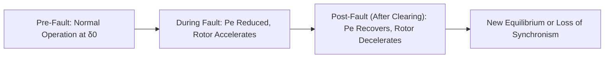
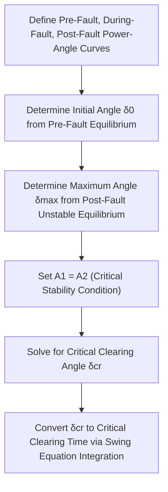
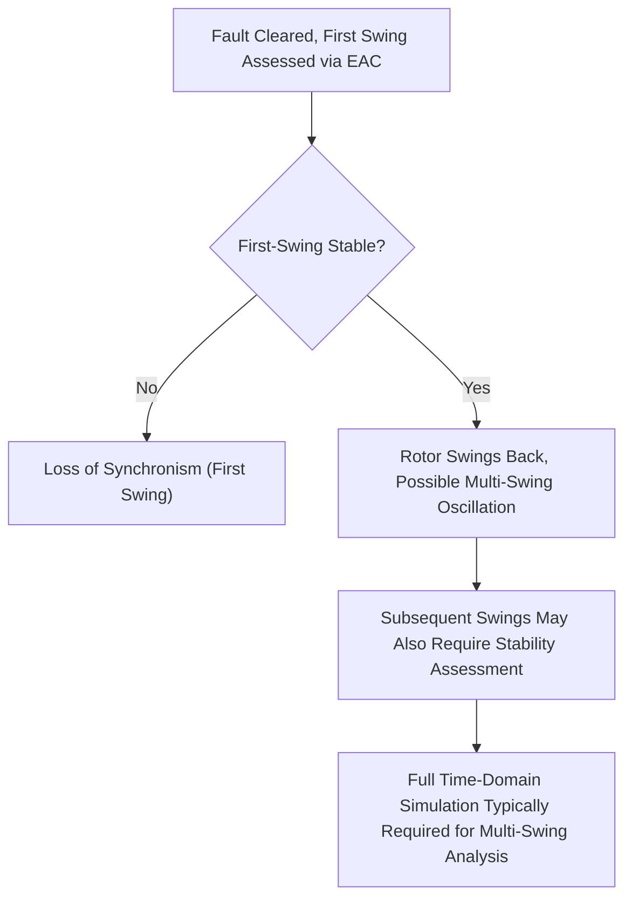

## Equal Area Criterion for Transient Stability

### Overview

The equal area criterion (EAC) is a graphical method for assessing the transient (first-swing) stability of a single synchronous machine connected to an infinite bus (or an equivalent two-machine system reducible to this form) without performing full time-domain numerical integration of the swing equation. It determines stability by comparing areas on the power-angle curve representing kinetic energy gained during a disturbance against the energy that can be absorbed as the system decelerates afterward, providing rapid insight into stability margins and critical clearing angles.

### Conceptual Basis

The equal area criterion follows directly from the swing equation. Multiplying the swing equation by $\frac{d\delta}{dt}$ and integrating over the disturbance period shows that the net change in kinetic energy of the rotor (relative to synchronous speed) is proportional to the integral of accelerating power over angle. For the rotor to return to synchronous speed after a disturbance (a necessary condition for stability), this net energy change must return to zero, which translates into the requirement that the area representing energy gained during acceleration equal the area representing energy given up during deceleration.

$$\oint (P_m - P_e) \, d\delta = 0 \quad \text{(for stable return to synchronous speed)}$$

### The Three Phases of a Disturbance

- **Pre-fault**: the machine operates at a stable equilibrium angle $\delta_0$ where mechanical input power equals electrical output power on the pre-fault power-angle curve.
- **During-fault**: a fault (typically modeled as reducing the effective power-angle curve, e.g., to zero for a solid three-phase fault at the machine terminals, or a reduced curve for other fault types/locations) causes $P_e$ to drop below $P_m$, and the rotor accelerates, angle $\delta$ increasing.
- **Post-fault (after clearing)**: once the fault is cleared (by protection operation), the system returns to a post-fault power-angle curve (which may differ from the pre-fault curve if the fault clearing involves removing a line or other network element), and if $P_e$ now exceeds $P_m$ at the current angle, the rotor decelerates.

### Graphical Representation

<svg xmlns="http://www.w3.org/2000/svg" viewBox="0 0 600 450">
<rect width="600" height="450" fill="#ffffff" />
<text x="300" y="25" text-anchor="middle" font-size="14" font-weight="bold">Equal Area Criterion (svg_diagram)</text>
<line x1="70" y1="380" x2="560" y2="380" stroke="#333" stroke-width="1.5" />
<line x1="70" y1="380" x2="70" y2="60" stroke="#333" stroke-width="1.5" />
<text x="315" y="410" text-anchor="middle" font-size="12">Rotor Angle δ (degrees)</text>
<text x="30" y="220" text-anchor="middle" font-size="12" transform="rotate(-90 30 220)">Power (p.u.)</text>
<path d="M 70 380 Q 220 90 370 90 Q 480 90 560 260" stroke="#1f6feb" stroke-width="2" fill="none" />
<text x="400" y="105" font-size="10" fill="#1f6feb">Post-Fault Curve: Pe = (EV/X_post) sinδ</text>
<line x1="150" y1="380" x2="150" y2="260" stroke="#495057" stroke-width="1" />
<line x1="150" y1="260" x2="330" y2="140" stroke="#e8590c" stroke-width="2.5" />
<text x="180" y="200" font-size="10" fill="#e8590c">During-Fault Trajectory</text>
<line x1="330" y1="140" x2="450" y2="260" stroke="#2b8a3e" stroke-width="2.5" />
<line x1="70" y1="260" x2="560" y2="260" stroke="#666" stroke-width="1.5" stroke-dasharray="5,3" />
<text x="500" y="255" font-size="10" fill="#666">Pm</text>
<path d="M 150 260 L 150 260 L 330 140 L 330 260 Z" fill="#ffe3e3" fill-opacity="0.6" />
<text x="200" y="230" font-size="11" fill="#c92a2a" font-weight="bold">A1 (Accelerating)</text>
<path d="M 330 260 L 330 140 L 450 260 Z" fill="#d3f9d8" fill-opacity="0.6" />
<text x="360" y="220" font-size="11" fill="#2b8a3e" font-weight="bold">A2 (Decelerating)</text>
<text x="140" y="400" font-size="10">δ0</text>
<text x="320" y="400" font-size="10">δc (clear)</text>
<text x="440" y="400" font-size="10">δmax</text>
</svg>

**Key Points**

- Area A1 (accelerating area) is bounded by the mechanical power line $P_m$ above the during-fault power-angle curve, swept from the initial angle $\delta_0$ to the clearing angle $\delta_c$.
- Area A2 (decelerating area) is bounded by the post-fault power-angle curve above the $P_m$ line, swept from the clearing angle $\delta_c$ to the maximum swing angle $\delta_{max}$.
- Stability requires that a decelerating area at least equal to the accelerating area be available before the rotor angle reaches the point where the post-fault curve can no longer provide net decelerating power (i.e., before reaching the unstable equilibrium angle on the post-fault curve).

### Mathematical Formulation

$$A_1 = \int_{\delta_0}^{\delta_c} (P_m - P_{e,fault}) \, d\delta$$

$$A_2 = \int_{\delta_c}^{\delta_{max}} (P_{e,post} - P_m) \, d\delta$$

**Stability condition**: $A_2 \geq A_1$ (with $A_2 = A_1$ representing the marginal/critical stability boundary)

For the specific case of a solid three-phase fault at the generator terminal (during which $P_e = 0$) with fault clearing followed by return to the original pre-fault network (no line lost), the areas simplify to:

$$A_1 = P_m (\delta_c - \delta_0)$$

$$A_2 = \int_{\delta_c}^{\delta_{max}} \left(\frac{EV}{X_{post}}\sin\delta - P_m\right) d\delta$$

### Critical Clearing Angle

The critical clearing angle $\delta_{cr}$ is the maximum clearing angle for which $A_2$ (evaluated up to $\delta_{max} = 180° - \delta_1$, the unstable equilibrium angle on the post-fault curve) still equals or exceeds $A_1$. Solving the equal-area equation at this boundary condition (setting $A_1 = A_2$ with $\delta_{max}$ at the unstable equilibrium point) yields a closed-form expression for simple single-machine-infinite-bus cases:

$$\delta_{cr} = \cos^{-1}\left[\frac{P_m(\delta_{max} - \delta_0) - \frac{EV}{X_{post}}\cos\delta_{max} + \frac{EV}{X_{fault}}\cos\delta_0 \cdot 0}{\frac{EV}{X_{post}} - \frac{EV}{X_{fault}}}\right]$$

**[Inference]** The exact closed-form expression for critical clearing angle depends on the specific assumptions made about during-fault and post-fault power-angle curves (e.g., whether during-fault power is exactly zero, whether the post-fault network differs from pre-fault, and how many distinct network configurations are involved), and the general derivation approach shown here should be adapted to the specific fault/clearing scenario being analyzed rather than applied as a universal fixed formula; textbook derivations typically present the specific case assumptions explicitly alongside the resulting expression.

### Critical Clearing Time

While the equal area criterion directly yields a critical clearing *angle*, protection engineering requires a critical clearing *time*, obtained by integrating the swing equation during the fault period to determine how long it takes the rotor to swing from $\delta_0$ to $\delta_{cr}$.

$$t_{cr} : \delta(t_{cr}) = \delta_{cr}, \quad \text{found by integrating} \quad \frac{2H}{\omega_s}\frac{d^2\delta}{dt^2} = P_m - P_{e,fault} \text{ from } t=0$$

For the specific simplified case of a solid three-phase fault ($P_{e,fault} = 0$) starting from rest (zero initial speed deviation), this integration yields a closed-form result:

$$t_{cr} = \sqrt{\frac{4H(\delta_{cr} - \delta_0)}{\omega_s P_m}}$$

**Key Points**

- This closed-form critical clearing time expression is a considerable simplification (zero during-fault electrical power, specific initial conditions); more general fault scenarios (non-zero during-fault power, non-zero pre-disturbance speed deviation) require numerical integration rather than a closed-form solution.
- Critical clearing time is a central output linking stability analysis to protection system design: it establishes the maximum total fault clearing time (relay operating time plus breaker interrupting time) that can be tolerated for the system to remain transiently stable for that specific disturbance and system condition.
- Critical clearing time generally decreases with lower machine inertia $H$, higher pre-fault loading (larger initial angle $\delta_0$, less margin to $\delta_{cr}$), and more severe faults (lower during-fault $P_e$), all of which reduce the available accelerating-energy margin.

### Extension to Different Fault Types and Locations

The severity of the during-fault power-angle curve depression, and hence the accelerating area A1, depends on fault type and location:

| Fault Type | Relative Severity (During-Fault Pe) | Typical Impact on Stability Margin |
| --- | --- | --- |
| Three-Phase Fault | Most severe (Pe often near zero at fault point) | Smallest critical clearing angle/time |
| Line-to-Line-to-Ground | Moderate to severe | Intermediate |
| Single-Line-to-Ground | Generally least severe among short-circuit types | Largest critical clearing angle/time (most tolerant) |

**Key Points**

- Three-phase faults are conventionally used as the worst-case (most limiting) scenario for critical clearing time studies because they typically produce the most severe reduction in transmittable electrical power during the fault, though **[Inference]** the relative severity ordering can depend on specific system grounding, fault impedance, and network configuration, and should be verified through system-specific fault studies rather than assumed universally in all cases.
- Fault location along a line affects severity: a fault electrically closer to the generator (lower impedance path from generator to fault point) tends to produce a more severe (lower) during-fault power-angle curve than a fault further away, generally reducing available critical clearing time for closer faults.
- The specific network topology change resulting from fault clearing (e.g., whether a faulted line is tripped and remains out of service, changing the post-fault reactance $X_{post}$ from the pre-fault value) directly affects the post-fault power-angle curve and thus the available decelerating area.

### Application to Reclosing and Multi-Swing Behavior

The basic equal area criterion as presented addresses first-swing stability only (whether the rotor angle remains bounded during its initial excursion following the disturbance). Additional considerations extend this framework:

- **Multi-swing instability**: a system can be first-swing stable but become unstable on a subsequent swing (particularly relevant with automatic reclosing onto a still-faulted line, or with weak system damping), which the basic single-swing equal area criterion does not directly address and generally requires full time-domain simulation to assess.
- **Unsuccessful reclosing impact**: if automatic reclosing occurs onto a line still carrying a persistent fault, the equal area analysis must be extended to account for the additional accelerating area introduced by the second fault application, further reducing stability margin compared to a single-fault scenario.

### Limitations of the Equal Area Criterion

**Key Points**

- The equal area criterion applies rigorously only to a single machine against an infinite bus, or systems that can be reduced to an equivalent two-machine (or one-machine-equivalent) representation; genuine multi-machine systems require full time-domain simulation (or more advanced energy-function-based methods such as transient energy function/extended equal area criterion approaches) for accurate stability assessment.
- The method assumes a classical generator model (constant EMF magnitude behind transient reactance), neglecting excitation system response, governor action, saturation, and other dynamics that a detailed multi-machine simulation would capture; this makes EAC most suitable for quick first-swing screening and conceptual understanding rather than final detailed stability studies of complex systems.
- Damping is typically neglected in the basic equal area criterion formulation, which is a conservative simplification for first-swing assessment (damping would tend to reduce the effective decelerating area needed, meaning the undamped EAC generally provides a stability margin estimate that errs toward caution for this specific factor), though other simplifications in the method may offset this in either direction depending on the specific system.

### Practical Application in Protection and Stability Engineering

The equal area criterion serves several practical roles despite the availability of detailed time-domain simulation tools:

- **Conceptual understanding**: provides intuitive graphical insight into why faster fault clearing improves stability (reducing A1) and why higher pre-fault loading reduces stability margin (larger δ0, less room before reaching the unstable equilibrium angle).
- **Quick screening and sensitivity studies**: allows rapid approximate assessment of stability sensitivity to clearing time, fault location, and loading level without requiring full simulation runs for preliminary studies.
- **Validation of critical clearing time requirements**: informs the maximum acceptable total fault clearing time (protection operating time plus breaker interrupting time) for critical system elements, directly influencing decisions about pilot protection scheme application versus stepped-time backup protection, as discussed under distance protection and wide-area protection topics.
- **Educational and diagnostic tool**: widely used in power system engineering curricula and post-event analysis to build intuition about transient stability behavior before or alongside detailed simulation-based study.

### Illustrative Sensitivity: Effect of Clearing Time on Stability Margin

<svg xmlns="http://www.w3.org/2000/svg" viewBox="0 0 550 350">
<rect width="550" height="350" fill="#ffffff" />
<text x="275" y="25" text-anchor="middle" font-size="14" font-weight="bold">Effect of Clearing Time on Accelerating Area (svg_diagram)</text>
<line x1="60" y1="300" x2="520" y2="300" stroke="#333" stroke-width="1.5" />
<line x1="60" y1="300" x2="60" y2="50" stroke="#333" stroke-width="1.5" />
<text x="290" y="330" text-anchor="middle" font-size="12">Rotor Angle δ</text>
<text x="25" y="180" text-anchor="middle" font-size="12" transform="rotate(-90 25 180)">Power (p.u.)</text>
<line x1="60" y1="200" x2="520" y2="200" stroke="#666" stroke-width="1.5" stroke-dasharray="5,3" />
<text x="480" y="195" font-size="10">Pm</text>
<rect x="130" y="200" width="70" height="100" fill="#d3f9d8" fill-opacity="0.7" />
<text x="135" y="320" font-size="10" fill="#2b8a3e">Fast Clearing: Small A1</text>
<rect x="130" y="200" width="180" height="100" fill="#ffe3e3" fill-opacity="0.5" />
<text x="330" y="320" font-size="10" fill="#c92a2a">Slow Clearing: Large A1</text>
</svg>

**Related Topics**

- The Swing Equation and Rotor Dynamics
- Generator Protection Schemes (Out-of-Step/Power Swing)
- Transmission Line Distance Protection (Power Swing Blocking)
- Wide-Area and Adaptive Protection Schemes
- Protection Coordination Studies and Relay Setting Calculation
- Transient Stability Simulation Methods and Software
- Automatic Reclosing Practices and System Stability