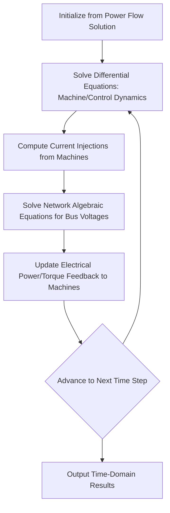
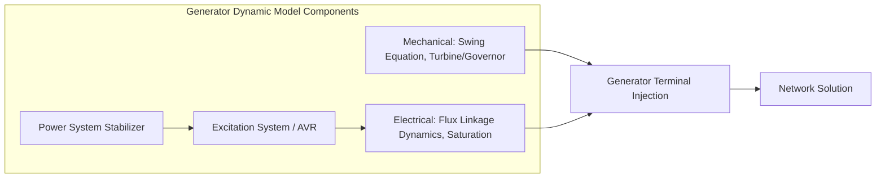
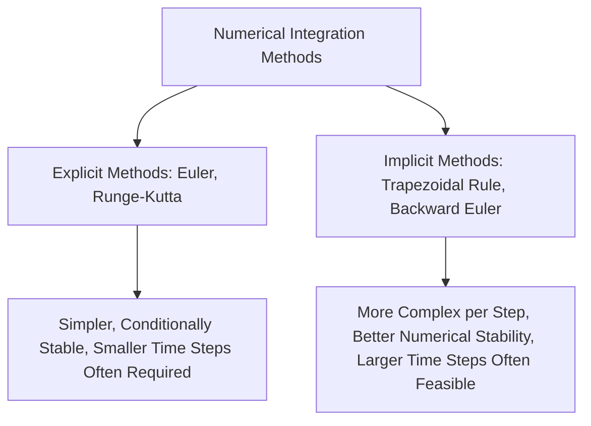
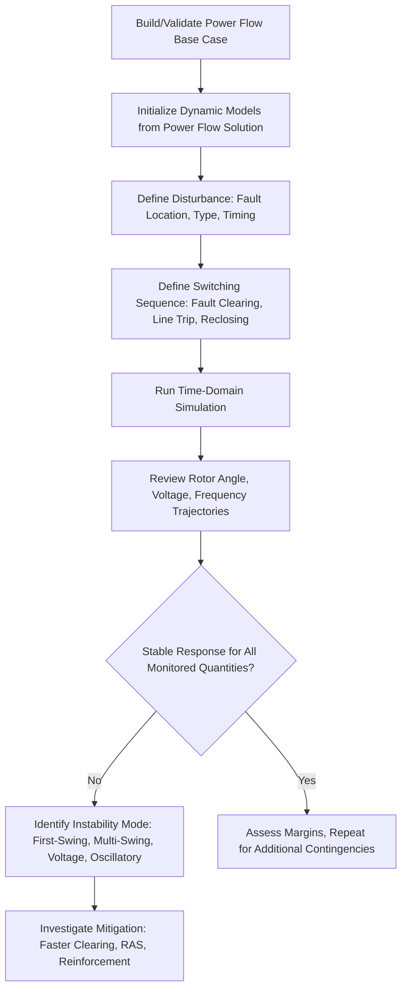
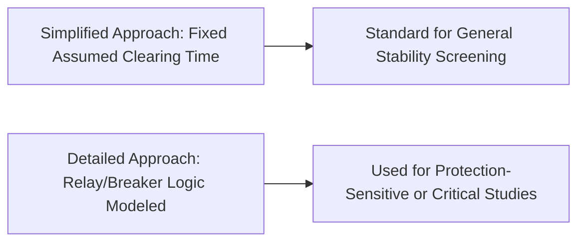

## Transient Stability Simulation Methods

### Overview

Transient stability simulation numerically solves the coupled differential-algebraic equations governing synchronous machine dynamics and network power flow following a large disturbance, determining whether the power system maintains synchronism and acceptable operating conditions. Unlike the equal area criterion's graphical single-machine approach, transient stability simulation handles realistic multi-machine systems with detailed generator, excitation, governor, and load models, producing time-domain trajectories of rotor angles, voltages, frequencies, and other quantities throughout and after the disturbance.

### The Differential-Algebraic Equation (DAE) System

Transient stability simulation solves a combined system of:

$$\dot{x} = f(x, V) \quad \text{(differential equations: machine dynamics, controls)}$$

$$0 = g(x, V) \quad \text{(algebraic equations: network power flow balance)}$$

where $x$ represents dynamic state variables (rotor angles, speed deviations, flux linkages, controller states) and $V$ represents network bus voltages, which must satisfy power flow equality at every instant given the current injections from all dynamic devices.

**Key Points**

- The differential equations capture the "slow" (relative to network transients) electromechanical dynamics of rotating machines and their controls, while the algebraic equations enforce that the network is always in an instantaneous quasi-steady-state power flow condition at each simulation time step (the fundamental "phasor domain" or "RMS" simulation assumption, as distinguished from full electromagnetic transient simulation).
- This DAE structure means transient stability simulation is fundamentally different from electromagnetic transient (EMT) simulation: transient stability tools solve for fundamental-frequency phasor quantities evolving over seconds, while EMT tools solve for instantaneous waveforms evolving over microseconds to milliseconds, making transient stability tools computationally practical for large-scale, multi-second system-wide studies.

### Generator and Control Modeling

Accurate transient stability simulation requires appropriately detailed models beyond the classical swing equation, since excitation, governor, and stabilizer response occur on timescales relevant to the seconds-to-tens-of-seconds simulation window.

**Key Points**

- Generator electrical models range in complexity from the "classical model" (constant EMF magnitude behind transient reactance, essentially the model underlying the basic swing equation and equal area criterion) to detailed models incorporating d-q axis flux linkage dynamics, subtransient effects, and magnetic saturation, with model choice depending on required study accuracy and the specific phenomena of interest.
- Excitation system (automatic voltage regulator, AVR) models are essential for realistic transient stability results since AVR response significantly affects post-fault voltage recovery and machine internal EMF behavior during the swing; standardized excitation system model structures (e.g., per IEEE Std 421.5) are commonly used to represent commercially available exciter types in a consistent, interoperable format.
- Governor and turbine models represent the mechanical power response to speed deviation, relevant for multi-second and longer simulation windows where governor action begins to influence the power balance, though for very short first-swing assessments (a few hundred milliseconds to a couple seconds) governor response may have limited impact compared to the initial swing dynamics.
- Power system stabilizers (PSS), which modulate excitation system input based on speed or power deviation to add damping torque, are important for capturing realistic oscillation damping behavior, particularly for inter-area oscillation and small-signal-adjacent transient studies.

### Load Modeling

Load representation significantly affects simulation results since load response to voltage and frequency deviations during a disturbance influences the network power balance and can materially affect stability outcomes.

| Load Model Type | Characteristic | Typical Application |
| --- | --- | --- |
| Constant Impedance (Z) | Power varies with voltage squared | Simplified studies, resistive/some lighting loads |
| Constant Current (I) | Power varies linearly with voltage | Intermediate representation |
| Constant Power (P) | Power independent of voltage (within limits) | Motor-dominated or regulated loads |
| ZIP Model | Weighted combination of Z, I, P components | Common composite representation |
| Dynamic/Motor Load Models | Explicit induction motor dynamics | Studies where motor stalling/reacceleration is significant |

**Key Points**

- Load model selection can materially affect simulation outcomes, particularly for voltage stability-adjacent studies or scenarios involving significant motor load where stalling behavior during depressed voltage conditions introduces additional dynamics beyond a simple static ZIP representation.
- **[Inference]** The appropriate level of load model detail depends on the specific study objective and system characteristics (e.g., high motor load penetration, air conditioning load sensitivity to voltage), and should be selected based on the specific system's load composition and the phenomena the study intends to capture, rather than a single universally appropriate default.

### Numerical Integration Methods

The differential equations of the DAE system must be numerically integrated over the simulation time horizon, with several established methods used in practice.

- **Explicit methods** (e.g., Euler's method, Runge-Kutta methods): compute the next state directly from current state derivatives, straightforward to implement but generally requiring smaller time steps for numerical stability, particularly for systems with fast dynamics (e.g., detailed machine models with fast subtransient time constants).
- **Implicit methods** (e.g., trapezoidal rule, backward Euler): require solving an implicit equation at each step (often via iteration), more computationally demanding per step but typically offering better numerical stability properties, allowing larger time steps for a given accuracy requirement, particularly beneficial for "stiff" systems with widely varying time constants (common in power system dynamic models combining fast electrical and slower mechanical/control dynamics).

**Key Points**

- The trapezoidal rule is widely used in commercial transient stability simulation software due to its favorable numerical stability characteristics (A-stability) for the stiff differential equations typical of power system dynamic models.
- Typical simulation time steps for conventional (fundamental-frequency phasor) transient stability studies commonly range from a fraction of a cycle up to a few cycles (e.g., often around 1/4 to 1 cycle, or in the range of a few milliseconds), though **[Inference]** the specific appropriate time step depends on the fastest dynamics being modeled, the numerical method's stability properties, and the desired accuracy, and should be selected per the specific study's requirements and validated through sensitivity testing (e.g., confirming results do not change materially with a smaller time step) rather than assumed as a fixed value.

### Simulation Workflow

**Key Points**

- Simulation initialization from a converged power flow solution is essential, ensuring all dynamic model states start at values consistent with the specified pre-disturbance steady-state operating condition; initialization errors are a common source of spurious simulation artifacts if not properly validated.
- Disturbance definition (fault type, location, duration, and subsequent switching actions such as line tripping and reclosing) must accurately represent the actual protection and breaker operation sequence expected in the real system, since the assumed clearing time and switching sequence directly determine the simulated accelerating/decelerating energy per the swing equation principles.
- Contingency screening across many credible disturbance scenarios (N-1, and in some studies N-2 or other multiple-contingency scenarios) is standard practice for comprehensive stability assessment, since a system's stability margin can vary substantially depending on which specific element is faulted/lost and the pre-disturbance system loading/configuration.

### Output Analysis

Transient stability simulation results are typically reviewed across several dimensions:

- **Rotor angle trajectories**: checking that all machine angles (often plotted relative to a reference machine or system center-of-inertia) remain bounded and return toward a new equilibrium rather than diverging, consistent with the loss-of-synchronism concept from the swing equation.
- **Voltage trajectories**: verifying bus voltages recover to acceptable levels within required time frames post-disturbance, relevant to both stability and power quality/equipment withstand considerations.
- **Frequency trajectories**: particularly relevant for islanding scenarios or major generation/load imbalance events, checking frequency stays within acceptable bounds and that underfrequency/overfrequency protection or load-shedding schemes behave as modeled.
- **Relative angle/slip between machine groups**: used to detect inter-area or multi-machine loss-of-synchronism patterns not necessarily visible from a single machine's angle alone.

### Relationship to Protection System Modeling

Transient stability simulations increasingly incorporate representations of protection system behavior directly within the study, rather than treating fault clearing as an idealized fixed-time event:

**Key Points**

- For general system-wide stability screening across many contingencies, fault clearing is commonly modeled with a fixed assumed clearing time representative of the applicable protection scheme's expected performance (e.g., primary protection operating time plus typical breaker interrupting time), sufficient for most planning-level studies.
- For studies specifically investigating protection system performance, relay misoperation scenarios, or backup protection timing (e.g., studies supporting the wide-area/adaptive protection and coordination topics discussed elsewhere), more detailed representation of actual relay logic, distance zone characteristics, or breaker failure timing may be incorporated directly into the simulation.
- **[Unverified]** The specific extent to which commercial transient stability software packages support fully detailed protection relay modeling (as opposed to simplified fixed-time fault clearing) varies by software package and version, and current capability should be confirmed against the specific tool's documentation for studies requiring this level of detail.

### Comparison with Other Simulation Types

| Simulation Type | Timescale | Typical Use |
| --- | --- | --- |
| Electromagnetic Transient (EMT) | Microseconds to milliseconds | Switching transients, insulation coordination, harmonic studies, detailed protection/control validation |
| Transient Stability (RMS/Phasor) | Milliseconds to tens of seconds | First-swing and multi-swing rotor angle stability, voltage/frequency response |
| Long-Term Dynamic Simulation | Seconds to minutes/hours | Load restoration, tap-changer/AGC dynamics, longer-term voltage stability |
| Steady-State Power Flow | N/A (single operating point) | Base case establishment, thermal/voltage limit studies |

**Key Points**

- EMT and transient stability simulation are complementary rather than interchangeable: EMT captures fast electromagnetic phenomena (switching surges, sub-cycle protection element behavior, power electronic converter switching dynamics) that phasor-domain transient stability tools cannot represent, while transient stability tools remain the practical choice for large-scale, multi-second, system-wide rotor angle and voltage stability assessment due to computational efficiency.
- Hybrid simulation approaches, combining detailed EMT representation of a specific area of interest (e.g., an HVDC converter station or a cluster of inverter-based resources) with a broader phasor-domain transient stability representation of the surrounding system, have been an area of ongoing development to capture interaction effects between fast power-electronic dynamics and system-wide electromechanical stability, though **[Unverified]** the specific maturity and commercial availability of such hybrid simulation capability should be confirmed against current software vendor documentation.

### Increasing Relevance of Inverter-Based Resource Modeling

As wind, solar, and battery storage inverter-based resources displace conventional synchronous generation, transient stability simulation practice has needed to incorporate generic and manufacturer-specific inverter-based resource dynamic models, since these devices do not follow the classical swing equation-based synchronous machine behavior and instead respond according to their power-electronic control algorithms (current limiting, fault ride-through logic, and in newer designs, grid-forming control strategies).

**[Inference]** The specific modeling standards, generic model structures, and validation practices for inverter-based resources in transient stability studies have been an active area of industry standardization and development; current best-practice guidance should be obtained from relevant standards bodies (e.g., IEEE, WECC, or applicable regional reliability organization modeling requirements) rather than assumed static, given this is an actively evolving area of the discipline.

### Common Practical Considerations

- **Model validation and data quality**: transient stability simulation results are only as reliable as the underlying dynamic model data (machine parameters, control system models, load composition); poor-quality or outdated model data is a recognized source of simulation-to-actual-event discrepancy.
- **Computational scale for large systems**: system-wide stability studies for large interconnections involve thousands of buses and hundreds or thousands of dynamic devices, requiring efficient numerical methods and, for extensive contingency screening, potentially parallel/distributed computation approaches.
- **Selection of critical contingencies**: comprehensive N-1 (and selected higher-order) contingency screening is standard, but engineering judgment remains important in identifying which specific contingencies and system conditions (loading levels, dispatch scenarios, seasonal configurations) are most likely to reveal binding stability constraints.
- **Coordination with protection and control study results**: transient stability simulation outputs (critical clearing times, oscillation damping, voltage recovery behavior) directly inform protection system speed requirements, special protection/remedial action scheme design, and power system stabilizer tuning, illustrating the interconnected nature of stability and protection engineering disciplines.

**Related Topics**

- The Swing Equation and Rotor Dynamics
- Equal Area Criterion for Transient Stability
- Generator Protection Schemes (Out-of-Step/Power Swing)
- Wide-Area and Adaptive Protection Schemes
- Small-Signal Stability and Power System Stabilizers
- Inertia and Frequency Response in Systems with High Renewable Penetration
- System Protection Schemes / Special Protection Schemes (SPS/RAS)