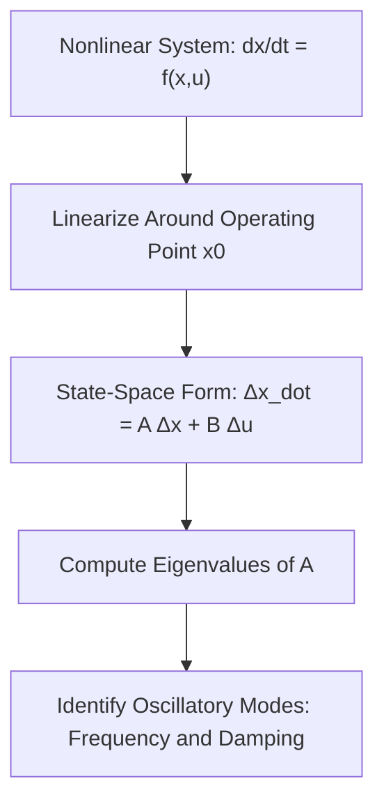
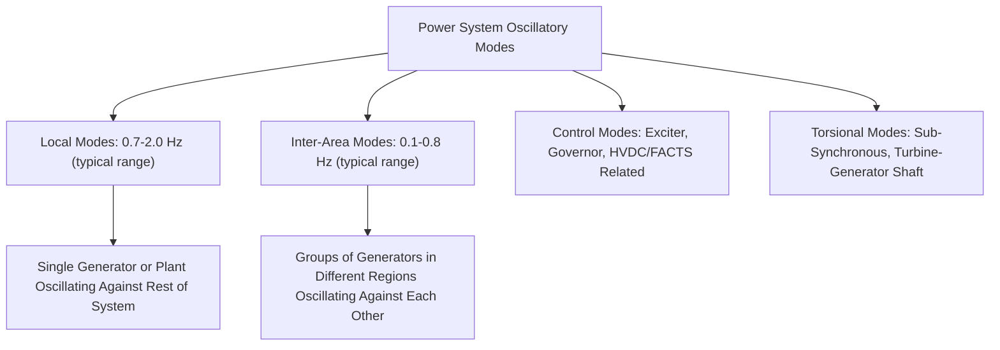
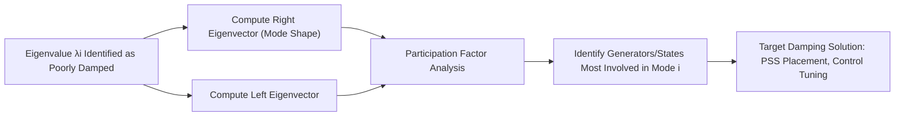
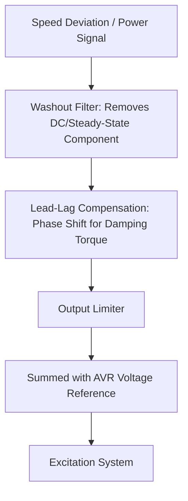

## Small-Signal Stability and Eigenvalue Analysis

### Overview

Small-signal (small-disturbance) stability concerns a power system's ability to maintain synchronism when subjected to small perturbations, where system behavior can be adequately represented by linearizing the nonlinear dynamic equations around a steady-state operating point. Unlike transient stability's concern with large disturbances and nonlinear swing behavior, small-signal stability analysis uses linear system theory, specifically eigenvalue analysis of the linearized state matrix, to determine oscillatory modes, their frequencies, and their damping characteristics.

### Linearization of System Dynamics

The full nonlinear power system dynamic model can be written in state-space form:

$$\dot{x} = f(x, u)$$

Linearizing around an equilibrium operating point $(x_0, u_0)$ using a first-order Taylor series expansion gives:

$$\Delta \dot{x} = A \Delta x + B \Delta u$$

where $A = \frac{\partial f}{\partial x}\Big|_{x_0, u_0}$ is the system (state) matrix, $\Delta x$ represents small deviations of state variables from the equilibrium, and $B$ relates input perturbations to state changes.

**Key Points**

- The state matrix $A$ depends on the specific operating point (loading level, generation dispatch, network topology), meaning small-signal stability characteristics change as the system operating condition changes, requiring analysis across multiple representative operating conditions rather than a single fixed assessment.
- State variables for a multi-machine power system typically include each generator's rotor angle and speed deviation, flux linkage states, excitation system states, governor states, and power system stabilizer states, resulting in a state matrix whose dimension grows substantially with system size and model detail.

### Eigenvalue Analysis

The eigenvalues of the state matrix $A$ determine the stability and characteristic response of the linearized system. For a real system matrix, eigenvalues are either real or occur in complex conjugate pairs.

$$\lambda_i = \sigma_i \pm j\omega_i$$

where $\sigma_i$ is the real part (damping) and $\omega_i$ is the imaginary part (oscillation frequency, rad/s) of eigenvalue $i$.

**Stability criterion**: the system is small-signal stable if and only if all eigenvalues have negative real parts ($\sigma_i < 0$ for all $i$), meaning any small perturbation decays over time rather than growing.

<svg xmlns="http://www.w3.org/2000/svg" viewBox="0 0 550 400">
<rect width="550" height="400" fill="#ffffff" />
<text x="275" y="25" text-anchor="middle" font-size="14" font-weight="bold">Eigenvalues on the Complex Plane (svg_diagram)</text>
<line x1="275" y1="360" x2="275" y2="50" stroke="#333" stroke-width="1" />
<line x1="60" y1="205" x2="520" y2="205" stroke="#333" stroke-width="1.5" />
<text x="530" y="210" font-size="11">Real (σ)</text>
<text x="280" y="60" font-size="11">Imaginary (jω)</text>
<rect x="60" y="50" width="215" height="310" fill="#ffe3e3" fill-opacity="0.3" />
<text x="80" y="70" font-size="10" fill="#c92a2a">Unstable Region (σ &gt; 0... wait)</text>
<rect x="60" y="50" width="215" height="155" fill="none" />
<circle cx="180" cy="130" r="5" fill="#c92a2a" />
<circle cx="180" cy="280" r="5" fill="#c92a2a" />
<text x="150" y="115" font-size="10" fill="#c92a2a">Unstable Pair (σ&gt;0)</text>
<circle cx="380" cy="150" r="5" fill="#2b8a3e" />
<circle cx="380" cy="260" r="5" fill="#2b8a3e" />
<text x="350" y="135" font-size="10" fill="#2b8a3e">Stable Oscillatory Pair (σ&lt;0)</text>
<circle cx="420" cy="205" r="5" fill="#1f6feb" />
<text x="425" y="200" font-size="10" fill="#1f6feb">Stable Real (Non-Oscillatory)</text>
</svg>

Corrected boundary description: the imaginary (vertical) axis at $\sigma = 0$ divides the plane, with the **left half-plane** ($\sigma < 0$) representing stability and the **right half-plane** ($\sigma > 0$) representing instability.

**Key Points**

- A complex conjugate eigenvalue pair with negative real part represents a damped oscillatory mode: the associated state variables oscillate at frequency $\omega_i$ while the amplitude decays exponentially at a rate governed by $\sigma_i$.
- A real negative eigenvalue represents a non-oscillatory, exponentially decaying mode, while a real positive eigenvalue represents non-oscillatory (aperiodic) instability, sometimes associated with loss of synchronizing torque.
- A complex conjugate pair with positive real part represents a growing oscillation (oscillatory instability), often associated with inadequate damping torque, relevant to inter-area and local oscillation modes of practical concern in power systems.

### Damping Ratio and Oscillation Frequency

For a complex eigenvalue pair, the damping ratio $\zeta$ quantifies how quickly oscillations decay relative to the oscillation frequency:

$$\zeta = \frac{-\sigma}{\sqrt{\sigma^2 + \omega^2}}$$

$$f_{oscillation} = \frac{\omega}{2\pi} \text{ (Hz)}$$

**Key Points**

- Higher damping ratio indicates faster decay of oscillations relative to their frequency; a damping ratio of zero corresponds to sustained (undamped) oscillation at the marginal stability boundary, while negative damping ratio indicates growing oscillation.
- Utility and industry planning criteria commonly specify minimum acceptable damping ratios for critical oscillatory modes (frequently cited in industry practice as being in the range of a few percent, such as 3-5%, for adequate margin), though **[Inference]** the specific minimum damping ratio criteria applied are utility- and regulatory-region-specific planning standards rather than a single universal value, and should be confirmed against the applicable reliability standard or utility planning criteria for the system being studied.

### Classification of Oscillatory Modes

- **Local (plant) modes**: involve a single generator or a small group of closely coupled generators at one plant oscillating against the rest of the system, typically at higher frequencies (commonly cited in industry literature as roughly 0.7 to 2.0 Hz, though **[Inference]** specific frequency ranges vary by system and reference source).
- **Inter-area modes**: involve groups of generators in one geographic region oscillating against groups in another region, connected through relatively weak tie-lines, typically at lower frequencies than local modes (commonly cited as roughly 0.1 to 0.8 Hz), and of particular concern in large interconnected systems where poorly damped inter-area modes can limit power transfer capability across tie-lines.
- **Control modes**: associated with the dynamics of control systems themselves (excitation system, governor, HVDC converter controls, FACTS device controls), which can interact with electromechanical modes if not properly tuned or coordinated.
- **Torsional modes**: mechanical oscillation modes of the turbine-generator shaft system (multiple rotating masses connected by shaft sections with finite stiffness), relevant particularly to sub-synchronous resonance interactions with series-compensated transmission lines or certain power electronic control interactions.

**[Inference]** The specific frequency ranges cited above for local and inter-area modes are commonly referenced approximate ranges in power system engineering literature; actual mode frequencies for any specific system depend on that system's particular inertia, network impedance, and control characteristics, and should be determined through system-specific eigenvalue analysis rather than assumed from generic ranges.

### Participation Factors

Beyond simply identifying eigenvalues, participation factor analysis determines which state variables (and by extension, which physical generators or system elements) are most significantly involved in a particular oscillatory mode, aiding in understanding mode character and designing targeted damping solutions.

$$p_{ki} = \phi_{ki} \psi_{ik}$$

where $\phi_{ki}$ is the $k$-th element of the right eigenvector (mode shape) for eigenvalue $i$, and $\psi_{ik}$ is the corresponding element of the left eigenvector, together indicating how strongly state variable $k$ participates in mode $i$.

**Key Points**

- Participation factors are normalized measures combining information from both right eigenvectors (mode shapes, showing relative magnitude/phase of state variable oscillation) and left eigenvectors (showing which states most influence the mode's excitation), together identifying the most effective locations for damping control application.
- This analysis directly informs power system stabilizer (PSS) placement and tuning decisions: generators with high participation factors in a poorly damped mode are generally the most effective locations to apply supplementary damping control.

### Power System Stabilizers (PSS)

PSS devices add a supplementary signal to the excitation system's voltage reference, derived from a locally measurable quantity (commonly rotor speed deviation, electrical power, or a combination), specifically designed to introduce additional damping torque in phase with speed deviation to improve damping of electromechanical oscillatory modes.

**Key Points**

- The washout filter (high-pass characteristic) ensures the PSS output responds only to dynamic oscillatory deviations and does not affect the steady-state terminal voltage regulation function of the AVR.
- Lead-lag compensation stages are tuned to provide the correct phase characteristic so that the resulting supplementary excitation modulation produces damping torque (in phase with speed deviation) rather than synchronizing torque, across the frequency range of concern for the modes being damped.
- PSS tuning is typically performed with reference to eigenvalue/participation factor analysis results, verifying that the tuned PSS improves damping ratio for target modes without introducing adverse interactions with other modes (including control modes or modes at generators without PSS).

### Small-Signal Stability Tools and Analysis Software

Eigenvalue analysis for realistic multi-machine power systems requires specialized software due to the large state matrix dimensions involved (potentially thousands of states for large interconnected systems).

**Key Points**

- Commercial and research-grade power system dynamic simulation software packages typically include linearization and eigenvalue analysis modules alongside their time-domain transient stability simulation capability, allowing engineers to move between nonlinear time-domain and linear small-signal analysis of the same underlying system model.
- For very large systems, computing the full eigenvalue spectrum can be computationally demanding; selective eigenvalue computation methods (targeting only the eigenvalues of interest, such as those with low damping or in a specific frequency range) are commonly used rather than computing the complete eigenvalue set.
- **[Unverified]** Specific software packages and their current small-signal analysis capabilities change with vendor updates; current tool selection and capability verification should be obtained from vendor documentation rather than assumed static, consistent with the broader note on coordination study software tools discussed elsewhere in this material.

### Relationship to Wide-Area Monitoring

Small-signal stability concepts connect directly to wide-area measurement applications: since inter-area oscillation modes involve widely separated generators, wide-area PMU-based monitoring (as discussed under wide-area and adaptive protection schemes) provides a practical means to observe actual system oscillatory behavior in real time, complementing offline eigenvalue analysis based on system models.

**Key Points**

- Measurement-based (as opposed to purely model-based) small-signal stability monitoring using PMU data allows real-time or near-real-time tracking of actual oscillation modes and their damping, providing a cross-check against model-based eigenvalue predictions and detecting changes in system dynamic behavior that may not be captured in the planning model.
- Poorly damped or growing oscillations observed via wide-area monitoring can trigger operator alarms or automated remedial actions in some system architectures, representing a practical application bridging small-signal stability theory and real-time wide-area protection/control infrastructure.

### Comparison: Small-Signal vs. Transient Stability Analysis

| Aspect | Small-Signal Stability | Transient (Large-Disturbance) Stability |
| --- | --- | --- |
| Disturbance Size | Small perturbations | Large disturbances (faults, major losses) |
| Mathematical Approach | Linearized state matrix, eigenvalue analysis | Nonlinear time-domain simulation (or equal area criterion for simple cases) |
| Key Output | Damping ratio, oscillation frequency, mode shape | Stability/instability determination, critical clearing time |
| Typical Concern | Sustained/growing oscillations under normal or near-normal conditions | Loss of synchronism following a specific severe event |
| Primary Mitigation | PSS tuning, control coordination | Faster protection clearing, network reinforcement, special protection schemes |

### Common Analytical Considerations

- **Operating point dependency**: since the state matrix $A$ depends on the linearization point, small-signal stability results (damping ratios, mode frequencies) can vary meaningfully across different loading conditions, generation dispatch patterns, and network topologies, requiring analysis across a representative range of operating conditions rather than a single "typical" case.
- **Model detail trade-offs**: as with transient stability simulation, small-signal analysis accuracy depends on the fidelity of underlying generator, excitation, governor, and load models; inadequate model detail can produce eigenvalue results that do not accurately reflect actual system oscillatory behavior.
- **Control interaction risks**: as more power-electronic-based controls (HVDC, FACTS, inverter-based resource controls) are added to systems alongside conventional PSS and AVR controls, adverse control interactions (where one control's action degrades another's effectiveness, or introduces new poorly-damped modes) have become an increasingly important consideration requiring coordinated small-signal analysis across multiple control systems rather than single-device tuning in isolation.
- **Distinction from sub-synchronous resonance/interaction phenomena**: while related in using similar eigenvalue-based analytical techniques, sub-synchronous resonance (mechanical torsional interaction with series-compensated network electrical resonance) and sub-synchronous control interaction (power-electronic control interaction with network characteristics) are typically treated as distinct specialized analysis areas beyond standard electromechanical small-signal stability study, often requiring dedicated frequency-domain or detailed eigenvalue analysis specific to those phenomena.

**Related Topics**

- The Swing Equation and Rotor Dynamics
- Transient Stability Simulation Methods
- Wide-Area and Adaptive Protection Schemes
- Generator Protection Schemes (Excitation System Interaction)
- Inertia and Frequency Response in Systems with High Renewable Penetration
- Sub-Synchronous Resonance and Control Interaction