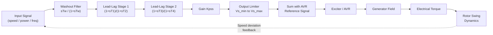

## Power System Stabilizer Design

### Overview and Purpose

A Power System Stabilizer (PSS) is a supplementary control device added to a generator's excitation system to damp low-frequency electromechanical oscillations, typically in the range of $0.1$ Hz to $3$ Hz. These oscillations arise from the interaction between synchronous machines and the transmission network, and if left undamped, they can grow in magnitude and threaten system stability or trigger protective disconnections.

The core problem the PSS solves: the Automatic Voltage Regulator (AVR), while essential for voltage control, introduces negative damping torque into the rotor's swing equation at oscillation frequencies, especially under high external system impedance and heavy loading. The PSS counteracts this by injecting an auxiliary stabilizing signal into the AVR's summing junction, modulating field voltage to produce a torque component in phase with rotor speed deviation.

### Theoretical Basis: Phillips-Heffron Model

The design foundation for PSS tuning is the Phillips-Heffron (K-constant) model, which linearizes generator dynamics around an operating point. The model expresses electrical torque as a function of six constants ($K_1$ through $K_6$):

$$\Delta T_e = K_1 \Delta\delta + K_2 \Delta\psi_{fd}$$

$$\Delta\psi_{fd} = \frac{K_3}{1 + sT_3 K_3}\left(\Delta E_{fd} - K_4 \Delta\delta\right)$$

$$\Delta V_t = K_5 \Delta\delta + K_6 \Delta\psi_{fd}$$

Where:

- $K_1$: torque component from rotor angle changes at constant flux linkage
- $K_2$: torque component from field flux linkage changes
- $K_3$: impedance factor relating field circuit dynamics
- $K_4$: demagnetizing effect of armature reaction due to angle change
- $K_5$: terminal voltage change with rotor angle
- $K_6$: terminal voltage change with field flux linkage

The synchronizing torque coefficient ($K_1$) and damping torque coefficient (derived from the $K_2$-$K_3$-$K_4$-AVR loop) together determine oscillatory behavior. A negative $K_5$ (common when the generator is heavily loaded and exporting reactive power to a strong grid) causes the AVR to actively destabilize the rotor angle loop — this is precisely the condition the PSS is designed to counteract.

### PSS Structure: The Standard Configuration

The classical PSS (IEEE PSS1A structure) consists of three cascaded blocks:

**1. Washout Filter (High-Pass Stage)**

$$G_{washout}(s) = \frac{sT_w}{1 + sT_w}$$

This block blocks steady-state speed or power signals from reaching the AVR (which would otherwise cause the PSS to interfere with normal frequency regulation), while passing oscillatory frequency content. Typical $T_w$ values range from 1 to 20 seconds; the block acts as a pure differentiator for oscillation frequencies of interest since $\omega T_w \gg 1$ in that band.

**2. Phase Compensation (Lead-Lag Stages)**

$$G_{comp}(s) = \left(\frac{1 + sT_1}{1 + sT_2}\right)^n$$

Typically two cascaded lead-lag stages ($n = 2$) are used. This block compensates for the phase lag introduced by the generator, excitation system, and power system (the "GEP(s)" transfer function) between the field voltage input and the electrical torque output. The design goal is to shift the phase such that the net PSS output produces a torque component in phase with $\Delta\omega$ (speed deviation), i.e., pure damping torque, across the oscillation frequency range of interest.

**3. Gain Block**

$$K_{PSS}$$

Sets the magnitude of the damping contribution. Gain is bounded above by torsional interaction concerns (see below) and stability margin requirements; too low a gain provides insufficient damping, too high a gain can amplify torsional modes or cause instability at higher frequencies.

**4. Output Limiter**

A final limiter ($V_{s,min}$ to $V_{s,max}$) restricts the PSS output signal, typically to $\pm 0.1$ pu on the terminal voltage base, to prevent the stabilizer from driving the AVR into large voltage excursions during severe disturbances.

### Block Diagram

### Input Signal Selection

PSS input signal choice is a major design decision, each with tradeoffs:

**Speed deviation ($\Delta\omega$)**

- Direct measure of the quantity to be damped
- Susceptible to torsional oscillation contamination on large steam turbine-generators (shaft modes at 10-50 Hz can appear in the speed signal and get amplified by the PSS gain, risking sub-synchronous resonance)
- Requires torsional filters (notch filters) tuned to shaft natural frequencies

**Accelerating power ($\Delta P_a$, derived from $\Delta P_e$ integration)**

- The "delta-P-omega" (PSS2A/PSS2B) approach combines electrical power and a compensated speed/frequency signal
- Less sensitive to torsional modes because mechanical power changes slowly and the ramp-tracking filter naturally rejects high-frequency torsional content
- Widely adopted as the modern default for large thermal units

**Frequency ($\Delta f$ at generator terminals)**

- Simple to measure, but sensitive to fast bus voltage transients and can be noisy in weak systems

**Bus voltage / integral of accelerating power variants**

- Used in multi-band PSS designs (PSS4B) targeting local, inter-area, and low-frequency oscillation modes with separate filter branches

### Multi-Band PSS (PSS4B / IEEE Type PSS4B)

Modern implementations, especially for systems with pronounced inter-area oscillations, employ three parallel differential filter branches tuned to distinct frequency bands:

- **Low-band**: 0.005–0.1 Hz (very slow inter-area / control modes)
- **Intermediate-band**: 0.1–1 Hz (inter-area modes between generator groups/regions)
- **High-band**: 1–4 Hz (local plant modes)

Each band has independent gain and time-constant tuning, and the outputs are summed before the final limiter. This allows a single PSS to simultaneously damp local-mode oscillations (single generator against the rest of the system) and inter-area oscillations (groups of generators oscillating against other groups) without the compromises inherent in single-band tuning.

### Tuning Methodology

**Step 1 — Determine GEP(s) frequency response**

At the intended operating point (typically a stressed condition: high output, high external reactance, weak grid), compute or measure the phase and gain of the generator-exciter-power-system transfer function from PSS output ($V_s$) to electrical torque ($\Delta T_e$).

**Step 2 — Design phase compensation**

Select $T_1, T_2$ (and additional stages if needed) so the compensated PSS transfer function phase leads the GEP(s) phase lag by a small residual lag angle (typically 10°-20° lag is left intentionally to also contribute some synchronizing torque), across the frequency range of concern (0.2-2.5 Hz for local modes, 0.1-1 Hz for inter-area modes).

**Step 3 — Set gain**

Using root-locus analysis or eigenvalue (small-signal stability / modal analysis) tools, increase $K_{PSS}$ from zero and track the movement of the electromechanical mode eigenvalue. Select gain at roughly one-third to one-half of the value that causes instability of an adjacent mode (typically the exciter mode or a higher-frequency torsional mode), providing adequate gain margin.

**Step 4 — Validate via eigenvalue/damping ratio analysis**

Target damping ratio $\zeta$ for the electromechanical mode is typically $\zeta \geq 0.05$ to $0.1$ (5-10%) minimum, though many utilities require higher margins for critical inter-area modes.

$$\zeta = \frac{-\sigma}{\sqrt{\sigma^2 + \omega_d^2}}$$

where $\sigma$ is the real part and $\omega_d$ the damped natural frequency of the complex eigenvalue pair.

**Step 5 — Validate across operating conditions**

PSS parameters fixed at one operating point must be checked across the full range of expected loading, generation dispatch, and network topology changes, since $K_1$-$K_6$ constants and GEP(s) phase vary substantially with operating point. [Inference] In practice, this often requires accepting a compromise tuning that provides adequate but not optimal damping across the full envelope, since a single fixed linear PSS cannot be simultaneously optimal at every operating point.

### Torsional Interaction and Sub-Synchronous Resonance (SSR)

For large thermal generators with long turbine-generator shafts (multiple LP/HP/IP turbine sections), the mechanical shaft system has multiple torsional natural frequencies, commonly in the 10-50 Hz range. A speed-input PSS with insufficient filtering can:

1. Sense shaft torsional oscillations as noise in $\Delta\omega$
2. Amplify them through the PSS gain and lead-lag stages
3. Feed them back through the AVR into the electrical torque
4. Under certain network conditions (particularly with series-compensated transmission lines), create negative damping at a torsional frequency — risking shaft fatigue or failure

Mitigation: torsional filters (band-reject/notch filters) placed after the washout stage, tuned narrowly around each shaft torsional frequency identified from a modal/eigenvalue analysis of the turbine-generator shaft system, or use of the delta-P-omega input structure which is inherently less torsionally sensitive.

### Example: Lead-Lag Parameter Calculation

Given a GEP(s) phase lag of 40° at the local-mode frequency of 1.2 Hz ($\omega = 7.54$ rad/s), and targeting full compensation with a single lead-lag stage:

$$\phi_{max} = 40°$$

The maximum phase lead of a single lead-lag stage occurs at:

$$\omega_m = \frac{1}{\sqrt{T_1 T_2}}$$

with

$$\sin\phi_{max} = \frac{T_1 - T_2}{T_1 + T_2}$$

Solving for $\alpha = T_1/T_2$:

$$\alpha = \frac{1 + \sin\phi_{max}}{1 - \sin\phi_{max}} = \frac{1 + \sin(40°)}{1 - \sin(40°)} = \frac{1.643}{0.357} \approx 4.60$$

With $\omega_m = 7.54$ rad/s and $T_1 = \alpha T_2$:

$$T_2 = \frac{1}{\omega_m \sqrt{\alpha}} = \frac{1}{7.54 \times 2.145} \approx 0.0619 \text{ s}$$

$$T_1 = \alpha T_2 \approx 4.60 \times 0.0619 \approx 0.285 \text{ s}$$

In practice, this compensation is typically split across two identical cascaded stages (each providing 20°) rather than one stage providing the full 40°, since two moderate stages produce a flatter phase response across a wider frequency band than one aggressive stage — this is standard PSS design practice, not merely a rule of thumb specific to one vendor.

### Practical Implementation Considerations

- **Field verification**: Off-line (small-signal model) tuning must be validated with on-line staged tests — step response tests on the AVR reference with PSS in/out of service, observing damping of the resulting oscillation
- **Coordination with other controls**: PSS action must be coordinated with Power System Stabilizer limiters, Over-Excitation Limiters (OEL), Under-Excitation Limiters (UEL), and Power Oscillation Dampers (PODs) on FACTS devices to avoid adverse interaction
- **Commissioning standard**: IEEE Std 421.5 defines standard PSS model structures (PSS1A, PSS2A/B, PSS3B, PSS4B) used for both design and for power system simulation software (PSS/E, PowerFactory, ETAP) model exchange
- **Grid code requirements**: Many system operators (e.g., NERC in North America, ENTSO-E in Europe) mandate minimum PSS performance and require periodic re-verification of tuning, since generator and network parameters drift over time and PSS effectiveness must be demonstrated via compliance testing

### Related Topics

- Automatic Voltage Regulator (AVR) Modeling and Excitation Systems (IEEE Std 421.5 Types ST, AC, DC)
- Small-Signal Stability Analysis and Eigenvalue/Modal Analysis
- Sub-Synchronous Resonance (SSR) and Torsional Interaction Analysis
- Inter-Area Oscillation Damping and Wide-Area Measurement Systems (WAMS/PMU-based control)
- Power Oscillation Damping (POD) Controllers on FACTS Devices (SVC, STATCOM, HVDC)
- Multi-Machine Power System Stability and the Swing Equation
- Under-Excitation Limiter (UEL) and Over-Excitation Limiter (OEL) Coordination
- Root Locus and Frequency-Domain Control Design Techniques