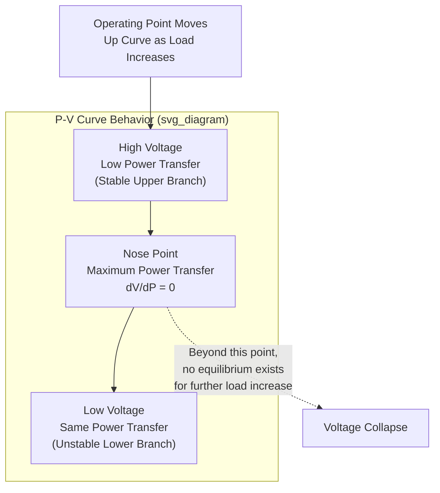

## Voltage Stability and Voltage Collapse Mechanisms

### Definition and Scope

Voltage stability is the ability of a power system to maintain acceptable voltages at all buses under normal operating conditions and after being subjected to a disturbance. A system enters a state of voltage instability when a disturbance, load increase, or change in system condition causes a progressive and uncontrollable decline in voltage. Voltage collapse is the end-state process by which this instability leads to a blackout or abnormally low voltages across a significant portion of the system.

This is fundamentally distinct from rotor angle (transient/small-signal) stability: voltage instability is primarily driven by the balance of reactive power and the load's response to voltage, rather than by the electromechanical dynamics of generator rotors. The two phenomena can interact, but the underlying mechanisms and mitigation strategies differ substantially.

### Classification of Voltage Stability

**By disturbance magnitude:**

- **Large-disturbance voltage stability**: concerns the system's ability to maintain steady voltages following large disturbances such as system faults, loss of generation, or circuit contingencies. Requires examination of nonlinear system dynamics over a period sufficient to capture the performance of devices such as On-Load Tap Changers (OLTCs) and generator field current limiters.
- **Small-disturbance voltage stability**: concerns the system's ability to maintain steady voltages when subjected to small perturbations such as incremental load changes. This form can be effectively analyzed using linearized system equations around an operating point, similar to small-signal rotor angle stability analysis.

**By time frame:**

- **Short-term voltage stability**: involves dynamics of fast-acting load components such as induction motors, electronically controlled loads, and HVDC converters. Study period is on the order of seconds; differential equations are typically required.
- **Long-term voltage stability**: involves slower-acting equipment such as tap-changing transformers, thermostatically controlled loads, and generator current limiters. Study period extends from tens of seconds to several minutes.

### The P-V Curve (Nose Curve)

The classical tool for visualizing voltage stability margin is the P-V curve, plotting receiving-end voltage against transmitted active power for a given load power factor.

For a simple two-bus system (source behind impedance $Z\angle\theta$ feeding a load at power factor angle $\phi$), the receiving end voltage satisfies:

$$V_R^4 + V_R^2\left[2PR\cos\phi_{err} - E^2 + 2QX\right] + \left(P^2+Q^2\right)\left(R^2+X^2\right) = 0$$

(Derivation follows from the power flow equations on a series R-X line; the exact form depends on sign conventions for lagging/leading power factor.) The critical insight is that this equation has **two real solutions for $V_R$** at any power level below the maximum — the upper (stable, normal operating) solution and the lower (unstable) solution — and **no real solution** beyond the maximum transferable power, which defines the "nose" of the curve. As reactive power demand $Q$ increases (i.e., the load becomes more inductive), the nose point moves toward lower power and lower voltage, shrinking the stability margin.

The **voltage stability margin** is defined as the distance (in MW) from the current operating point to the nose point along the P-V curve.

### The Q-V Curve and Reactive Power Margin

While P-V curves show active power margin, Q-V curves at a specific bus show the reactive power margin — how much additional reactive power support (from a hypothetical synchronous condenser at that bus) would be needed before the system becomes unstable.

$$\frac{dQ}{dV} > 0 \implies \text{stable operating region}$$

$$\frac{dQ}{dV} < 0 \implies \text{unstable operating region}$$

The bottom of the Q-V curve represents the point of minimum reactive power injection required — this margin (in MVAr) directly indicates how close a bus is to voltage collapse and is widely used in planning studies (e.g., NERC/WECC voltage stability criteria) to size reactive compensation.

### Physical Mechanism of Voltage Collapse

The collapse mechanism is best understood as a self-reinforcing feedback loop:

1. A disturbance (line outage, generator trip, or gradual load growth) increases reactive power demand or reduces reactive supply on a heavily loaded transmission corridor.
2. Voltage at load buses drops due to increased $I^2X$ reactive losses on the transmission path.
3. **Load restoration dynamics** attempt to restore power consumption:
   - OLTCs on distribution transformers tap up to restore secondary-side voltage, which *increases* the effective load seen by the transmission system (since real distribution loads are often modeled as voltage-dependent, e.g., constant impedance, but tap action restores them toward constant power behavior)
   - Thermostatic loads (e.g., electric heating, motor-driven compressors) draw more current at lower voltage to maintain constant power output
   - Induction motors, if voltage drops enough to stall them, draw very high locked-rotor reactive current
4. This increased demand for real and reactive power further depresses transmission voltage.
5. Generators reach field current limits: their Automatic Voltage Regulators, in the effort to hold terminal voltage, drive field current to the point where Over-Excitation Limiters (OEL) intervene to protect the rotor winding from thermal damage — at which point the generator can no longer support voltage and effectively becomes a constant-reactive-power (or worse, reactive-power-absorbing) source.
6. With generator reactive support capped and load reactive demand still rising, the system reaches a point of no equilibrium — voltages at multiple buses collapse in a cascading manner, often within seconds to tens of minutes depending on which mechanism dominates.

This chain illustrates why voltage collapse is often described as a phenomenon where **the load "fights back"** against low voltage by drawing more current, unlike a purely passive load that would naturally reduce its demand as voltage sags.

### Key Contributing Factors

- **Heavy reactive power transfer over long transmission lines**: reactive power does not travel well over long distances due to $I^2X$ losses; systems with insufficient local reactive compensation are most vulnerable
- **Generator reactive reserve depletion**: insufficient reactive reserves at generators electrically close to the load center
- **Load characteristics**: composition of constant-power vs. constant-impedance vs. constant-current loads significantly affects collapse dynamics; a higher share of constant-power-restoring loads (via OLTCs or motor loads) increases vulnerability
- **OLTC "runaway" behavior**: in severe cases, OLTCs continue tapping in an attempt to restore load voltage even as this action drives transmission-side voltage progressively lower, a well-documented instability driver in historical collapse events
- **Insufficient reactive compensation switching**: shunt capacitor banks that are not switched in proactively as demand grows
- **Contingency (N-1) conditions**: loss of a critical transmission line or large reactive source (generator, SVC, capacitor bank) that was previously providing critical support

### Analysis Techniques

**Continuation Power Flow (CPF)**

Standard Newton-Raphson power flow fails to converge near and at the nose point because the power flow Jacobian becomes singular there. CPF techniques parameterize the load increase and use a predictor-corrector scheme to trace the full P-V curve including the lower (unstable) branch, robustly identifying the maximum loadability point.

**Modal Analysis (V-Q Sensitivity)**

Based on the reduced Jacobian relating $\Delta V$ to $\Delta Q$ at the point of interest:

$$\Delta Q = J_R \, \Delta V$$

Eigenvalue decomposition of $J_R$ identifies critical modes; the eigenvalue closest to zero indicates proximity to voltage collapse, and its associated eigenvector identifies participating buses (voltage stability weak areas) and generators (via participation factors).

**Time-Domain Simulation**

Required for long-term voltage stability studies incorporating discrete OLTC tap steps, OEL dynamics, and load restoration — since these effects are inherently nonlinear and time-dependent, static P-V/Q-V analysis alone cannot capture the full trajectory to collapse.

**Singular Value Decomposition of the Power Flow Jacobian**

The minimum singular value of the full power flow Jacobian approaching zero is a general indicator of proximity to a saddle-node bifurcation, which is the underlying mathematical structure of the voltage collapse point.

### Mitigation and Control Measures

- **Reactive power compensation**: shunt capacitors, Static VAR Compensators (SVC), STATCOMs, and synchronous condensers placed close to load centers to support voltage without relying on long-distance reactive transfer
- **Coordinated OLTC control / voltage-dependent load shedding**: blocking or reversing OLTC action during a voltage emergency to prevent the tap-driven demand-restoration feedback loop from accelerating collapse
- **Under-voltage load shedding (UVLS)**: automatic, often multi-stage, shedding of load when voltage drops below defined thresholds for a sustained duration — a last-resort defense mechanism widely deployed in systems with known voltage-stability-limited corridors
- **Secondary voltage control**: coordinated regional control of generator reactive output and reactive devices to maintain pilot-bus voltages within target bands, improving reactive reserve margins system-wide
- **Special Protection Schemes (SPS) / Remedial Action Schemes (RAS)**: automatic generation redispatch, capacitor switching, or controlled load shedding triggered by real-time monitoring of voltage stability indices
- **Planning-stage reactive margin criteria**: mandating a minimum MW or MVAr margin (e.g., a percentage above forecast peak load) between normal operation and the P-V nose point under worst-case single or double contingency

### Historical Reference Events

[Unverified] Widely cited illustrative cases in the literature include voltage collapse contributions to major blackouts, such as portions of the 2003 US-Canada Northeast blackout and the 2003 Italy blackout, where reactive power shortages and cascading line outages combined with rotor angle and frequency effects; the precise contribution of voltage instability versus other cascading mechanisms in these specific events is analyzed in detail in post-event technical reports and is beyond simple summary here.

### Distinguishing Voltage Collapse from Rotor Angle Instability

| Aspect | Voltage Instability | Rotor Angle Instability |
| --- | --- | --- |
| Primary driver | Reactive power / load-voltage relationship | Electromechanical torque balance |
| Typical timescale | Seconds to tens of minutes | Sub-second to seconds |
| Key equipment | OLTCs, OEL, shunt compensation, load characteristics | AVR, PSS, governor, inertia |
| Primary analysis tool | P-V/Q-V curves, CPF, modal analysis | Swing equation, eigenvalue analysis of rotor modes |
| Typical mitigation | Reactive compensation, UVLS | PSS tuning, fast fault clearing, generation tripping |

### Related Topics

- Continuation Power Flow and Saddle-Node Bifurcation Analysis
- Reactive Power Compensation: SVC, STATCOM, and Synchronous Condensers
- Under-Voltage Load Shedding (UVLS) Scheme Design
- On-Load Tap Changer (OLTC) Modeling and Coordinated Control
- Over-Excitation Limiter (OEL) and Generator Reactive Capability Curves
- Secondary and Tertiary Voltage Control Schemes
- Load Modeling for Power System Stability Studies (ZIP and Motor Load Models)
- Wide-Area Monitoring Systems for Real-Time Voltage Stability Assessment