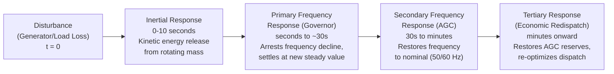

## Frequency Stability Fundamentals

### Definition and Scope

Frequency stability is the ability of a power system to maintain steady frequency following a severe system upset resulting in a significant imbalance between generation and load. Instability results in sustained frequency swings large enough to trigger the tripping of generating units or loads, potentially leading to cascading outages and, in the extreme, a system-wide blackout.

Unlike rotor angle stability (which concerns the relative angular position between machines) and voltage stability (which concerns the reactive power / voltage relationship), frequency stability concerns the **absolute balance between total system generation and total system load**, since frequency is a single system-wide quantity governed by the aggregate inertia and power balance of all connected synchronous machines.

### The Fundamental Power-Frequency Relationship

The starting point is the swing equation applied to the aggregate system, treating all synchronously connected generators as a single equivalent machine (the "center of inertia" representation):

$$2H\frac{d\Delta f}{dt} = \Delta P = P_m - P_e$$

Where:

- $H$: aggregate system inertia constant (MW·s/MVA, i.e., seconds), representing the total kinetic energy stored in all rotating masses (turbines, generators, and to a lesser extent, some rotating loads) normalized to system MVA base
- $\Delta f$: per-unit or Hz frequency deviation from nominal
- $P_m$: mechanical power input (turbine)
- $P_e$: electrical power output (load plus losses)

This single equation captures the essential physics: **frequency deviation is the integral of the power imbalance, scaled inversely by system inertia**. A larger imbalance or a lower-inertia system produces a faster and larger frequency excursion.

### Rate of Change of Frequency (RoCoF)

Immediately following a disturbance (e.g., loss of a large generator), before any control action can respond, the initial rate of change of frequency is:

$$\text{RoCoF} = \frac{df}{dt}\bigg|_{t=0^+} = \frac{\Delta P \cdot f_0}{2H \cdot S_{base}}$$

RoCoF has become an increasingly critical metric because:

- It is used by RoCoF-based protection relays (particularly on distributed and embedded generation) to detect loss-of-mains/islanding conditions
- Systems with declining synchronous inertia (due to high penetration of inverter-based renewable generation, which does not inherently contribute rotational inertia) experience **steeper RoCoF** for the same size of disturbance
- Many grid codes now specify maximum permissible RoCoF (e.g., commonly in the range of 0.5-2 Hz/s depending on jurisdiction) that connected generation must be able to ride through without spurious tripping

### The Frequency Response Timeline

**1. Inertial Response (0-10 seconds)**

Immediately after imbalance, kinetic energy stored in the rotating mass of synchronous generators (and their turbines) is released or absorbed automatically, governed purely by the physics of the swing equation — no control action is required for this phase; it happens as an inherent consequence of the electromagnetic coupling between rotor speed and system frequency. This response determines the initial RoCoF and arrests the very earliest and fastest part of the frequency excursion.

**2. Primary Frequency Response (seconds to ~30 seconds)**

Governor droop control on individual generating units responds to local frequency deviation by adjusting mechanical power (turbine valve/gate position). This is a decentralized, proportional control action with no communication required between units. The droop characteristic is defined as:

$$R = -\frac{\Delta f / f_0}{\Delta P / P_{rated}}$$

Typical droop settings are 4-5% (i.e., a generator would theoretically go from zero to full output for a 4-5% frequency deviation if unconstrained by physical limits). Primary response arrests the frequency decline and brings the system to a new steady-state frequency, but this settling frequency will generally **not** be exactly nominal — it stabilizes at a value offset from 60/50 Hz proportional to the size of the imbalance and inversely proportional to the aggregate system stiffness (sum of $1/R$ across all responding units plus load's own frequency sensitivity).

**3. Secondary Frequency Response / Automatic Generation Control (AGC) (30 seconds to several minutes)**

A centralized control system (AGC) adjusts generation set points at selected units to drive frequency (and, in interconnected systems, tie-line flows via Area Control Error) back to the scheduled nominal value, eliminating the steady-state offset left by droop-only primary response. AGC operates on the Area Control Error (ACE):

$$ACE = (P_{tie,actual} - P_{tie,scheduled}) + B(f_{actual} - f_{scheduled})$$

Where $B$ is the frequency bias setting (MW/0.1 Hz), tuned to approximate the area's own natural response characteristic.

**4. Tertiary Response (minutes onward)**

Economic redispatch and reserve restoration: system operators bring additional generation online or redispatch existing units to restore the depleted spinning reserve margin used during the event, preparing the system for a subsequent contingency.

### Load's Natural Frequency Damping

Load itself provides a natural, if modest, damping effect: many load types (particularly induction motor loads) consume less real power as frequency drops. This is captured by the load damping constant $D$:

$$\Delta P_{load} = D \cdot \Delta f$$

This term appears added to the denominator dynamics of the frequency response and contributes to the aggregate system stiffness alongside governor droop response, but its contribution is typically much smaller than that of primary governor response in most systems.

### Under-Frequency Load Shedding (UFLS)

For disturbances large enough that inertial and primary response alone cannot arrest the frequency decline before it reaches unacceptable levels, Under-Frequency Load Shedding acts as an automatic defense mechanism. UFLS relays are typically configured in multiple stages, e.g.:

| Stage | Frequency Threshold | Load Shed | Time Delay |
| --- | --- | --- | --- |
| 1 | 59.3 Hz (60 Hz system) | 5-10% | 0.1-0.3 s |
| 2 | 59.0 Hz | additional 5-10% | 0.1-0.3 s |
| 3 | 58.7 Hz | additional 5-10% | 0.1-0.3 s |

[Inference] Exact thresholds, number of stages, and percentages vary significantly by interconnection and are set by regional reliability standards (e.g., NERC PRC-006 in North America); the values above are illustrative of typical staged UFLS philosophy rather than a universal standard. UFLS is intentionally the last line of defense before frequency reaches levels that risk generator under-frequency trip settings (which protect turbine blades from resonance damage at off-nominal frequency) — a coordination gap here can turn a controllable load-shedding event into an uncontrolled cascading generator trip and full collapse.

### The Declining Inertia Challenge (Modern Grids)

As synchronous generation (coal, gas, nuclear, hydro) is displaced by inverter-based resources (wind, solar PV, battery storage) that are decoupled from the grid by power electronics and do not inherently provide rotational inertia, several effects compound:

- **Reduced aggregate $H$**: the same size of MW disturbance produces a proportionally larger and faster frequency excursion
- **Steeper RoCoF**: increases risk of nuisance tripping of RoCoF-based anti-islanding protection on distributed generation, which can itself worsen the disturbance (a cascading effect)
- **Reduced primary response headroom**: if synchronous units are displaced rather than merely reduced in output, the total governor response capacity available to arrest a given disturbance also shrinks

**Mitigation approaches:**

- **Synthetic/emulated inertia**: control algorithms on wind turbines and battery inverters that detect RoCoF and inject a fast active power response proportional to $df/dt$, mimicking (though not physically replicating) synchronous inertial response
- **Fast Frequency Response (FFR)**: battery storage and other fast-responding resources providing a rapid, sub-second active power injection in response to frequency deviation, often procured as a distinct ancillary service product separate from traditional primary frequency response
- **Grid-forming inverter control**: an emerging inverter control paradigm (as opposed to conventional grid-following control) designed to inherently provide voltage and frequency reference behavior similar to a synchronous machine, rather than merely injecting current synchronized to an externally sensed grid voltage
- **Minimum inertia requirements / inertia markets**: some system operators are introducing explicit inertia procurement or minimum online synchronous generation requirements to maintain RoCoF within tolerable limits

### Frequency Stability vs. Other Stability Classes

| Aspect | Frequency Stability | Rotor Angle Stability | Voltage Stability |
| --- | --- | --- | --- |
| Governing quantity | System-wide generation/load balance | Relative rotor angle between machines | Reactive power / voltage relationship |
| Key parameter | Inertia $H$, droop $R$ | Synchronizing/damping torque | $dQ/dV$ sensitivity |
| Typical trigger | Loss of large generation or load block | Faults, switching events | Heavy loading, reactive shortage |
| Primary defense | UFLS, spinning reserve, FFR | Fast fault clearing, PSS | Reactive compensation, UVLS |

### Related Topics

- Load-Frequency Control (LFC) and Automatic Generation Control (AGC) Design
- Governor Droop Control and Turbine-Governor Modeling (IEEE Std standard models)
- Under-Frequency Load Shedding (UFLS) Scheme Coordination
- Synthetic Inertia and Fast Frequency Response from Inverter-Based Resources
- Grid-Forming vs. Grid-Following Inverter Control
- Interconnection Reliability Standards (NERC BAL-003, Frequency Response Obligation)
- Islanding Detection and Anti-Islanding Protection (RoCoF and Vector Shift Relays)
- Reserve Margin Planning: Spinning, Non-Spinning, and Regulation Reserves