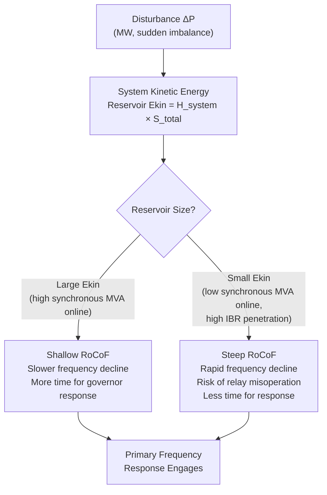

## Rotational Inertia and Rate of Change of Frequency

### Physical Basis of Rotational Inertia

Synchronous generator rotors, along with their directly coupled turbines, store kinetic energy by virtue of their rotating mass. This stored kinetic energy is:

$$KE = \frac{1}{2}J\omega_m^2$$

Where $J$ is the polar moment of inertia (kg·m²) and $\omega_m$ is mechanical angular velocity (rad/s). This kinetic energy reservoir is the physical mechanism underlying inertial response: when electrical load exceeds mechanical input power, the rotor decelerates, converting stored kinetic energy into electrical energy to help meet the shortfall — automatically and without any control system intervention, purely as a consequence of Newton's second law applied to rotation.

### The Inertia Constant H

Rather than working directly with $J$, power system analysis normalizes stored kinetic energy to the machine's MVA rating, yielding the inertia constant $H$:

$$H = \frac{KE_{rated}}{S_{rated}} = \frac{\frac{1}{2}J\omega_{m,rated}^2}{S_{rated}}$$

$H$ has units of seconds and has an intuitive physical meaning: **it is the time, in seconds, that the machine could supply its own rated MVA output using only its stored kinetic energy**, if that energy were discharged at a constant rate with no other input. Typical $H$ values:

| Machine Type | Typical H (seconds) |
| --- | --- |
| Thermal (steam) units | 4-9 |
| Hydro units | 2-4 |
| Combustion turbines (gas) | 4-6 |
| Small/older units | as low as 2 |
| Large modern thermal units | up to 9-10 |

[Inference] Exact values vary by manufacturer, unit size, and shaft design; the ranges above reflect commonly cited typical values in power system stability literature rather than a fixed standard.

### Deriving the Swing Equation from First Principles

Newton's second law for rotation states:

$$J\frac{d\omega_m}{dt} = T_m - T_e$$

Converting to per-unit power (multiplying both sides by $\omega_m$, and normalizing), and expressing in terms of the electrical angle $\delta$ (related to mechanical angle by the number of pole pairs), yields the standard per-unit swing equation:

$$\frac{2H}{\omega_s}\frac{d^2\delta}{dt^2} = P_m - P_e$$

Or, expressed in terms of per-unit frequency deviation $\Delta f = \Delta\omega/\omega_s$ (valid for small deviations near nominal, treating the system in the "center of inertia" aggregate form):

$$2H\frac{d\Delta f}{dt} = \Delta P_{pu} = P_m - P_e$$

This is the fundamental equation linking stored kinetic energy (via $H$) to the rate of frequency change following any active power imbalance $\Delta P$.

### System (Aggregate) Inertia

For a synchronously interconnected system with multiple generating units, the system behaves — to a first approximation, immediately following a disturbance and before governor/AGC action — as a single equivalent machine whose inertia constant is the generation-capacity-weighted sum of all online units' individual inertia constants:

$$H_{system} = \frac{\sum_i H_i S_i}{\sum_i S_i}$$

This aggregate $H_{system}$, combined with total online synchronous MVA capacity, determines the total kinetic energy reservoir (in MW·s or GW·s) available to the system to absorb a sudden imbalance before frequency-sensitive protection and control systems engage.

### Deriving Rate of Change of Frequency (RoCoF)

Rearranging the swing equation for the instant immediately following a step disturbance $\Delta P$ (before governor action has had time to respond, i.e., $t = 0^+$):

$$\text{RoCoF} = \frac{d\Delta f}{dt}\bigg|_{t=0^+} = \frac{\Delta P_{pu}}{2H}$$

In absolute (Hz/s) terms, for a disturbance $\Delta P$ (MW) on a system with total online inertia $H_{system}$ (s) and total online synchronous MVA capacity $S_{total}$:

$$\text{RoCoF} \, [\text{Hz/s}] = \frac{\Delta P \, [\text{MW}] \times f_0 \, [\text{Hz}]}{2 \times H_{system} \, [\text{s}] \times S_{total} \, [\text{MVA}]}$$

This is often reformulated in terms of total system kinetic energy $E_{kin} = H_{system} \times S_{total}$ (typically expressed in GW·s or MW·s):

$$\text{RoCoF} = \frac{\Delta P \cdot f_0}{2 E_{kin}}$$

This formulation makes explicit why RoCoF is fundamentally a function of the **absolute stored kinetic energy of the system**, not a percentage or per-unit inertia value alone — a system with high $H$ per machine but few machines online can have low total $E_{kin}$ and therefore experience steep RoCoF.

### Worked Example

Consider an isolated system with:

- Total online synchronous generation: $S_{total} = 8000$ MVA
- Aggregate inertia constant: $H_{system} = 5$ s
- Nominal frequency: $f_0 = 50$ Hz
- Sudden loss of a generating unit: $\Delta P = 400$ MW

Total kinetic energy:

$$E_{kin} = H_{system} \times S_{total} = 5 \times 8000 = 40{,}000 \text{ MW·s} = 40 \text{ GW·s}$$

Initial RoCoF:

$$\text{RoCoF} = \frac{\Delta P \cdot f_0}{2 E_{kin}} = \frac{400 \times 50}{2 \times 40{,}000} = \frac{20{,}000}{80{,}000} = 0.25 \text{ Hz/s}$$

If the same 400 MW loss occurred on a system with only $E_{kin} = 10$ GW·s (e.g., due to high displacement of synchronous generation by inverter-based resources, even at the same $H$ per machine, because fewer synchronous MVA are online):

$$\text{RoCoF} = \frac{400 \times 50}{2 \times 10{,}000} = \frac{20{,}000}{20{,}000} = 1.0 \text{ Hz/s}$$

This fourfold increase in RoCoF for an identical disturbance illustrates precisely why declining system inertia is a first-order operational concern for modern grid operators.

### RoCoF Measurement Window and Practical Considerations

In practice, RoCoF is not measured as an instantaneous derivative (which is undefined/noisy for a discrete measurement) but as an average slope over a defined window, commonly using Phasor Measurement Unit (PMU) data:

$$\text{RoCoF}_{avg} = \frac{f(t_2) - f(t_1)}{t_2 - t_1}$$

Typical measurement windows range from 100 ms to 500 ms. [Inference] The choice of window length is itself a design tradeoff not universally standardized: shorter windows respond faster (relevant for protection applications) but are more susceptible to noise and local oscillatory content from nearby switching events; longer windows smooth out this noise but introduce detection delay, which matters for relays intended to trip within tight time budgets.

### Grid Code RoCoF Withstand Requirements

Because RoCoF-based protection (loss-of-mains / anti-islanding relays) is widely deployed on embedded and distributed generation, and because these relays can misoperate during legitimate system-wide disturbances (not just true islanding events), many grid codes now specify a minimum RoCoF the connected generation must withstand without tripping:

| Region/Standard (illustrative) | Typical RoCoF Withstand Requirement |
| --- | --- |
| Historical UK settings (pre-reinforcement) | 0.125 Hz/s |
| Updated UK / many European grid codes | 1.0 Hz/s (sustained, e.g., 500 ms window) |
| Ireland (historically inertia-constrained system) | Up to 1.0 Hz/s |
| Nordic synchronous area | Generally lower RoCoF due to large synchronous area, but tightening as inertia declines |

[Unverified] Specific numerical thresholds are jurisdiction- and time-specific, frequently revised as inertia conditions evolve, and should be verified against the current grid code of the relevant transmission system operator rather than treated as fixed values; the table above illustrates the general trend and order of magnitude rather than a current authoritative reference.

### Diagram: Inertia Reservoir and RoCoF Relationship

### Inverter-Based Resources and the Inertia Gap

Conventional grid-following inverters (the dominant control paradigm for existing wind and solar installations) synchronize to grid voltage via a Phase-Locked Loop (PLL) and inject current according to a pre-determined power reference — they do not inherently respond to RoCoF or frequency deviation unless explicitly programmed to do so, and they contribute **zero physical rotational inertia** to the system regardless of the turbine or converter's own internal mechanical mass (e.g., a wind turbine rotor's kinetic energy is decoupled from grid frequency by the back-to-back power converter).

This creates the "inertia gap": as synchronous generation is displaced megawatt-for-megawatt by inverter-based resources, $S_{total}$ effective inertia-contributing capacity shrinks even if total generation capacity (MW) stays constant, directly steepening RoCoF for any given disturbance size per the equation above.

**Compensating mechanisms** (each partially restoring an inertia-like response, though none is physically identical to synchronous inertia):

- **Synthetic/Emulated inertia**: control loops on wind turbine converters that temporarily extract additional kinetic energy from the turbine's own rotating mass (blades + drivetrain) in response to detected RoCoF, injecting a short burst of additional active power — but this is a **finite, extractable energy** response, not a continuous inertial characteristic, and can create a secondary frequency dip ("energy payback") once the extracted kinetic energy must be restored
- **Fast Frequency Response (FFR) from batteries**: near-instantaneous active power injection from battery energy storage systems, limited by battery power rating and state-of-charge rather than by a physical kinetic energy reservoir
- **Grid-forming inverter control**: a more fundamental control redesign where the inverter presents an internal voltage source behind an impedance (analogous to a synchronous machine's internal EMF behind synchronous reactance) rather than a controlled current source; under appropriate control law design, this can provide an inherent, near-instantaneous power response to frequency/phase deviations that more closely approximates true inertial behavior, though [Inference] the degree to which grid-forming control can fully substitute for physical rotational inertia at very large penetration levels remains an active area of research and standards development rather than a settled engineering conclusion

### Related Topics

- Frequency Stability Fundamentals and the Frequency Response Timeline
- Synthetic Inertia Control Design for Wind Turbine Converters
- Grid-Forming vs. Grid-Following Inverter Control Architectures
- Loss-of-Mains / Anti-Islanding Protection and RoCoF Relay Coordination
- Minimum Inertia Requirements and System Operator Inertia Monitoring
- Fast Frequency Response (FFR) Ancillary Service Market Design
- Governor Droop Control and Primary Frequency Response Coordination
- System Non-Synchronous Penetration (SNSP) Limits and Operational Constraints