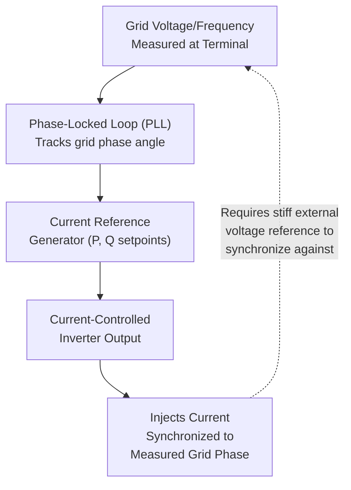

## Declining System Inertia from Inverter-Based Resource Penetration

### The Core Phenomenon

As power systems worldwide displace conventional synchronous generation (coal, gas, nuclear, large hydro) with Inverter-Based Resources (IBRs) — wind, solar photovoltaic, and battery energy storage — the total physical rotational inertia available to the system declines, often faster than total generation capacity would suggest, because IBRs are decoupled from grid frequency by power electronic converters and do not inherently contribute inertial response regardless of their internal energy content.

This is not merely an incremental change in system behavior but, at sufficiently high penetration, a qualitative shift in system dynamics: the assumptions underlying decades of stability analysis, protection coordination, and control design — built around a system dominated by synchronous machines with predictable inertial characteristics — begin to break down.

### Why IBRs Do Not Provide Native Inertia

A synchronous generator's rotor is electromagnetically coupled to grid frequency: any deviation between rotor speed and synchronous speed produces a restoring/opposing electromagnetic torque automatically, governed by physics rather than any control algorithm. This coupling is the source of physical inertial response.

An inverter-based resource, by contrast, is connected to the grid through a power electronic converter (typically a voltage-source converter switching at several kHz), which acts as a control-mediated interface rather than a direct electromagnetic coupling:

- **Wind turbines**: the turbine rotor does spin with substantial kinetic energy, but this energy is mechanically and electrically isolated from grid frequency by the AC-DC-AC (or DFIC partial) power conversion stage. The turbine rotor speed is controlled independently, typically for aerodynamic (Maximum Power Point Tracking) efficiency, and has no automatic coupling to grid frequency deviations unless a control loop is deliberately added.
- **Solar PV**: has no rotating mass at all in the generation process; the DC output of PV panels is inverted directly to AC, with zero inherent kinetic energy storage.
- **Battery storage**: similarly has no rotating mass; response to frequency deviation is entirely a function of the inverter's control software and the power/energy rating of the battery and converter.

In each case, **any frequency-responsive behavior must be explicitly programmed into the converter control system** — it is a control choice, not a physical inevitability, which is the fundamental distinction from synchronous machine behavior.

### Grid-Following Control: The Conventional (and Problematic) Default

The dominant control architecture historically deployed for wind and solar inverters is grid-following control:

A grid-following inverter behaves, electrically, as a controlled current source: it measures the grid voltage phase via a PLL and injects current synchronized to that externally-sensed reference, tracking a pre-determined active/reactive power setpoint. This architecture works well when the surrounding grid is "stiff" (i.e., dominated by synchronous machines providing a strong, stable voltage reference), but has two structural limitations relevant to inertia decline:

1. It provides **no inherent inertial response** — the current injection follows the power reference, not the physical dynamics of frequency deviation, unless a supplementary control loop is added
2. At very high IBR penetration (approaching or exceeding 100% of instantaneous demand in some regions during high-renewable periods), the PLL synchronization reference itself becomes weak or unstable, since there are too few synchronous machines left to provide the stiff voltage reference the PLL depends on — a phenomenon sometimes described as a "weak grid" stability problem distinct from, but related to, the inertia problem

### Quantifying the Impact: System Non-Synchronous Penetration (SNSP)

System operators track the instantaneous share of demand met by non-synchronous generation as a key operational constraint:

$$SNSP = \frac{P_{wind} + P_{solar} + P_{HVDC\,import} + P_{other\,IBR}}{P_{demand} + P_{HVDC\,export}} \times 100\%$$

Historically, many system operators imposed SNSP limits (commonly in the 50-75% range in earlier grid code generations) as an operational safeguard, curtailing renewable output or requiring synchronous condensers/must-run synchronous generation to stay online even when not needed for energy production, purely to maintain adequate inertia and short-circuit strength. [Inference] These limits have been progressively relaxed in several jurisdictions as system operators gain operational experience and deploy compensating technologies (synthetic inertia, fast frequency response, grid-forming inverters, synchronous condensers), though the specific current limit in any given system is a live operational parameter that changes over time and should be verified against that system operator's current published operating policy rather than assumed from historical figures.

### Compounding Effects on RoCoF and Frequency Nadir

Referring to the RoCoF relationship developed from the swing equation:

$$\text{RoCoF} = \frac{\Delta P \cdot f_0}{2 E_{kin}}$$

Declining $E_{kin}$ (total system kinetic energy = $H_{system} \times S_{total,synchronous}$) has two compounding effects on system security for a given contingency size $\Delta P$ (e.g., loss of the largest single generating unit or HVDC link, the standard "credible contingency" used in reserve sizing):

1. **Steeper initial RoCoF**, increasing the risk that:
   - RoCoF-based anti-islanding relays on distributed generation misoperate, trip additional generation, and worsen the very disturbance they were meant to protect against (a dangerous positive-feedback cascading risk)
   - The frequency reaches critical protection thresholds faster, leaving less time for primary frequency response and automatic defense schemes (UFLS) to act before damage-preventing generator under-frequency trips engage
2. **Lower frequency nadir** (the minimum frequency reached before primary response and load damping arrest the decline) for a given primary response capability, since less kinetic energy is available to buy time during the interval before governor response ramps up

This creates a self-reinforcing planning challenge: the same displacement of synchronous generation that reduces available primary response headroom (fewer governor-controlled MW online) simultaneously reduces the inertia that would otherwise buy time for whatever primary response remains.

### Mitigation Strategies

**1. Synthetic (Emulated) Inertia from Wind Turbines**

Control algorithms detect RoCoF or frequency deviation at the turbine terminal and command a temporary additional active power injection by extracting kinetic energy from the turbine's own rotating mass (blades, hub, drivetrain, and — for DFIG designs — the rotor), which is otherwise decoupled from grid frequency. This is fundamentally different from synchronous inertia in two respects:

- It is a **detection-and-response control action** with inherent measurement and processing delay, not an instantaneous physical coupling
- The extracted kinetic energy must eventually be restored (the turbine rotor slows down and must re-accelerate), which can produce a secondary "energy payback" dip in turbine output and, at scale, a secondary system frequency effect

**2. Fast Frequency Response (FFR) from Battery Storage**

Battery inverters, having essentially no mechanical time constant, can respond to frequency/RoCoF triggers within tens of milliseconds — often faster than conventional governor response — providing a rapid power injection bounded by the battery's power rating and available energy (state of charge), rather than by a kinetic energy reservoir. Many system operators have introduced FFR as a distinct, separately procured and compensated ancillary service product to explicitly value this capability.

**3. Grid-Forming Inverter Control**

A fundamentally different control paradigm in which the inverter is controlled to present an internal AC voltage source (with defined magnitude and phase/frequency dynamics) behind an output impedance — conceptually analogous to a synchronous machine's internal EMF behind synchronous reactance — rather than behaving as a current source tracking an externally measured phase reference.

Under this architecture, the inverter can:

- Provide an instantaneous (or near-instantaneous, limited by converter switching and control bandwidth rather than PLL tracking delay) power response to frequency and phase deviations
- Operate without requiring a pre-existing stiff grid voltage reference, and in principle support system "black start" and islanded operation
- Provide a form of virtual/synthetic inertia through control design (e.g., virtual synchronous machine algorithms that explicitly emulate swing-equation dynamics in the control loop)

[Inference] Grid-forming control is an active area of standards development (e.g., work by NERC, ENTSO-E, and various national TSOs on grid-forming requirements for new IBR interconnections) rather than a single settled specification; different vendors and researchers have proposed varying control architectures (droop-based virtual synchronous machine, virtual oscillator control, matching control, among others), and the degree to which grid-forming inverters can fully substitute for synchronous inertia at very high penetration levels remains a subject of ongoing technical study rather than settled engineering consensus.

**4. Synchronous Condensers**

Decommissioned or repurposed synchronous generators (or purpose-built synchronous condensers) operated without a prime mover, spinning synchronously with the grid purely to provide rotational inertia, reactive power support, and short-circuit current contribution. This is a direct, well-understood way to restore physical inertia and grid strength in regions with high IBR penetration, at the cost of the capital and ongoing operational expense of maintaining machines that produce no active power revenue.

**5. Operational and Market Mechanisms**

- **Minimum inertia / kinetic energy floors**: some system operators (e.g., in Ireland/Northern Ireland's SEM, and parts of Great Britain) have introduced explicit minimum system inertia requirements as operational constraints, sometimes procured via a dedicated market or contracted service (inertia and/or FFR procurement)
- **Curtailment of IBR output**: as a last-resort operational measure to keep sufficient synchronous generation online during periods of high renewable availability and low demand
- **RoCoF relay setting revisions**: updating anti-islanding relay thresholds and time delays across the fleet of connected distributed generation to reduce nuisance tripping risk as ambient RoCoF levels rise — a significant, multi-year fleet-wide coordination exercise in many jurisdictions

### Comparative Summary

| Factor | Synchronous Generation | Grid-Following IBR | Grid-Forming IBR |
| --- | --- | --- | --- |
| Native inertia | Yes (physical, instantaneous) | None | Potentially, via control design |
| Response to RoCoF | Automatic (physics) | None unless explicitly added | Can be near-instantaneous |
| Requires external voltage reference | No | Yes (PLL synchronization) | No (can establish its own reference) |
| Short-circuit current contribution | High (multiples of rated current) | Low (typically limited to ~1.1-1.2x rated) | Varies by design, generally higher than grid-following |
| Response energy source | Rotor kinetic energy | Power reference / converter rating | Converter rating + any coupled storage |

### Related Topics

- Rotational Inertia and Rate of Change of Frequency Fundamentals
- Grid-Forming vs. Grid-Following Inverter Control Architectures
- Virtual Synchronous Machine and Droop-Based Grid-Forming Control Algorithms
- System Non-Synchronous Penetration (SNSP) Limits and Operational Management
- Fast Frequency Response (FFR) and Inertia Ancillary Service Market Design
- Synchronous Condenser Application and Retrofit of Retired Generation Assets
- Weak Grid Interconnection Issues and Short-Circuit Ratio (SCR) Requirements
- Under-Frequency Load Shedding Coordination in Low-Inertia Systems