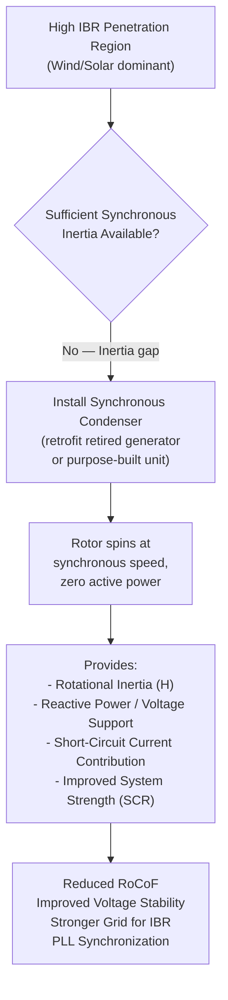

## Synchronous Condensers and Inertia Augmentation

### Definition and Basic Principle

A synchronous condenser (also called a synchronous compensator) is a synchronous machine operated without a prime mover (no turbine, no mechanical driving torque input) and without a mechanical load, spinning synchronously with the grid purely to provide electrical services: reactive power support, voltage regulation, short-circuit current contribution, and — of particular relevance in modern low-inertia grids — physical rotational inertia.

Mechanically, a synchronous condenser is functionally identical to a conventional synchronous generator or motor: a wound rotor field winding excited by a DC current, spinning at synchronous speed, electromagnetically coupled to the grid. The distinguishing feature is purely operational: it produces no net active power (aside from small losses it draws to overcome friction, windage, and electrical losses), and its function is defined entirely by its reactive power and inertial behavior.

### Physical Operation

The machine is brought up to synchronous speed either by:

- **Direct grid start**: using the grid itself as a starting motor (induction start via damper windings, or via a variable frequency drive / static frequency converter for smoother start-up), or
- **Pony motor / starting motor**: a smaller auxiliary motor mechanically coupled to bring the rotor to near-synchronous speed before synchronizing to the grid

Once synchronized, the machine's field excitation is controlled by its AVR to regulate reactive power output/absorption:

$$Q = \frac{V_t E_f}{X_s}\cos\delta - \frac{V_t^2}{X_s}$$

(simplified round-rotor reactive power expression, where $\delta \approx 0$ for a condenser at near-zero active power output)

- **Overexcited operation** ($E_f > V_t$): the machine sources reactive power to the grid, supporting voltage during heavy loading conditions
- **Underexcited operation** ($E_f < V_t$): the machine absorbs reactive power from the grid, useful during light-load conditions when transmission line charging can cause voltage rise

Because active power output is essentially zero (aside from losses), rotor angle $\delta$ remains near zero, and the machine's rotor simply spins at synchronous speed indefinitely, its kinetic energy continuously available to the grid.

### Inertial Contribution Mechanism

The synchronous condenser's rotor, spinning at synchronous speed with its own moment of inertia $J$ and associated inertia constant $H_{sc}$, contributes to the same swing-equation physics described for conventional generators:

$$2H_{sc}\frac{d\Delta f}{dt}\bigg|_{contribution} = -\Delta P_{sc}$$

When system frequency deviates, the synchronous condenser's rotor automatically decelerates or accelerates in exact synchronism with the electrical grid frequency, releasing or absorbing kinetic energy — this is the same automatic, physics-governed inertial response as any synchronous machine, requiring no control system action or communication delay.

This directly adds to system aggregate kinetic energy:

$$E_{kin,system} = \sum_i H_i S_i \quad \text{(summed over all synchronous machines, including condensers)}$$

and therefore directly reduces RoCoF for a given disturbance $\Delta P$, per the standard relationship:

$$\text{RoCoF} = \frac{\Delta P \cdot f_0}{2 E_{kin,system}}$$

### Diagram: Synchronous Condenser in a Low-Inertia System

### Retrofit of Retired Generating Units

A common and cost-effective deployment strategy is converting a decommissioned conventional generator (typically a retired coal or gas steam unit) into a synchronous condenser:

**Typical retrofit steps:**

1. Mechanically de-couple or remove the turbine (steam/gas turbine no longer needed to provide mechanical torque)
2. Assess and potentially refurbish the existing generator rotor, stator windings, and bearings for continuous synchronous-speed operation without the thermal cycling patterns of a generating unit
3. Retain or upgrade the existing excitation system (AVR) — this is central to the machine's reactive power function and largely unchanged from generator operation
4. Install or retain a starting means (pony motor, static frequency converter, or grid-assisted start via existing auxiliary systems)
5. Add or retain a flywheel if additional inertia beyond the machine's native rotor inertia is desired (see below)
6. Verify protection and control system settings are appropriate for condenser (near-zero active power, potentially bidirectional reactive power) operation rather than generator operation

This retrofit path is attractive because it reuses existing substation infrastructure (transformers, switchgear, grid connection) and a large rotating mass that would otherwise be scrapped, at a fraction of the cost of a purpose-built new machine.

### Purpose-Built Synchronous Condensers

For sites without a retiring generator to repurpose, utilities and system operators (particularly in regions experiencing rapid IBR growth without corresponding retiring conventional plant, or in transmission-constrained areas needing voltage/inertia support) increasingly procure new-build synchronous condensers, often at strategic grid locations identified through system planning studies as inertia- or strength-deficient.

Purpose-built units are frequently specified with:

**Flywheels**: an additional mechanical inertia mass mounted on the same shaft, used to substantially increase $H$ beyond what the electrical machine's own rotor alone would provide, since the condenser's core electrical function (reactive power support) does not itself require large rotor mass — the flywheel is added specifically to maximize the kinetic energy contribution per installed machine, often the primary reason for its purchase in a low-inertia grid context.

### Comparative Role vs. Other Inertia/Strength Solutions

| Attribute | Synchronous Condenser | Grid-Forming Inverter | Synthetic Inertia (Wind) | Battery FFR |
| --- | --- | --- | --- | --- |
| Physical inertia | Yes (native + optional flywheel) | No physical inertia (control-emulated at best) | Limited, extractable from turbine mass | None (converter-limited response) |
| Short-circuit current contribution | High (multiples of rated current, several seconds sustained) | Limited by converter thermal rating (~1.1-2x rated, briefly) | Low | Low |
| Reactive power support | Continuous, bidirectional | Yes, converter-rating-limited | Limited | Limited |
| Response speed to frequency events | Instantaneous (physics) | Near-instantaneous (control-dependent) | Fast but with detection/processing delay and energy payback | Very fast (tens of ms) but energy-limited |
| Capital cost profile | High (new-build) / Moderate (retrofit) | Moderate (incremental to inverter cost) | Low (software/control upgrade) | High (storage capital cost) |
| Ongoing operating cost | Continuous losses, maintenance of rotating machine | Minimal beyond normal inverter O&M | Minimal | Minimal beyond battery degradation |

Synchronous condensers are frequently deployed **in combination with**, rather than as a substitute for, grid-forming inverters and FFR — each addresses a different facet of the low-inertia/weak-grid problem (physical inertia and short-circuit strength versus fast controllable power response), and system planners typically model the combined portfolio effect on RoCoF, frequency nadir, and voltage/strength metrics rather than relying on any single technology.

### System Strength and PLL Synchronization Benefit

Beyond inertia narrowly defined, synchronous condensers materially increase local **short-circuit ratio (SCR)** — the ratio of available fault (short-circuit) MVA at a point in the network to the MW rating of nearby IBR:

$$SCR = \frac{S_{fault}}{P_{IBR,rated}}$$

Grid-following inverters (which depend on PLL synchronization to a measurable, sufficiently stiff voltage waveform) can experience control instability or poor performance in "weak grid" conditions (low SCR, commonly cited threshold SCR < 2-3 as a zone of concern, though [Inference] this threshold is inverter-design-dependent and not a universal physical constant). By injecting substantial fault current and providing a strong local voltage source, a synchronous condenser directly raises local SCR, improving the operating stability of nearby grid-following IBR — a benefit distinct from, but complementary to, its inertial contribution.

### Economic and Planning Considerations

- **Siting**: optimal placement is determined by system studies identifying specific buses or regions with the largest inertia deficit, weakest short-circuit strength, or most severe projected RoCoF/voltage issues under high-IBR dispatch scenarios — not simply wherever a retiring plant happens to be located, though retrofit opportunities strongly influence practical site selection
- **Sizing**: driven by target $H \times S$ contribution needed to meet a defined RoCoF or minimum-inertia planning criterion at that location or system-wide
- **Losses**: continuous no-load and windage/friction losses represent an ongoing operating cost with no offsetting energy revenue, since the machine produces no net active power — this is typically justified as a reliability/ancillary-service cost rather than an energy-market investment
- **Ancillary service compensation**: increasingly, system operators are structuring specific market or contracted payment mechanisms (capacity payments, inertia/reactive power service contracts) to compensate synchronous condenser owners for a service that does not generate conventional energy market revenue

### Related Topics

- Rotational Inertia and Rate of Change of Frequency Fundamentals
- Declining System Inertia from Inverter-Based Resource Penetration
- Short-Circuit Ratio (SCR) and Weak Grid Interconnection Studies
- Grid-Forming vs. Grid-Following Inverter Control Architectures
- Reactive Power Compensation: SVC, STATCOM, and Synchronous Condensers
- Flywheel Energy Storage for Grid Inertia Support
- Retired Generation Asset Repowering and Grid Services Conversion
- Minimum Inertia Requirements and Ancillary Service Market Design