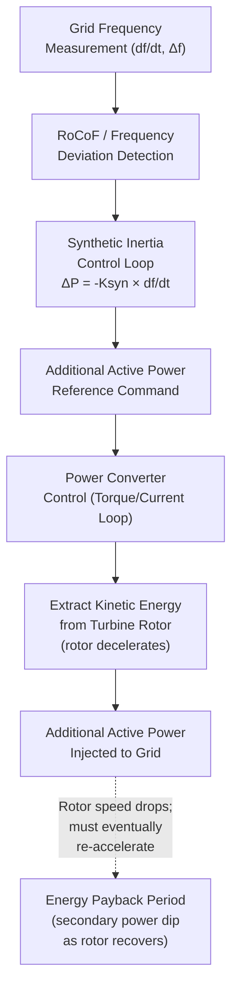

## Synthetic and Virtual Inertia from Inverter Control

### Conceptual Foundation

Synthetic inertia (also called virtual or emulated inertia) refers to control algorithms embedded in power electronic converters — wind turbine converters, battery inverters, or other inverter-based resources — that produce an active power response to frequency deviation or RoCoF, designed to emulate some of the beneficial system effects of physical rotational inertia without the underlying electromagnetic coupling that produces true synchronous inertia.

It is essential to distinguish this from physical inertia at the outset: synthetic inertia is a **control-mediated, detection-and-response action**, subject to measurement delay, signal processing, and control bandwidth limits, whereas physical inertia is an **instantaneous, automatic consequence of electromagnetic coupling** between rotor speed and grid frequency, governed by Newton's second law with no detection step required. This distinction has real consequences for how much synthetic inertia can substitute for physical inertia in system planning, discussed further below.

### Why Wind Turbines Are Decoupled from Grid Frequency

Modern variable-speed wind turbines (both Type 3 DFIG and Type 4 full-converter designs) intentionally decouple turbine rotor speed from grid electrical frequency via power electronic conversion, because:

- Variable rotor speed allows the turbine to track the aerodynamically optimal tip-speed ratio across varying wind speeds, maximizing energy capture (Maximum Power Point Tracking, MPPT)
- The power converter (partial-scale for DFIG, full-scale for Type 4) manages the frequency/voltage translation between the variable-frequency turbine-side output and the fixed-frequency grid

The consequence: even though a wind turbine rotor stores substantial kinetic energy (large blades, hub, and drivetrain mass), this energy is not automatically released in response to grid frequency deviation, because the power converter's control system — not direct electromagnetic coupling — determines how much active power flows to the grid at any instant. Absent a deliberate synthetic inertia control loop, the turbine simply continues operating at its MPPT-determined power output regardless of what grid frequency is doing.

### Synthetic Inertia Control Architecture

The typical control law takes the form:

$$\Delta P_{syn} = -K_{syn}\frac{df}{dt}$$

Where $K_{syn}$ is a tunable gain (effectively an emulated inertia constant, often expressed directly in seconds analogous to $H$) determining how aggressively the turbine responds to a given RoCoF. Some implementations combine this derivative (RoCoF-proportional) term with a proportional frequency-deviation term, similar in spirit to a droop response:

$$\Delta P_{syn} = -K_{syn}\frac{df}{dt} - K_{droop}\Delta f$$

This combined structure allows a single control loop to provide both an inertia-like fast initial response and a droop-like sustained response, though the two components draw on physically different aspects of the turbine's operating envelope (kinetic energy extraction versus power curve headroom).

### The Energy Payback Problem

The critical limitation distinguishing synthetic inertia from true physical inertia: when a wind turbine extracts additional kinetic energy from its rotor to support grid frequency during a disturbance, **that energy must eventually be restored**, because the rotor's kinetic energy is finite and the turbine must return to its MPPT-optimal speed to continue efficient energy capture.

This creates a two-phase response:

1. **Extraction phase** (seconds after the trigger event): rotor decelerates, releasing kinetic energy as additional active power injected to the grid — genuinely helpful, arresting frequency decline similarly to physical inertia during this window
2. **Recovery/payback phase** (following the initial response, typically 10-30 seconds later): the turbine must re-accelerate its rotor back toward the optimal MPPT speed, which requires drawing mechanical power from the wind *in excess of* what it delivers electrically for a period — effectively reducing electrical output below what it would otherwise have been, creating a **secondary dip** in system frequency support precisely during the period when the system may still be recovering from the original disturbance

[Inference] The magnitude and timing of this secondary dip is a significant design consideration in synthetic inertia control tuning, and different manufacturers implement varying strategies (e.g., limiting the depth of rotor speed excursion, or spreading the recovery over a longer period) to minimize its impact; the specific approach is proprietary to each turbine OEM's control implementation rather than a single standardized method.

### Measurement and Processing Delay

Unlike physical inertia (zero delay by definition), synthetic inertia control necessarily involves:

- **Signal measurement delay**: frequency or RoCoF must be measured over some window (commonly 20-100 ms for fast-response implementations) before a reliable estimate is available, since instantaneous frequency measurement from a single zero-crossing is noisy
- **Communication/processing delay**: control system computation and command propagation to the power converter's inner control loops
- **Converter response time**: the power converter's own current/torque control loop bandwidth limits how quickly the commanded additional power can actually be delivered

[Inference] Aggregate response delay for synthetic inertia implementations is commonly cited in the range of tens to a few hundred milliseconds, which is slow relative to the truly instantaneous physical inertial response but fast relative to conventional governor primary frequency response (which typically begins responding meaningfully only after 1-2 seconds and takes up to 30 seconds to fully deploy); exact figures are implementation- and vendor-specific rather than a fixed physical constant.

### Fast Frequency Response (FFR) from Battery Storage

Battery energy storage systems provide a related but distinct capability: because batteries have no mechanical rotor and essentially no thermal/mechanical time constant limiting response speed, battery inverters can respond to a frequency/RoCoF trigger extremely quickly — commonly cited in the tens-of-milliseconds range, often faster than synthetic inertia from wind turbines.

Key distinctions from wind turbine synthetic inertia:

- **No energy payback problem in the same form**: a battery's response is limited by its power rating and available state of charge, not by a need to "recover" a mechanical rotor speed — though the battery's state of charge is itself finite and must eventually be replenished through charging, which is a related but different constraint
- **Bidirectional capability**: batteries can both inject (discharge) power for over-frequency-triggered response as well as absorb (charge) power in response to under-frequency conditions, at least in the reverse case, or high-frequency events requiring absorption
- **Product-based procurement**: many system operators have created formal FFR ancillary service products with defined response speed and duration requirements (e.g., full response within 1 second, sustained for a specified duration), procured through competitive tender or capacity markets separately from conventional frequency response services

### Standards and Grid Code Treatment

[Unverified] Requirements for synthetic inertia and FFR provision vary substantially by jurisdiction and are an active area of grid code development rather than a single settled international standard; specific numerical requirements (response speed, sustained duration, deadband settings) should be verified against the current grid code of the relevant transmission system operator. Illustrative examples of the general approach include:

- Some system operators mandate synthetic inertia response as a **connection requirement** for new wind farms above a certain capacity threshold, with defined minimum $K_{syn}$ equivalent values
- Others treat FFR/synthetic inertia as a **competitively procured ancillary service**, compensating providers based on measured or type-tested performance rather than mandating it as a blanket connection condition
- IEC and IEEE working groups, along with regional bodies (ENTSO-E, NERC), have published or are developing technical guidance distinguishing inertial response, FFR, and primary frequency response as related but distinct grid services, each with its own performance metrics

### Limitations: Why Synthetic Inertia Does Not Fully Substitute for Physical Inertia

Several structural reasons limit the degree to which synthetic inertia can be treated as equivalent to physical inertia in system planning:

1. **Finite, extractable energy vs. continuous physical coupling**: physical inertia responds continuously and automatically to any frequency deviation for as long as the deviation persists (bounded only by how far rotor speed can safely drop before other protections engage); synthetic inertia is typically a time-limited, engineered response with a defined extraction and payback profile
2. **Detection delay**: even a few tens of milliseconds of delay matters significantly during the very fastest, highest-RoCoF portion of a severe disturbance, when physical inertia is doing the most work
3. **Aggregation uncertainty**: the actual aggregate synthetic inertia contribution from a fleet of wind turbines depends on real-time wind conditions (turbines operating below rated output have more rotor speed headroom to exploit than those at rated output), making it harder to guarantee as a firm, dispatchable system capability compared to physical inertia from an online synchronous machine, which is a known, fixed quantity
4. **Coordination complexity**: aggregate behavior of many independently controlled turbines and batteries, each running proprietary control algorithms, responding to the same system event creates emergent system-level dynamics that [Inference] are less thoroughly characterized in the operational record than the century of accumulated experience with synchronous machine inertial response, and remain an active subject of system studies and simulation model validation work by system operators and researchers

### Comparative Summary

| Attribute | Physical (Synchronous) Inertia | Synthetic Inertia (Wind) | Fast Frequency Response (Battery) |
| --- | --- | --- | --- |
| Response mechanism | Automatic electromagnetic coupling | Control-detected, commanded response | Control-detected, commanded response |
| Response delay | None (instantaneous) | Tens to hundreds of ms | Tens of ms (typically faster) |
| Energy source | Rotor kinetic energy (continuous) | Turbine rotor kinetic energy (finite, must be repaid) | Battery state of charge (finite, must be replenished) |
| Secondary effects | None | Energy payback dip | Minimal (charging replenishment separate concern) |
| Availability certainty | High (known online synchronous capacity) | Variable (depends on wind conditions/turbine loading) | High (if adequately charged) |
| Typical procurement | Inherent to synchronous generation, not separately compensated historically | Increasingly mandated or separately compensated | Competitively procured ancillary service |

### Related Topics

- Rotational Inertia and Rate of Change of Frequency Fundamentals
- Declining System Inertia from Inverter-Based Resource Penetration
- Grid-Forming vs. Grid-Following Inverter Control Architectures
- Synchronous Condensers and Inertia Augmentation
- Fast Frequency Response (FFR) Ancillary Service Market Design
- Wind Turbine Type 3 (DFIG) and Type 4 (Full-Converter) Control Architectures
- Frequency Nadir and Primary Frequency Response Coordination
- Grid Code Requirements for Inverter-Based Resource Interconnection