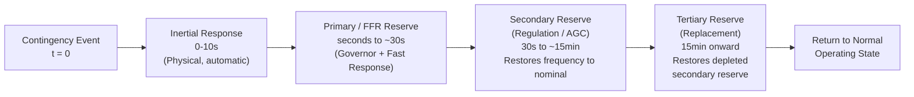

## Frequency Response Services and Reserve Requirements

### Purpose and Framework

Frequency response services and reserve requirements are the formal operational and market mechanisms by which system operators ensure sufficient generation and load resources are available, at the right speed and duration, to maintain frequency within acceptable limits following credible contingencies. Where earlier sections addressed the underlying physics (inertia, RoCoF, droop), this topic addresses how system operators translate that physics into procured, contracted, and dispatched services with defined performance requirements.

The overarching design question every system operator must answer: for a defined set of credible contingencies (typically sized to the loss of the single largest in-feed — generator or HVDC link — under the N-1 planning criterion), how much response capability, of what speed and duration, must be held in reserve at any given time to keep frequency within statutory or reliability-standard limits?

### The Reserve Categories

**Primary Reserve (Frequency Containment Reserve, FCR — ENTSO-E terminology; also called Regulating Reserve or Governor Response in other markets)**

- **Function**: arrest frequency decline/rise and stabilize frequency at a new steady-state value following a disturbance
- **Response time**: typically must begin responding within 2-10 seconds and be fully delivered within 15-30 seconds, sustained for a defined minimum duration (commonly 15 minutes, though this varies by market)
- **Providers**: conventional generators via governor droop response, increasingly supplemented by battery storage and demand response
- **Activation**: automatic, decentralized (droop-based), triggered directly by local frequency measurement — no central dispatch signal required for activation, though the resource must be pre-qualified and held in reserve

**Secondary Reserve (Frequency Restoration Reserve, FRR — ENTSO-E terminology; also called Regulation or AGC Reserve)**

- **Function**: restore frequency to its nominal scheduled value (eliminating the steady-state offset left by primary/droop response) and restore tie-line flows to scheduled values in interconnected systems
- **Response time**: typically activated within 30 seconds to a few minutes, with full activation commonly required within 5-15 minutes
- **Providers**: generators (and increasingly storage/demand response) under centralized Automatic Generation Control (AGC), responding to Area Control Error signals
- **Activation**: centrally dispatched via AGC, not purely local droop response

**Tertiary Reserve (Replacement Reserve)**

- **Function**: restore the secondary reserve that was consumed responding to the initial event, and support further economic redispatch, preparing the system for a subsequent contingency
- **Response time**: minutes to tens of minutes (commonly 15 minutes to an hour depending on market design)
- **Providers**: typically slower-starting generation (e.g., units requiring startup time) or demand response with longer activation lead times
- **Activation**: manually or semi-automatically dispatched by system operators based on economic merit order

### Reserve Sizing Methodology

The foundational sizing principle across most interconnections is the **N-1 (or N-1-1, for more conservative systems) credible contingency**: the reserve held must be sufficient to cover the loss of the single largest in-feed (generator, HVDC interconnector, or in some designs, a defined multiple contingency) without frequency excursion beyond defined limits.

$$\text{Required Primary Reserve} \geq \Delta P_{largest\,credible\,contingency}$$

More sophisticated probabilistic sizing methodologies (increasingly adopted as systems incorporate variable renewable generation) consider:

$$\text{Reserve Requirement} = f(\text{contingency size}, \text{forecast uncertainty}, \text{system inertia}, \text{acceptable risk level})$$

This reflects a shift from purely deterministic (N-1) sizing toward probabilistic approaches that explicitly account for renewable generation and demand forecast uncertainty as an additional source of required balancing capability, alongside the traditional discrete generator-loss contingency.

### Frequency Response Obligation Standards (Illustrative)

[Unverified] Specific numerical performance standards vary by interconnection and are periodically revised; the following illustrates the general structure of such standards rather than current authoritative values, which should be verified against the relevant reliability standard body:

| Region/Framework (illustrative) | Standard Reference | General Approach |
| --- | --- | --- |
| North America (NERC) | BAL-003 (Frequency Response Obligation) | Assigns each Balancing Authority a minimum Frequency Response Obligation based on historical system frequency response performance during actual disturbances |
| Continental Europe (ENTSO-E) | FCR/FRR/RR framework under System Operation Guideline | Synchronous-area-wide FCR obligation shared proportionally among Transmission System Operators based on generation/consumption share |
| Great Britain (National Grid ESO) | Historically Firm Frequency Response (FFR); evolving service suite | Multiple response speed tiers (Dynamic, Static) procured via market mechanisms |
| Ireland/Northern Ireland (SEM) | DS3 System Services Programme | Explicit suite of services including POR/SOR/TOR1/TOR2 (Primary/Secondary/Tertiary Operating Reserve) and dedicated Fast Frequency Response |

### Reserve Product Design: Speed and Duration Dimensions

Modern reserve product taxonomies increasingly disaggregate what was historically a small number of broad categories into more granular products distinguished along two key dimensions:

**Response speed** (how quickly full response must be delivered):

- Sub-second to a few seconds: Fast Frequency Response, synthetic inertia-adjacent products
- 2-10 seconds: primary/dynamic response
- 30 seconds to minutes: secondary/regulation response
- Minutes to an hour: tertiary/replacement response

**Sustained duration** (how long the response must be maintained once activated):

- Seconds (FFR, often 1-30 seconds sustained)
- Minutes (primary response, commonly 15-30 minutes)
- Extended (secondary/tertiary, until relieved by subsequent reserve or normal redispatch)

This disaggregation reflects growing recognition that different technologies have fundamentally different response profiles — a battery can respond extremely fast but only for a duration limited by its energy capacity, while a conventional thermal unit responds more slowly but can sustain output for hours — and procuring against a single monolithic "reserve" product poorly values these distinct technical capabilities.

### The Governor Droop Foundation of Primary Reserve

Individual generator contribution to primary reserve is governed by droop characteristic $R$:

$$\Delta P = -\frac{1}{R}\frac{\Delta f}{f_0}$$

System-wide primary response capability (aggregate stiffness) is the sum of all online, responsive units' droop-based sensitivity, plus load's own frequency-damping contribution $D$:

$$\beta = \sum_i \frac{1}{R_i} \cdot \frac{S_i}{S_{base}} + D$$

This aggregate system stiffness $\beta$ (sometimes called the "frequency response characteristic" in NERC terminology) determines the steady-state frequency deviation resulting from a given imbalance:

$$\Delta f_{ss} = \frac{-\Delta P}{\beta}$$

Reserve requirement calculations must ensure that $\beta$, aggregated across all responsive online resources, is sufficient to keep $\Delta f_{ss}$ within acceptable bounds for the largest credible contingency, before secondary response (AGC) restores frequency fully to nominal.

### Impact of Renewable Generation and IBRs on Reserve Requirements

Several factors specific to high-IBR systems increase and complicate reserve requirements relative to conventional systems:

- **Reduced governor-responsive capacity**: as synchronous generation is displaced, fewer MW of droop-responsive capacity remain online per unit of total system demand, all else equal, shrinking $\beta$
- **Forecast uncertainty as a reserve driver**: variable renewable output forecast error becomes a significant, continuously present component of required balancing reserve, distinct from the traditional discrete "loss of largest unit" contingency — some system operators now size a portion of reserve explicitly against renewable forecast error statistics rather than purely deterministic contingencies
- **New reserve products for IBR-provided response**: as discussed in prior sections, FFR and similar fast, short-duration products are specifically designed to allow battery storage and appropriately controlled wind/solar to participate in frequency response markets, partially offsetting the loss of conventional governor response capacity
- **Curtailment as an unusual reserve-providing mechanism**: renewable generators operating below their available output (deliberately curtailed) can provide upward frequency response headroom in a manner analogous to conventional generation operating below full output — some system operators have begun exploring or implementing curtailed-renewable reserve provision as an additional resource category

### Market vs. Mandatory Provision Models

- **Mandatory/regulatory provision**: reserve capability required as a condition of interconnection (a "must offer" or technical connection requirement), with no separate market payment beyond capacity/energy market participation — historically common for primary response from conventional generation
- **Competitively procured ancillary services**: reserve capability explicitly tendered and compensated through a defined market or auction mechanism, increasingly the model for FFR and other new, technology-differentiated products, reflecting the view that requiring these newer, more sophisticated response capabilities without separate compensation could discourage investment in the enabling technology (battery storage, advanced turbine controls)
- **Co-optimization with energy markets**: many modern market designs co-optimize energy and reserve procurement simultaneously (e.g., in security-constrained unit commitment and economic dispatch formulations), recognizing that holding a unit in reserve has an opportunity cost in terms of foregone energy market revenue that should be reflected in reserve pricing

### Compliance Monitoring and Performance Verification

System operators typically require:

- **Pre-qualification testing**: resources must demonstrate, via a defined test protocol, that they can actually deliver the claimed response speed and magnitude before being accepted as a qualified reserve provider
- **Real-time performance monitoring**: PMU and SCADA-based measurement of actual delivered response during real disturbance events, compared against contracted/obligated performance
- **Performance-based settlement**: some markets adjust compensation based on measured performance during actual events, rather than paying purely for capacity availability regardless of demonstrated delivery

### Related Topics

- Frequency Stability Fundamentals and the Frequency Response Timeline
- Load-Frequency Control (LFC) and Automatic Generation Control (AGC) Design
- Fast Frequency Response (FFR) Ancillary Service Market Design
- Governor Droop Control and Turbine-Governor Modeling
- Declining System Inertia from Inverter-Based Resource Penetration
- Probabilistic Reserve Sizing Methodologies for Renewable-Dominant Systems
- Area Control Error (ACE) and Interconnection Tie-Line Bias Control
- Under-Frequency Load Shedding as a Last-Resort Reserve Backstop