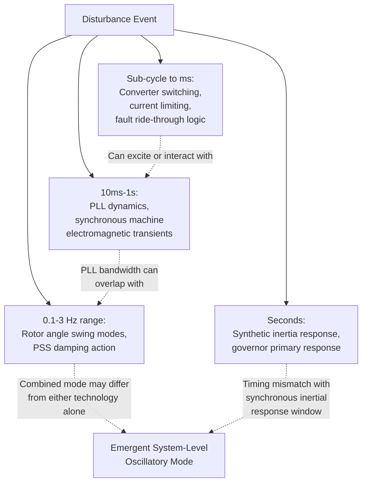
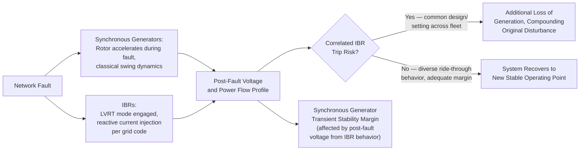

## Transient Interaction Between Synchronous Generators and IBRs

### Framing the Problem

As transmission and distribution networks transition from systems dominated exclusively by synchronous machines to systems with substantial shares of Inverter-Based Resources (IBRs) operating alongside remaining synchronous generation, new categories of transient interaction emerge that do not exist, or exist only in benign forms, in purely synchronous systems. These interactions arise because synchronous generators and IBRs respond to disturbances through fundamentally different physical and control mechanisms operating on overlapping timescales, and their combined dynamic behavior is not simply the linear superposition of each technology's isolated response.

This topic synthesizes the interaction effects that follow from the individual mechanisms covered in prior sections (synchronous machine swing dynamics, PSS damping, grid-following/grid-forming control, synthetic inertia) when both technology types coexist and interact during and after a disturbance.

### Timescale Overlap and Control Interaction

Synchronous generator electromechanical dynamics (rotor swing modes, the domain of the classical PSS design covered earlier) typically occupy the 0.1-3 Hz range. IBR control loops — particularly PLL dynamics in grid-following converters, and the outer power/voltage control loops in both grid-following and grid-forming designs — often have control bandwidths that overlap this same frequency range, since control designers tune these loops to respond quickly to grid conditions for good power quality and fault ride-through performance. This bandwidth overlap creates the potential for control interaction: the IBR's control response and the synchronous generator's electromechanical response are no longer cleanly separable in frequency, and their combined closed-loop dynamics can differ meaningfully from either technology's isolated behavior.

### Specific Interaction Mechanisms

**1. PLL-Induced Oscillatory Instability in Weak Grids**

A grid-following inverter's Phase-Locked Loop tracks the phase of the locally measured grid voltage to synchronize current injection. In a strong grid (high short-circuit ratio, dominated by nearby synchronous machines), the voltage waveform the PLL tracks is largely independent of the inverter's own current injection — a stiff, largely externally-imposed reference. As synchronous generation is displaced and local short-circuit ratio (SCR) falls, the voltage at the inverter's point of connection becomes increasingly influenced by the inverter's *own* current injection (since there is less synchronous machine impedance "stiffening" the bus), creating a feedback loop between the PLL's phase-tracking action and the resulting voltage, which the PLL then measures.

Under sufficiently low SCR, this feedback loop can become dynamically unstable or poorly damped, producing sustained oscillations — a phenomenon distinct from classical rotor angle instability but capable of coexisting with, or even interacting with, nearby synchronous generator dynamics if the oscillation frequency happens to fall near an electromechanical mode.

**2. Sub-Synchronous Control Interaction (SSCI)**

Distinct from classical Sub-Synchronous Resonance (SSR, which involves torsional interaction between a synchronous generator's shaft and series-compensated transmission line electrical resonance), Sub-Synchronous Control Interaction refers to instability arising from the interaction between an IBR's power electronic control system and the electrical network, particularly in the presence of series capacitor compensation. Documented events (e.g., at wind plants connected to series-compensated transmission in the U.S. and elsewhere) have shown that wind turbine converter control loops can interact with network resonances at sub-synchronous frequencies, producing growing oscillations analogous in symptom (though different in root cause) to classical torsional SSR.

[Inference] Unlike classical SSR, which is a well-characterized electromechanical phenomenon with decades of established analysis methods (eigenvalue analysis of the combined electrical-mechanical system), SSCI analysis methods are comparatively newer and less universally standardized, and specific risk depends heavily on the particular converter control implementation of the IBR in question — this remains an active area of both academic research and industry technical guidance (e.g., work by NERC's Inverter-Based Resource Performance subcommittee) rather than a fully settled analytical framework.

**3. Reduced Damping Torque Contribution from Displaced Synchronous Generation**

Recall from PSS design theory that damping of electromechanical oscillations arises substantially from the interaction between the AVR/PSS control loop and the generator's own electrical torque production. As synchronous generators are displaced by IBRs (which do not participate in this same rotor-angle-referenced damping torque mechanism unless explicitly designed to, e.g., via Power Oscillation Damping control added to a grid-forming or FACTS-based IBR), the *aggregate* damping available to counteract inter-area and local oscillation modes can decline even if the remaining synchronous generators' individual PSS tuning is unchanged — because there are fewer machines contributing damping torque to the same oscillation modes, and the network's electrical characteristics (impedance, power flow patterns) have also shifted due to the changed generation mix.

**4. Fault Ride-Through Interaction and Cascading Trip Risk**

During and immediately after a network fault, synchronous generators experience the classical transient stability dynamics (rotor acceleration during the fault, potential loss of synchronism if critical clearing time is exceeded). IBRs, meanwhile, typically enter a distinct fault ride-through mode governed by grid code requirements (e.g., Low Voltage Ride-Through, LVRT) specifying how long the IBR must remain connected during a voltage sag and how it should behave (often injecting reactive current proportional to the voltage deviation, per requirements such as those in German VDE-AR-N 4110 or similar codes elsewhere) before returning to normal operation.

The interaction risk arises because:

- IBR reactive current injection during the fault affects the voltage profile the *synchronous* generators experience, potentially affecting their transient stability margin (the accelerating/decelerating power available during and after the fault)
- If IBR fault ride-through logic causes a large fleet of IBRs to simultaneously reduce active power output or trip (e.g., due to a common design characteristic across many units from the same manufacturer, or a shared protection setting), this can itself constitute a significant, correlated loss-of-generation event overlapping with the original fault-induced disturbance — a risk explicitly highlighted in post-event analyses of several large-scale solar/wind fleet trip events

### Diagram: Combined System Response Pathway

### Analytical and Modeling Challenges

Studying these interactions requires methods that extend beyond the classical tools used for purely synchronous systems:

- **Electromagnetic Transient (EMT) simulation**: increasingly necessary (rather than the traditional RMS/phasor-domain transient stability simulation used for classical swing studies) to accurately capture fast converter control dynamics, PLL behavior, and sub-synchronous frequency interactions — EMT simulation is computationally far more intensive, limiting the size of system that can be practically studied compared to RMS-domain tools
- **Detailed, vendor-specific converter control models**: unlike synchronous machine models (which are well-standardized across the industry, e.g., IEEE Std 1110 generic models), IBR converter control behavior is often proprietary to the manufacturer, requiring either vendor-supplied detailed models (increasingly requested by system operators as a condition of interconnection studies) or standardized generic models (e.g., WECC/IEC generic renewable energy models) that may not capture every relevant control interaction
- **Impedance-based stability analysis**: a frequency-domain technique examining the interaction between the IBR's output impedance (as seen from the grid) and the grid's own impedance characteristic (the Nyquist stability criterion applied to this impedance ratio), used particularly for weak-grid PLL interaction and SSCI-type studies, complementary to time-domain simulation

### Mitigation Approaches

- **Grid-forming inverter deployment**: as discussed in prior sections, grid-forming control fundamentally changes the IBR's interaction character with the network (behaving as a voltage source rather than depending on PLL synchronization to an external reference), which [Inference] is widely expected in current research and industry guidance to reduce several of the weak-grid interaction risks described above, though the degree of improvement depends on specific control design and has not been universally validated across all interaction mechanisms at very high penetration levels
- **PLL bandwidth tuning and coordination**: adjusting PLL control bandwidth to avoid problematic overlap with known electromechanical or sub-synchronous network resonance frequencies, informed by site-specific impedance-based stability studies
- **Diversification of IBR fault ride-through settings**: encouraging or requiring diversity in protection and ride-through settings across an IBR fleet (rather than uniform settings that create correlated trip risk), sometimes through updated grid code requirements following observed fleet-trip events
- **Series compensation level review**: for SSCI risk specifically, reviewing and potentially limiting the degree of series capacitive compensation on lines serving large wind/solar plants, or adding sub-synchronous damping controllers
- **Enhanced interconnection study requirements**: system operators increasingly require detailed EMT-based interaction studies (rather than relying solely on traditional RMS transient stability studies) as a condition of connecting new, large IBR plants, particularly in regions already experiencing high IBR penetration or known weak-grid conditions

### Related Topics

- Grid-Forming vs. Grid-Following Inverter Control Architectures
- Sub-Synchronous Resonance (SSR) and Torsional Interaction Analysis
- Weak Grid Interconnection Issues and Short-Circuit Ratio (SCR) Requirements
- Electromagnetic Transient (EMT) vs. RMS/Phasor Domain Simulation Methods
- Low Voltage Ride-Through (LVRT) Grid Code Requirements for IBRs
- Power System Stabilizer Design and Damping Torque Contribution
- Impedance-Based Stability Analysis for Power Electronic Systems
- Declining System Inertia from Inverter-Based Resource Penetration