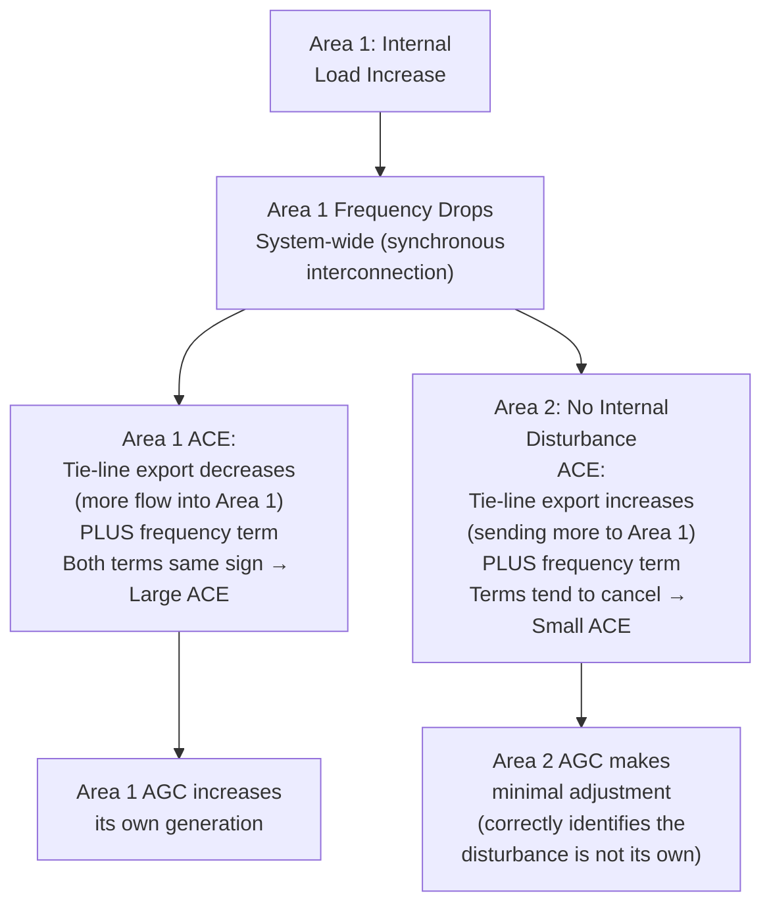
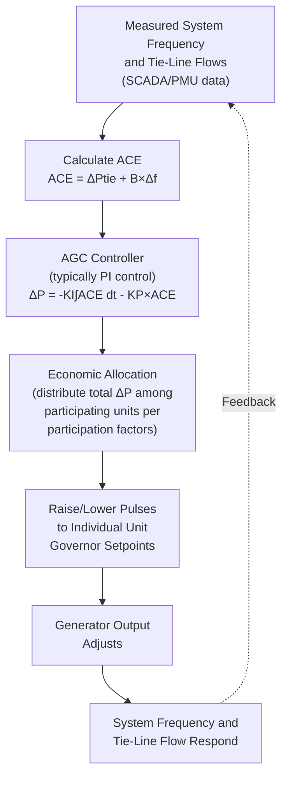

## Automatic Generation Control and Load-Frequency Control

### Purpose and Scope

Automatic Generation Control (AGC), implementing the underlying discipline of Load-Frequency Control (LFC), is the centralized real-time control system that adjusts the output of selected generating units to maintain system frequency at its scheduled nominal value and, in interconnected multi-area systems, to maintain net tie-line power flows at their scheduled values. Where primary (governor droop) response is decentralized and automatic, arresting frequency decline within seconds, AGC operates on a slower timescale (seconds to minutes) to eliminate the steady-state frequency and tie-line flow deviations that primary response alone cannot correct.

### Why Primary Response Alone Is Insufficient

Governor droop control, by design, produces a proportional response: a generator increases output in proportion to frequency deviation, meaning the system settles at a new frequency offset from nominal (as established in the aggregate stiffness relationship $\Delta f_{ss} = -\Delta P/\beta$ covered in frequency response fundamentals). This is an inherent property of proportional control — pure droop response, without further correction, cannot restore frequency exactly to its nominal value, because doing so would require zero remaining error, which would also mean zero remaining corrective governor output for a proportional controller.

AGC provides the integral action needed to drive this steady-state error to zero, functioning as an outer control loop layered above the individual generators' local droop response.

### Single-Area LFC Model

For an isolated system (single control area, no tie-lines), the LFC objective simplifies to restoring frequency to nominal following a load change. The classical block-diagram representation combines:

$$\text{Governor}: \quad \frac{1}{1+sT_g}$$

$$\text{Turbine}: \quad \frac{1}{1+sT_t}$$

$$\text{Rotating Mass + Load}: \quad \frac{1}{2Hs+D}$$

$$\text{Droop Feedback}: \quad \frac{1}{R}$$

The integral controller added for AGC action takes the form:

$$\Delta P_{AGC} = -K_I \int ACE \, dt$$

Where Area Control Error (ACE), for a single isolated area, reduces to:

$$ACE = -B\Delta f$$

with $B$ (the frequency bias factor, MW/Hz or MW/0.1Hz) representing the area's own natural frequency response characteristic. Driving ACE to zero via integral control necessarily drives $\Delta f$ to zero, restoring frequency to exactly its nominal scheduled value.

### Multi-Area LFC and Tie-Line Bias Control

In interconnected systems (multiple control areas connected by tie-lines, as is standard in most large synchronous interconnections), each area's AGC must accomplish two objectives simultaneously:

1. Help maintain system-wide frequency at nominal
2. Ensure its own area absorbs its own load changes rather than relying on neighboring areas' generation (i.e., each area maintains its scheduled net interchange with neighbors)

This is achieved through the **Tie-Line Bias Control** formulation of ACE:

$$ACE_i = (P_{tie,i,actual} - P_{tie,i,scheduled}) + B_i(f_{actual} - f_{scheduled})$$

Where:

- $(P_{tie,actual} - P_{tie,scheduled})$: the tie-line flow deviation term, capturing whether area $i$ is exporting more or less than scheduled to its neighbors
- $B_i(f_{actual} - f_{scheduled})$: the frequency bias term, scaled by the area's own frequency bias setting $B_i$

The critical design property of tie-line bias control: $B_i$ is deliberately tuned (ideally set close to the area's own natural frequency response characteristic $\beta_i$, i.e., $B_i \approx \beta_i$) so that **an area experiencing its own internal load-generation imbalance will show non-zero ACE and thus correct its own generation, while an area with no internal imbalance (frequency deviation is caused entirely by a neighboring area's disturbance) will show approximately zero ACE and will not unnecessarily adjust its own generation** — even though system-wide frequency has deviated.

This self-correcting property is the central design achievement of tie-line bias control: each area is incentivized and mechanically guided to serve its own load changes from its own generation, a principle sometimes summarized as each area being responsible for "cleaning up its own mess," which is essential for fair and stable operation of a multi-utility interconnected grid.

### AGC Control Loop Structure

**Participation Factors**: when AGC calculates a total required generation adjustment $\Delta P_{AGC}$, this quantity must be distributed among the specific units enrolled in AGC (not all units necessarily participate — some remain at fixed output for economic or technical reasons). Each participating unit $j$ receives a share:

$$\Delta P_j = \alpha_j \cdot \Delta P_{AGC}, \quad \sum_j \alpha_j = 1$$

Participation factors $\alpha_j$ are set based on a combination of technical response capability (ramp rate, regulating range) and economic considerations (units with lower marginal adjustment cost or better response characteristics can be weighted more heavily), and are typically updated periodically (e.g., every few minutes to hourly) to reflect changing unit commitment and economic dispatch conditions, rather than being fixed constants.

### Economic Dispatch Integration

Modern AGC systems typically integrate closely with the broader Energy Management System (EMS), particularly the security-constrained economic dispatch function, so that:

- AGC's frequency/tie-line regulation function operates on top of an underlying economically optimal base-point dispatch
- Participation factors and regulating ranges are consistent with each unit's economic dispatch instruction, avoiding a situation where AGC commands adjustments that conflict with, or unnecessarily override, the economically optimal generation schedule
- Some modern EMS implementations directly co-optimize the regulation (AGC) reserve requirement alongside energy dispatch in the security-constrained unit commitment/dispatch formulation, rather than treating AGC purely as a downstream real-time correction layer

### AGC Performance Standards

Reliability organizations define quantitative performance criteria for AGC operation. [Unverified] Specific criteria and numerical thresholds vary by interconnection and are periodically revised; illustrative examples of the general structure include:

- **Control Performance Standards** (e.g., historically NERC's CPS1 and CPS2 in North America) which statistically evaluate an area's ACE performance over defined time windows, ensuring that an area's frequency/tie-line control contributes to, rather than degrades, overall interconnection frequency quality
- **Balancing Authority ACE Limit (BAAL)** standards, establishing bounds on how far and how long an individual area's ACE may deviate before corrective action is mandated

These standards exist because, in an interconnected system, one area's poor AGC performance (e.g., persistently large or oscillating ACE) can degrade frequency quality for the entire synchronous interconnection, not just that area — making AGC performance a shared reliability concern requiring standardized, auditable metrics rather than being left purely to each area's internal judgment.

### Time Error Correction

Because system frequency, integrated over time, determines the accumulated "time" kept by frequency-synchronized clocks and certain industrial processes historically dependent on precise 60/50 Hz timing, some interconnections incorporate a **time error correction** function within or alongside AGC: deliberately biasing the frequency schedule slightly above or below exactly nominal for a period, to correct accumulated time error from a prior period of sustained frequency deviation. [Inference] The prevalence and precise implementation of formal time error correction has been declining in some interconnections as fewer critical systems depend on grid-frequency-derived timekeeping, though the practice and specific policy vary by system operator and should be verified against current operational procedures rather than assumed uniform.

### Interaction with Frequency Response Services (Cross-Reference)

AGC's secondary reserve function sits explicitly in the middle of the frequency response timeline established in prior sections: it activates after primary/FFR response has arrested the initial frequency excursion, and its purpose — restoring frequency exactly to nominal and tie-lines to schedule — is distinct from, and should not be confused with, primary response's purpose of arresting decline and establishing a stable (if off-nominal) frequency. Reserve product design (discussed under Frequency Response Services and Reserve Requirements) explicitly earmarks a portion of committed capacity as "regulating" or "secondary" reserve specifically to ensure AGC has sufficient headroom/footroom to perform this function during normal operation, separate from the primary reserve held for contingency response.

### Related Topics

- Frequency Stability Fundamentals and the Frequency Response Timeline
- Frequency Response Services and Reserve Requirements
- Governor Droop Control and Turbine-Governor Modeling
- Area Control Error (ACE) Performance Standards and Compliance Monitoring
- Security-Constrained Economic Dispatch and Unit Commitment
- Energy Management System (EMS) Architecture and SCADA Integration
- Interconnection Operating Agreements and Tie-Line Scheduling Practices
- Balancing Authority Reliability Standards (NERC BAL Standards Family)