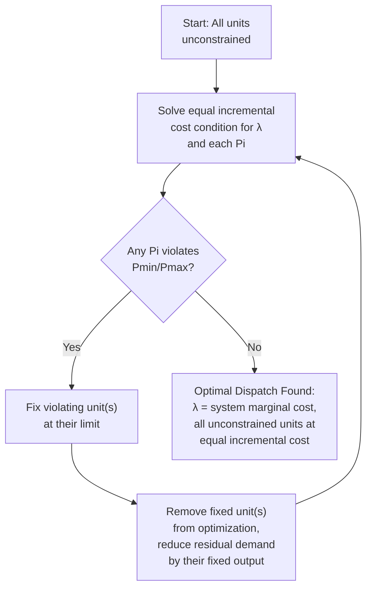

## Economic Dispatch

### Definition and Objective

Economic Dispatch is the optimization problem of allocating total system demand among the available online generating units in a way that minimizes total generation cost (or, in some formulations, maximizes some other objective such as emissions reduction or market surplus), while satisfying the fundamental power balance constraint and respecting each unit's physical operating limits. It is one of the foundational optimization problems in power system operations, underlying both vertically integrated utility dispatch and modern competitive electricity market clearing.

Economic dispatch is distinct from, and typically solved on a faster/more frequent cycle than, **unit commitment** (the decision of *which* units to have online at all, a mixed-integer problem solved over a longer horizon, typically day-ahead) — economic dispatch takes the set of committed (online) units as given and solves purely for the optimal output level of each.

### The Classical Formulation

**Objective function**: minimize total generation cost across all $N$ online units:

$$\min \sum_{i=1}^{N} C_i(P_i)$$

Where $C_i(P_i)$ is the cost function of unit $i$, typically represented as a quadratic (or piecewise-linear approximation of a quadratic) function of output:

$$C_i(P_i) = a_i + b_i P_i + c_i P_i^2$$

**Equality constraint** (power balance, ignoring transmission losses in the simplest formulation):

$$\sum_{i=1}^{N} P_i = P_{demand}$$

**Inequality constraints** (unit operating limits):

$$P_{i,min} \leq P_i \leq P_{i,max}$$

### Solution via Lagrangian Method: Equal Incremental Cost Criterion

The classical analytical solution (ignoring binding inequality constraints and transmission losses) applies the method of Lagrange multipliers. Forming the Lagrangian:

$$\mathcal{L} = \sum_{i=1}^{N} C_i(P_i) + \lambda\left(P_{demand} - \sum_{i=1}^{N} P_i\right)$$

Taking the partial derivative with respect to each $P_i$ and setting to zero yields the classical **equal incremental cost** (equal marginal cost) result:

$$\frac{dC_i}{dP_i} = \lambda \quad \text{for all units } i \text{ not at a limit}$$

This is one of the most important results in power system economics: **at the optimal dispatch, every unit's incremental (marginal) cost of production must be equal**, and this common marginal cost $\lambda$ is precisely the system marginal cost of supplying the next increment of demand. If two units had different incremental costs, total cost could be reduced by shifting output from the higher-marginal-cost unit to the lower-marginal-cost unit — a straightforward economic arbitrage argument that underlies the mathematical result.

For the quadratic cost function above, the incremental cost is linear:

$$IC_i(P_i) = \frac{dC_i}{dP_i} = b_i + 2c_iP_i$$

Setting $IC_i(P_i) = \lambda$ and solving for each unit's dispatch:

$$P_i = \frac{\lambda - b_i}{2c_i}$$

### Worked Example

Consider three units with quadratic cost functions (cost in $/hr, $P$ in MW):

- Unit 1: $C_1 = 500 + 5.3P_1 + 0.004P_1^2$
- Unit 2: $C_2 = 400 + 5.5P_2 + 0.006P_2^2$
- Unit 3: $C_3 = 200 + 6.0P_3 + 0.009P_3^2$

Total demand: $P_{demand} = 800$ MW (ignoring losses)

Incremental costs:

$$IC_1 = 5.3 + 0.008P_1, \quad IC_2 = 5.5 + 0.012P_2, \quad IC_3 = 6.0 + 0.018P_3$$

Setting all equal to $\lambda$ and expressing each $P_i$ in terms of $\lambda$:

$$P_1 = \frac{\lambda - 5.3}{0.008}, \quad P_2 = \frac{\lambda - 5.5}{0.012}, \quad P_3 = \frac{\lambda - 6.0}{0.018}$$

Substituting into the power balance $P_1 + P_2 + P_3 = 800$ and solving for $\lambda$ (algebraically combining the three fractions and solving the resulting linear equation) gives $\lambda \approx 7.94$ $/MWh (illustrative value from this example's coefficients). Substituting back:

$$P_1 \approx 330 \text{ MW}, \quad P_2 \approx 203 \text{ MW}, \quad P_3 \approx 108 \text{ MW}$$

[Inference] These specific numerical outputs depend on precise arithmetic carried through from the assumed coefficients; the example is illustrative of the solution method (equal incremental cost via Lagrangian solution) rather than a benchmarked reference calculation, and readers implementing this method should verify their own arithmetic independently rather than relying on the illustrative figures shown.

### Handling Generator Limits (Binding Constraints)

When the unconstrained Lagrangian solution would place a unit's output outside its $[P_{min}, P_{max}]$ range, that unit is instead fixed at the violated limit, and the remaining unconstrained units re-solve the equal-incremental-cost condition among themselves for the residual demand:

$$\text{If } P_i^{unconstrained} > P_{i,max}: \quad \text{Set } P_i = P_{i,max}, \text{ remove from Lagrangian, re-solve for remaining units}$$

This iterative "fix-and-resolve" procedure continues until all remaining unconstrained units satisfy their limits, at which point the equal incremental cost condition holds exactly for the unconstrained subset, with $\lambda$ potentially differing from what it would be without any binding limits.

### Diagram: Economic Dispatch Iterative Solution Process

### Incorporating Transmission Losses: The Penalty Factor Method

Real systems must account for transmission losses, which depend on the specific pattern of generation dispatch (via the network's power flow physics), not merely total generation minus total load. The classical approach incorporates losses via the **loss formula** (B-coefficients method), expressing system losses as a quadratic function of generator outputs:

$$P_{loss} = \sum_i \sum_j P_i B_{ij} P_j$$

The power balance constraint becomes:

$$\sum_i P_i = P_{demand} + P_{loss}(P_1, ..., P_N)$$

The modified optimality condition introduces a **penalty factor** $L_i$ for each unit, reflecting how a marginal increase in that unit's output affects total system losses:

$$L_i = \frac{1}{1 - \frac{\partial P_{loss}}{\partial P_i}}$$

$$IC_i(P_i) \cdot L_i = \lambda$$

Units located electrically far from the load center (with a high marginal contribution to losses) receive a penalty factor greater than 1, effectively requiring a lower incremental cost to be dispatched to the same marginal level as a unit closer to load — capturing the intuitive principle that dispatching a distant unit is more expensive to the system than its stated fuel/incremental cost alone would suggest, once transmission losses are properly accounted for.

### Relationship to Optimal Power Flow (OPF) and Locational Marginal Pricing

Classical economic dispatch (as described above) is a simplification of the more general **Optimal Power Flow (OPF)** problem, which additionally enforces the full nonlinear AC power flow equations and transmission line thermal (or other) limits as explicit constraints, rather than approximating network effects solely through the B-coefficient loss formula.

In modern competitive electricity markets (particularly those using **Locational Marginal Pricing**, LMP), the market-clearing dispatch is typically solved as a DC-OPF (a linearized approximation of the full AC-OPF, tractable for large-scale, fast market-clearing computation) or, in some markets, increasingly incorporating AC-OPF elements. The resulting LMP at each network node/bus decomposes into three components:

$$LMP_k = \lambda_{energy} + \lambda_{losses,k} + \lambda_{congestion,k}$$

- **Energy component**: the system-wide marginal energy cost (analogous to the classical $\lambda$ from the loss-free formulation)
- **Loss component**: reflects the marginal contribution of injecting power at that specific node to total system losses (a generalization of the classical penalty factor concept)
- **Congestion component**: reflects the marginal value of relieving a binding transmission constraint, which is non-zero only when one or more network limits are actively binding, and can vary substantially and rapidly between adjacent nodes when significant transmission congestion exists

This LMP decomposition is the direct market-pricing analog of the classical equal-incremental-cost economic dispatch principle, extended to properly value both losses and transmission congestion at a locational (nodal) level rather than treating the system as a single, uniformly-priced copper-plate.

### Security-Constrained Economic Dispatch (SCED)

Modern operational practice almost universally solves **Security-Constrained** Economic Dispatch, which additionally ensures the resulting dispatch remains within acceptable limits not only in the current (pre-contingency) network state, but also following a defined set of credible contingencies (the N-1 criterion, consistent with the reserve and reliability framework discussed in prior sections). This significantly increases problem complexity (effectively requiring the dispatch to satisfy many additional constraint sets, one per contingency scenario considered) but is essential for ensuring the economically optimal dispatch does not leave the system vulnerable to cascading failure following a single credible equipment loss.

### Practical Implementation Considerations

- **Piecewise-linear cost approximation**: many practical market-clearing and dispatch software implementations approximate the smooth quadratic cost curve with a piecewise-linear function (a series of cost/output segment pairs, often called "cost blocks" or "offer segments" in market contexts), converting the problem into a linear (or mixed-integer linear) program more tractable for large-scale, fast, and provably-optimal solution than a nonlinear quadratic program
- **Ramp rate constraints**: real dispatch must additionally respect each unit's physical ramp rate (MW/minute) limiting how quickly output can change between successive dispatch intervals, which is particularly binding in systems with high renewable variability requiring frequent, sometimes large, dispatch adjustments
- **Must-run and minimum-output constraints**: units required to remain online for reliability, contractual, or technical minimum-stable-generation reasons introduce additional constraints beyond the pure economic optimality condition
- **Renewable curtailment in dispatch**: in the presence of significant renewable generation, economic dispatch software must also determine when and how much renewable output to curtail (typically only when network or system constraints, such as minimum synchronous generation requirements or transmission congestion, make full renewable output infeasible), integrating the low/zero marginal cost characteristic of renewable generation into the same optimization framework

### Related Topics

- Unit Commitment and Security-Constrained Unit Commitment (SCUC)
- Optimal Power Flow (OPF) Formulations and Solution Methods
- Locational Marginal Pricing (LMP) and Electricity Market Design
- Automatic Generation Control and Load-Frequency Control
- Frequency Response Services and Reserve Requirements
- Transmission Congestion Management and Financial Transmission Rights
- Renewable Curtailment Optimization in Dispatch Software
- Energy Management System (EMS) Architecture and SCADA Integration