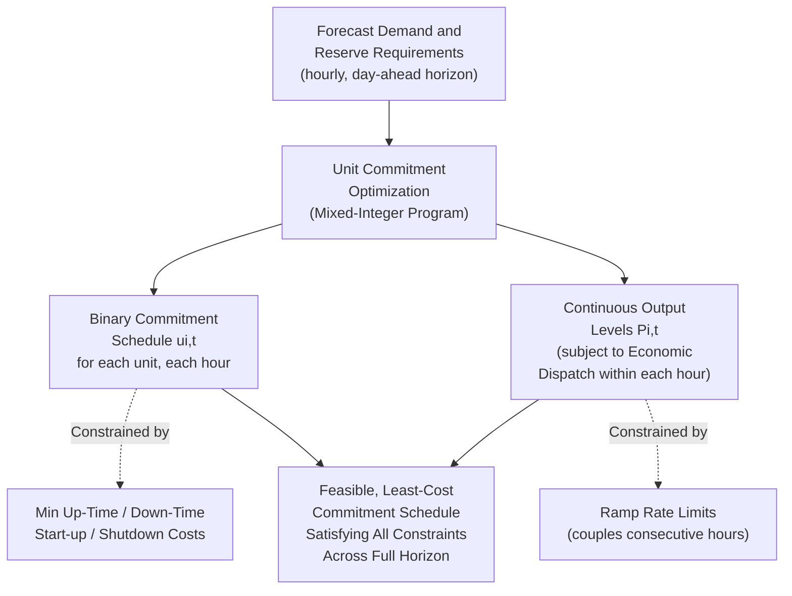

## Unit Commitment

### Definition and Objective

Unit Commitment (UC) is the optimization problem of determining which generating units should be online (committed, i.e., synchronized and available to produce power) during each interval of a defined planning horizon — typically day-ahead, hour-by-hour — in order to reliably and economically meet forecast demand and reserve requirements. It is distinct from, and logically precedes, economic dispatch: UC decides the discrete on/off status of each unit across time, while economic dispatch (solved for each committed set at each interval) determines the continuous output level of the units already decided to be online.

This is fundamentally a **mixed-integer optimization problem**: each unit's commitment status is a binary decision (on or off) at each time period, while output levels remain continuous variables — a combination that makes UC substantially more computationally demanding than economic dispatch alone, and one of the classical hard combinatorial optimization problems in power system operations.

### Why Commitment Decisions Matter Independently of Dispatch

If dispatch cost were the only consideration, one might imagine simply running economic dispatch fresh at every interval and letting the resulting optimal output levels implicitly determine which units are "on" (those with positive dispatch) versus "off." This does not work in practice because of characteristics that only manifest across time and cannot be captured in a single-interval dispatch snapshot:

- **Start-up costs**: bringing a unit online (particularly thermal units requiring boiler warm-up, turbine synchronization, and other startup sequences) incurs a substantial cost distinct from and in addition to the marginal fuel cost of producing power once online
- **Minimum up-time and minimum down-time constraints**: once started, many units (especially large thermal units) must remain online for a minimum duration before shutting down again (to avoid excessive thermal cycling stress), and conversely must remain offline for a minimum duration once shut down before restarting
- **Minimum stable generation levels**: most thermal units cannot operate below some minimum output level while remaining synchronized and stable, meaning the "off or above minimum" nature of unit output is itself a discrete commitment decision, not merely a continuous variable that happens to reach zero
- **Ramp rate limitations across the horizon**: a unit's ability to reach a required output level at a future interval depends on its trajectory from the current interval, requiring explicit time-coupling in the optimization rather than independent interval-by-interval solution

### Mathematical Formulation

**Objective function**: minimize total cost across all units $i$ and time periods $t$ over the planning horizon:

$$\min \sum_{t=1}^{T}\sum_{i=1}^{N}\left[C_i(P_{i,t}) \cdot u_{i,t} + SU_i \cdot y_{i,t} + SD_i \cdot z_{i,t}\right]$$

Where:

- $u_{i,t} \in \{0,1\}$: binary commitment status of unit $i$ at time $t$ (1 = online)
- $C_i(P_{i,t})$: fuel/operating cost function (as in economic dispatch)
- $SU_i$, $SD_i$: start-up and shut-down costs for unit $i$
- $y_{i,t}, z_{i,t} \in \{0,1\}$: binary indicators for start-up and shut-down events at time $t$

**Key constraints:**

Power balance (per time period):

$$\sum_i P_{i,t} = P_{demand,t}$$

Generation limits (only enforced when the unit is committed):

$$P_{i,min} \cdot u_{i,t} \leq P_{i,t} \leq P_{i,max} \cdot u_{i,t}$$

Minimum up-time (once started, must remain on for at least $UT_i$ periods):

$$\sum_{k=t}^{t+UT_i-1} u_{i,k} \geq UT_i \cdot y_{i,t}$$

Minimum down-time (analogous constraint for remaining off after shutdown)

Ramp rate limits (coupling consecutive periods):

$$P_{i,t} - P_{i,t-1} \leq RU_i \quad \text{(ramp-up limit)}$$

$$P_{i,t-1} - P_{i,t} \leq RD_i \quad \text{(ramp-down limit)}$$

Reserve requirements (system-wide, per period, consistent with the reserve framework covered under Frequency Response Services):

$$\sum_i (P_{i,max} \cdot u_{i,t} - P_{i,t}) \geq R_{required,t}$$

### Diagram: Unit Commitment Decision and Time-Coupling Structure

### Solution Methods

**Priority List (Simple Heuristic)**

The simplest classical approach ranks units by average full-load cost (or a similar simple metric) and commits units in priority order until forecast demand plus reserve is met, decommitting in reverse order as demand falls. [Inference] This method is computationally trivial and was historically common before modern optimization software became widely available, but it does not guarantee a globally optimal solution and does not naturally handle complex constraints like minimum up/down times or start-up cost trade-offs as rigorously as more advanced methods — it remains useful primarily as an initial feasible solution or a simplified teaching illustration rather than the primary method used in current large-scale operational practice.

**Dynamic Programming**

Formulates the problem as a sequential decision process across time periods, exploring combinations of unit commitment states period-by-period. While theoretically capable of finding globally optimal solutions for small systems, the state space grows exponentially with the number of units (the "curse of dimensionality"), making pure dynamic programming impractical for large-scale systems with many units without significant simplification or decomposition techniques.

**Lagrangian Relaxation**

A classical decomposition technique that relaxes the coupling constraint (typically the system-wide power balance and reserve requirements) into the objective function via Lagrange multipliers, allowing the problem to decompose into independent, more tractable subproblems for each individual unit (each unit's own commitment/dispatch trajectory, subject to its own minimum up/down time and ramp constraints, can be solved via dynamic programming independently). The multipliers are then iteratively adjusted (e.g., via subgradient methods) to drive the relaxed constraints toward satisfaction. This method scales well to large systems but does not guarantee a strictly feasible or provably globally optimal final solution — some heuristic adjustment is typically needed to recover a feasible commitment schedule from the relaxed solution.

**Mixed-Integer Linear Programming (MILP)**

The dominant modern approach in commercial and system-operator UC software: formulating the entire problem (with cost functions and constraints linearized or piecewise-linearized as needed) as a MILP and solving with commercial or open-source MILP solvers (e.g., CPLEX, Gurobi, or open alternatives). Advances in both solver algorithms (branch-and-cut, cutting plane methods) and computing hardware have made MILP-based UC tractable for systems with thousands of units and constraints, and it offers the significant advantage of a provable **optimality gap** (a guaranteed bound on how far the found solution could be from the true global optimum, even if the solver terminates before proving strict optimality — important for time-constrained operational deadlines), which heuristic and Lagrangian methods generally cannot provide as rigorously.

### Security-Constrained Unit Commitment (SCUC)

Analogous to the security-constrained extension of economic dispatch, modern practice generally solves **Security-Constrained Unit Commitment**, incorporating network transmission constraints and contingency (N-1) analysis directly into the commitment decision — ensuring the resulting day-ahead commitment schedule will not only meet demand and reserve at least cost, but will also remain operable (dispatchable within transmission and reliability limits) following any credible single contingency at each hour of the horizon. This substantially increases problem size and complexity (effectively multiplying the constraint set by the number of contingencies considered) but is standard practice in most modern independent system operator (ISO) and regional transmission organization (RTO) day-ahead market clearing processes.

### Uncertainty and Stochastic/Robust Unit Commitment

Classical (deterministic) UC assumes perfect knowledge of future demand and renewable generation over the commitment horizon — an assumption increasingly strained by high renewable energy penetration, where wind and solar forecast uncertainty is substantial and directly affects how much conventional generation capacity should be committed to cover potential renewable shortfalls.

Two principal extensions address this uncertainty:

- **Stochastic Unit Commitment**: models forecast uncertainty explicitly via a set of discrete demand/renewable output scenarios, each with an associated probability, and optimizes the commitment decision to minimize *expected* cost across all scenarios while ensuring feasibility in each — computationally far more demanding than deterministic UC (effectively solving many linked instances of the base problem simultaneously) but can produce meaningfully more robust and often lower-expected-cost commitment schedules than a deterministic approach using only a single forecast
- **Robust Unit Commitment**: instead of a probabilistic scenario set, defines an "uncertainty set" (e.g., a bounded interval or polytope of possible renewable/demand outcomes) and optimizes for the worst-case realization within that set, guaranteeing feasibility for any outcome in the defined range at the cost of potentially more conservative (and thus more expensive in expectation) commitment decisions

[Inference] The adoption of stochastic and robust UC methods in actual operational (as opposed to academic/research) practice has been gradual and varies significantly by system operator, given the substantial additional computational burden and the practical challenge of defining well-calibrated scenario sets or uncertainty bounds; deterministic UC augmented with explicit reserve margins (sized to cover a defined percentile of forecast error, as discussed under reserve requirements) remains a widely used and computationally simpler practical alternative in much of current industry practice.

### Rolling and Multi-Timescale Commitment Practice

Real operational practice typically layers UC decisions across multiple timescales rather than solving a single day-ahead problem in isolation:

- **Day-ahead UC**: the primary commitment decision, typically solved the day before operation based on day-ahead demand and renewable forecasts, often directly tied to day-ahead market clearing in restructured electricity markets
- **Intra-day / real-time re-commitment**: shorter-horizon re-optimization (e.g., every few hours, or continuously rolling forward) that can adjust the commitment schedule as forecasts update and actual conditions diverge from the day-ahead assumption, bringing additional fast-starting units online or decommitting units as needed
- **Reliability unit commitment (RUC)**: a supplementary commitment process, run by some system operators outside the primary market-clearing UC, specifically to ensure sufficient capacity is committed to meet reliability requirements (as opposed to purely market-based commitment decisions, which could in principle under-commit capacity relative to reliability needs if market price signals alone were relied upon)

### Related Topics

- Economic Dispatch and the Equal Incremental Cost Criterion
- Security-Constrained Economic Dispatch (SCED) and Optimal Power Flow
- Frequency Response Services and Reserve Requirements
- Stochastic and Robust Optimization Methods for Power System Scheduling
- Day-Ahead and Real-Time Electricity Market Clearing Design
- Renewable Forecast Uncertainty and Its Impact on Operational Reserve Sizing
- Mixed-Integer Linear Programming Solvers and Formulation Techniques
- Energy Management System (EMS) Architecture and SCADA Integration