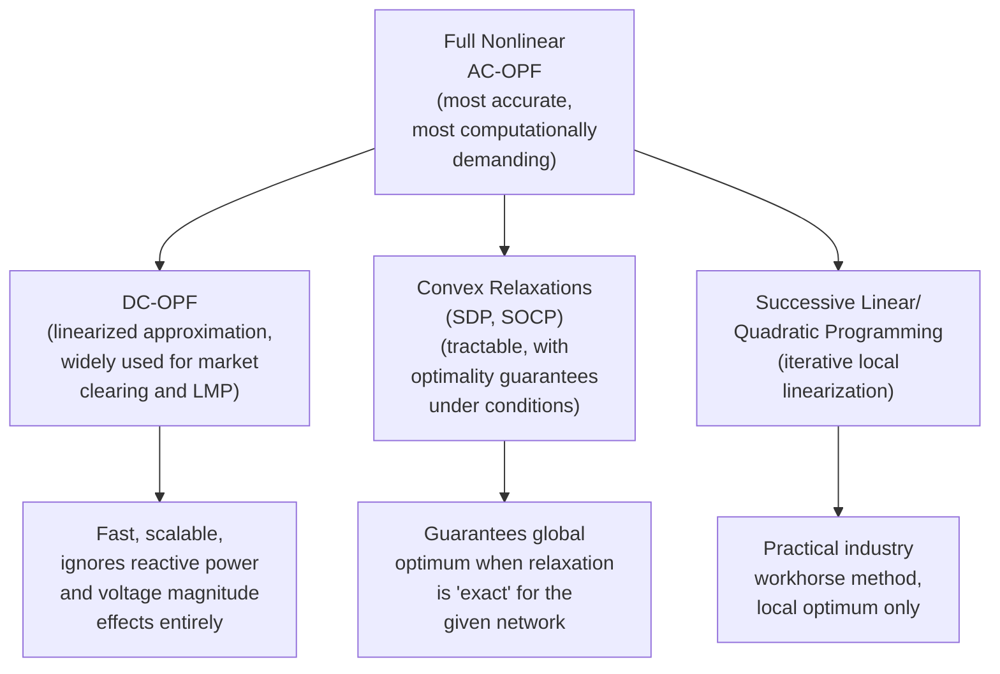

## Optimal Power Flow Formulations

### Definition and Position Within the Optimization Hierarchy

Optimal Power Flow (OPF) is the optimization problem of determining generator outputs, voltage set points, and other controllable network variables that minimize a defined objective (typically total generation cost) while satisfying the full nonlinear AC power flow equations as explicit equality constraints, along with generator, voltage, and transmission line operating limits as inequality constraints. It generalizes classical economic dispatch by replacing the simplified power-balance-plus-loss-formula representation of the network with the actual nonlinear physics governing power flow through the transmission system.

OPF sits at the mathematical core of nearly every advanced power system operations function discussed elsewhere in this material: security-constrained economic dispatch, locational marginal pricing calculation, security-constrained unit commitment's network-feasibility checks, and voltage/reactive power optimization are all, in essence, applications or variants of the OPF problem.

### The Full AC-OPF Formulation

**Objective function** (typically cost minimization, though voltage deviation minimization, loss minimization, or other objectives are also used depending on application):

$$\min \sum_{i} C_i(P_{G,i})$$

**Equality constraints** (AC power flow equations at every bus $k$):

$$P_{G,k} - P_{D,k} = V_k \sum_{m} V_m \left(G_{km}\cos\theta_{km} + B_{km}\sin\theta_{km}\right)$$

$$Q_{G,k} - Q_{D,k} = V_k \sum_{m} V_m \left(G_{km}\sin\theta_{km} - B_{km}\cos\theta_{km}\right)$$

Where $V_k$, $\theta_k$ are the voltage magnitude and angle at bus $k$ (the core decision variables determining the entire network state), $G_{km}$, $B_{km}$ are the conductance and susceptance elements of the network admittance matrix, and $\theta_{km} = \theta_k - \theta_m$.

**Inequality constraints:**

$$P_{G,i,min} \leq P_{G,i} \leq P_{G,i,max}, \quad Q_{G,i,min} \leq Q_{G,i} \leq Q_{G,i,max}$$

$$V_{k,min} \leq V_k \leq V_{k,max}$$

$$|S_{km}| \leq S_{km,max} \quad \text{(thermal/apparent power line flow limits)}$$

### Why AC-OPF Is Fundamentally Difficult

The AC power flow equations are **nonlinear and non-convex** (due to the trigonometric terms coupling voltage angles, and the product terms coupling voltage magnitudes), which means:

- Standard convex optimization guarantees (a local optimum is the global optimum) do not automatically hold — AC-OPF can have multiple local optima, and standard nonlinear solvers (e.g., interior-point methods) generally only guarantee convergence to a local, not necessarily global, optimum
- Problem size scales with network complexity (number of buses, branches), and large real-world networks (thousands to tens of thousands of buses for major interconnections) create substantial computational burden for full nonlinear AC-OPF, particularly when required to run within tight operational time windows (e.g., 5- or 15-minute real-time market intervals)
- Ensuring global optimality (or even a certified bound on optimality gap) for large-scale AC-OPF remains, [Inference] as characterized in ongoing academic literature, a genuinely hard research problem rather than one with a fully general, computationally efficient solved-in-practice answer for arbitrarily large networks — though substantial progress has been made via convex relaxation techniques (below) for many practical network topologies

### Diagram: OPF Formulation Spectrum

### DC-OPF: The Linearized Approximation

The DC Power Flow approximation, widely used in practice due to its computational tractability and the resulting linear program's guaranteed global optimality, makes several simplifying assumptions:

1. **Voltage magnitudes are approximately 1.0 per unit everywhere** (reactive power flow and voltage magnitude variation are ignored entirely)
2. **Voltage angle differences across any branch are small**, so $\sin\theta_{km} \approx \theta_{km}$ and $\cos\theta_{km} \approx 1$
3. **Line resistance is negligible relative to reactance** ($R \ll X$), a reasonable assumption for high-voltage transmission but progressively less accurate for lower-voltage or shorter lines

Under these assumptions, real power flow on a line becomes a simple linear function of the voltage angle difference:

$$P_{km} = \frac{\theta_k - \theta_m}{X_{km}}$$

This reduces the entire OPF to a **linear program** (given linear or piecewise-linear cost functions):

$$\min \sum_i C_i(P_{G,i}) \quad \text{s.t.} \quad \sum_i P_{G,i} = \sum_k P_{D,k}, \quad P_{km} = \theta_{km}/X_{km}, \quad |P_{km}| \leq P_{km,max}$$

**DC-OPF is the dominant formulation used for day-ahead and real-time market clearing (LMP calculation) in most North American ISOs/RTOs**, valued for its computational speed, scalability, and the guaranteed global optimum a linear program provides — critical properties for market operations requiring transparent, replicable, and fast price determination on operational deadlines. Its principal limitation is the complete omission of reactive power and voltage magnitude effects, meaning DC-OPF-based dispatch and pricing do not directly capture voltage-related constraints or losses with full accuracy, requiring separate voltage/reactive power management processes to handle those aspects.

### Convex Relaxation Approaches

A significant body of more recent (relative to the classical DC-OPF and nonlinear AC-OPF methods) research has developed **convex relaxations** of the full AC-OPF problem, seeking a middle ground: retaining more physical accuracy than DC-OPF while achieving the tractability and, importantly, the **global optimality guarantee** that a genuinely convex problem provides (unlike the general nonlinear AC-OPF, which typically only guarantees local optimality).

**Semidefinite Programming (SDP) Relaxation**

Reformulates the AC-OPF problem by lifting the voltage variables into a higher-dimensional matrix space (representing $VV^T$ as a matrix variable $W$), relaxing the requirement that $W$ have rank exactly 1 (which would recover the exact original problem) to instead requiring $W$ be positive semidefinite. [Inference] Under certain network conditions (established in the academic literature via specific technical criteria related to network topology and operating point), this relaxation is "exact" — meaning the SDP relaxation's optimal solution corresponds to a valid, physically realizable AC power flow solution, providing a certified global optimum for those cases. For networks or operating conditions where the relaxation is not exact, the SDP solution provides a valid lower bound on the true optimal cost (useful for assessing optimality gaps of other solution methods) but may not directly yield a feasible AC solution.

**Second-Order Cone Programming (SOCP) Relaxation**

A related, generally more computationally efficient relaxation (SOCP problems are generally faster to solve than SDP problems of comparable size), particularly well-suited to radial (tree-structured) network topologies common in distribution systems, where the relaxation is exact under broader and more easily verified conditions than the general SDP relaxation applied to meshed transmission networks. This has made SOCP-based OPF formulations particularly popular for distribution system optimization applications (e.g., optimal reactive power dispatch from distributed energy resources).

### Successive Linearization / Quadratic Programming Methods

The dominant practical industry approach for full AC-OPF (when required, e.g., for detailed voltage/reactive power optimization studies or advanced applications beyond DC-OPF's scope) is iterative local linearization: starting from an initial operating point, linearize (or form a local quadratic approximation of) the nonlinear constraints around that point, solve the resulting linear/quadratic program, update the operating point, and repeat until convergence. Interior-point methods, adapted from general nonlinear programming, are widely used as the underlying solver for this class of approach in commercial and research OPF software. This approach reliably finds a local optimum efficiently for well-behaved, well-initialized problems but, as noted above, does not inherently guarantee global optimality for the general non-convex AC-OPF problem.

### Security-Constrained OPF (SC-OPF)

Analogous to the security-constrained extensions of economic dispatch and unit commitment discussed elsewhere, Security-Constrained OPF additionally requires the solution to remain feasible (within all limits) following each of a defined set of credible contingencies, not merely in the current pre-contingency network state:

$$\text{For each contingency } c: \quad P_{km}^{(c)} \leq P_{km,max}^{(c)}, \quad V_{k,min}^{(c)} \leq V_k^{(c)} \leq V_{k,max}^{(c)}$$

This substantially increases the constraint set (effectively one full additional set of network constraints per contingency considered) and is the formulation underlying real-world security-constrained economic dispatch and unit commitment market-clearing software used by system operators, typically implemented via DC-OPF-based SC-OPF for computational tractability at the scale of full-network, many-contingency operational deployment, with full AC-based SC-OPF reserved for more targeted studies or increasingly for advanced real-time applications as computational capability grows.

### Locational Marginal Pricing as an OPF Byproduct

As introduced under Economic Dispatch, the dual variables (Lagrange multipliers) associated with the power balance and network constraints in the OPF formulation directly yield Locational Marginal Prices at each bus:

$$LMP_k = \frac{\partial \mathcal{L}}{\partial P_{D,k}}$$

This is a general property of the OPF formulation, not specific to DC-OPF: the shadow price interpretation of the dual variables on the nodal power balance constraints is what makes OPF (in whichever specific formulation is used) the natural mathematical foundation for nodal electricity pricing in restructured markets.

### Extensions: Multi-Period and Stochastic OPF

- **Multi-period OPF**: couples individual-period OPF problems across a time horizon via ramp rate and energy storage state-of-charge constraints, relevant for optimizing dispatch including battery storage or other time-coupled resources
- **Stochastic OPF**: incorporates renewable generation and demand uncertainty explicitly (analogous to stochastic unit commitment), optimizing over a scenario set or chance-constrained formulation rather than a single deterministic forecast — an active area of both academic research and gradual practical adoption as renewable penetration increases the value of explicitly modeling forecast uncertainty within the dispatch-level optimization itself, not merely at the reserve-sizing level

### Related Topics

- Economic Dispatch and the Equal Incremental Cost Criterion
- Security-Constrained Unit Commitment and Economic Dispatch
- Locational Marginal Pricing and Electricity Market Design
- Voltage Stability and Voltage Collapse Mechanisms
- Distribution System Optimal Power Flow and Distributed Energy Resource Management
- Convex Optimization Methods in Power Systems (SDP and SOCP Relaxations)
- Transmission Congestion Management and Financial Transmission Rights
- Interior-Point Methods for Nonlinear Programming