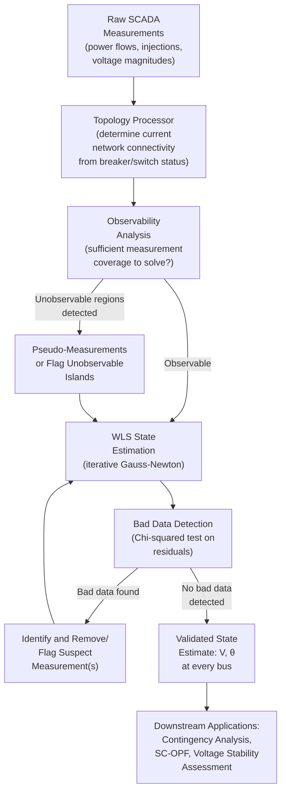

## State Estimation

### Definition and Purpose

State Estimation is the process by which a power system's Energy Management System determines the best estimate of the current, real-time operating state of the network — specifically, the complex voltage (magnitude and angle) at every bus — using a redundant set of imperfect, noisy measurements gathered from across the system (SCADA telemetry, and increasingly PMU-based phasor measurements). It is the essential bridge between raw field telemetry and every downstream real-time operational function (contingency analysis, security-constrained dispatch, voltage stability assessment) that requires a complete, consistent, and validated picture of the network state.

State estimation exists because raw SCADA measurements alone are insufficient for reliable operational decision-making: measurements arrive with noise, occasional gross errors (a failed sensor, a communications fault, a mislabeled data point), and — critically — are typically insufficient in number and coverage to fully and directly determine every bus voltage in the network without some form of estimation and redundancy exploitation.

### Why Direct Calculation Is Insufficient

A power network with $N$ buses has $2N$ unknown state variables (voltage magnitude and angle at each bus, with one bus's angle typically fixed as the reference/slack angle, giving $2N-1$ unknowns). In principle, if enough independent, error-free measurements were available at exactly the right locations, the network state could be solved directly (much as a conventional power flow calculation determines bus voltages from specified injections). In practice:

- **Measurements contain noise**: every physical meter and communication channel introduces some random measurement error
- **Measurements are redundant but not perfectly matched to the minimum required set**: telemetry is typically available at many more points than the strict minimum needed, but not necessarily at the specific locations or combinations that would allow direct algebraic solution
- **Gross errors occur**: a stuck meter, a blown current transformer fuse, a communications dropout returning a stale or garbage value, or a mislabeled measurement point are common real-world occurrences that must be detected and rejected rather than blindly incorporated
- **Measurements arrive asynchronously and are not perfectly time-coincident** (particularly for conventional SCADA measurements, though PMU technology substantially improves this — see below)

State estimation addresses all of these issues simultaneously through a statistical estimation framework that exploits measurement redundancy to produce a single best estimate, while detecting and rejecting measurements inconsistent with that estimate.

### The Weighted Least Squares (WLS) Formulation

The dominant classical formulation treats state estimation as a weighted least-squares regression problem. Given a measurement vector $z$ (containing available SCADA measurements — typically real/reactive power flows and injections, voltage magnitudes, and increasingly PMU voltage/current phasors) related to the true system state $x$ (bus voltage magnitudes and angles) through the nonlinear measurement function $h(x)$ plus measurement noise $e$:

$$z = h(x) + e$$

The WLS estimator seeks the state estimate $\hat{x}$ that minimizes the weighted sum of squared residuals:

$$\min_x J(x) = \sum_{i=1}^{m} \frac{(z_i - h_i(x))^2}{\sigma_i^2} = [z - h(x)]^T R^{-1} [z - h(x)]$$

Where $R$ is the measurement error covariance matrix (typically diagonal, with $\sigma_i^2$ representing the assumed variance/reliability of each individual measurement — more accurate/reliable meters receive proportionally higher weight in the estimation, i.e., smaller $\sigma_i^2$).

### Solution via Iterative Gauss-Newton Method

Because $h(x)$ is nonlinear (following directly from the nonlinear AC power flow relationships linking bus voltages to power flows and injections), the WLS problem is solved iteratively, analogous in structure to the Newton-Raphson method used for conventional power flow solution:

$$\left[H^T R^{-1} H\right] \Delta x = H^T R^{-1} [z - h(x)]$$

Where $H = \partial h/\partial x$ is the measurement Jacobian matrix (evaluated at the current iterate). The state estimate is updated iteratively: $x^{(k+1)} = x^{(k)} + \Delta x$, until convergence (when $\Delta x$ becomes sufficiently small).

### Diagram: State Estimation Processing Pipeline

### Topology Processing and Observability Analysis

Before the numerical WLS estimation can proceed, two preliminary steps are essential:

**Topology Processing**: converts the current status of circuit breakers and switches (received as telemetered status points, distinct from the analog power/voltage measurements) into the current effective network connectivity — determining, for instance, which buses are currently merged (a closed bus-tie breaker effectively combining two nominal buses into one electrical node) or which lines are currently out of service. This step must run before the state estimator, since the estimator's underlying network model (the specific $h(x)$ function) depends on the current topology, which changes as switching operations occur throughout normal operations.

**Observability Analysis**: determines whether the available measurement set, given the current topology, provides sufficient information to uniquely determine the state of every part of the network. Portions of the network with insufficient measurement coverage (an "unobservable island") cannot have their state directly and uniquely estimated from available data alone. When unobservable regions are detected, system operators typically address this via:

- **Pseudo-measurements**: substituting a forecast or historically typical value (e.g., a typical load profile for an unmetered bus) as a low-confidence (high-variance) measurement, allowing the estimator to proceed with an assumed value rather than leaving that portion of the network entirely undetermined
- **Flagging the unobservable island**: explicitly marking that region's estimated state as unreliable for critical downstream decision-making, prompting operator attention or a request for additional telemetry

### Bad Data Detection and Identification

A central strength of the WLS state estimation framework, beyond merely producing a noise-averaged estimate, is its ability to statistically detect and identify individual measurements that are grossly inconsistent with the rest of the (redundant) measurement set — indicating a likely meter failure, communication error, or other data quality problem, rather than a genuine, if unusual, system condition.

**Chi-squared Test (Detection)**: after WLS convergence, the weighted sum of squared residuals $J(\hat{x})$ is compared against a chi-squared distribution threshold (with degrees of freedom equal to the measurement redundancy, i.e., number of measurements minus number of states):

$$J(\hat{x}) > \chi^2_{(m-n), \alpha} \implies \text{Bad data likely present}$$

If this threshold is exceeded, the estimator flags that at least one measurement is likely erroneous, without yet identifying *which* one.

**Largest Normalized Residual Test (Identification)**: once bad data is detected, individual measurement residuals are normalized by their expected statistical variability, and the measurement with the largest normalized residual is identified as the most likely culprit:

$$r_i^{norm} = \frac{|z_i - h_i(\hat{x})|}{\sqrt{\Omega_{ii}}}$$

Where $\Omega_{ii}$ is derived from the residual covariance matrix. The identified bad measurement is removed (or down-weighted), and the WLS estimation is re-solved — this process can iterate multiple times if several bad measurements are present simultaneously, though [Inference] the classical largest-normalized-residual method can, in certain configurations, struggle to correctly identify bad data when multiple interacting (correlated) bad measurements occur simultaneously — a known limitation motivating more advanced robust estimation techniques in the research literature.

### PMU-Enhanced State Estimation

The increasing deployment of Phasor Measurement Units, which provide direct, GPS-time-synchronized measurement of voltage and current phasors (magnitude *and* phase angle, not just magnitude as with conventional SCADA voltage measurements) at high reporting rates (commonly 30-60 samples per second, versus conventional SCADA's typical few-second-to-tens-of-seconds update cycle), has significantly changed the state estimation landscape:

- **Direct, linear phasor measurement**: because PMUs directly measure voltage and current phasors (rather than the derived, nonlinear power flow quantities that conventional SCADA typically reports), a PMU-only or PMU-dominant state estimator can, in principle, be formulated as a **linear** estimation problem (a "linear state estimator"), avoiding the iterative nonlinear solution required for conventional WLS estimation — offering both computational speed advantages and improved numerical robustness
- **True time-synchronization**: conventional SCADA measurements, gathered asynchronously across a wide-area network with varying communication delays, are implicitly treated as if simultaneous even though small time-skew exists; PMU measurements' GPS time-stamping provides genuinely simultaneous, verifiably time-coincident measurement across the entire monitored area, which matters particularly for capturing fast dynamic events (e.g., post-disturbance oscillations) that conventional SCADA's slower update rate cannot resolve
- **Hybrid state estimation**: most practical current implementations combine conventional SCADA measurements (providing broad network coverage, since PMU deployment, while growing, is [Inference] generally still less than complete network coverage in most systems as of recent years) with available PMU measurements in a combined WLS (or extended) formulation, gaining PMU's accuracy and time-synchronization benefits where available while retaining SCADA's broader coverage elsewhere

### Applications Downstream of State Estimation

The validated state estimate is the foundational input to essentially all other real-time EMS security and optimization functions:

- **Contingency Analysis**: simulating the effect of credible equipment outages starting from the current validated state estimate, to identify any contingency that would cause an operating limit violation
- **Security-Constrained Economic Dispatch / OPF**: as discussed in prior sections, requires an accurate current network state as the starting point for dispatch optimization
- **Voltage Stability Assessment**: computing real-time proximity-to-collapse indices (as discussed under Voltage Stability) requires an accurate current state estimate as the basis for P-V/Q-V margin calculation
- **Dynamic/Wide-Area Situational Awareness**: PMU-enhanced state estimation increasingly supports near-real-time visualization of system stress, oscillatory behavior, and emerging instability precursors for control room operators

### Related Topics

- Optimal Power Flow Formulations and Solution Methods
- Voltage Stability and Voltage Collapse Mechanisms
- Contingency Analysis and N-1 Security Assessment
- Phasor Measurement Units (PMU) and Wide-Area Monitoring Systems
- Energy Management System (EMS) Architecture and SCADA Integration
- Bad Data Detection and Robust Estimation Techniques
- Security-Constrained Economic Dispatch and Unit Commitment
- Network Topology Processing and Breaker Status Modeling