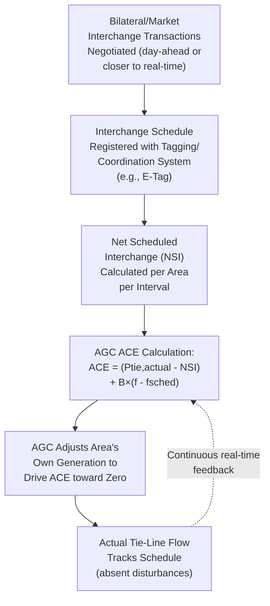

## Interchange Scheduling and Tie-Line Bias Control

### Definition and Context

Interchange Scheduling is the process by which neighboring Balancing Authorities (BAs) or control areas in an interconnected power system arrange, in advance, the transfer of scheduled power across their shared tie-lines — reflecting bilateral trades, market transactions, or coordinated resource sharing agreements. Tie-Line Bias Control is the real-time control mechanism (implemented within each area's AGC, as introduced in the AGC and Load-Frequency Control material) that ensures actual tie-line flows track these schedules while simultaneously contributing appropriately to system-wide frequency regulation. Together, these two functions — one a scheduling/market process, the other a real-time control mechanism — form the operational backbone of coordinated multi-area interconnected system operation.

### Why Interchange Scheduling Is Necessary

In an interconnected synchronous system spanning multiple utilities, balancing authorities, or even countries, no single entity generates exactly enough power to serve only its own native load at every instant — instead, areas routinely buy and sell power to and from neighbors based on economic dispatch differences, resource diversity (e.g., hydro-rich areas exporting to thermal-dominant areas), and reliability support arrangements. Interchange scheduling formalizes these transactions into agreed-upon, time-stamped power transfer schedules between specific areas, which then become the reference point against which real-time tie-line flow control operates.

**Typical interchange schedule characteristics:**

- Specified as a constant MW value (or a defined ramp profile) for a given hour or sub-hourly interval
- Agreed upon in advance (day-ahead or, increasingly in many markets, closer to real-time via faster scheduling processes) between the two (or more, in a multi-party transaction) participating areas
- Registered with a common interchange scheduling authority or tagging system (in North America, the E-Tag system serves this coordination function, allowing all affected intermediate and adjacent balancing authorities to be aware of scheduled transactions crossing or affecting their systems)

### The Tie-Line Bias Control Objective, Revisited

As established in the AGC/LFC material, each area's Area Control Error is calculated as:

$$ACE_i = (P_{tie,i,actual} - P_{tie,i,scheduled}) + B_i(f_{actual} - f_{scheduled})$$

This section focuses specifically on the scheduling side of this equation — how $P_{tie,i,scheduled}$ is determined and maintained as an operationally meaningful, continuously updated reference — and on the deeper rationale and calibration of the frequency bias term $B_i$.

### Diagram: Interchange Scheduling and Real-Time Control Integration

### Net Scheduled Interchange (NSI)

A given area typically has simultaneous interchange schedules with multiple neighboring areas. The relevant quantity for that area's ACE calculation is the **Net Scheduled Interchange**: the algebraic sum of all scheduled transactions across all of that area's tie-lines with all neighbors, at the current time:

$$NSI_i = \sum_{j} P_{scheduled,i \to j}$$

(with appropriate sign convention: exports positive, imports negative, or vice versa, consistently applied). The actual measured net tie-line flow $P_{tie,i,actual}$ (summed across all of area $i$'s tie-line metering points) is compared against this NSI, not against any single bilateral schedule in isolation — it is the aggregate net position that matters for the area's own generation/load balance, since from a physics standpoint, the area's AGC only controls its own aggregate generation, not the routing of power along any particular individual path (which is determined by the network's own impedance-based power flow physics, generally not directly controllable transaction-by-transaction in an AC network without additional devices like phase-shifting transformers or HVDC links).

### Calibrating the Frequency Bias Setting

As introduced in the AGC/LFC material, the frequency bias setting $B_i$ is deliberately calibrated to approximate the area's own natural (governor droop plus load damping) frequency response characteristic:

$$B_i \approx \beta_i = \sum_{k \in i} \frac{1}{R_k}\cdot\frac{S_k}{S_{base}} + D_i$$

**Why this specific calibration matters:** if $B_i$ is set substantially different from the area's true natural response characteristic $\beta_i$, the tie-line bias control's self-correcting property (each area responding appropriately to its own disturbances while not over- or under-reacting to neighboring areas' disturbances, as illustrated in the AGC material) degrades:

- **$B_i$ set too small** (relative to $\beta_i$): the area's AGC under-weights the frequency component of ACE, potentially causing the area to under-respond to disturbances originating within its own boundaries, effectively "free-riding" on neighboring areas' primary and secondary response — a behavior explicitly discouraged and monitored under interconnection reliability standards, since it burdens neighboring areas with providing response to a disturbance that should properly be served by the area where it originated
- **$B_i$ set too large**: the area's AGC over-reacts to system-wide frequency deviations that are not actually caused by disturbances within its own area, unnecessarily adjusting its own generation (and correspondingly its tie-line flows away from schedule) in response to a neighbor's problem — creating unnecessary regulation cost and potentially interfering with, rather than assisting, overall interconnection frequency recovery

[Inference] Actual bias setting calibration in practice is periodically reviewed and updated (rather than fixed permanently at commissioning) as an area's generation mix, load characteristics, and governor response capability change over time — particularly relevant in the current period of significant generation mix transition (synchronous generation displacement by inverter-based resources, as covered in the Inertia and Frequency Response chapter), since $\beta_i$ itself changes as an area's synchronous generation fleet and its associated aggregate droop response shrinks.

### Dynamic Scheduling and Pseudo-Ties

Beyond standard fixed-interval interchange schedules, more advanced arrangements allow finer-grained, near-continuous adjustment of the effective interchange between areas:

**Dynamic Scheduling**: allows a specific generating unit or load physically located within one balancing authority's footprint to be telemetered and treated, for AGC and ACE calculation purposes, as if it were located within a *different* balancing authority — the resource's real-time output is dynamically incorporated into the receiving area's ACE calculation, updated continuously rather than as a fixed hourly schedule. This is used, for instance, when a generator owner in one area has sold its output entirely to a load-serving entity in another area and wishes for that unit's real-time variability to be managed as part of the purchasing area's balancing responsibility rather than requiring hourly schedule adjustments to approximate the unit's actual variable output.

**Pseudo-Tie**: a specific implementation of dynamic scheduling where a resource is telemetered in real-time and treated by the receiving area's AGC/EMS essentially as if a physical tie-line existed directly to that resource, even though the resource is electrically embedded within another area's network and no actual dedicated transmission tie-line exists at that specific interconnection point.

These mechanisms have grown in importance particularly for integrating variable renewable resources across balancing authority boundaries, allowing a renewable resource's real, continuously varying output to be accurately reflected in real-time balancing responsibility, rather than being approximated by a coarser fixed-schedule interchange arrangement that would poorly match the resource's actual variability.

### Inadvertent Interchange

Over any operating period, an area's actual net interchange will not exactly match its scheduled net interchange at every instant, due to the normal operation of tie-line bias control (which deliberately allows tie-line flow deviation as part of its frequency-responsive function) and measurement/rounding effects. The cumulative difference between actual and scheduled interchange over an extended period (e.g., a day or month) is tracked as **Inadvertent Interchange**.

[Unverified] Specific accounting and settlement practices for inadvertent interchange (methods for "paying back" accumulated inadvertent energy between areas, and the precise time-error and payback correction procedures involved) vary by interconnection and are governed by specific interconnection-level operating agreements and reliability standards; the general principle — that inadvertent interchange is tracked and periodically reconciled between areas via mutually agreed accounting procedures, rather than being ignored or allowed to accumulate indefinitely without settlement — is broadly consistent across major interconnections, but the specific numerical procedures should be verified against the current operating agreement for the relevant interconnection.

### Multi-Area Coordination Beyond Bilateral Tie-Line Bias

Tie-line bias control as classically formulated addresses coordination pairwise/aggregately at each individual area's boundary. Larger, more centrally coordinated regional structures have developed additional layers of coordination:

- **Regional Transmission Organizations (RTOs) / Independent System Operators (ISOs)**: within a single ISO/RTO footprint (which may itself comprise what were historically several separate balancing authorities), centralized security-constrained economic dispatch and unit commitment (as discussed in prior sections) can substantially reduce the practical significance of internal "tie-line" scheduling between sub-areas, since generation and load are optimized jointly across the entire footprint rather than via bilateral inter-area scheduling
- **Reserve sharing groups**: formal multi-area agreements to jointly hold and, when needed, share operating reserves across member areas, reducing the total reserve each individual area must independently hold while maintaining overall reliability — a coordination layer distinct from, but complementary to, standard interchange scheduling and tie-line bias control
- **Coordinated multi-BA AGC / consolidated balancing**: in some regions, historically separate balancing authorities have consolidated their AGC and balancing functions into a single, jointly operated entity, effectively eliminating the internal tie-line bias control problem for the consolidated footprint (since there is no longer an internal "tie-line" requiring separate scheduling and control) while the consolidated entity continues to interact with genuinely external neighboring areas via standard tie-line bias control

### Related Topics

- Automatic Generation Control and Load-Frequency Control
- Frequency Response Services and Reserve Requirements
- Balancing Authority Reliability Standards and Performance Compliance
- Regional Transmission Organization (RTO) and ISO Market Structures
- Reserve Sharing Groups and Multi-Area Reliability Coordination
- Dynamic Scheduling for Renewable Resource Integration
- State Estimation and Real-Time Network Monitoring
- Security-Constrained Economic Dispatch Across Balancing Authority Boundaries