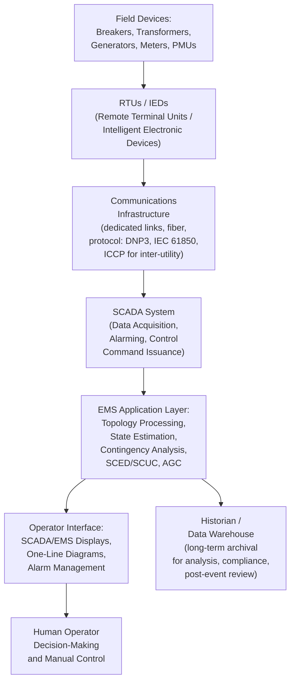

## Energy Management System Architecture

### Definition and Position in Operations

An Energy Management System (EMS) is the integrated hardware and software platform that provides system operators with real-time monitoring, control, and optimization capability for the transmission-level power system. It is the umbrella application suite within which nearly every function discussed in this chapter — state estimation, contingency analysis, security-constrained economic dispatch and unit commitment, AGC, and interchange scheduling — is actually implemented, integrated, and presented to control room operators as a coherent operational tool, rather than as isolated standalone calculations.

### The Layered EMS Architecture

### SCADA: The Foundational Data Acquisition Layer

Supervisory Control and Data Acquisition (SCADA) forms the base layer of the EMS, responsible for:

- **Data acquisition**: periodically polling (or receiving unsolicited reports from) Remote Terminal Units (RTUs) and, increasingly, Intelligent Electronic Devices (IEDs) at substations, collecting analog measurements (voltage, current, power flow, frequency) and status/digital points (breaker open/closed, transformer tap position, alarm flags)
- **Alarm processing and presentation**: comparing incoming data against defined limits and expected states, generating and prioritizing alarms for operator attention when abnormal conditions are detected
- **Supervisory control**: transmitting operator-issued control commands (breaker open/close, generator setpoint changes, transformer tap adjustments) back out to the field devices, typically with a "select-before-operate" confirmation sequence as a safeguard against inadvertent or erroneous commands

**Typical SCADA update cycles** range from roughly 2-10 seconds for most analog telemetry (though this varies significantly by implementation and priority of the specific measurement), which is a key contextual fact for understanding why state estimation (built atop this comparatively slow-cycling data) cannot directly capture very fast dynamic phenomena — a limitation increasingly addressed by PMU integration operating at much higher reporting rates (as discussed under State Estimation).

### Communication Protocols

- **DNP3 (Distributed Network Protocol)**: widely used for RTU-to-SCADA communication in North America, designed specifically for the reliability and data-integrity demands of utility telemetry over potentially unreliable communication links
- **IEC 61850**: a more modern, comprehensive standard for substation automation, defining not only communication protocols but also a standardized object/data model for substation equipment, increasingly displacing or supplementing older protocols as substations are modernized, and notably supporting high-speed peer-to-peer communication (GOOSE messaging) directly between IEDs for protection and control applications beyond simple SCADA telemetry
- **ICCP (Inter-Control Center Communications Protocol, IEC 60870-6/TASE.2)**: the standard protocol for real-time data exchange *between* different utilities' or balancing authorities' EMS/SCADA systems — essential infrastructure underlying the interchange scheduling and tie-line bias control coordination discussed in the prior section, since neighboring areas must share real-time tie-line flow and frequency data to implement their respective ACE calculations

### The Network (Topology) Model

A foundational EMS component, distinct from but essential to nearly every application layer function, is the maintained network (topology) model: a database representation of the electrical network's connectivity, equipment parameters (line impedances, transformer ratings, generator characteristics), and current real-time switching state. This model is updated continuously by the **Topology Processor** (introduced under State Estimation) as breaker and switch status changes are received via SCADA, ensuring that all downstream applications (state estimation, contingency analysis, dispatch optimization) operate against a network representation that accurately reflects the current physical configuration of the grid — a stale or incorrect topology model would render every subsequent calculation invalid, regardless of how sophisticated the optimization algorithm applied to it.

### Real-Time Application Suite

Building atop the SCADA data acquisition and network model foundation, the EMS application layer typically comprises the functions detailed in depth elsewhere in this chapter, integrated as a coordinated processing sequence:

1. **State Estimation**: produces the validated, complete real-time network state from available (redundant, noisy) telemetry
2. **Contingency Analysis**: using the validated state estimate, simulates the effect of credible equipment outages to identify any that would cause an operating limit violation, informing operators of emerging security risks before they occur
3. **Security-Constrained Economic Dispatch / Optimal Power Flow**: determines the least-cost generation dispatch that remains secure against all considered contingencies
4. **Automatic Generation Control**: the continuous real-time control loop adjusting generation to maintain frequency and scheduled interchange
5. **Security-Constrained Unit Commitment**: typically run on a longer cycle (day-ahead, with possible intra-day re-optimization) to determine which units should be online to support the above real-time functions

These functions are typically executed in a defined, cyclic sequence (e.g., state estimation and contingency analysis every few minutes, AGC continuously at a much faster cycle measured in seconds, SCED periodically on a 5-15 minute cycle depending on market design, SCUC daily with possible intra-day updates), reflecting the differing natural timescales of each function's underlying physical or economic phenomenon.

### Operator Interface and Situational Awareness

The human-facing layer of the EMS translates the underlying data and application results into a form usable for real-time operator decision-making:

- **One-line diagrams / geographic displays**: graphical representations of the network topology, typically color-coded to indicate voltage levels, loading conditions, and alarm status, allowing operators to rapidly assess overall system condition at a glance
- **Alarm management**: prioritized, filtered presentation of abnormal conditions, designed to draw operator attention to the most operationally significant issues without overwhelming them with low-priority or cascading/duplicate alarms during a major event — alarm flooding during major disturbances has been identified in several historical post-event analyses (including major North American blackout investigations) as a contributing factor to delayed or impaired operator response, motivating ongoing attention to alarm management design and philosophy
- **Trending and historical displays**: allowing operators to view recent trends in key quantities (frequency, voltage, line loading) to assess whether current conditions are stable, improving, or deteriorating
- **Contingency analysis result presentation**: typically ranked/prioritized lists of contingencies with predicted post-contingency violations, allowing operators to focus attention on the most severe emerging risks

### Historian and Long-Term Data Archival

A separate but integrated component, the historian (or data warehouse), archives time-series data from the real-time EMS/SCADA system over extended periods (months to years), supporting:

- **Post-event analysis**: detailed reconstruction of system conditions leading up to, during, and following significant disturbances or near-miss events
- **Compliance reporting**: demonstrating adherence to reliability standards (e.g., performance metrics discussed under AGC) over defined reporting periods
- **Planning and forecasting studies**: providing historical load, generation, and network condition data as input to longer-term planning processes distinct from the real-time EMS's own operational functions
- **Model validation**: comparing actual historical system behavior against model predictions, informing ongoing refinement of network models, load forecasts, and dynamic simulation models used elsewhere in planning and operations

### Redundancy and Cybersecurity Considerations

Given the EMS's critical role in maintaining reliable grid operation, modern implementations incorporate substantial architectural redundancy and security measures:

- **Redundant/backup control centers**: many system operators maintain a geographically separate backup control center capable of assuming full EMS functionality if the primary control center becomes unavailable (due to a physical disaster, extended outage, or other incapacitating event), with the specific failover architecture and testing regime governed by applicable reliability standards
- **Server and communication path redundancy**: within a single control center, EMS architectures typically employ redundant servers, network paths, and failover mechanisms to minimize the risk of a single equipment failure disabling critical real-time functions
- **Network segmentation and cybersecurity controls**: given the EMS's role as critical infrastructure and its historical target status for cyberattack (including well-documented incidents affecting grid operations in various countries), modern EMS architectures incorporate defense-in-depth cybersecurity measures, including network segmentation isolating the operational technology (OT) environment from corporate information technology (IT) networks, intrusion detection, and compliance with applicable critical infrastructure protection standards (e.g., NERC CIP standards in North America)

[Inference] Specific architectural and cybersecurity implementation details vary substantially by utility/system operator and are, appropriately, generally not published in full detail for security reasons; the general principles described above (redundancy, segmentation, standards compliance) reflect widely acknowledged industry practice rather than any specific system's detailed implementation.

### Related Topics

- State Estimation and Bad Data Detection
- Security-Constrained Economic Dispatch and Unit Commitment
- Automatic Generation Control and Load-Frequency Control
- Interchange Scheduling and Tie-Line Bias Control
- Contingency Analysis and N-1 Security Assessment
- SCADA Communication Protocols and Substation Automation (IEC 61850)
- Phasor Measurement Units and Wide-Area Monitoring Systems
- Critical Infrastructure Protection and Grid Cybersecurity Standards