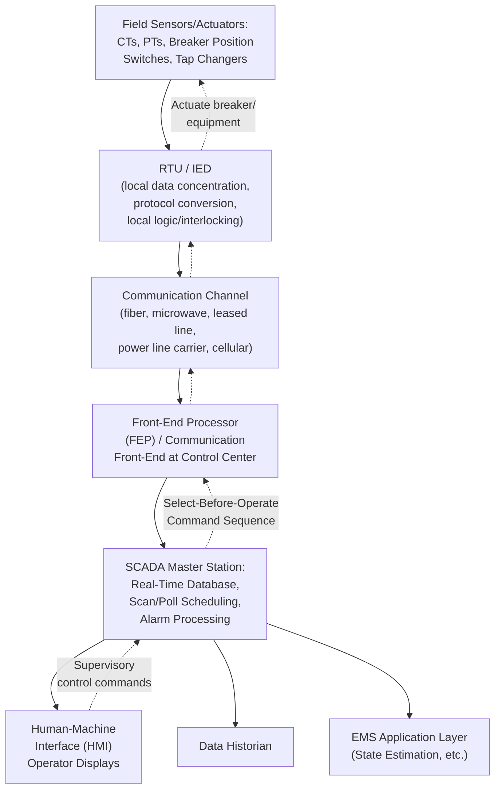

## SCADA Architecture and Communication Protocols

### Definition and Scope

Supervisory Control and Data Acquisition (SCADA) is the real-time data acquisition, monitoring, alarming, and supervisory control system that forms the foundational layer connecting field equipment across the power system to control center operators and the higher-level EMS application suite. Where the prior EMS Architecture section addressed SCADA's position within the broader EMS stack, this section examines the internal architecture of SCADA itself and the communication protocols that enable it — the specific mechanisms by which field data actually travels from a breaker or meter to the control room screen, and by which operator commands travel back.

### Core SCADA System Components

### Remote Terminal Units (RTUs) and Intelligent Electronic Devices (IEDs)

**RTUs** are the traditional field-installed devices that interface directly with substation instrumentation and control equipment, performing:

- Analog-to-digital conversion of measured quantities (voltage, current, power, from current and potential transformers) into values suitable for digital communication
- Digital status point collection (breaker position, alarm contacts, tap changer position)
- Local execution of supervisory control commands received from the master station (e.g., opening/closing a breaker), typically incorporating local safety interlocking logic
- Protocol translation between the field-level instrumentation and the communication protocol used to reach the control center

**IEDs** represent a more modern evolution: microprocessor-based devices (protection relays, meters, breaker controllers) that combine the traditional RTU data acquisition function with additional local intelligence — protection logic, local automation, and often direct native support for modern communication standards (particularly IEC 61850, discussed below) — reducing the need for a separate, distinct RTU as a translation layer between "dumb" instrumentation and the communication network, since the IED itself can communicate its measurements and status directly using standard protocols.

### The Master Station / SCADA Server

At the control center, the SCADA master station performs:

- **Scan scheduling**: determining the polling sequence and frequency for each RTU/IED (traditional polled SCADA architectures query each remote device in a defined rotation; more modern systems increasingly support unsolicited/report-by-exception reporting, where field devices transmit data only when values change or on a periodic heartbeat, reducing unnecessary communication traffic)
- **Real-time database maintenance**: storing the most current value of every monitored point, timestamped and quality-flagged (e.g., marking a point as "stale" if expected communication has not been received within an expected interval)
- **Limit checking and alarm generation**: comparing incoming values against configured normal/alarm/emergency thresholds, generating operator alarms when violations are detected
- **Command sequencing and verification**: managing the supervisory control command process, typically via a **select-before-operate** (SBO) sequence — the operator first "selects" the target device and desired action, the system confirms the selection is valid and unambiguous, and only then does the operator issue the "execute" command — a deliberate two-step safeguard against inadvertent single-click control errors that could otherwise trip critical equipment

### Communication Protocols

**DNP3 (Distributed Network Protocol)**

Widely deployed across North American utility SCADA systems (and internationally), DNP3 was specifically designed to address the reliability challenges of utility telemetry over communication links that may be slow, noisy, or intermittently available (as was historically common for remote substation communication over leased telephone lines, radio, or early digital links). Key DNP3 characteristics:

- Supports both polled and unsolicited (report-by-exception) reporting modes
- Includes robust error-checking and sequencing mechanisms to detect and handle communication errors or lost messages
- Defines a standardized object model for common point types (analog inputs, binary inputs, counters, control outputs), improving interoperability between RTU/IED equipment from different manufacturers
- Includes DNP3 Secure Authentication extensions addressing cybersecurity concerns not present in the original protocol design, reflecting the broader industry recognition that legacy SCADA protocols were generally designed for reliability rather than security against deliberate malicious actors

**IEC 61850**

A substantially more comprehensive and modern standard for substation automation communication, distinguished from DNP3 by:

- **Standardized data/object modeling**: rather than merely defining a communication protocol, IEC 61850 defines a standardized abstract data model for substation equipment (e.g., a standardized way to represent a circuit breaker's position, a transformer's tap position, or a protection relay's trip signal), intended to improve interoperability and reduce the substantial engineering effort historically required to map each vendor's proprietary point-naming conventions into a utility's SCADA system
- **GOOSE messaging (Generic Object Oriented Substation Event)**: a high-speed, peer-to-peer communication mechanism allowing IEDs to communicate directly with each other (e.g., a protection relay signaling a circuit breaker to trip, or coordinating protection logic between multiple relays) without requiring the message to route through the SCADA master station — critical for protection applications requiring communication latencies on the order of milliseconds, far faster than conventional SCADA polling cycles could support
- **Sampled Values (SV)**: a related high-speed messaging capability for streaming raw, time-synchronized analog measurement samples (e.g., current and voltage waveform samples) directly between devices, supporting process-bus architectures where conventional hard-wired instrumentation cabling within a substation is replaced by a digital communication network
- **Substation Configuration Language (SCL)**: an XML-based standardized file format for describing a substation's IED configuration and communication architecture, intended to streamline engineering and configuration management, particularly for multi-vendor substation automation projects

[Inference] IEC 61850 adoption has been substantial in new substation automation projects and modernization efforts globally, though many existing substations continue to operate with legacy protocols (including DNP3 or older standards) that have not yet been replaced, meaning most real-world utility SCADA environments currently operate as a mixed, multi-protocol environment during an extended transition period rather than having uniformly migrated to IEC 61850, and the pace of this transition varies substantially by utility and jurisdiction.

**ICCP / TASE.2 (Inter-Control Center Communications Protocol)**

Standardized as IEC 60870-6/TASE.2, ICCP is specifically designed for real-time data exchange *between* separate utilities' or balancing authorities' control centers, rather than for field-device-to-control-center communication within a single utility. This is the essential protocol infrastructure underlying inter-area coordination functions discussed elsewhere in this chapter — particularly tie-line bias control (which requires each area to know its neighbors' real-time tie-line flow contribution) and wide-area situational awareness spanning multiple utility footprints. ICCP typically carries a more limited, specifically negotiated set of data points between the participating control centers (agreed tie-line flows, frequency, and other mutually relevant operational data) rather than the full internal SCADA point set of either utility.

### Communication Media

Physical/transmission media for SCADA communication have evolved substantially over time and continue to vary by application and geographic/economic context:

- **Leased telephone lines / dial-up**: historically common, now largely legacy, retained in some older or remote installations
- **Power Line Carrier (PLC)**: communication signals carried directly over the utility's own high-voltage transmission lines, historically valuable for remote substations lacking other communication infrastructure, though generally lower bandwidth than modern alternatives
- **Microwave radio**: point-to-point or point-to-multipoint radio links, historically and still commonly used for utility communication, particularly in areas where fiber deployment is impractical
- **Fiber optic communication**: increasingly the preferred medium for new installations and major substations, offering high bandwidth, immunity to electromagnetic interference (relevant given the high-voltage, high-current environment of a substation), and support for the higher-bandwidth requirements of modern protocols like IEC 61850's GOOSE and Sampled Values messaging
- **Cellular/wireless data**: increasingly used for lower-criticality or distribution-level monitoring points where dedicated utility communication infrastructure is not economically justified

### Cybersecurity Considerations Specific to SCADA

Because SCADA systems directly interface with physical control of critical infrastructure, they present a particularly consequential cybersecurity target, with several protocol-specific and architectural considerations:

- **Legacy protocol vulnerabilities**: many legacy SCADA protocols (including early DNP3 and Modbus implementations still present in older equipment) were designed without built-in authentication or encryption, reflecting an era when physical isolation of SCADA networks was considered sufficient protection — an assumption increasingly challenged as networks have become more interconnected (even if not directly internet-connected) and as documented attacks against SCADA/ICS environments have demonstrated real-world exploitation of these gaps
- **Network segmentation**: standard current practice isolates SCADA/OT (Operational Technology) networks from corporate IT networks and the broader internet via defense-in-depth architectures (firewalls, demilitarized zones, unidirectional gateways/data diodes for particularly critical one-way data flows), rather than relying on any single protocol-level security feature
- **Regulatory compliance frameworks**: in North America, NERC's Critical Infrastructure Protection (CIP) standards impose specific mandatory requirements on SCADA/EMS cybersecurity practices for entities meeting defined criticality thresholds, covering areas including access control, security monitoring, incident response, and physical security of critical cyber assets

[Unverified] Specific current cybersecurity requirements, thresholds, and enforcement details are subject to ongoing regulatory revision; readers should consult the current version of applicable standards (e.g., the current NERC CIP standard series) rather than treating any specific requirement described here as necessarily current.

### Related Topics

- Energy Management System Architecture
- State Estimation and Bad Data Detection
- Phasor Measurement Units and Wide-Area Monitoring Systems
- Interchange Scheduling and Tie-Line Bias Control
- Critical Infrastructure Protection and Grid Cybersecurity Standards (NERC CIP)
- Protection Relay Coordination and IED-Based Substation Automation
- Substation Automation and Process Bus Architectures (IEC 61850)
- Network Topology Processing and Breaker Status Modeling