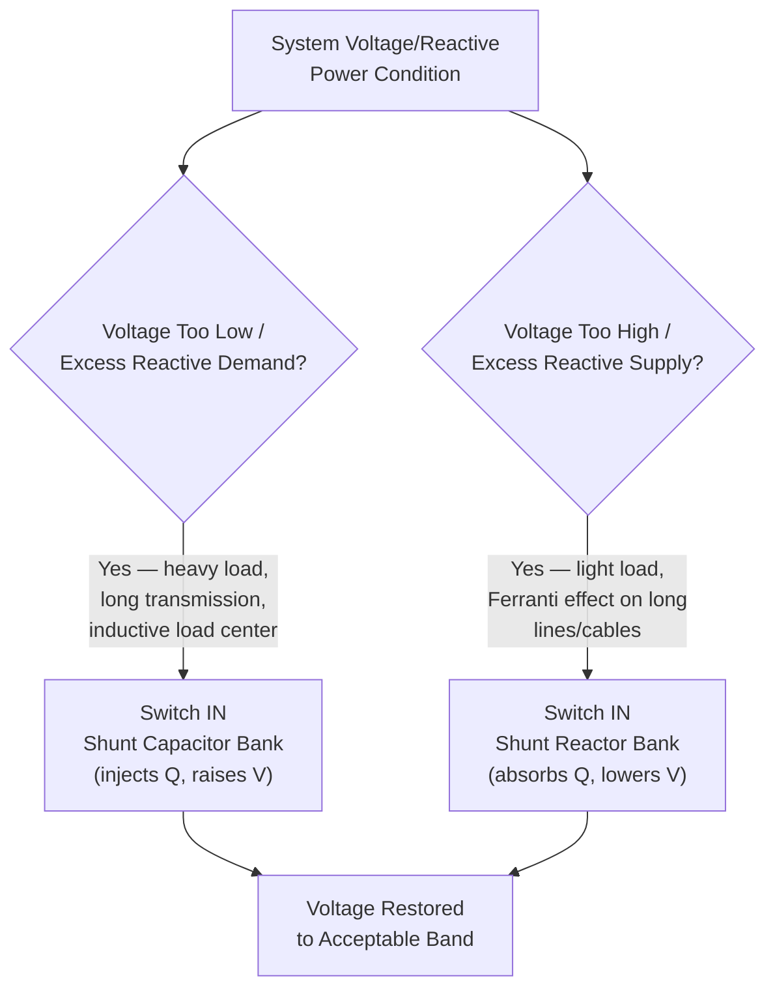

## Shunt Capacitor and Reactor Banks

### Purpose and Physical Basis

Shunt capacitor and reactor banks are the simplest and most widely deployed form of reactive power compensation in power systems, connected in parallel (shunt) across a bus to inject or absorb reactive power and thereby influence local voltage. Their operation rests on the basic AC circuit relationship between reactive power and voltage: a shunt capacitor bank draws leading current and injects reactive power into the system, tending to raise local voltage, while a shunt reactor bank draws lagging current and absorbs reactive power, tending to lower local voltage.

$$Q_C = V^2 \cdot \omega C = \frac{V^2}{X_C}$$

$$Q_L = \frac{V^2}{\omega L} = \frac{V^2}{X_L}$$

The reactive power delivered (capacitor) or absorbed (reactor) scales with the **square** of the applied voltage — a critical practical consequence: as voltage sags, a capacitor bank's reactive power contribution falls off exactly when it may be most needed to support a declining voltage, while conversely a capacitor bank's output rises during high-voltage conditions, potentially exacerbating an overvoltage problem if not properly controlled.

### Shunt Capacitor Banks: Application and Purpose

Shunt capacitor banks serve two principal, related functions:

**1. Reactive Power / Voltage Support**

Most loads (induction motors, transformers, and general mixed industrial/residential/commercial load) are net inductive, drawing lagging reactive power from the system. This reactive power demand, if supplied entirely from remote generation, must flow through transmission and distribution impedance, causing voltage drop and $I^2X$ losses. Shunt capacitors placed close to the load center supply this reactive demand locally, reducing the reactive power that must flow through the network and thereby supporting voltage and reducing losses.

**2. Power Factor Correction**

Industrial and commercial customers with significant inductive load (motor-driven equipment, in particular) often install shunt capacitors specifically to improve their facility's power factor, since utility tariffs frequently penalize low power factor (high reactive power draw relative to real power) through demand charges or explicit power factor penalty clauses — capacitor correction reduces the apparent power (and therefore the current, and the associated $I^2R$ losses and equipment sizing requirements) drawn from the utility for a given real power consumption.

### Shunt Reactor Banks: Application and Purpose

Shunt reactors serve the converse function, primarily addressing **overvoltage** conditions that arise under specific, well-understood circumstances:

**Ferranti Effect / Line Charging on Lightly Loaded Long Transmission Lines**

Long transmission lines exhibit significant shunt capacitance (line charging capacitance) distributed along their length. Under light-load or no-load conditions, this line charging capacitance generates reactive power that is not being consumed by load, causing the receiving-end voltage to rise above the sending-end voltage — the Ferranti effect. Shunt reactors, typically switched in during light-load periods (commonly overnight or during low-demand seasons) and switched out during heavy loading, absorb this excess charging reactive power, preventing overvoltage.

**Underground Cable Systems**

Underground cables have substantially higher shunt capacitance per unit length than overhead lines (due to the closer conductor-to-ground/shield spacing), making shunt reactor compensation particularly important for longer underground cable circuits, including submarine cable interconnections, where uncompensated charging current can become a limiting factor in the cable's usable transmission capacity even before reaching its thermal rating.

### Diagram: Capacitor vs. Reactor Application Context

### Switching Mechanisms

**Mechanical Circuit Breaker Switching**

The traditional and still widely used method: a conventional circuit breaker connects/disconnects the entire capacitor or reactor bank as a discrete block. Key practical considerations:

- **Inrush current on capacitor energization**: closing a breaker onto an uncharged (or oppositely charged, in back-to-back switching scenarios) capacitor bank produces a high-magnitude, high-frequency inrush current transient, requiring appropriately rated switching equipment and, in back-to-back bank configurations, often a current-limiting reactor in series with each bank
- **Restrike risk on de-energization**: opening a circuit breaker while interrupting capacitive current carries some risk of restrike (the arc re-establishing across the opening contacts due to the rapid voltage recovery characteristic of capacitive switching), potentially producing severe voltage transients; modern capacitor-switching-rated breakers are specifically designed to minimize this risk
- **Limited switching frequency**: mechanical breakers have a finite switching life (number of operations before maintenance/replacement is required), which constrains how frequently a bank can be practically switched in normal operation, limiting the granularity of voltage control achievable through breaker-switched banks alone

**Thyristor-Switched Capacitors/Reactors (TSC/TSR)**

A power-electronic switching alternative, using back-to-back thyristor pairs to connect/disconnect the capacitor or reactor bank, offering:

- Much faster switching response (typically within one to a few cycles) compared to mechanical breaker switching
- No mechanical wear-related switching frequency limitation, enabling more frequent switching for finer voltage control granularity
- Precisely timed switching instant control (e.g., closing a capacitor bank thyristor switch at the voltage zero-crossing to minimize inrush transient), a capability not available with conventional mechanical breakers

TSC/TSR arrangements form the switched (as opposed to continuously variable, thyristor-*controlled*) reactive compensation branch commonly found within a Static VAR Compensator (SVC) installation, discussed further under that dedicated topic.

### Bank Configuration and Sizing Considerations

- **Segmentation into multiple steps**: rather than a single large bank switched as one block, capacitor (and sometimes reactor) installations are commonly segmented into multiple smaller steps that can be switched independently, allowing finer granularity of reactive power adjustment to more closely track actual system need rather than only providing a single large, coarse increment
- **Harmonic filtering considerations**: shunt capacitor banks, particularly at buses with significant harmonic-producing loads (variable frequency drives, other power-electronic loads) or nearby HVDC/FACTS converter equipment, can interact with system impedance to create resonance conditions at specific harmonic frequencies, potentially amplifying harmonic voltage/current distortion; detuned (filter) reactors are often installed in series with capacitor banks specifically to shift the bank's resonant frequency away from problematic harmonic orders (commonly the 5th harmonic in many industrial applications) and, in dedicated harmonic filter bank designs, to actively filter specific harmonic currents
- **Protection considerations**: capacitor banks require specific protection schemes addressing unbalance detection (detecting a failed individual capacitor unit within a bank, typically via unbalance current or voltage relaying, before cascading failure of additional units occurs), overvoltage protection, and, for the bank's associated switching device, appropriate capacitor-switching-duty-rated equipment as noted above

### Control Strategies

- **Manual switching**: operator-initiated switching based on observed voltage/reactive power conditions — historically common, increasingly supplemented or replaced by automated control as system complexity and the pace of required reactive power adjustment (particularly with high renewable variability) increases
- **Local automatic voltage/time-based control**: capacitor bank controllers that automatically switch based on local voltage measurement (switching in when voltage or reactive demand crosses a threshold) and/or time-of-day scheduling (e.g., switching in capacitor banks during known peak demand periods, switching in reactors overnight for line-charging compensation)
- **Centralized/coordinated control (Secondary/Tertiary Voltage Control)**: as introduced under Voltage Stability, more sophisticated regional voltage control schemes coordinate shunt capacitor/reactor switching alongside generator reactive output and other reactive devices (SVC, STATCOM) to maintain target voltage profiles across a wider area, rather than each bank responding purely to its own local, independent measurement

### Comparison with Other Reactive Compensation Technologies

| Attribute | Shunt Capacitor/Reactor Bank | SVC | STATCOM |
| --- | --- | --- | --- |
| Response speed | Slow (mechanical) to fast (TSC/TSR) | Fast (sub-cycle to few cycles) | Very fast, continuous |
| Continuous variability | No (discrete steps) | Yes (within TCR range) | Yes, fully continuous |
| Reactive support at low voltage | Degrades with $V^2$ (capacitor) | Degrades with $V^2$ for capacitive portion | Largely maintained even at reduced voltage (current-source-like behavior) |
| Relative capital cost | Low | Moderate | High |
| Typical application | Baseline/bulk reactive compensation, power factor correction | Dynamic voltage support, flicker mitigation | Highest-performance dynamic voltage support, weak grid applications |

Shunt capacitor and reactor banks remain, despite their comparative simplicity relative to power-electronic FACTS devices, the most economical and widely deployed baseline reactive compensation technology, with SVC and STATCOM technologies typically reserved for applications specifically requiring their faster, continuously variable response characteristics — the two categories are generally complementary components of a coordinated voltage control strategy rather than directly competing alternatives for the same application.

### Related Topics

- Voltage Stability and Voltage Collapse Mechanisms
- Static VAR Compensator (SVC) Design and Control
- STATCOM Architecture and Voltage-Source Converter Control
- Secondary and Tertiary Voltage Control Schemes
- Harmonic Resonance and Filter Bank Design
- Capacitor Switching Transients and Circuit Breaker Duty Ratings
- Power Factor Correction for Industrial and Commercial Facilities
- Ferranti Effect and Long Transmission Line Charging Characteristics