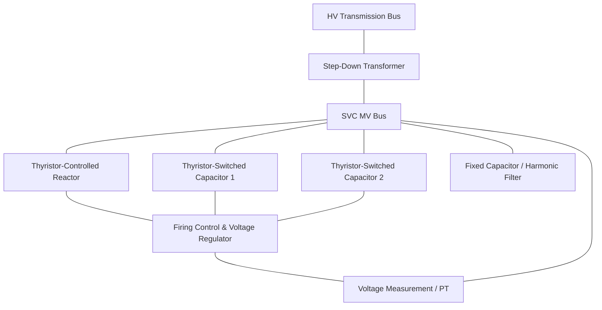
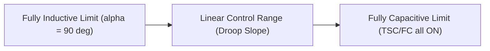

## Static VAR Compensator (SVC) Technology

### Overview

A Static VAR Compensator (SVC) is a shunt-connected Flexible AC Transmission System (FACTS) device that provides fast-acting reactive power compensation using power electronic switching (thyristors) rather than mechanical switchgear or rotating machines. It dynamically adjusts its reactive power output — absorbing or generating VARs — to regulate voltage at a bus, improve power factor, dampen power oscillations, and enhance system stability.

Unlike mechanically switched capacitors/reactors, an SVC has no significant moving parts in its reactive control loop; regulation is achieved by controlling the firing angle of thyristors, giving response times on the order of one to two cycles (typically 20–40 ms at 50/60 Hz).

### Basic Principle of Operation

An SVC works by varying its effective shunt admittance seen by the power system. It is functionally equivalent to an adjustable reactor and/or capacitor bank whose effective value is controlled electronically.

$$Q_{SVC} = V^2 \cdot B_{eq}$$

Where:

- $Q_{SVC}$ = reactive power output/absorption of the SVC
- $V$ = bus voltage at point of connection
- $B_{eq}$ = equivalent controllable susceptance of the SVC

By varying $B_{eq}$ from inductive to capacitive, the SVC can either absorb reactive power (to reduce overvoltage) or inject reactive power (to support sagging voltage).

### Core Components / Configurations

An SVC is typically built from one or more of the following building blocks connected in parallel on the secondary side of a step-down transformer:

**Thyristor-Controlled Reactor (TCR)**

- A fixed reactor in series with a pair of anti-parallel thyristors.
- The firing angle $\alpha$ (measured from voltage zero-crossing, $90° \le \alpha \le 180°$) controls the effective inductance.
- At $\alpha = 90°$, the reactor conducts fully (maximum inductive absorption).
- At $\alpha = 180°$, the reactor is effectively off (zero current).
- Provides continuously variable inductive VAR absorption but injects odd-harmonic currents due to phase-angle chopping.

**Thyristor-Switched Capacitor (TSC)**

- A capacitor bank in series with thyristor switches that operate in full-conduction mode only (either fully on or fully off) — not phase-controlled — to avoid the severe harmonic distortion and transient inrush that phase-controlled capacitor switching would cause.
- Switching is synchronized to the instant when capacitor voltage equals system voltage, minimizing switching transients.
- Provides step-wise (not continuous) capacitive support; multiple TSC branches give a stepped, quasi-continuous range when combined with a TCR.

**Thyristor-Switched Reactor (TSR)**

- Similar to TCR but thyristors are fully on/off (not phase-controlled), used for discrete inductive steps.

**Fixed Capacitor / Filter Banks (FC)**

- Often tuned as harmonic filters (e.g., 5th, 7th harmonic) to absorb TCR-generated harmonics while contributing a base level of capacitive VAR support.

**Common Practical Configuration**

- TCR + FC (Fixed Capacitor): most common industrial configuration — capacitive base with inductive trim.
- TSC + TCR: wider dynamic range, used in transmission applications requiring both capacitive and inductive control.

### V-I Characteristic

The steady-state behavior of an SVC is best understood through its voltage-current (V-I) characteristic, which defines a regulation slope (droop) around a reference voltage.

- **Linear control range**: between the fully inductive and fully capacitive limits, the SVC regulates voltage along a slope, typically 1–5% droop (slope reactance $X_{sl}$), expressed as:

$$V = V_{ref} + X_{sl} \cdot I_{SVC}$$

- **Capacitive limit**: maximum capacitive output is reached when all TSC/FC branches are fully switched in; beyond this, the SVC behaves as a fixed capacitor (output falls with declining voltage — cannot support voltage further).
- **Inductive limit**: maximum inductive absorption is reached when the TCR is at full conduction ($\alpha = 90°$); beyond this, the SVC behaves as a fixed reactor.

Droop slope is intentionally introduced to:

- Prevent hunting/instability when multiple voltage-regulating devices operate on the same or electrically close buses.
- Allow reactive power sharing among multiple compensators.

### Control System Structure

A typical SVC control system consists of nested loops:

1. **Voltage Measurement** — RMS voltage derived from PTs at the point of connection, often with a filter to reject transients and DC offset.
2. **Voltage Regulator** — compares measured voltage to $V_{ref}$, computes error, and outputs a susceptance demand $B_{ref}$ based on the droop characteristic.
3. **Susceptance-to-Firing-Angle Converter** — translates the required $B_{ref}$ into TCR firing angle $\alpha$ and TSC on/off switching logic.
4. **Synchronization / Firing Pulse Generator** — phase-locked loop (PLL) referenced to system voltage, generates precisely timed gate pulses to thyristors.
5. **Supplementary Controls** (optional) — Power Oscillation Damping (POD), overvoltage/undervoltage protection logic, and coordination with other reactive devices.

### Applications

- **Voltage regulation** at weak points in transmission/distribution networks, especially where load is remote from generation.
- **Power factor correction** for large fluctuating industrial loads (e.g., arc furnaces, rolling mills), where SVCs suppress voltage flicker caused by rapidly varying reactive demand.
- **Increasing transmission capacity** — SVCs improve voltage profile along long lines, permitting higher power transfer for a given thermal/stability limit.
- **Damping power system oscillations** — modulating reactive output in response to power swings improves transient and small-signal stability.
- **Balancing unbalanced loads** — in some designs, per-phase TCR control mitigates negative-sequence voltage from single-phase heavy loads.

### Worked Example

**Scenario**: An SVC rated ±100 MVAR (100 MVAR inductive to 100 MVAR capacitive) is connected to a 230 kV bus via a 230/13.8 kV transformer. System voltage sags to 0.95 pu (218.5 kV) under heavy load.

Given a droop slope of 3% (on SVC MVA base) and $V_{ref} = 1.0$ pu:

$$V = V_{ref} + X_{sl} \cdot Q_{pu}$$

Solving for the reactive output required to correct voltage error of $-0.05$ pu with $X_{sl} = 0.03$ pu:

$$Q_{pu} = \frac{V - V_{ref}}{X_{sl}} = \frac{-0.05}{0.03} \approx -1.67 \text{ pu (capacitive, saturating to full output)}$$

Since $|Q_{pu}| > 1.0$, the SVC saturates at its capacitive limit and delivers its full 100 MVAR capacitive output — voltage will not be fully restored to 1.0 pu but will be improved, following the linear slope up to the limit and then following the fixed-capacitor branch characteristic.

**Key Points**

- SVC response is fast (1–2 cycles) but reactive output is bounded by installed MVA rating — it cannot indefinitely regulate voltage against a severe system deficiency.
- Droop slope trades off perfect voltage regulation for stability and reactive power sharing.

### Harmonics and Filtering

TCR operation generates characteristic harmonics (predominantly odd-order: 5th, 7th, 11th, 13th...) due to phase-angle-controlled conduction. Mitigation includes:

- **Six-pulse / twelve-pulse TCR arrangements** — using two 6-pulse TCR banks phase-shifted by 30° (via delta/wye transformer windings) to cancel 5th and 7th harmonics.
- **Tuned harmonic filters** — LC branches tuned to specific harmonic frequencies, doubling as fixed capacitive VAR sources.
- **High-pass filters** — damp higher-order and non-characteristic harmonics.

[Inference] Detailed harmonic filter sizing is highly project-specific and depends on background system impedance and TCR rating; results shown in vendor studies should not be assumed to generalize across installations.

### SVC vs. Other Reactive Compensation Technologies

| Attribute | Mechanically Switched Capacitor/Reactor | SVC (TCR/TSC) | STATCOM |
| --- | --- | --- | --- |
| Response time | Seconds (mechanical switching) | 1–2 cycles | Sub-cycle |
| Continuous control | No (stepped) | Yes (within TCR range) | Yes |
| Reactive output at low voltage | Falls with $V^2$ | Falls with $V^2$ within capacitive limit | Largely voltage-independent |
| Harmonics generated | None | Yes (requires filtering) | Minimal (PWM-based) |
| Relative cost | Low | Moderate | Higher |
| Footprint | Small | Moderate–large | Compact |

**Note**: A STATCOM (Static Synchronous Compensator) is a related but distinct FACTS device using voltage-source converters instead of thyristor-controlled impedances; it maintains near-constant reactive current capability even during deep voltage sags, unlike an SVC whose capacitive output degrades with $V^2$.

### Protection and Ratings Considerations

- **Thyristor valve protection**: snubber circuits, surge arresters across valve, overcurrent/overvoltage tripping of firing control.
- **Transformer**: SVC step-down transformer must be rated for harmonic loading (K-factor) in addition to fundamental MVA.
- **Redundancy**: multiple TSC/TCR branches allow partial operation and N-1 contingency tolerance.
- **MVAR rating selection** [Inference]: typically driven by contingency-based voltage stability studies (e.g., post-fault voltage recovery requirements) rather than steady-state load flow alone, though exact methodology varies by utility planning criteria.

### SVC Single-Line Diagram (svg_diagram)

<svg xmlns="http://www.w3.org/2000/svg" viewBox="0 0 640 420" font-family="sans-serif">
<text x="320" y="24" font-size="16" text-anchor="middle" font-weight="bold">SVC Single-Line Diagram (svg_diagram)</text>

<line x1="80" y1="60" x2="560" y2="60" stroke="black" stroke-width="3" />
<text x="20" y="64" font-size="12">HV Bus</text>

<line x1="320" y1="60" x2="320" y2="100" stroke="black" stroke-width="2" />
<circle cx="320" cy="120" r="20" fill="none" stroke="black" stroke-width="2" />
<circle cx="320" cy="150" r="20" fill="none" stroke="black" stroke-width="2" />
<text x="350" y="140" font-size="12">Step-Down XFMR</text>
<line x1="320" y1="170" x2="320" y2="200" stroke="black" stroke-width="2" />

<line x1="100" y1="200" x2="540" y2="200" stroke="black" stroke-width="3" />
<text x="30" y="204" font-size="12">SVC MV Bus</text>

<line x1="150" y1="200" x2="150" y2="240" stroke="black" stroke-width="2" />
<path d="M140,240 L160,240 L140,255 L160,255 L140,270" stroke="black" stroke-width="2" fill="none" />
<text x="100" y="300" font-size="12">TCR</text>
<rect x="135" y="270" width="30" height="18" fill="none" stroke="black" stroke-width="2" />
<text x="110" y="283" font-size="10">Thyristors</text>

<line x1="280" y1="200" x2="280" y2="240" stroke="black" stroke-width="2" />
<line x1="270" y1="250" x2="290" y2="250" stroke="black" stroke-width="2" />
<line x1="270" y1="256" x2="290" y2="256" stroke="black" stroke-width="2" />
<text x="250" y="300" font-size="12">TSC-1</text>
<rect x="265" y="270" width="30" height="18" fill="none" stroke="black" stroke-width="2" />

<line x1="400" y1="200" x2="400" y2="240" stroke="black" stroke-width="2" />
<line x1="390" y1="250" x2="410" y2="250" stroke="black" stroke-width="2" />
<line x1="390" y1="256" x2="410" y2="256" stroke="black" stroke-width="2" />
<text x="370" y="300" font-size="12">TSC-2</text>
<rect x="385" y="270" width="30" height="18" fill="none" stroke="black" stroke-width="2" />

<line x1="500" y1="200" x2="500" y2="240" stroke="black" stroke-width="2" />
<line x1="490" y1="250" x2="510" y2="250" stroke="black" stroke-width="2" />
<line x1="490" y1="256" x2="510" y2="256" stroke="black" stroke-width="2" />
<text x="470" y="300" font-size="12">FC / Filter</text>

<rect x="220" y="340" width="200" height="50" fill="none" stroke="black" stroke-width="2" />
<text x="320" y="360" font-size="12" text-anchor="middle">Firing Control &amp;</text>
<text x="320" y="376" font-size="12" text-anchor="middle">Voltage Regulator</text>
<line x1="320" y1="200" x2="320" y2="340" stroke="black" stroke-width="1" stroke-dasharray="4,3" />
</svg>

### Limitations

- Reactive capability degrades approximately with $V^2$ during severe voltage depressions, reducing effectiveness exactly when most needed (this is the key structural disadvantage versus a STATCOM).
- Generates harmonics requiring dedicated filtering infrastructure.
- Discrete TSC switching introduces small step-changes rather than fully continuous control (mitigated by combining with TCR).
- Higher installed cost and control complexity relative to simple mechanically switched capacitor banks.

**Related Topics**

- STATCOM (Static Synchronous Compensator) technology and VSC-based FACTS
- Thyristor valve design and gate firing circuits
- Power system voltage stability and PV/QV curve analysis
- Series compensation: TCSC (Thyristor-Controlled Series Capacitor)
- Harmonic filter design methodology for power electronic converters
- Reactive power planning and contingency-based MVAR sizing studies
- Power Oscillation Damping (POD) control design
- Unified Power Flow Controller (UPFC) as combined series-shunt FACTS device