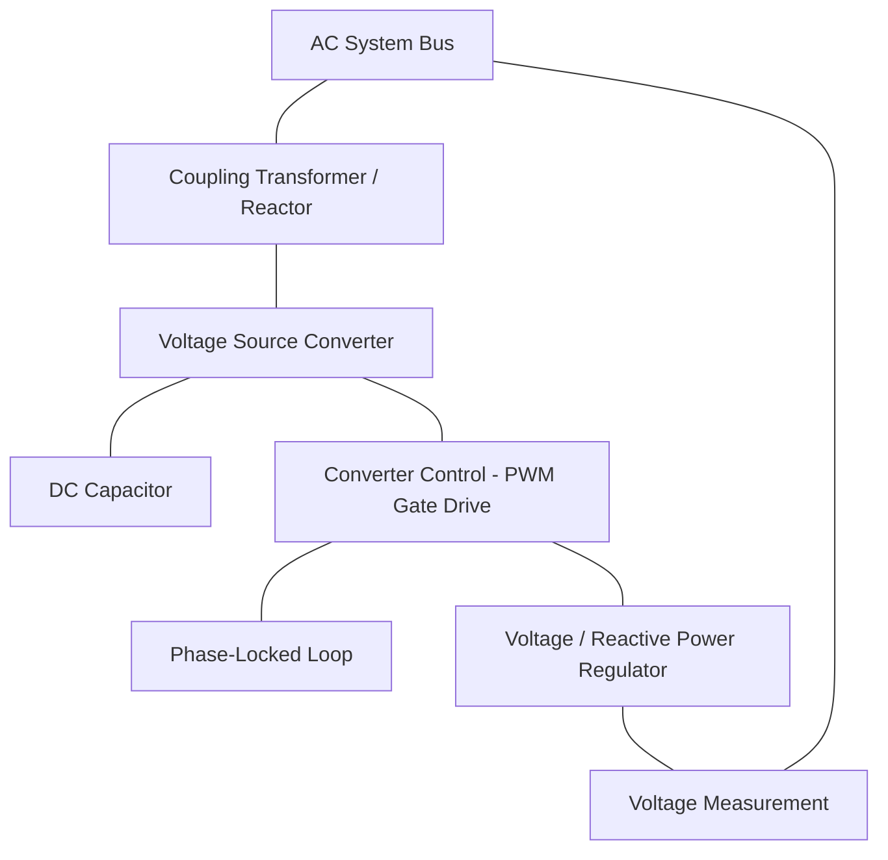
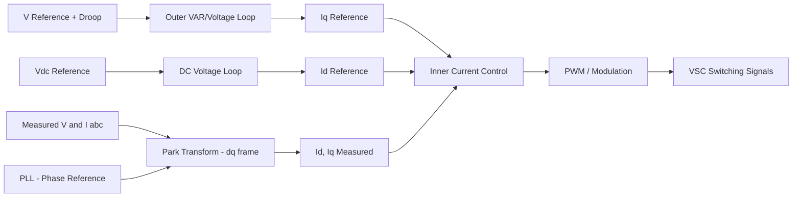

## STATCOM Technology and Control

### Overview

A Static Synchronous Compensator (STATCOM) is a shunt-connected FACTS (Flexible AC Transmission System) device that regulates voltage and provides dynamic reactive power compensation using a voltage-source converter (VSC) rather than thyristor-controlled passive impedances (as in an SVC). It behaves as a controllable synchronous voltage source, exchanging reactive current with the AC system nearly independently of the system's instantaneous voltage magnitude.

STATCOMs are used to regulate bus voltage, support voltage stability under contingencies, damp power oscillations, mitigate flicker from fluctuating industrial loads, and improve dynamic performance of weak grids and renewable-heavy interconnections.

### Basic Principle of Operation

A STATCOM consists of a voltage-source converter connected to the AC system through a coupling transformer (or reactor), with a DC-side capacitor providing energy storage for converter switching.

The converter synthesizes an AC voltage $V_{conv}$ at its terminals, in phase with the system voltage $V_s$ but of controllable magnitude. The difference between $V_{conv}$ and $V_s$, across the coupling reactance $X$, determines the reactive current exchanged:

$$Q = \frac{V_s(V_s - V_{conv})}{X}$$

- If $V_{conv} > V_s$: the STATCOM sources reactive power (capacitive mode) — current leads voltage, injecting VARs into the system.
- If $V_{conv} < V_s$: the STATCOM sinks reactive power (inductive mode) — absorbing VARs from the system.
- If $V_{conv} = V_s$: zero reactive power exchange.

Because $V_{conv}$ is actively synthesized by the converter (not derived from a passive LC network), the STATCOM's reactive current capability is largely decoupled from the instantaneous system voltage — a key structural advantage over an SVC.

### Core Components

**Voltage Source Converter (VSC)**

- Built from self-commutated semiconductor switches — historically GTOs (Gate Turn-Off thyristors), now predominantly IGBTs (Insulated Gate Bipolar Transistors) or IGCTs (Integrated Gate-Commutated Thyristors) for high-power applications.
- Converts DC bus voltage into a controllable AC waveform via switching (PWM or multilevel modulation).

**DC Energy Storage (Capacitor)**

- Maintains DC bus voltage that serves as the source for AC voltage synthesis.
- Unlike a battery-based system, the STATCOM's DC capacitor stores only enough energy to support switching and momentary real-power exchange — it is not a bulk energy storage device (though STATCOMs can be paired with BESS for real-power support, sometimes termed "STATCOM with storage").

**Coupling Transformer / Reactor**

- Interfaces the converter's synthesized voltage with the AC system.
- The leakage reactance of this transformer (or a dedicated series reactor) sets the coupling impedance $X$ used in the reactive power equation.

**Converter Topologies**

- **Two-level VSC**: simplest topology; produces a stepped square-wave-like output, generally requiring more filtering.
- **Multilevel converters** (Neutral-Point-Clamped, Flying Capacitor, Modular Multilevel Converter/MMC): synthesize a stepped waveform closely approximating a sinusoid, reducing harmonic content and enabling higher-voltage direct connection.
- **Modular Multilevel Converter (MMC)**: the modern standard for high-power transmission-level STATCOMs, built from cascaded submodules (each with its own capacitor), providing low harmonic distortion, scalability, and fault-tolerant redundancy through submodule bypassing.

### Control System Structure

STATCOM control operates on multiple nested timescales:

1. **Inner Current Control Loop**
   - Regulates the converter's output current in a synchronously rotating $d$-$q$ reference frame (Park transformation), referenced to the system voltage via a Phase-Locked Loop (PLL).
   - The $d$-axis current component typically corresponds to real power (DC bus regulation); the $q$-axis current component corresponds to reactive power exchange.
2. **DC Voltage Regulation Loop**
   - Maintains the DC capacitor voltage at its setpoint by adjusting the small real-power component drawn from the AC system to cover converter switching losses.
3. **Outer Voltage/VAR Regulation Loop**
   - Compares measured AC bus voltage to a reference, applying a droop characteristic (similar in concept to an SVC) to compute the required reactive current command $I_{q,ref}$.
4. **Supplementary Controls**
   - Power Oscillation Damping (POD): modulates reactive current in response to detected power system oscillations (typically 0.1–2 Hz inter-area modes).
   - Negative-sequence / unbalance compensation: some STATCOM controls include separate control of positive- and negative-sequence current components for unbalanced load or fault conditions.
   - Low-Voltage Ride-Through (LVRT) logic: prioritizes reactive current injection during voltage sags per grid code requirements.

### V-I Characteristic

A STATCOM's V-I characteristic differs fundamentally from an SVC's:

- Within its rated current limits, the STATCOM can deliver full rated reactive current essentially independent of system voltage, down to very low voltage levels (limited by converter voltage headroom and protection settings) — unlike the SVC, whose capacitive output falls with $V^2$.
- Like the SVC, a droop slope (typically 1–5%) is applied in the linear control range for stable operation and reactive sharing with other regulating devices.
- At voltage extremes, the converter reaches its maximum modulation index or current limit, at which point further support is not possible — but this limit is defined by converter current rating, not by declining voltage as with a fixed capacitor.

[Inference] Exact low-voltage current capability during deep sags depends on specific converter design margins and protection thresholds set by the manufacturer; behavior can vary across STATCOM implementations and should be verified against the specific unit's technical datasheet.

### Applications

- **Voltage support during contingencies** — particularly valuable in weak grids or near the end of long transmission lines, where SVC capacitive output would otherwise collapse during a fault-induced voltage sag.
- **Renewable integration** — STATCOMs are widely deployed at wind and solar plant interconnection points to provide fast reactive support and meet grid code voltage ride-through requirements.
- **Flicker mitigation** — fast response (sub-cycle to a few milliseconds) makes STATCOMs effective against rapidly fluctuating loads such as electric arc furnaces.
- **Power oscillation damping** — modulated reactive current injection improves inter-area and local-mode damping in interconnected systems.
- **Grid-forming applications** [Inference] — some modern STATCOM/MMC-based converters can be configured to provide grid-forming voltage support (synthetic inertia-like behavior) in inverter-dominated grids, though this is an evolving area with implementation details varying by vendor.

### Worked Example

**Scenario**: A ±150 MVAR STATCOM is installed at a wind farm point of interconnection (POI), rated 34.5 kV. A nearby fault causes the POI voltage to sag to 0.5 pu (17.25 kV) for 150 ms.

Assuming the STATCOM's rated current is maintained regardless of voltage depression (a defining STATCOM characteristic):

$$Q_{available} = V \cdot I_{rated}$$

At $V = 0.5$ pu, with $I_{rated}$ corresponding to 150 MVAR at 1.0 pu voltage:

$$Q_{available} \approx 0.5 \times 150 \text{ MVAR} = 75 \text{ MVAR}$$

Compare this to an equivalently-rated SVC under the same 0.5 pu sag, where capacitive output falls approximately with $V^2$:

$$Q_{SVC} \approx (0.5)^2 \times 150 \text{ MVAR} = 37.5 \text{ MVAR}$$

**Key Points**

- Even though both devices' available VARs decline during the sag (since $Q = V \cdot I$ and $V$ itself is reduced), the STATCOM retains proportionally more capability ($V^1$ scaling near current limit) than the SVC's capacitive branch ($V^2$ scaling), giving it a significant advantage for fault ride-through and voltage recovery support.
- [Inference] Actual field performance depends on the converter's current limit strategy during faults (e.g., prioritizing reactive over real current) and specific protection/control settings, which vary by manufacturer and project specification.

### Harmonics and Filtering

- Two-level VSC-based STATCOMs generate switching-frequency harmonics requiring output filters (typically LC or LCL filters).
- Multilevel/MMC-based STATCOMs produce substantially lower harmonic distortion due to the stepped waveform closely approximating a sine wave, often eliminating the need for dedicated harmonic filters at the point of connection.
- Unlike SVCs, STATCOMs do not generate the characteristic low-order harmonics associated with thyristor phase-angle control (5th, 7th, etc.), since they do not rely on phase-delayed conduction.

### STATCOM vs. SVC — Comparative Summary

| Attribute | SVC | STATCOM |
| --- | --- | --- |
| Core technology | Thyristor-controlled reactor/capacitor | Voltage-source converter (VSC/MMC) |
| Reactive current at low voltage | Degrades with $V^2$ | Degrades approximately linearly with $V$ (near-constant current) |
| Response time | 1–2 cycles | Sub-cycle to ~1 cycle |
| Harmonic generation | Moderate (requires filters) | Low (especially with multilevel topology) |
| Footprint | Larger (reactor/capacitor banks) | More compact |
| Overload capability | Limited by passive component ratings | Can have short-term overload margin via converter design |
| Typical cost | Lower | Higher |
| Real power exchange capability | None (reactive only, structurally) | Minimal by default; can be extended with DC-side storage |

### Protection Considerations

- **Overcurrent protection**: converter valves are protected against fault currents via fast current limiting in the control loop combined with hardware overcurrent trip and bypass (crowbar or thyristor bypass switch) for the coupling transformer/reactor.
- **DC capacitor overvoltage protection**: critical to prevent damage to converter switches during control transients or loss of grid synchronization.
- **Submodule redundancy (MMC)**: additional submodules beyond the minimum required are commonly installed so that failed submodules can be bypassed without taking the STATCOM out of service.
- **Grid code compliance**: many interconnection standards (e.g., IEEE 1547, various transmission operator grid codes) specify required reactive current injection profiles during voltage sags, which STATCOM controls must be tuned to satisfy.

### Limitations

- Higher capital cost per MVAR compared to SVC or mechanically switched capacitor banks.
- Converter losses (switching and conduction) are generally higher than passive thyristor-controlled equipment, though multilevel topologies have narrowed this gap considerably.
- Control and protection system complexity is greater, requiring more sophisticated commissioning and maintenance expertise.
- Without added energy storage, real-power support capability remains minimal — a STATCOM alone cannot substitute for active power reserves or frequency support.

**Related Topics**

- Modular Multilevel Converter (MMC) architecture and submodule design
- Static VAR Compensator (SVC) technology (comparative baseline)
- Grid-forming inverter control and synthetic inertia
- Low-Voltage Ride-Through (LVRT) grid code requirements
- Power Oscillation Damping (POD) control design
- Voltage-source converter PWM and space-vector modulation techniques
- STATCOM with integrated Battery Energy Storage System (BESS)
- Unified Power Flow Controller (UPFC) as a combined series-shunt FACTS device