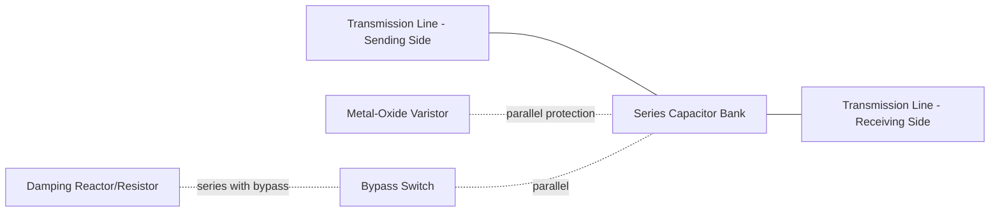
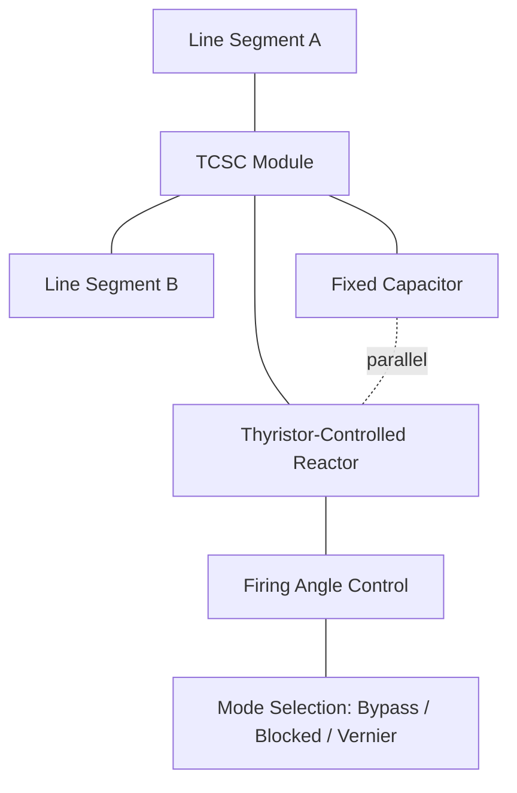

## Series Compensation for Voltage Support

### Overview

Series compensation refers to the insertion of a reactive element — typically capacitive, though sometimes controllable — in series with a transmission line conductor, as opposed to shunt compensation which connects reactive devices in parallel at a bus. Series compensation directly reduces the effective series reactance of a transmission line, which is the dominant factor limiting power transfer, voltage drop, and stability margins on long AC lines.

While often associated primarily with increasing power transfer capability, series compensation also plays a significant role in voltage support: by reducing the reactive voltage drop ($I \cdot X$) along a line, it improves voltage regulation between sending and receiving ends, particularly under heavy loading conditions.

### Fundamental Principle

For a simplified transmission line represented by series reactance $X$, connecting a sending-end voltage $V_S$ and receiving-end voltage $V_R$ with angle difference $\delta$, real power transfer is approximated by:

$$P = \frac{V_S V_R}{X} \sin\delta$$

Series capacitive compensation reduces the effective line reactance:

$$X_{eff} = X_L - X_C$$

Where $X_L$ is the line's natural inductive reactance and $X_C$ is the reactance of the inserted series capacitor. Reducing $X_{eff}$ has two major benefits:

1. **Increased power transfer capability** for the same voltage magnitudes and angle difference.
2. **Reduced voltage drop** along the line for a given power flow, since the reactive component of voltage drop ($I \cdot X_{eff} \cdot \sin\phi$, where $\phi$ is the load power factor angle) is directly reduced.

The **degree of compensation** is commonly expressed as a percentage:

$$k = \frac{X_C}{X_L} \times 100\%$$

Typical series compensation levels range from 25% to 70%, with most transmission applications falling between 40–60%. [Inference] Compensation levels above roughly 70% are uncommon in practice due to subsynchronous resonance (SSR) risk and protection coordination complexity, though exact thresholds are project- and system-specific.

### Fixed Series Capacitor (FSC) Banks

The simplest and most common form of series compensation uses a fixed capacitor bank installed at a switching station along the line route (often at the midpoint for symmetric benefit, or near one end for logistical reasons).

**Key Components**

- **Capacitor bank**: multiple capacitor units arranged in series/parallel groups to achieve rated voltage and MVAR capability.
- **Metal-Oxide Varistor (MOV)**: connected across the capacitor bank to limit overvoltage during line faults, clamping voltage to a protective level while allowing the capacitor to remain in service through the fault (rather than requiring immediate bypass).
- **Bypass switch/breaker**: a fast mechanical or, in modern designs, a triggered spark-gap or thyristor-based bypass, used to short-circuit the capacitor bank during severe faults or for planned maintenance.
- **Damping circuit**: a small reactor/resistor branch in parallel with the bypass switch to limit the discharge current transient when the capacitor bank is reinserted after a bypass event.
- **Platform and insulation**: since the capacitor bank floats at line potential (not ground), the entire assembly is mounted on an insulated platform rated for the line's phase-to-ground voltage.

### Thyristor-Controlled Series Capacitor (TCSC)

A TCSC extends the fixed series capacitor concept by adding a thyristor-controlled reactor (TCR) in parallel with the capacitor bank, allowing continuous or discrete adjustment of the effective series reactance.

**Operating Modes**

- **Bypassed mode**: TCR thyristors fully conduct, effectively short-circuiting (bypassing) the capacitor at power frequency — used during high fault currents or for reduced compensation.
- **Blocked (capacitive) mode**: TCR thyristors are fully off; the branch behaves as a fixed capacitor bank.
- **Vernier (boost) mode**: TCR is partially fired, causing the parallel LC combination to present an effective capacitive reactance larger than the capacitor alone (due to resonance-adjacent operation between the capacitor and partially conducting reactor), providing continuously variable capacitive reactance boost.

$$X_{TCSC}(\alpha) = \frac{X_C \cdot X_L(\alpha)}{X_L(\alpha) - X_C}$$

Where $X_L(\alpha)$ is the effective TCR reactance as a function of firing angle $\alpha$, and the expression is valid in the capacitive vernier region, away from the parallel resonance point (which must be avoided in steady-state operation).

**Benefits over Fixed Series Capacitors**

- Fast, continuous control of line reactance enables dynamic power flow control and power oscillation damping.
- Effective mitigation of subsynchronous resonance (SSR) — the TCSC's frequency-dependent impedance characteristic can be tuned to avoid amplifying subsynchronous currents, unlike a fixed capacitor which presents a fixed series-resonant point with the system.
- Can rapidly adjust compensation level in response to system disturbances, improving transient stability margins.

### Voltage Support Mechanism in Detail

Series compensation supports voltage in several distinct ways:

1. **Direct reduction of reactive voltage drop** — for a heavily loaded line with lagging power factor, the majority of voltage drop is reactive ($I X \sin\phi$); reducing $X$ directly reduces this drop, improving receiving-end voltage without any shunt reactive injection.
2. **Improved voltage stability margin** — on long lines approaching their steady-state stability limit (often voltage-collapse-driven under heavy load), reducing effective reactance increases the maximum deliverable power before voltage collapse occurs, effectively pushing the nose of the P-V curve outward.
3. **Reduced reactive losses** — lower effective line reactance for a given power transfer reduces the line's own reactive power consumption ($I^2 X$), which otherwise must be supplied from the sending end or local shunt sources, indirectly benefiting system-wide voltage profile.
4. **Dynamic damping (TCSC only)** — modulating series reactance in response to power swings can directly counteract the voltage and power oscillations that accompany inter-area stability events.

### Worked Example

**Scenario**: A 230 kV, 150 km transmission line has a series reactance of $X_L = 0.35\ \Omega/\text{km}$, giving total $X_L = 52.5\ \Omega$. The line carries 400 MW at 0.90 lagging power factor. A 50% series compensation scheme is proposed.

**Step 1 — Uncompensated reactive drop (approximate)**

Line current:

$$I = \frac{P}{\sqrt{3} \cdot V \cdot \cos\phi} = \frac{400 \times 10^6}{\sqrt{3} \times 230 \times 10^3 \times 0.90} \approx 1116\ \text{A}$$

Reactive component of current ($\sin\phi \approx 0.436$ for $\cos\phi = 0.90$):

$$I_{reactive} \approx 1116 \times 0.436 \approx 487\ \text{A}$$

Approximate reactive voltage drop (per phase, simplified):

$$\Delta V_{reactive} \approx I_{reactive} \times X_L = 487 \times 52.5 \approx 25{,}570\ \text{V} \approx 25.6\ \text{kV (per phase equivalent)}$$

**Step 2 — With 50% series compensation**

$$X_{eff} = X_L (1 - 0.50) = 52.5 \times 0.5 = 26.25\ \Omega$$

$$\Delta V_{reactive,comp} \approx 487 \times 26.25 \approx 12{,}785\ \text{V} \approx 12.8\ \text{kV}$$

**Key Points**

- The reactive voltage drop is approximately halved, directly improving receiving-end voltage regulation for the same power transfer and power factor.
- This is a simplified single-line approximation ignoring shunt charging capacitance and resistance; full analysis requires load-flow or transmission-line ABCD-parameter modeling. [Inference] Real-world voltage improvement will differ based on system source impedance, other parallel paths, and reactive support elsewhere in the network.

### Subsynchronous Resonance (SSR) Considerations

A critical design concern for series-compensated lines, particularly near turbine-generator units:

- The series capacitor forms a resonant circuit with the system's inductance at a subsynchronous frequency $f_{er}$:

$$f_{er} = f_0 \sqrt{\frac{X_C}{X_L}}$$

- If this electrical resonant frequency complements a torsional mechanical resonance of a nearby turbine-generator shaft, self-excited oscillations (SSR) can grow and cause severe shaft damage — historically documented in incidents such as the Mohave Generating Station events in the 1970s.
- Mitigation approaches include: NGH (Nayak-Gyugyi-Hingorani) SSR damping schemes, TCSC-based reactance modulation for SSR damping, supplementary excitation-system-based damping controllers, and careful compensation-level selection during planning studies.

[Unverified] Specific SSR risk thresholds are highly dependent on the electrical distance and torsional characteristics of nearby generating units and require detailed eigenvalue/frequency-scan studies for any real project; no generic percentage threshold reliably predicts SSR risk across all systems.

### Comparison: Fixed Series Capacitor vs. TCSC

| Attribute | Fixed Series Capacitor (FSC) | TCSC |
| --- | --- | --- |
| Reactance control | Fixed | Continuously variable (within range) |
| Response to system disturbance | None (passive) | Fast, controllable (sub-cycle to few cycles) |
| SSR mitigation capability | None inherent (may require separate damping) | Can provide active SSR damping |
| Cost | Lower | Higher |
| Power oscillation damping | Not capable | Capable via modulation control |
| Complexity of protection/control | Lower (MOV + bypass only) | Higher (firing control, mode logic) |

### Related Series FACTS Devices

- **Static Synchronous Series Compensator (SSSC)**: a VSC-based series device (series counterpart to the STATCOM) that injects a controllable voltage in quadrature with line current, providing series compensation without relying on a physical capacitor — offering both capacitive and inductive series compensation modes and inherent immunity to the classical SSR resonance mechanism.
- **Unified Power Flow Controller (UPFC)**: combines a shunt STATCOM-like converter with a series SSSC-like converter on a common DC link, enabling simultaneous independent control of voltage, active power flow, and reactive power flow.
- **Interline Power Flow Controller (IPFC)**: multiple series converters sharing a common DC bus, coordinating power flow across multiple lines from a single substation.

### Practical Application Notes

- Series compensation is most commonly applied on long transmission lines (typically >200 km) where line reactance is a binding constraint on power transfer and voltage regulation.
- Placement (midpoint vs. line-end) affects both electrical performance and protection/relaying complexity; midpoint placement generally maximizes power transfer benefit but complicates line protection schemes due to non-monotonic apparent impedance seen by distance relays.
- Series-compensated lines require specialized protective relaying (e.g., using ohm-based distance elements with compensation for capacitive reactance, or dedicated series-compensation-aware relay algorithms) since a standard distance relay's apparent impedance calculation is distorted by the presence of the series capacitor.

**Related Topics**

- Static Synchronous Series Compensator (SSSC) technology
- Unified Power Flow Controller (UPFC) architecture
- Subsynchronous resonance (SSR) analysis and mitigation techniques
- Protective relaying for series-compensated transmission lines
- Power-angle curves and steady-state stability limits
- Thyristor-Controlled Series Capacitor (TCSC) firing control design
- Transmission line ABCD parameter modeling
- Metal-Oxide Varistor (MOV) protection design for series capacitor banks