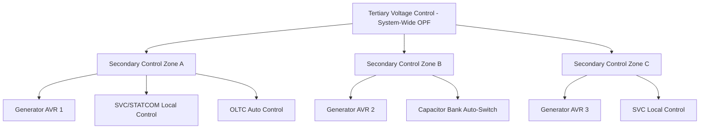

## System-Wide Voltage Control Coordination

### Overview

System-wide voltage control coordination refers to the hierarchical and distributed management of all voltage-regulating devices across a power system — generators, transformers, shunt compensators (capacitors, reactors, SVCs, STATCOMs), series devices, and load-side elements — so that they act in a coordinated, non-conflicting manner to maintain acceptable voltage profiles across the network under normal and contingency conditions.

Without coordination, independently operating voltage controllers (each optimizing only its local bus) can hunt against each other, interact adversely (e.g., two devices alternately over-correcting), or fail to make efficient system-wide use of available reactive reserves, leaving the system vulnerable to voltage instability or collapse under stress.

### Why Coordination Is Necessary

- **Local vs. system-wide objectives**: a device regulating its local bus voltage tightly may inadvertently deplete reactive reserves needed elsewhere, or mask a developing system-wide reactive power deficiency until it is too late to respond (a classic precursor to voltage collapse).
- **Device interaction**: multiple regulating devices electrically close to one another (e.g., an SVC and a nearby generator AVR, or two capacitor banks on adjacent buses) can interact if their control bandwidths overlap, potentially causing oscillatory or hunting behavior.
- **Reactive reserve management**: coordination ensures that fast-acting, limited-capacity devices (SVCs, STATCOMs) are not the sole or first line of defense, reserving their dynamic range for contingencies while slower, larger-capacity devices (mechanically switched capacitors, transformer tap changers) handle steady-state adjustments.
- **Economic and loss considerations**: coordinated dispatch of reactive sources minimizes system losses and can defer capital investment in new compensation equipment.

### Hierarchical Voltage Control Structure

Modern power systems commonly implement (or conceptually follow) a three-level hierarchical voltage control structure, most extensively formalized in Continental European practice but broadly applicable:

**Primary Voltage Control (PVC)**

- Local, fast-acting automatic control at each individual device: generator Automatic Voltage Regulators (AVRs), SVC/STATCOM local voltage regulators, and On-Load Tap Changer (OLTC) automatic controls.
- Operates on a timescale of milliseconds to a few seconds.
- Regulates the device's own terminal or a nearby pilot point voltage to a locally set reference, typically with a droop characteristic to allow reactive sharing.

**Secondary Voltage Control (SVC — not to be confused with Static VAR Compensator)**

- Regional coordination layer, typically implemented as a regional voltage regulator that adjusts the voltage setpoints of primary controllers within a zone to maintain a designated pilot bus voltage at a target value.
- Operates on a timescale of tens of seconds to a few minutes.
- Groups of generators/compensators in electrical proximity are coordinated via participation factors, so that all contribute proportionally to supporting the pilot bus rather than a single device bearing the full burden.

**Tertiary Voltage Control (TVC)**

- System-wide, often optimization-based layer (frequently implemented via Optimal Power Flow, OPF) that determines optimal voltage/reactive setpoints for secondary control zones based on system-wide security and economic objectives.
- Operates on a timescale of minutes to tens of minutes, often tied to the energy management system (EMS) state estimator and security analysis cycle.
- Considers system-wide constraints: voltage stability margins, contingency (N-1) analysis results, transmission losses, and reactive reserve adequacy.

### Key Coordinated Devices and Their Roles

| Device | Typical Response Time | Primary Role in Coordination |
| --- | --- | --- |
| Generator AVR/Exciter | Milliseconds–seconds | Fast local voltage support; primary reactive source for nearby buses |
| SVC / STATCOM | 1 cycle–100 ms | Fast dynamic support; contingency response; reserved for transient events |
| Switched Capacitor/Reactor Banks | Seconds–minutes (mechanical) | Steady-state base reactive support; often dispatched to relieve dynamic devices |
| On-Load Tap Changer (OLTC) | Seconds–minutes per tap step | Distribution/subtransmission voltage regulation; can interact adversely with transmission-level control if uncoordinated |
| HVDC Converter Reactive Control | Sub-cycle–seconds | Reactive support at converter stations, often independently controllable from active power |
| Static/Dynamic Load Behavior | Continuous | Voltage-dependent load response affects apparent system reactive demand; relevant to voltage stability studies |

### Coordination Challenges: Device Interaction

**AVR–SVC Interaction**

- If a generator AVR and a nearby SVC both regulate the same or an electrically close bus with overlapping control bandwidths and no droop or deadband coordination, oscillatory hunting can occur as each device reacts to the other's corrective action.
- Mitigation: assign different regulation points, apply appropriate droop settings, or use time-delayed/staggered response bandwidths.

**OLTC–Shunt Compensation Interaction**

- OLTCs regulating downstream voltage can mask an upstream reactive power deficiency by continuing to raise tap position, drawing increasing reactive current from the transmission system — a well-documented long-term voltage instability mechanism.
- Mitigation: OLTC blocking or reversal schemes during detected voltage emergencies, coordinated with system operator alarms.

**Multiple Capacitor Bank Switching**

- Uncoordinated automatic switching of multiple capacitor banks on the same feeder or substation can cause "hunting" (banks switching in and out repeatedly) if control deadbands are too narrow or overlapping.
- Mitigation: staggered deadbands, time delays, and master-follower switching schemes.

### Reactive Reserve Management

A central coordination objective is maintaining adequate reactive power reserves at strategic locations to respond to contingencies:

- **Reserve monitoring**: system operators track available MVAR headroom on generators, SVCs, and STATCOMs relative to their capability curves.
- **Reserve margin criteria**: many system operators define minimum reactive reserve requirements (e.g., a percentage of a device's capability remaining unused) so that dynamic response capability remains available for post-contingency voltage support.
- **Voltage/VAR optimization tools**: increasingly implemented as Volt/VAR Optimization (VVO) applications within Energy Management Systems (EMS) or Distribution Management Systems (DMS), continuously computing optimal setpoints for all controllable devices based on real-time state estimation.

### Voltage Stability Monitoring in Coordination

Coordination is closely tied to online voltage stability assessment:

- **P-V and V-Q curve analysis**: used in planning and, increasingly, in real-time tools to assess proximity to voltage collapse at critical buses.
- **Voltage Stability Margin (VSM) indices**: computed via state estimator-driven tools to provide operators with a real-time measure of how much additional load or power transfer the system can sustain before voltage instability.
- **Wide-Area Measurement Systems (WAMS)**: Phasor Measurement Units (PMUs) provide synchronized, high-resolution voltage and current phasor data across the network, enabling faster detection of voltage stability deterioration than traditional SCADA/state-estimator cycles alone.

$$\text{Common approach: track } \frac{dQ}{dV} \text{ at critical buses — a sign reversal or approach toward zero indicates proximity to voltage instability.}$$

### Automatic Voltage Control Systems (Regional Examples)

[Inference] Specific implementations vary significantly by region and system operator; the following describes generalized patterns observed in published literature rather than any single universally standardized system.

- **Continental European coordinated secondary voltage control (CSVC)**: several European TSOs implement automated hierarchical PVC/SVC/TVC schemes as described above, coordinating generator reactive output within defined regions to hold pilot bus voltages.
- **North American practice**: voltage/reactive coordination is more commonly achieved through a combination of AVR settings, planned switching schedules for capacitor/reactor banks, SCADA-based remote setpoint adjustment, and increasingly, EMS-integrated Volt/VAR optimization tools, rather than a single formalized three-tier automatic hierarchy — though the underlying principles (local, regional, system-wide coordination) still apply conceptually.

### Worked Example: Coordination Conflict and Resolution

**Scenario**: A regional secondary voltage controller targets a pilot bus at 1.02 pu using two generators (G1, G2) with participation factors 0.6 and 0.4 respectively. An SVC on a nearby industrial bus independently regulates to 1.00 pu with a tight deadband and no droop coordination with the regional scheme.

**Problem**: As the secondary controller raises G1 and G2 reactive output to support the pilot bus, the SVC (seeing a corresponding local voltage rise) responds by reducing its own capacitive output to hold its local 1.00 pu target — partially offsetting the intended regional voltage support and creating an unintended interaction loop.

**Resolution approaches**:

1. Assign the SVC a droop characteristic (e.g., 3%) rather than a tight deadband, allowing its output to naturally settle rather than fully counteracting regional changes.
2. Coordinate the SVC's voltage reference with the regional secondary control target so both are working toward compatible objectives.
3. Introduce a time-scale separation — ensure the SVC's fast local loop and the regional secondary loop operate on sufficiently different timescales (secondary control loops are typically deliberately slower) to avoid direct competition.

**Key Points**

- Coordination failures often manifest not as outright instability but as reduced effectiveness of the intended regional control action.
- Droop settings and timescale separation are the primary tools for preventing multi-device interaction problems.

### Related Topics

- Optimal Power Flow (OPF) and reactive power dispatch
- Voltage stability analysis: P-V and V-Q curves
- Wide-Area Measurement Systems (WAMS) and Phasor Measurement Units (PMU)
- On-Load Tap Changer (OLTC) control and coordination schemes
- Generator excitation systems and AVR tuning
- Volt/VAR Optimization (VVO) in Distribution Management Systems
- Reactive power reserve margin criteria and planning studies
- Long-term voltage instability and collapse mechanisms