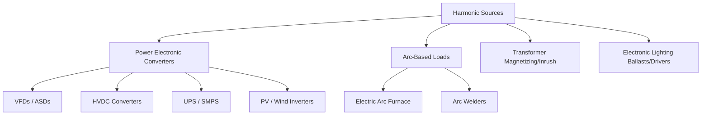
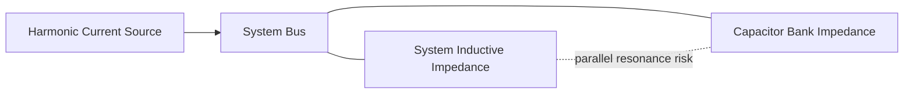

## Harmonic Sources and Harmonic Analysis

### Overview

Harmonics are sinusoidal voltage or current components at frequencies that are integer multiples of the power system's fundamental frequency (50 Hz or 60 Hz). They arise primarily from non-linear loads and devices whose current draw is not proportional to applied voltage, distorting the otherwise sinusoidal waveform. Harmonic distortion degrades power quality, causing equipment overheating, malfunction of sensitive electronics, capacitor bank failures, protective relay misoperation, and increased system losses.

Harmonic analysis is the set of measurement, calculation, and simulation techniques used to characterize, quantify, and mitigate these distortions.

### Fundamental Concepts

Any periodic, non-sinusoidal waveform can be decomposed via Fourier analysis into a fundamental component plus a series of harmonic components:

$$f(t) = A_0 + \sum_{n=1}^{\infty} A_n \sin(n\omega t + \phi_n)$$

Where:

- $n$ = harmonic order (1 = fundamental, 2 = second harmonic, etc.)
- $A_n$ = magnitude of the $n$-th harmonic
- $\omega$ = fundamental angular frequency ($2\pi f_0$)
- $\phi_n$ = phase angle of the $n$-th harmonic

**Total Harmonic Distortion (THD)** quantifies overall distortion relative to the fundamental:

$$THD_V = \frac{\sqrt{\sum_{n=2}^{\infty} V_n^2}}{V_1} \times 100\%$$

$$THD_I = \frac{\sqrt{\sum_{n=2}^{\infty} I_n^2}}{I_1} \times 100\%$$

**Total Demand Distortion (TDD)**, used in IEEE 519, normalizes current distortion to the maximum demand load current rather than the instantaneous fundamental, avoiding artificially inflated THD readings during light-load conditions:

$$TDD = \frac{\sqrt{\sum_{n=2}^{\infty} I_n^2}}{I_L} \times 100\%$$

Where $I_L$ is the maximum demand load current (typically averaged over the prior 12 months at the point of common coupling).

### Harmonic Order Classification

- **Odd harmonics** (3rd, 5th, 7th, 9th, 11th...): most common in practice, generated predominantly by symmetric non-linear loads (most power electronic converters).
- **Even harmonics** (2nd, 4th, 6th...): typically low in magnitude in balanced systems; presence often indicates waveform asymmetry (e.g., half-wave rectification, DC offset, or geomagnetically induced currents).
- **Triplen harmonics** (3rd, 9th, 15th...odd multiples of 3): of particular concern in three-phase systems because they are zero-sequence in nature and add arithmetically (rather than canceling) in the neutral conductor of a wye-connected system, potentially causing neutral conductor overheating.

$$\text{Triplen harmonic order} = 3, 9, 15, 21, ... \quad (3k \text{ where } k \text{ is odd})$$

### Common Harmonic Sources

**Power Electronic Converters**

- Variable Frequency Drives (VFDs) / Adjustable Speed Drives (ASDs): six-pulse rectifier front ends are a dominant source of 5th, 7th, 11th, 13th harmonics.
- HVDC converter stations: line-commutated converters (LCC) generate characteristic harmonics based on pulse number (e.g., 12-pulse converters generate 11th, 13th, 23rd, 25th as dominant characteristic orders).
- Uninterruptible Power Supplies (UPS) and switch-mode power supplies: widespread in commercial/IT loads, contributing significant 3rd, 5th, 7th harmonic content.
- Solar PV and wind turbine inverters: switching-frequency-related harmonics and, in poorly designed systems, some low-order harmonics; modern grid-tied inverters with high switching frequencies typically produce harmonics well above the audible range, though interharmonics and grid-side resonance interactions remain a design concern.

**Arc-Based Loads**

- Electric arc furnaces: highly non-linear, time-varying arc characteristics produce a broad harmonic spectrum plus significant interharmonics and flicker.
- Arc welding equipment: similar broadband distortion on a smaller scale.

**Transformers**

- Transformer magnetizing current under normal operation contains harmonic content (predominantly 3rd) due to the non-linear B-H (saturation) characteristic of the core.
- Transformer energization inrush current is rich in even and odd harmonics (particularly 2nd harmonic), which is specifically used by protective relays to distinguish inrush from internal faults (2nd-harmonic restraint).

**Fluorescent and LED Lighting**

- Electronic ballasts and LED drivers, especially lower-cost designs without active power factor correction, produce significant odd harmonics (3rd, 5th, 7th) due to their rectifier-capacitor input stage.

**Saturated Iron-Core Devices**

- Any device operating near or into magnetic saturation (transformers, some reactors) generates harmonics due to the non-linear flux-current relationship.

### Harmonic Analysis Techniques

**Fast Fourier Transform (FFT)**

- The standard computational method for extracting harmonic magnitude and phase from a sampled time-domain waveform.
- Requires adequate sampling rate (satisfying Nyquist criterion relative to the highest harmonic of interest) and an integer number of fundamental cycles in the sampling window to avoid spectral leakage.
- IEC 61000-4-7 specifies standard methodology for harmonic measurement, including window length (typically 10 cycles for 50 Hz systems, 12 cycles for 60 Hz systems) and grouping of harmonic/interharmonic components.

**Harmonic Load Flow Studies**

- Extension of conventional load flow analysis to multiple frequencies, solving the network at each harmonic order using frequency-dependent impedance models for lines, transformers, and loads.
- Used to predict harmonic voltage distortion at various system buses given known or assumed harmonic current injections from non-linear loads.

**Frequency Scan Analysis**

- Computes the system's driving-point impedance as a function of frequency at a point of interest, identifying parallel and series resonance points where harmonic amplification could occur.
- Particularly important when capacitor banks are present, since capacitor-system inductance combinations create parallel resonance points that can dramatically amplify specific harmonic orders.

$$f_{resonance} = f_0 \sqrt{\frac{MVA_{sc}}{MVAR_{cap}}}$$

Where $MVA_{sc}$ is the system short-circuit MVA at the point of connection and $MVAR_{cap}$ is the capacitor bank rating — this estimates the parallel resonant harmonic order between system inductance and an installed capacitor bank.

**Time-Domain Simulation**

- Electromagnetic Transients Program (EMTP)-type simulation, capturing non-linear device behavior directly in the time domain, useful for transient harmonic phenomena, converter switching harmonics, and cases where frequency-domain linearization is inadequate (e.g., highly non-linear or time-varying loads like arc furnaces).

**Field Measurement**

- Power quality analyzers (compliant with IEC 61000-4-30 Class A/S/B accuracy classes) capture real voltage/current waveforms at points of interest, providing empirical THD, TDD, and individual harmonic magnitude data for comparison against standards and simulation results.

### Resonance Phenomena

**Parallel Resonance**

- Occurs when system inductive reactance and a capacitor bank's capacitive reactance are equal in magnitude at a specific frequency, presenting very high impedance to harmonic currents at that frequency injected from elsewhere in the system.
- Even a small harmonic current injection near the resonant frequency can produce large voltage distortion — the most common mechanism by which capacitor bank installation triggers unexpected harmonic problems.

**Series Resonance**

- Occurs when a capacitor bank is in series with system inductance from the perspective of a harmonic source, presenting very low impedance at the resonant frequency and potentially drawing large harmonic currents through the capacitor bank, risking overload/failure.

### Effects of Harmonics

- **Transformers**: increased eddy current and hysteresis losses, additional heating (quantified via K-factor rated transformers designed for harmonic-rich loads).
- **Capacitor banks**: increased dielectric stress and heating; capacitors present decreasing impedance at higher frequencies ($X_C = 1/(2\pi f C)$), making them prone to overload from harmonic currents; risk of resonance amplification as noted above.
- **Rotating machines**: additional heating from harmonic-induced eddy currents in rotor; negative-sequence harmonics (5th, 11th...) produce torque pulsations and counter-rotating fields that increase losses and mechanical stress.
- **Protective relays and metering**: possible misoperation or measurement error if relay/meter design does not adequately filter or account for harmonic content.
- **Neutral conductors**: triplen harmonic current addition in wye systems can overload neutral conductors sized only for expected fundamental imbalance current.
- **Communication interference**: harmonic currents in power conductors can induce noise in adjacent communication circuits (telephone influence factor, TIF).

### Relevant Standards

| Standard | Scope |
| --- | --- |
| IEEE 519 | Recommended practice for harmonic control in electric power systems; defines voltage and current distortion limits at the Point of Common Coupling (PCC) based on system voltage level and short-circuit ratio |
| IEC 61000-3-2 / -3-12 | Limits for harmonic current emissions from individual equipment (low-voltage, low/higher current equipment) |
| IEC 61000-4-7 | Measurement methodology for harmonics and interharmonics |
| IEC 61000-4-30 | Power quality measurement methods and instrument accuracy classes |

[Inference] Specific numerical limits within these standards (e.g., IEEE 519 THD/TDD tables) are periodically revised between standard editions; current applicable limits should always be verified against the latest published edition rather than assumed from general familiarity.

### Worked Example: Parallel Resonance Risk Check

**Scenario**: A distribution substation has a short-circuit capacity of 300 MVA at the point of interest. A 10 MVAR capacitor bank is proposed for power factor correction on a 60 Hz system with significant 5th and 7th harmonic current injection from nearby VFD loads.

$$f_{resonance} = f_0 \sqrt{\frac{MVA_{sc}}{MVAR_{cap}}} = 60 \times \sqrt{\frac{300}{10}} = 60 \times \sqrt{30} \approx 60 \times 5.48 \approx 328.6\ \text{Hz}$$

Expressed as a harmonic order relative to 60 Hz fundamental:

$$h_{resonance} = \frac{328.6}{60} \approx 5.48$$

**Key Points**

- The calculated resonant point (~5.48th harmonic) falls dangerously close to the 5th harmonic, a dominant characteristic harmonic from six-pulse VFD loads — indicating significant risk of harmonic amplification if this capacitor bank is installed without a detuning reactor.
- **Mitigation**: install the capacitor bank as a detuned filter (capacitor in series with a small reactor tuned below the lowest problematic harmonic, e.g., tuned to the 4.7th order) to shift the resonant point safely away from characteristic harmonics, or add tuned harmonic filters (5th, 7th) instead of a plain capacitor bank.

### Mitigation Techniques

- **Passive harmonic filters**: series LC branches tuned to specific harmonic orders, providing a low-impedance path to shunt harmonic current away from the system while also supplying reactive power/power factor correction.
- **Detuned reactors**: reactors added in series with capacitor banks specifically to shift resonance below the lowest significant harmonic, protecting the bank without necessarily eliminating harmonic content.
- **Active harmonic filters (AHF)**: power-electronic-based devices that actively inject compensating currents in real time to cancel measured harmonic distortion, effective across a broad and adaptable range of harmonic orders.
- **Multi-pulse converter designs**: 12-pulse, 18-pulse, or higher-pulse rectifier configurations (via phase-shifting transformers) cancel specific lower-order characteristic harmonics inherently, reducing the need for external filtering.
- **Line reactors / DC link chokes**: added at VFD input/output to reduce harmonic current magnitude at the source.

**Related Topics**

- IEEE 519 harmonic limits and compliance assessment
- Detuned and tuned harmonic filter design
- Active harmonic filter (AHF) technology
- K-factor transformer design for non-linear loads
- Power quality monitoring and IEC 61000-4-30 measurement classes
- Flicker (voltage fluctuation) analysis and mitigation
- Interharmonics and their sources
- HVDC converter harmonic performance and filtering