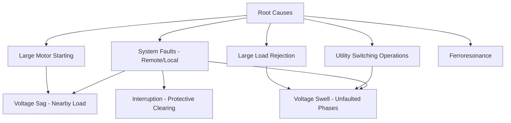
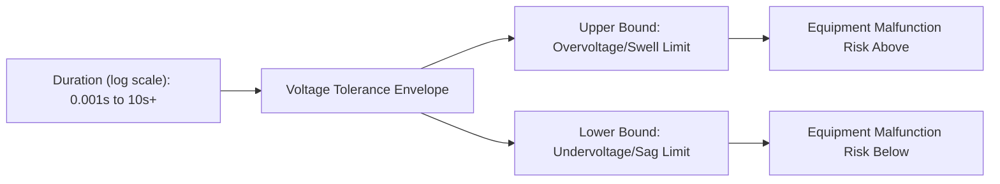
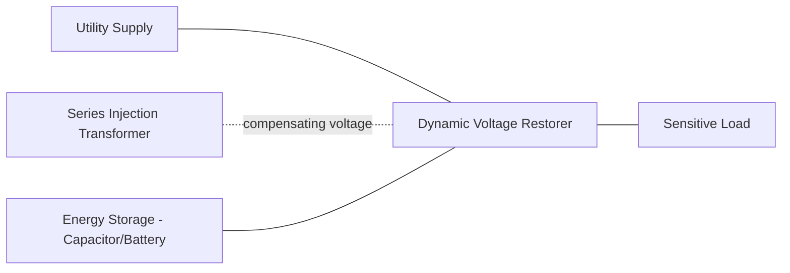

## Voltage Sags, Swells, and Interruptions

### Overview

Voltage sags, swells, and interruptions are short-duration RMS voltage variation events — among the most common and economically significant power quality disturbances affecting industrial and commercial customers. Unlike harmonics (steady-state waveform distortion) or transients (sub-cycle high-frequency events), these are characterized by a change in RMS voltage magnitude sustained over a duration ranging from half a cycle to one minute, per standard power quality classification (IEEE 1159).

### Classification and Definitions

Per IEEE 1159 terminology, short-duration RMS variations are categorized by both magnitude and duration:

| Category | Duration | Voltage Magnitude |
| --- | --- | --- |
| Instantaneous sag | 0.5–30 cycles | 0.1–0.9 pu |
| Instantaneous swell | 0.5–30 cycles | 1.1–1.8 pu |
| Momentary interruption | 0.5 cycles–3 s | <0.1 pu |
| Momentary sag | 30 cycles–3 s | 0.1–0.9 pu |
| Momentary swell | 30 cycles–3 s | 1.1–1.4 pu |
| Temporary interruption | 3 s–1 min | <0.1 pu |
| Temporary sag | 3 s–1 min | 0.1–0.9 pu |
| Temporary swell | 3 s–1 min | 1.1–1.2 pu |
| Sustained interruption | >1 min | 0.0 pu |

**Voltage Sag (Dip)**: a decrease in RMS voltage to between 0.1 and 0.9 pu of nominal for a duration of 0.5 cycles to 1 minute.

**Voltage Swell**: an increase in RMS voltage above 1.1 pu of nominal for the same duration range.

**Interruption**: a reduction in voltage to less than 0.1 pu, further divided into momentary, temporary, and sustained categories based on duration; sustained interruptions (>1 minute) are generally treated as outages rather than power quality events per se, and tracked via separate reliability indices (SAIDI, SAIFI).

[Inference] Exact numerical boundaries and category names shown above follow IEEE 1159 as commonly cited; some regional standards (e.g., IEC 61000-4-11, EN 50160) define overlapping but not identical thresholds and terminology, so the applicable standard should be confirmed for any compliance-related work.

### Causes

**Voltage Sags**

- **Remote faults**: the dominant cause in transmission and distribution systems — a short circuit elsewhere on the network causes a temporary voltage depression at other buses until protective devices clear the fault; sag depth and duration depend on electrical distance from the fault and fault-clearing time.
- **Motor starting**: large induction motor starting draws high inrush current (typically 6–8 times full-load current), causing a local voltage sag until the motor accelerates.
- **Transformer energization**: inrush current during transformer switching can cause a brief local sag.
- **Utility switching operations**: capacitor bank or line switching can produce transient sags in some configurations.

**Voltage Swells**

- **Single-line-to-ground faults on ungrounded or high-impedance grounded systems**: the unfaulted phases can experience a voltage rise during the fault.
- **Sudden large load rejection**: abrupt disconnection of a large load can cause temporary overvoltage on the remaining system, particularly if voltage regulation response is slow relative to the load change.
- **Capacitor bank switching**: energizing a large capacitor bank can produce a swell, especially on lightly loaded feeders.
- **Ferroresonance**: nonlinear interaction between system capacitance and transformer/reactor inductance, occasionally producing sustained overvoltage conditions under specific switching configurations.

**Interruptions**

- **Protective device operation**: breaker or recloser operation isolating a faulted section (momentary if auto-reclosing succeeds, sustained if it does not).
- **Equipment failure**: transformer, cable, or line component failure requiring manual restoration.
- **Planned maintenance switching**.

### Voltage Sag Magnitude Estimation (Fault-Induced)

For a remote fault, the sag magnitude experienced at a given bus can be estimated using a voltage divider model based on system impedances:

$$V_{sag} = \frac{Z_F}{Z_S + Z_F} \times V_{prefault}$$

Where:

- $Z_S$ = source impedance between the monitored bus and the fault
- $Z_F$ = impedance from the fault point back to the source (representing the "distance" of the fault from the observation point in impedance terms)

This simplified model illustrates the key principle: sags are deeper for faults electrically closer to the observation point, and shallower for more remote faults — with the "area of vulnerability" for a given equipment sag-ride-through threshold definable through this relationship combined with system fault statistics.

### The ITIC/CBEMA Curve

Equipment sensitivity to voltage sags and swells is commonly assessed against the **Information Technology Industry Council (ITIC) curve** (successor to the earlier CBEMA curve), which defines a voltage-duration envelope within which typical information technology equipment is expected to operate without malfunction.

- The curve plots acceptable voltage (as % of nominal) against event duration (on a logarithmic time axis).
- Voltage excursions above the upper curve (prolonged overvoltage) or below the lower curve (prolonged undervoltage or sag) fall into a region where equipment malfunction becomes likely.
- Momentary sags to zero voltage lasting less than approximately 20 ms (per common ITIC curve depictions) are generally tolerated by compliant equipment; deeper or longer events are not.

[Inference] The ITIC curve represents a general industry reference for typical single-phase computer/electronic equipment; actual equipment sensitivity varies significantly by manufacturer, power supply design, and equipment type, and should not be treated as a guarantee of ride-through performance for any specific device.

### Sag Characterization Parameters

Beyond magnitude and duration, a complete sag characterization for analysis and equipment compatibility studies includes:

- **Point-on-wave of initiation**: the phase angle at which the sag begins, affecting how equipment with capacitive input filtering (most electronic power supplies) responds.
- **Phase involvement**: single-phase, two-phase, or three-phase sags behave differently and affect three-phase equipment (e.g., ASDs, three-phase rectifiers) differently depending on how the sag propagates through delta-wye transformer connections (phase-angle jumps and magnitude changes differ by sag "type," per the widely used ABCDEFG sag classification developed by Bollen).
- **Phase-angle jump**: an associated shift in voltage phase angle accompanying many fault-induced sags, which can affect synchronization-sensitive equipment (e.g., ASD control, some UPS designs) independent of magnitude alone.
- **Point-on-wave of recovery**: affects post-sag transient behavior in some equipment.

### Impact on Industrial and Sensitive Equipment

| Equipment Type | Typical Sensitivity |
| --- | --- |
| Adjustable Speed Drives (ASDs/VFDs) | Often trip on sags below ~80–90% for even a few cycles due to DC bus undervoltage protection; [Inference] exact trip thresholds are highly manufacturer- and model-specific |
| PLCs and industrial controllers | Variable; often sensitive to sags below ~70–80% lasting more than 1–2 cycles |
| Contactors and relays | May drop out during sags below approximately 50–70% of pickup voltage, depending on coil design and mechanical inertia |
| Computer/IT equipment (with SMPS) | Generally more tolerant per ITIC curve, though DC-link capacitor sizing varies by design |
| Sensitive process equipment (semiconductor fabrication, etc.) | Can be extremely sensitive, with even brief sags causing costly process interruptions |

### Mitigation Techniques

**Utility-Side Mitigation**

- Fast-clearing protection schemes to minimize fault duration and hence sag duration.
- Current-limiting reactors or fuses to reduce fault current magnitude and associated sag depth.
- Distribution system design changes (e.g., reducing exposure by segmenting feeders, undergrounding exposed overhead sections in high-lightning areas).

**Customer-Side Mitigation**

- **Uninterruptible Power Supplies (UPS)**: provide ride-through for sags and interruptions via battery or flywheel energy storage, commonly used for critical IT and control loads.
- **Dynamic Voltage Restorers (DVR)**: a series-connected power-electronic device that injects a compensating voltage in series with the incoming supply to correct for sags in real time, protecting downstream sensitive loads without the energy storage requirements of a full UPS for the protected load's total power.
- **Constant Voltage Transformers (CVT) / Ferroresonant transformers**: passive devices providing some inherent sag ride-through via magnetic saturation characteristics, though generally limited to lower power ratings and shallower/shorter sags.
- **Motor-generator sets with flywheel storage**: mechanical energy storage providing ride-through for larger loads.
- **Equipment specification and immunity testing**: specifying equipment tested to relevant immunity standards (e.g., IEC 61000-4-11 or -4-34 for voltage dip immunity testing) during procurement.
- **Process control strategies**: some industrial processes (e.g., ASD control logic) can be configured with "ride-through" kinetic-energy-recovery modes (using motor inertia to sustain DC bus voltage briefly) rather than requiring immediate trip on sag detection.

### Worked Example: Sag Ride-Through Assessment

**Scenario**: A facility's ASD fleet trips whenever supply voltage drops below 85% for more than 4 cycles. Utility fault records over the past year show 12 events causing sags at the facility's service point, with characteristics:

| Event Type | Depth | Duration | Frequency/Year |
| --- | --- | --- | --- |
| Remote transmission fault | 70% remaining | 5 cycles | 3 |
| Adjacent feeder fault | 60% remaining | 8 cycles | 4 |
| Same-feeder fault (upstream) | 40% remaining | 6 cycles | 2 |
| Distant fault (light sag) | 92% remaining | 3 cycles | 3 |

**Analysis**: Comparing against the 85%/4-cycle trip threshold:

- The "distant fault" events (92% remaining, 3 cycles) fall within tolerance — no trip expected.
- All other event types (70%, 60%, 40% remaining, each exceeding 4 cycles) fall below the threshold — the ASD fleet would be expected to trip for approximately 9 of the 12 recorded annual events.

**Key Points**

- This indicates the facility experiences process-disrupting sag events roughly 9 times per year based on historical fault statistics — providing the quantitative basis for a mitigation investment decision (e.g., DVR installation or ASD ride-through reconfiguration).
- [Inference] Actual future event frequency and characteristics depend on evolving system conditions (upstream protection changes, new interconnections, vegetation/weather patterns) and historical data should be treated as indicative rather than strictly predictive.

### Relevant Standards

| Standard | Scope |
| --- | --- |
| IEEE 1159 | Recommended practice for monitoring and classifying power quality events, including sag/swell/interruption terminology used above |
| IEC 61000-4-11 / -4-34 | Voltage dip and interruption immunity testing for equipment (low current / high current respectively) |
| EN 50160 | Voltage characteristics of electricity supplied by public distribution networks (European context) |
| SEMI F47 | Voltage sag immunity standard specifically for semiconductor processing equipment |

**Related Topics**

- Dynamic Voltage Restorer (DVR) design and control
- Uninterruptible Power Supply (UPS) topologies (online, line-interactive, standby)
- Voltage sag propagation through transformer connections (ABCDEFG classification)
- Reliability indices: SAIDI, SAIFI, MAIFI
- Ferroresonance mechanisms and mitigation
- Adjustable Speed Drive ride-through control strategies
- Power quality monitoring per IEEE 1159 and IEC 61000-4-30
- Fault current calculation and protection coordination