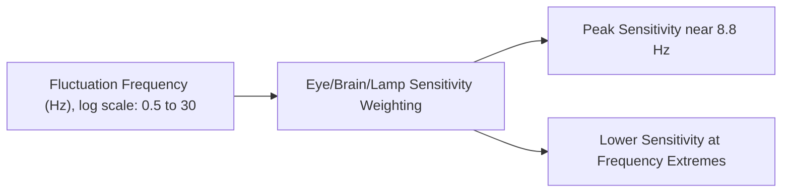
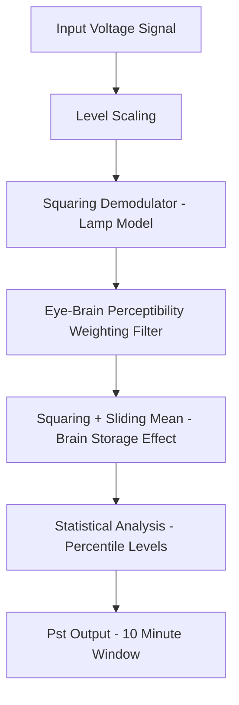
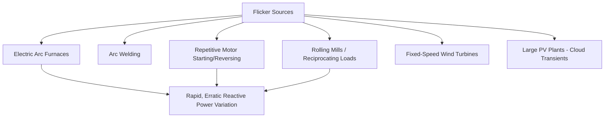
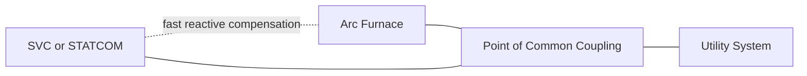

## Voltage Flicker and Its Sources

### Overview

Voltage flicker refers to rapid, repetitive fluctuations in RMS voltage magnitude, typically in the range of small percentages (often <5%), occurring at frequencies roughly between 0.5 Hz and 30 Hz. Unlike sags/swells (discrete, isolated events) or harmonics (steady-state waveform distortion), flicker is characterized by its cyclic, often continuous nature and is defined primarily by its effect on human perception — specifically, the visible fluctuation of light output from incandescent and other lamps, which the human eye is especially sensitive to detecting within certain frequency ranges.

Flicker is fundamentally a human-factors-driven power quality phenomenon: the underlying voltage fluctuation might be electrically modest, but because the human visual system has heightened sensitivity to light-intensity modulation around 8–10 Hz, even small voltage variations at these frequencies can produce noticeable, irritating lamp flicker.

### Physical Basis and the Flicker Sensitivity Curve

The human eye's sensitivity to periodic light fluctuation is not uniform across frequency. Empirical studies (originally by IEC working groups, standardized as the basis for flickermeter design) show peak sensitivity to voltage fluctuations occurring around 8.8 Hz for repetitive rectangular voltage changes, with sensitivity dropping off at both lower and higher fluctuation frequencies.

This frequency-dependent sensitivity is why flicker severity cannot be assessed by voltage fluctuation magnitude alone — a given percentage voltage change is far more perceptible (and irritating) at ~8–10 Hz than at 0.5 Hz or 25 Hz.

### Quantification: Pst and Plt Indices

Flicker severity is standardized (IEC 61000-4-15) using the **flickermeter** methodology, producing two key indices:

**Short-Term Flicker Severity ($P_{st}$)**

- Computed over a 10-minute measurement window.
- Derived from a statistical analysis of the flickermeter's output signal, incorporating the eye/brain/lamp perceptibility weighting curve described above.
- A $P_{st} = 1.0$ represents the conventional threshold of irritability for 50% of observers under the reference conditions used to develop the standard.

**Long-Term Flicker Severity ($P_{lt}$)**

- Aggregates twelve consecutive $P_{st}$ values (spanning 2 hours) using a cubic mean:

$$P_{lt} = \sqrt[3]{\frac{1}{12}\sum_{i=1}^{12} P_{st,i}^3}$$

- Used to assess flicker severity from loads with cyclic but not perfectly steady operating patterns (e.g., varying industrial process cycles) over a longer observation window.

**IEC Flickermeter Signal Processing Stages** (IEC 61000-4-15):

1. Input voltage scaling to a common reference level.
2. Squaring demodulator (simulates the lamp's response — light output is roughly proportional to voltage squared for incandescent lamps).
3. Weighting filters replicating the eye-brain perceptibility response and the lamp flicker response.
4. Squaring and sliding-mean (simulates the brain's non-linear "storage effect" perception of flicker).
5. Statistical (percentile-based) analysis over the measurement window to compute $P_{st}$.

### Common Sources of Voltage Flicker

**Electric Arc Furnaces (EAF)**

- The single most widely cited industrial flicker source, due to the highly erratic, non-linear arc impedance during melting, particularly in the initial "boring" phase when scrap is being melted and arc stability is poorest.
- Arc current fluctuations translate directly into rapidly varying reactive (and to a lesser extent, real) power demand, producing voltage fluctuation at the point of common coupling proportional to the system's short-circuit impedance.

**Arc Welding Equipment**

- Similar mechanism to EAFs on a much smaller scale; can still produce locally significant flicker, particularly on weak distribution feeders.

**Large Motor Starting (Repetitive)**

- Equipment with frequent start/stop or reversing cycles (e.g., certain reciprocating compressors, punch presses, crushers, saw mills, some elevator/hoist applications) can produce cyclic voltage dips synchronized with the mechanical duty cycle, falling within the flicker-sensitive frequency range if the cycle rate is high enough.

**Rolling Mills and Reciprocating Loads**

- Rolling mill motor loads with cyclic torque demand, and other reciprocating industrial machinery, produce periodic current draw variation.

**Wind Turbines**

- Certain wind turbine types, particularly fixed-speed induction generator designs, can produce flicker due to wind speed variation, tower shadow effect, and switching operations (especially at cut-in); continuous "flicker during continuous operation" is a recognized assessment category in wind turbine grid connection standards (IEC 61400-21).
- [Inference] Modern variable-speed, power-electronic-interfaced wind turbines generally exhibit substantially reduced flicker emission compared to older fixed-speed designs, though specific performance depends on turbine control design and is typically documented via manufacturer type-testing per IEC 61400-21.

**Solar PV Systems**

- Generally low flicker contributors under steady irradiance; however, rapidly passing cloud cover can produce output fluctuations that, in aggregate across a large plant or in combination with local grid weakness, may contribute to voltage fluctuation — though typically at frequencies and characteristics distinct from classic EAF-type flicker.

**X-Ray and Medical Imaging Equipment**

- Certain high-power pulsed loads (e.g., some medical imaging systems) can produce brief but significant flicker-frequency voltage events due to rapid load steps.

### Relationship Between Source Characteristics and Flicker Severity

The severity of flicker at a given bus depends on both the load's electrical behavior and the strength of the supply system:

$$\Delta V \approx \frac{\Delta Q}{S_{sc}}$$

Where $\Delta Q$ is the fluctuating reactive power demand of the load and $S_{sc}$ is the system short-circuit capacity at the point of common coupling. This relationship explains why:

- The same fluctuating load produces markedly worse flicker on a weak (low short-circuit capacity) system than on a strong one.
- Utilities commonly specify a minimum **short-circuit ratio** (system $S_{sc}$ relative to the fluctuating load's rated capacity) as a connection requirement for known flicker-producing loads such as arc furnaces.

**Worked Example**: An arc furnace with a reactive power fluctuation of $\Delta Q = 15$ MVAR is proposed for connection to a substation with system short-circuit capacity $S_{sc} = 500$ MVA.

$$\Delta V \approx \frac{15}{500} = 0.03 = 3\%$$

A 3% voltage fluctuation, if occurring at frequencies near the 8.8 Hz sensitivity peak, would likely produce a $P_{st}$ well above the typical 1.0 planning threshold, indicating a high probability of customer complaints without mitigation.

**Key Points**

- This simplified $\Delta V \approx \Delta Q / S_{sc}$ relationship is commonly used for preliminary screening; final connection assessments typically require full flickermeter simulation or field measurement against the actual fluctuation waveform shape, not just its magnitude. [Inference] The approximation's accuracy depends on system X/R ratio and the fluctuation's actual frequency spectrum, which a simple ratio calculation does not fully capture.

### Mitigation Techniques

**Fast-Responding Reactive Compensation**

- **Static VAR Compensators (SVC)**: widely used at arc furnace installations specifically to counteract the rapid reactive power fluctuation, since SVC response time (1–2 cycles) is fast enough to track much of the flicker-frequency variation.
- **STATCOMs**: offer even faster response and are increasingly used for demanding flicker mitigation applications, particularly where voltage support during simultaneous sag conditions is also required.

**System Strengthening**

- Connecting the flicker-producing load to a point of higher short-circuit capacity (stronger bus), or upgrading transformer/line capacity to reduce effective source impedance.
- Dedicating a separate feeder or transformer to the fluctuating load to isolate its effect from other customers.

**Series Reactance / Current Limiting**

- In some arc furnace applications, a series reactor is intentionally added to stabilize arc characteristics (paradoxically improving flicker by smoothing arc current variation, at some cost to furnace electrical efficiency) — a furnace-side mitigation approach distinct from compensations at the point of common coupling.

**Process-Based Mitigation**

- Operational changes to reduce the rate or magnitude of reactive power fluctuation (e.g., furnace electrode control tuning, foamy slag practice in EAF operation to stabilize the arc).

### Standards and Planning Levels

| Standard | Scope |
| --- | --- |
| IEC 61000-4-15 | Flickermeter functional and design specification |
| IEC 61000-3-3 / -3-11 | Flicker emission limits for equipment connected to low-voltage public networks |
| IEC 61000-3-7 | Assessment guidelines for flicker emission from fluctuating loads connected to MV/HV systems |
| IEEE 1453 | North American adoption/adaptation of IEC flicker measurement practice |
| IEC 61400-21 | Wind turbine flicker measurement and reporting (continuous operation and switching operations) |

Typical planning levels commonly referenced [Inference — specific values should be confirmed against the applicable local grid code or standard edition] target $P_{st} \leq 1.0$ and $P_{lt} \leq 0.8$ at the point of connection for MV systems, with more stringent (lower) allocated limits for individual customers when multiple fluctuating loads share a common connection point, apportioned via summation rules in IEC 61000-3-7.

**Related Topics**

- Static VAR Compensator (SVC) and STATCOM applications for flicker mitigation
- IEC 61000-4-15 flickermeter design and signal processing
- Electric arc furnace electrical characteristics and control
- Short-circuit ratio and system strength assessment for load interconnection
- Wind turbine grid connection standards (IEC 61400-21)
- Harmonic distortion (related but distinct power quality phenomenon)
- Power quality monitoring and field measurement practices
- Reactive power compensation technology comparison (SVC vs. STATCOM vs. mechanically switched capacitors)