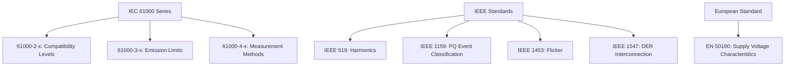
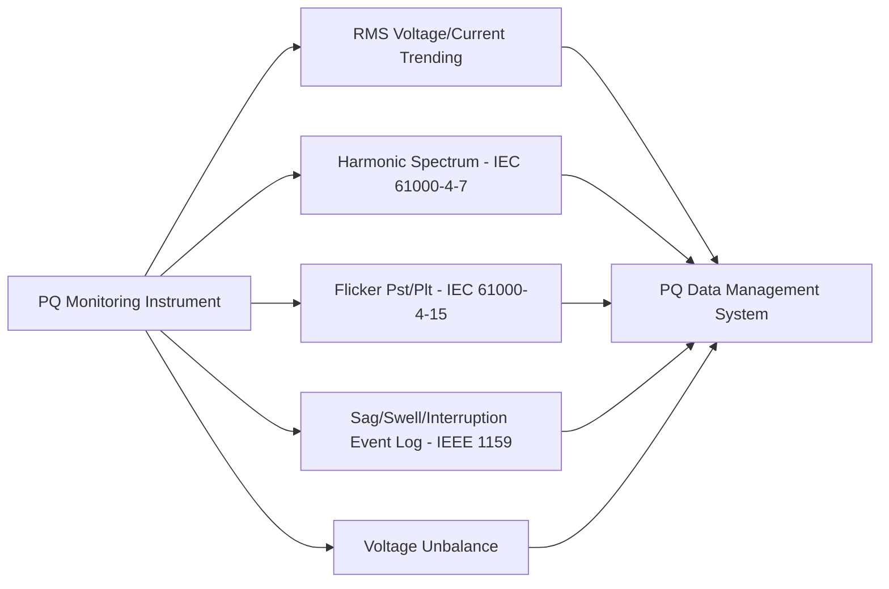

## Power Quality Standards and Monitoring

### Overview

Power Quality (PQ) standards and monitoring encompass the codified technical requirements defining acceptable electrical supply characteristics, together with the measurement instrumentation, methodologies, and data-management practices used to verify compliance and diagnose disturbances. This domain integrates the individually studied phenomena — harmonics, flicker, sags/swells/interruptions, unbalance, transients — into a unified compliance and monitoring framework used by utilities, regulators, and end customers.

### Purpose of Power Quality Standards

- **Define acceptable limits** for voltage/current disturbance categories at defined measurement points (commonly the Point of Common Coupling, PCC).
- **Establish responsibility boundaries** between utility supply quality obligations and customer equipment emission limits, preventing disputes over which party is accountable for a given disturbance.
- **Standardize measurement methodology** so that PQ data from different instruments, vendors, and jurisdictions is comparable and technically defensible.
- **Support contractual and regulatory compliance**, including interconnection agreements for generation (including renewables) and industrial loads.

### Major International and Regional Standards Landscape

**IEC 61000 Series (Electromagnetic Compatibility)**

The IEC 61000 series is the most comprehensive international framework, organized into parts addressing different aspects:

- **IEC 61000-2-x**: Environment — describes compatibility levels for various disturbance types in public supply networks.
- **IEC 61000-3-x**: Limits — emission limits for equipment (e.g., 61000-3-2 for harmonic current emissions ≤16A per phase, 61000-3-3/-3-11 for voltage fluctuation/flicker, 61000-3-7/-3-12 for MV/HV connection assessment of larger loads).
- **IEC 61000-4-x**: Testing and measurement techniques — defines instrumentation methodology (61000-4-7 harmonics, 61000-4-15 flicker, 61000-4-30 general PQ measurement, 61000-4-11/-4-34 dip/interruption immunity testing).

**IEEE Standards (North American Practice)**

- **IEEE 519**: Recommended practice for harmonic control, defining voltage and current distortion limits at the PCC based on system voltage class and, for current limits, the ratio of available short-circuit current to maximum load current ($I_{sc}/I_L$).
- **IEEE 1159**: Recommended practice for monitoring electric power quality, providing the standard terminology and categorization for PQ events (sags, swells, interruptions, transients, etc.) referenced across the broader PQ field.
- **IEEE 1453**: Adoption/adaptation of IEC flicker measurement methodology for North American application.
- **IEEE 1547**: Standard for interconnecting distributed energy resources with electric power systems, including PQ-related requirements (voltage regulation, harmonic injection limits, flicker) for DER interconnection.

**European Standard**

- **EN 50160**: Defines voltage characteristics (magnitude, frequency, harmonics, flicker, unbalance, sags/interruptions) that customers connected to public distribution networks in Europe can expect under normal operating conditions — notably a supply characteristic standard rather than an equipment emission standard.

### IEEE 519: Harmonic Limit Structure

IEEE 519 establishes two complementary limit sets applied at the PCC:

**Voltage Distortion Limits** — the utility's responsibility, based on bus voltage level:

| Bus Voltage | Individual Harmonic (%) | THD (%) |
| --- | --- | --- |
| ≤1 kV | 5.0 | 8.0 |
| 1 kV–69 kV | 3.0 | 5.0 |
| 69 kV–161 kV | 1.5 | 2.5 |
| >161 kV | 1.0 | 1.5 |

**Current Distortion Limits** — the customer's responsibility, based on the short-circuit ratio $I_{sc}/I_L$ at the PCC (higher ratios, indicating a stronger system relative to the customer's load, permit higher relative distortion). Limits are expressed as Total Demand Distortion (TDD), scaled to the customer's maximum demand load current rather than instantaneous fundamental current.

[Inference] The specific numerical tables above reflect the commonly cited IEEE 519-2014 revision structure; because standards are periodically revised, the current governing edition and its exact table values should always be verified directly rather than assumed from general recollection, especially for compliance-critical work.

### Power Quality Monitoring: Objectives

- **Compliance verification**: confirming adherence to applicable standards/contracts at defined measurement points.
- **Disturbance diagnosis**: identifying the source, propagation path, and root cause of reported PQ problems (equipment malfunction, nuisance tripping, etc.).
- **Baseline characterization**: establishing normal supply conditions before connecting a new potentially disruptive load or generation source.
- **Trending and asset management**: detecting gradual degradation (e.g., rising harmonic levels from accumulating non-linear loads, or deteriorating capacitor bank/filter performance) before it causes failures.
- **Post-event forensic analysis**: correlating PQ event records with operational data (SCADA, protection relay records) to determine cause and responsibility following equipment damage or process disruption claims.

### Monitoring Instrumentation and Methodology

**Power Quality Analyzers / Recorders**

- Measure voltage and current waveforms continuously or on trigger, computing RMS values, harmonic spectra, flicker indices, and event records per relevant IEC/IEEE methodology.
- **IEC 61000-4-30 accuracy classes**:
  - **Class A**: highest accuracy, used for contractual/compliance verification and dispute resolution; specifies precise algorithms, timing synchronization, and aggregation methods so that instruments from different manufacturers produce comparable results.
  - **Class S**: intermediate accuracy, suitable for statistical surveys.
  - **Class B**: legacy/lower-precision class retained for compatibility with older instrumentation practice (largely superseded in current editions).

**Measurement Aggregation Intervals**

- Fundamental measurements are typically aggregated over standardized intervals: very short (3-second, aligned with flicker $P_{st}$ sub-intervals), short (10-minute), and long (2-hour, for $P_{lt}$) periods, enabling standardized statistical reporting (e.g., 95th and 99th percentile values over a monitoring period, commonly referenced in EN 50160 compliance assessment).

**Phasor Measurement Units (PMUs)**

- While primarily deployed for wide-area system stability monitoring, PMUs' high-resolution synchronized phasor data increasingly supplements traditional PQ monitoring, particularly for capturing fast events and cross-site disturbance propagation analysis. [Inference] PMU-based PQ analysis is an evolving application area, and formal PQ compliance reporting still predominantly relies on dedicated IEC 61000-4-30 Class A instrumentation.

**Permanent vs. Portable Monitoring**

- **Permanent monitoring**: installed at substations, PCCs of large customers, or key feeder locations for continuous compliance tracking and early problem detection.
- **Portable/temporary monitoring**: deployed for specific investigations (e.g., diagnosing a customer complaint, pre-connection baseline study for a new large load).

### PQ Data Management and Reporting Systems

- Centralized PQ monitoring networks aggregate data from distributed monitors across a utility's system, often integrated with or adjacent to SCADA/EMS infrastructure.
- Modern systems typically provide automated compliance reporting against configured standard thresholds, alarm generation for threshold exceedance, and event correlation tools linking PQ disturbances to specific system events (fault locations, switching operations).
- Data retention and reporting periods (e.g., EN 50160's 95th/99th percentile weekly assessment windows) are defined by the applicable standard and often codified in interconnection or supply contracts.

### Worked Example: Compliance Assessment Workflow

**Scenario**: A utility receives a complaint from an industrial customer about nuisance ASD tripping. A Class A power quality analyzer is installed at the customer's PCC for a two-week monitoring period per IEEE 1159 event classification methodology.

**Findings** (illustrative):

- 6 recorded sag events below 90% lasting 4–10 cycles, correlating in time with recloser operations on an adjacent feeder per utility SCADA records.
- Steady-state voltage THD measured at 3.8%, within the ≤5% IEEE 519 limit for the customer's voltage class.
- Current TDD from the customer's own VFD fleet measured at 12%, compared to an applicable IEEE 519 limit of 8% for the customer's $I_{sc}/I_L$ ratio.

**Key Points**

- The sag events are attributable to the utility's adjacent-feeder protection scheme rather than the customer's internal equipment — supporting a mitigation discussion focused on ASD ride-through capability or a DVR installation, rather than a utility supply-quality dispute.
- The customer's own current distortion (TDD) exceeds their allocated IEEE 519 limit — indicating the customer's non-linear load (VFD fleet) itself requires mitigation (e.g., harmonic filtering) independent of the sag issue, illustrating how a single monitoring campaign can reveal both utility-side and customer-side compliance items.
- [Inference] Actual determination of responsibility and required remediation in a real dispute would typically also involve contractual interconnection terms and may require additional monitoring to confirm findings are representative rather than anomalous.

### Regulatory and Contractual Context

- Many regulators require utilities to report PQ performance statistics (particularly sustained interruption reliability indices SAIDI/SAIFI, and increasingly voltage regulation and harmonic compliance) as part of performance-based regulation frameworks.
- Interconnection agreements for generation (especially inverter-based renewable resources) increasingly specify detailed PQ compliance requirements (harmonic injection limits, flicker limits, voltage ride-through profiles) verified through pre-commissioning testing and ongoing monitoring, often referencing IEEE 1547 or equivalent grid codes.
- [Inference] Specific regulatory reporting requirements vary substantially by jurisdiction and regulatory body; no single global framework governs PQ regulatory reporting.

**Related Topics**

- IEEE 519 harmonic limit compliance methodology
- IEC 61000-4-30 power quality measurement accuracy classes
- Voltage sags, swells, and interruptions (IEEE 1159 classification)
- Voltage flicker measurement (IEC 61000-4-15)
- IEEE 1547 distributed energy resource interconnection requirements
- Reliability indices: SAIDI, SAIFI, MAIFI, CAIDI
- Wide-Area Measurement Systems and PMU-based monitoring
- Harmonic sources and harmonic analysis techniques