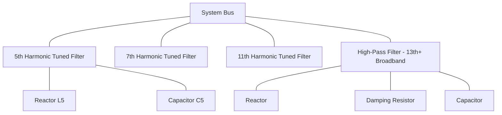
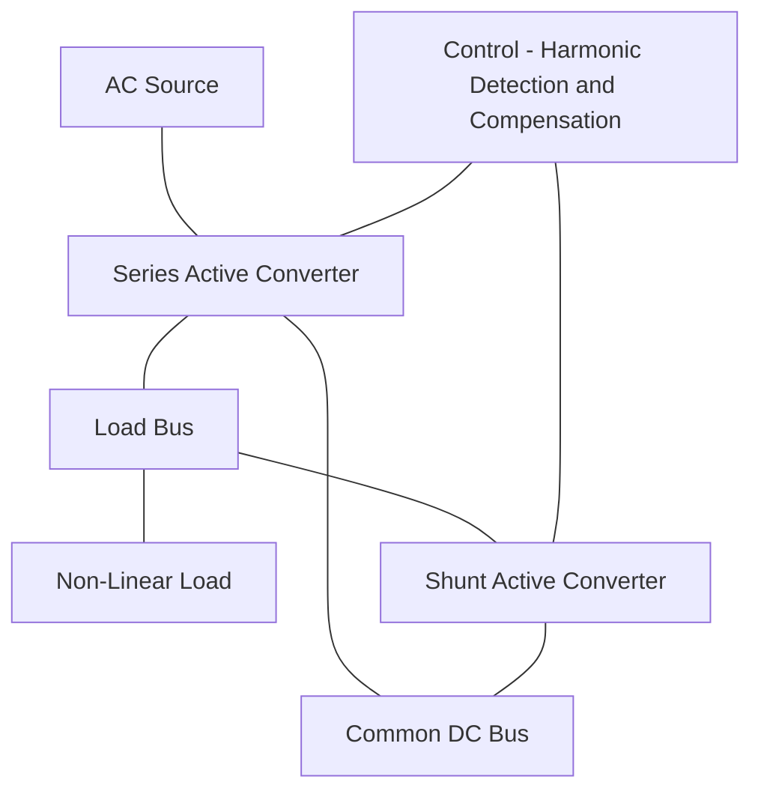
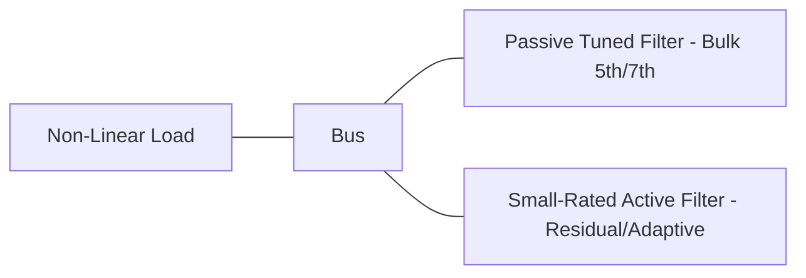

## Harmonic Filtering and Active Conditioning

### Overview

Harmonic filtering and active conditioning encompass the range of technologies used to reduce harmonic distortion in electrical power systems, spanning passive tuned filters, hybrid combinations, and fully active power-electronic-based conditioners. Selection among these approaches depends on the harmonic spectrum to be mitigated, required attenuation, reactive power compensation needs, system resonance considerations, and cost/performance tradeoffs.

### Passive Harmonic Filters

Passive filters use combinations of inductors, capacitors, and (in some designs) resistors to create low-impedance paths at targeted harmonic frequencies, diverting harmonic current away from the rest of the system while simultaneously providing reactive power (power factor correction) at fundamental frequency.

**Single-Tuned (Series LC) Filter**

- The most common passive filter type: an inductor and capacitor in series, tuned to present minimum impedance at a specific harmonic order.
- Tuning frequency:

$$f_n = \frac{1}{2\pi\sqrt{LC}}$$

- In practice, filters are tuned slightly below the exact target harmonic (e.g., a "5th harmonic filter" tuned to the 4.7th order) to account for component tolerances, temperature drift, and system frequency variation, avoiding accidental exact resonance which could cause excessive current through the filter branch.
- Multiple single-tuned filters (e.g., 5th, 7th, 11th) are often installed in parallel banks to address multiple characteristic harmonics from a known load (e.g., a six-pulse converter's dominant 5th and 7th orders).

**High-Pass Filter**

- A resistor is added in parallel with the reactor (or in a damped configuration) to provide broadband attenuation above a certain frequency, rather than a sharp single-frequency notch.
- Commonly used as the highest-order filter in a filter bank (e.g., a 2nd-order or C-type high-pass filter tuned above the 11th or 13th harmonic) to absorb higher-order and non-characteristic harmonic content that individual tuned filters would miss.

**C-Type High-Pass Filter**

- A variant designed to minimize fundamental-frequency losses in the damping resistor by adding an auxiliary capacitor in series with the resistor, tuned to bypass the resistor at fundamental frequency while still providing damping at higher frequencies — commonly used in HVDC converter station filter designs.

### Passive Filter Design Considerations

**Reactive Power Contribution**

- Since each filter branch includes a capacitor, passive filters inherently supply reactive power (leading VARs) at fundamental frequency — a design parameter that must be coordinated with the plant's overall power factor correction requirements, since over-sizing filter capacitance for harmonic purposes could lead to excessive leading power factor or overvoltage at light load.

**Detuning and Component Tolerance**

- Capacitor aging (capacitance typically decreases over time) and manufacturing tolerances shift the actual tuned frequency from the design value; filters are typically designed with margin and may require periodic verification/retuning.
- System frequency variation (small deviations from nominal 50/60 Hz) also shifts effective tuning point, generally a second-order effect compared to component tolerance.

**Resonance with the System**

- A passive filter, while providing low impedance at its tuned frequency, creates a new parallel resonance point with the system source impedance at a frequency below its tuning point. This resonance must be checked (via frequency scan analysis) to ensure it does not align with another significant harmonic order present in the system.
- Adding filters sequentially (5th, then 7th, then 11th) requires re-verifying the combined frequency response after each addition, since filters interact with each other's characteristics, not just with the underlying system impedance.

**Sizing and Rating**

- Filter components must be rated for the combination of fundamental current/voltage plus the harmonic current they are designed to absorb, plus contingency conditions (e.g., temporary overvoltage during light-load periods, or increased harmonic injection if the source load's harmonic spectrum shifts).

### Active Power Filters (APF)

Active Power Filters use power-electronic converters (typically voltage-source inverters, similar in basic topology to a STATCOM) to actively measure and inject compensating currents in real time, canceling harmonic distortion rather than diverting it through a passive impedance path.

**Shunt Active Power Filter**

- Connected in parallel at the point requiring compensation.
- Measures load current (or system voltage distortion), computes the harmonic content in real time (commonly via instantaneous reactive power theory, the "p-q theory," or synchronous reference frame methods), and injects an equal-and-opposite compensating current via a fast-switching inverter.
- Can simultaneously address harmonics, reactive power (power factor correction), and load current unbalance, depending on control design.

$$i_{compensation}(t) = -i_{harmonic}(t)$$

Such that the net current drawn from the source approaches a clean sinusoid:

$$i_{source}(t) = i_{load}(t) + i_{compensation}(t) \approx i_{fundamental}(t)$$

**Series Active Power Filter**

- Connected in series with the supply, primarily used to compensate for voltage-related disturbances (voltage harmonics, sags, unbalance) rather than load current harmonics — conceptually related to the Dynamic Voltage Restorer but often optimized specifically for continuous harmonic voltage correction rather than discrete sag events.

**Unified Power Quality Conditioner (UPQC)**

- Combines both shunt and series active filter converters on a common DC bus, providing simultaneous compensation of load current harmonics/reactive power (via the shunt converter) and supply voltage disturbances/harmonics (via the series converter) — the most comprehensive single-device active conditioning solution, at correspondingly higher cost and complexity.

### Active Filter Control: Harmonic Detection Methods

**Instantaneous Reactive Power Theory (p-q Theory)**

- Transforms three-phase voltage/current into the stationary $\alpha$-$\beta$ reference frame, computing instantaneous real power ($p$) and imaginary/reactive power ($q$); separating the oscillating (harmonic-related) components from the DC (fundamental-related) components via low-pass filtering identifies the compensation current reference.

**Synchronous Reference Frame (SRF/dq) Method**

- Transforms currents into a rotating $d$-$q$ frame synchronized to the fundamental frequency (via PLL); the fundamental component appears as a DC value in this frame, while harmonics appear as oscillating components, which are extracted via filtering and transformed back to derive the compensation reference.

**Selective Harmonic Extraction**

- Some active filter controls target specific problematic harmonic orders only (rather than full-spectrum compensation), reducing converter rating requirements when only certain harmonics need correction.

### Hybrid Filters

Hybrid filters combine passive and active elements to balance performance and cost:

**Passive + Active in Series (Hybrid Series-Shunt)**

- A passive filter handles the bulk of a dominant, well-characterized harmonic (e.g., 5th harmonic from a known six-pulse load), while an active filter of much smaller rating handles residual harmonics and adapts to load variation — significantly reducing the active filter's required current rating (and thus cost) compared to a stand-alone active filter sized for the full harmonic spectrum.

**Active Filter in Series with Passive Filter**

- A small active converter is placed in series with a passive tuned filter branch specifically to improve the filter's tuning accuracy and damping characteristic, actively adjusting the effective impedance seen by the harmonic current to maintain optimal filtering performance despite component drift or system changes.

### Comparison of Filtering Approaches

| Attribute | Passive Tuned Filter | Active Power Filter (APF) | Hybrid Filter |
| --- | --- | --- | --- |
| Targeted harmonics | Fixed, specific orders | Broad spectrum, adaptive | Bulk order (passive) + broad/adaptive (active) |
| Response to load changes | Fixed (no adaptation) | Real-time adaptive | Partially adaptive |
| Resonance risk with system | Present (requires study) | Minimal (active control) | Reduced but present at passive stage |
| Relative cost | Lower | Higher (rating scales with full harmonic current) | Moderate (active portion is smaller-rated) |
| Reactive power support | Yes, inherent | Optional, by design | Yes, from passive stage |
| Typical application scale | Large industrial loads, HVDC stations | Smaller-to-medium industrial/commercial | Large industrial with known dominant harmonic |

### Worked Example: Filter Selection Decision

**Scenario**: A cement plant has a 6-pulse VFD load producing dominant 5th (18% of fundamental) and 7th (10% of fundamental) harmonic currents, plus a smaller, variable-spectrum contribution from other miscellaneous non-linear loads (~5% aggregate across various orders). The plant also requires 2 MVAR of power factor correction.

**Analysis**:

- The large, well-characterized 5th and 7th harmonic content is well-suited to passive tuned filters, which can be sized to simultaneously deliver the needed 2 MVAR of power factor correction as a byproduct of the filter capacitor banks.
- The smaller, variable-spectrum residual harmonic content from miscellaneous loads is not well addressed by fixed-tuned passive filters (which target specific orders only) and would benefit from a smaller-rated active filter to adaptively clean up the remaining distortion.

**Key Points**

- A hybrid approach — passive 5th/7th tuned filters sized for the required 2 MVAR, supplemented by a modestly rated active filter for residual/variable harmonics — is likely to be more cost-effective here than either a full active filter (oversized for the well-known dominant harmonics) or passive-only filtering (which would leave the variable residual distortion unaddressed).
- [Inference] Final filter sizing and configuration in a real project requires detailed harmonic load flow and frequency scan studies specific to the plant's electrical system, not just the aggregate harmonic percentages shown in this simplified example.

### Design and Commissioning Considerations

- **Frequency scan verification**: mandatory step before and after passive filter installation to confirm no new problematic resonance is introduced.
- **Filter bank switching sequence**: for multiple filter banks, switching sequence and interlocking must be designed to avoid transient overvoltage or inrush issues during energization.
- **Active filter converter rating**: must account for both the RMS harmonic current to be compensated and the required dynamic response bandwidth (switching frequency sets the practical upper limit on which harmonic orders can be effectively cancelled).
- **Protection coordination**: filter branches require their own protection (fuses, unbalance detection for capacitor can failures) coordinated with the overall system protection scheme.

**Related Topics**

- Harmonic sources and harmonic analysis techniques
- Frequency scan and parallel resonance analysis
- STATCOM technology (shares VSC topology with active power filters)
- Unified Power Quality Conditioner (UPQC) architecture
- Power factor correction and capacitor bank design
- Instantaneous reactive power (p-q) theory for active filter control
- IEEE 519 harmonic compliance and filter sizing
- HVDC converter station filter design practices