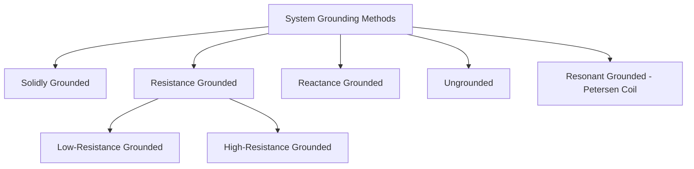
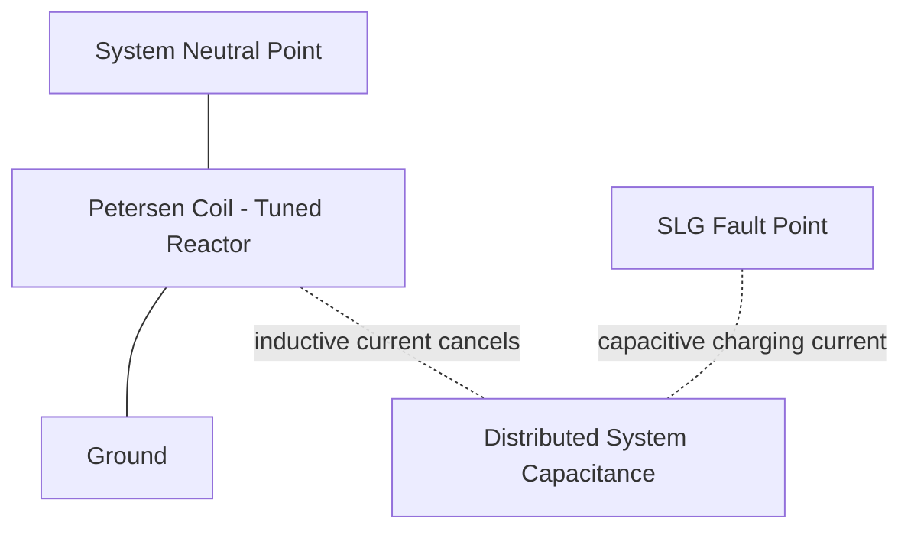
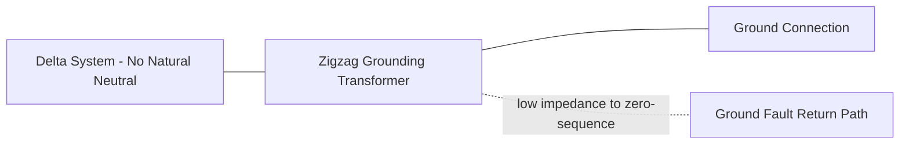

## System Grounding Methods and Neutral Treatment

### Overview

System grounding (earthing) refers to the intentional connection of a power system's neutral point (or, in the absence of an accessible neutral, an artificially derived reference point) to earth, together with the selection of the impedance in that connection. The choice of grounding method fundamentally shapes fault current magnitude, overvoltage behavior during ground faults, protective relaying requirements, and equipment insulation design across the entire system. This is distinct from equipment grounding (safety grounding of enclosures and structures), though the two are related in overall system safety design.

### Purpose of System Grounding

- **Limit transient overvoltages**: controls the voltage rise on unfaulted phases during a single-line-to-ground (SLG) fault, directly influencing required insulation levels.
- **Provide a path for ground fault current**: enables sensitive and selective ground fault protection to detect and clear faults.
- **Limit fault current magnitude**: certain grounding methods intentionally limit fault current to reduce equipment damage and step/touch potential hazards.
- **Improve system stability and reliability**: influences whether a ground fault requires immediate isolation or can be tolerated temporarily.
- **Facilitate protective device coordination**: the grounding method determines the character (magnitude, direction) of ground fault current that relays must detect.

### Classification of Grounding Methods

Grounding methods are broadly classified by the impedance value placed between the system neutral and ground, typically characterized by the ratio of zero-sequence to positive-sequence reactance ($X_0/X_1$) and resistance to positive-sequence reactance ($R_0/X_1$).

### Solidly Grounded Systems

- The neutral point is connected directly to ground with no intentional impedance.
- Defined per IEEE Std 142 as having $X_0/X_1 \leq 3$ and $R_0/X_1 \leq 1$ (commonly referred to as "effectively grounded" — a related but formally distinct term meaning the system meets specific coefficient-of-grounding criteria limiting overvoltage on unfaulted phases to approximately 80% of the line-to-line voltage or less).
- Produces the highest ground fault current magnitude among grounding methods — often comparable to or exceeding three-phase fault current at the same location.
- **Advantages**: limits transient overvoltage during ground faults most effectively; permits use of reduced insulation levels (e.g., graded insulation in large transformers); high fault current enables straightforward, sensitive protective relaying.
- **Disadvantages**: high fault current causes greater equipment damage and arc-flash energy at the fault point; requires robust equipment grounding and bonding to manage step/touch potential; typically requires immediate fault clearing (no tolerance for sustained ground faults).
- **Typical application**: most transmission systems (69 kV and above) and many distribution systems, particularly four-wire multi-grounded systems common in North American distribution practice.

### Resistance Grounded Systems

A resistor is inserted between the system neutral (or an artificially derived neutral) and ground, limiting ground fault current to a controlled value.

**Low-Resistance Grounding (LRG)**

- Resistor sized to limit ground fault current typically in the range of 100–1000 A (values vary by application and standard practice).
- Provides sufficient fault current for reliable, sensitive ground fault relay operation while substantially reducing fault energy compared to solid grounding.
- Commonly applied in medium-voltage industrial and utility distribution systems (e.g., generator step-up auxiliary systems, industrial plant distribution).
- Ground faults are typically cleared promptly (not tolerated for extended operation), similar to solidly grounded practice, but with reduced fault damage.

**High-Resistance Grounding (HRG)**

- Resistor sized to limit ground fault current to a very low value, often 10 A or less (frequently sized just above the system's inherent charging current to prevent transient overvoltage from arcing/restriking ground faults).
- Permits continued operation with a single ground fault present (an alarm-only condition rather than immediate trip), valuable for critical process continuity in industrial plants (e.g., continuous process industries where an immediate trip on first ground fault would be highly disruptive).
- Requires a coordinated ground fault location/detection scheme (commonly pulsing or SEL-type fault location fed through zero-sequence CTs) since standard overcurrent-based ground relaying is not adequate for such low currents.
- **Key constraint**: HRG resistor sizing must ensure the resulting charging-current-to-resistive-current ratio keeps transient overvoltages controlled — a widely cited design guideline is sizing resistive current to be at least equal to the total system's three-phase charging current.

$$I_R \geq I_{C0} \quad \text{(commonly cited HRG design guideline; resistive current at least equal to system charging current)}$$

Where $I_{C0}$ is the total zero-sequence (line-to-ground) charging current of the system. [Inference] Exact sizing guidelines and safety margins vary somewhat between standards (e.g., IEEE 141/242 guidance) and should be confirmed against the specific applicable reference for a given design.

### Reactance Grounded Systems

- A reactor, rather than a resistor, is inserted in the neutral-to-ground connection.
- Historically used to limit fault current on systems where a resistor of sufficient thermal rating was impractical (e.g., very high-current applications), though less common in modern practice compared to resistance grounding for MV systems.
- Reactance grounding occupies an intermediate position between solid and resonant grounding; if reactance is too high, overvoltage behavior approaches ungrounded-system characteristics; careful selection is required to avoid the higher end of the $X_0/X_1$ ratio range associated with problematic transient overvoltages.

### Ungrounded Systems

- No intentional connection between system neutral and ground; the only ground reference is via the distributed phase-to-ground capacitance of the system itself.
- **Key characteristic**: a single line-to-ground fault does not produce a return path large enough to trip protective devices in most configurations, allowing continued operation with one phase faulted to ground — historically valued for continuity of service in some industrial applications.
- **Major disadvantage**: sustained arcing ground faults can produce severe transient overvoltages (theoretically up to 6–8 times normal phase voltage in worst-case restriking arc conditions) due to repeated charging/discharging of system capacitance, posing significant insulation stress risk to the rest of the system.
- Ground fault location on ungrounded systems is more difficult, typically requiring pulsing techniques or selective sensitive ground relaying based on zero-sequence current unbalance detection.
- [Inference] Due to the overvoltage risk described above, ungrounded system design has become less common in new industrial system designs in favor of high-resistance grounding, which provides similar operational continuity benefits (tolerating a first ground fault) while substantially reducing transient overvoltage risk — though ungrounded systems remain in service in many existing installations.

### Resonant Grounding (Petersen Coil / Ground Fault Neutralizer)

- A specially tuned reactor (Petersen coil) is connected between neutral and ground, sized so that the reactor's inductive current very closely cancels the system's capacitive charging current during a ground fault.

$$X_L = \frac{1}{3 \omega^2 C_0}$$

Where $C_0$ is the total system phase-to-ground capacitance (per phase), such that the coil's fundamental-frequency inductive current at the fault location approximately equals the total system's capacitive charging current, minimizing the net current through the fault to near zero.

- This near-zero fault current often allows the arc at the fault point to self-extinguish, permitting the system to continue operating through a transient ground fault (particularly effective for temporary faults such as those caused by wind-blown line contact or lightning-induced flashover on overhead systems) without interruption.
- Widely used in some European and other utility distribution systems, particularly in areas with extensive overhead line exposure to transient faults, though [Inference] adoption varies significantly by country and utility practice.
- Requires precise tuning (often with automatic tuning controllers responding to system capacitance changes from switching operations) and specialized ground fault detection schemes similar in complexity to those needed for ungrounded/HRG systems, since conventional overcurrent protection cannot detect the intentionally near-zero fault current.

### Neutral Grounding Transformers (Derived Neutral)

For delta-connected systems or wye systems without an accessible neutral point suitable for direct grounding, a grounding transformer creates an artificial neutral:

**Zigzag Grounding Transformer**

- A specially wound three-phase transformer with zigzag winding configuration, presenting very low impedance to zero-sequence current while presenting high impedance to positive/negative-sequence (normal balanced) current — allowing it to provide a ground reference and fault current path without carrying significant current during normal balanced operation.
- Widely used to establish grounding on delta-secondary distribution transformers or generator systems without a naturally accessible neutral.

**Grounding (Wye-Delta) Transformer**

- A wye-connected primary (providing the neutral point for grounding) with a delta tertiary/secondary winding to provide a path for third-harmonic and zero-sequence circulating current, preventing these components from appearing on the primary system.

### Comparison of Grounding Methods

| Method | Fault Current Level | Transient Overvoltage Risk | Operational Continuity on SLG Fault | Typical Application |
| --- | --- | --- | --- | --- |
| Solidly Grounded | High (near 3-phase fault level) | Low | No — immediate trip required | Transmission, most utility distribution |
| Low-Resistance | Moderate (100–1000 A) | Low–Moderate | No — prompt trip required | MV industrial/utility distribution |
| High-Resistance | Very Low (≤10 A typical) | Low (if properly sized) | Yes — alarm-only, continued operation | Continuous-process industrial plants |
| Reactance | Moderate–High (design dependent) | Moderate | Varies | Historical/specific high-current applications |
| Ungrounded | Very Low (capacitive only) | High (restriking arc risk) | Yes — but overvoltage risk | Legacy industrial systems |
| Resonant (Petersen Coil) | Near zero (tuned cancellation) | Low (if properly tuned) | Yes — self-extinguishing faults | Utility distribution, overhead-line-heavy systems |

### Worked Example: HRG Resistor Sizing

**Scenario**: A 4.16 kV industrial plant distribution system has a total per-phase charging current to ground of 4 A (based on cable/equipment capacitance). Design a high-resistance grounding scheme.

**Step 1 — Determine minimum resistive current**

Using the common design guideline that resistive current should be at least equal to total system charging current:

$$I_R \geq I_{C0} = 4\ \text{A (total system, i.e., 3} \times \text{per-phase, if 4 A already represents zero-sequence total — confirm basis)}$$

For this example, assume 4 A represents the total zero-sequence charging current; select $I_R = 5$ A for margin.

**Step 2 — Calculate required neutral resistance**

Phase-to-neutral voltage:

$$V_{LN} = \frac{4160}{\sqrt{3}} \approx 2402\ \text{V}$$

$$R_N = \frac{V_{LN}}{I_R} = \frac{2402}{5} \approx 480\ \Omega$$

**Key Points**

- The resistor must also be checked for thermal rating (typically sized for a defined time duration, e.g., 10 seconds or 1 minute, per the expected maximum fault duration before alarm-driven operator or automated response).
- A ground fault detection scheme (e.g., zero-sequence voltage relay, 59N, monitoring neutral resistor voltage or current) must be coordinated with this design to alert operators of a sustained ground fault condition.
- [Inference] This is a simplified illustrative calculation; actual HRG system design requires detailed system charging current measurement/calculation across all connected equipment and cable lengths, plus verification against the applicable grounding resistor design standard (e.g., IEEE 142).

### Standards and References

| Standard | Scope |
| --- | --- |
| IEEE Std 142 (Green Book) | Recommended practice for grounding of industrial and commercial power systems |
| IEEE Std 141 (Red Book) | Electric power distribution for industrial plants (includes grounding guidance) |
| IEEE C62.92 (series) | Guide for application of neutral grounding in electrical utility systems |
| IEC 60071 | Insulation coordination (related to overvoltage consequences of grounding method) |

**Related Topics**

- Equipment grounding and bonding practices (distinct from system grounding)
- Ground fault protection relaying schemes (50N/51N/59N/67N)
- Insulation coordination and overvoltage design margins
- Zigzag and grounding transformer design
- Arc flash hazard analysis and its relationship to fault current magnitude
- Zero-sequence network modeling for grounding studies
- Petersen coil automatic tuning control systems
- Step and touch potential analysis in substation grounding grid design