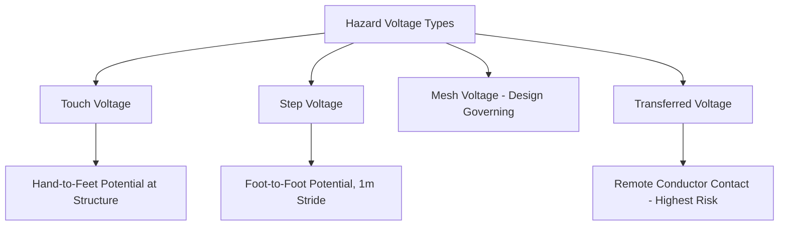
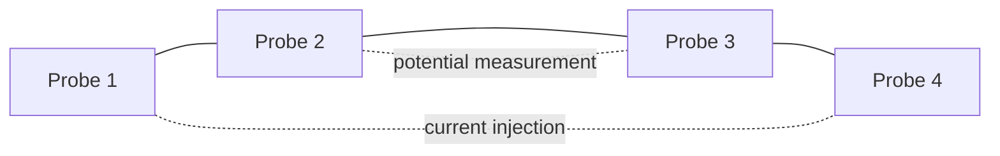
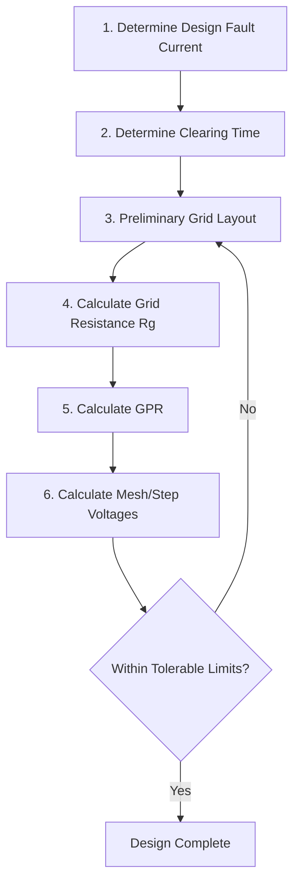

## Substation and Equipment Grounding Grid Design

### Overview

Substation grounding grid design is the engineering process of designing a buried conductor network beneath and around a substation to provide a low-impedance path to earth for fault currents, lightning discharges, and static charges, while limiting the potential differences (step, touch, and mesh voltages) that personnel could be exposed to during a ground fault. This is distinct from system grounding (neutral treatment), though the two interact — the system grounding method determines the magnitude and duration of ground fault current the grid must safely dissipate.

The design methodology is most comprehensively codified in **IEEE Std 80**, "IEEE Guide for Safety in AC Substation Grounding," which forms the basis of the calculations and design principles below.

### Design Objectives

- **Personnel safety**: ensure that step and touch voltages a person could experience during a ground fault remain below tolerable limits based on human body current-duration tolerance curves.
- **Equipment protection**: provide a low-impedance ground reference to limit voltage stress on equipment insulation during faults and transients.
- **Reliable fault current dissipation**: safely conduct fault current into the earth without excessive localized heating or grid conductor damage.
- **Lightning and switching surge discharge path**: work in conjunction with surge arresters and shield wires to safely dissipate transient energy.

### Key Hazard Voltages

**Touch Voltage**

- The potential difference between a grounded structure/equipment surface and a point on the earth's surface at a distance equal to the normal maximum reach of a person (typically 1 meter) while in contact with that structure.

**Step Voltage**

- The potential difference between two points on the earth's surface separated by one typical stride (typically taken as 1 meter) during a ground fault.

**Mesh Voltage**

- The maximum touch voltage within a mesh (grid square) of the grounding grid — typically the worst-case (highest) touch voltage location within the grid interior, and the key design-governing parameter in the IEEE 80 mesh voltage method.

**Transferred Voltage**

- A special case of touch voltage where a person contacts a conductor (e.g., a fence, pipe, or communication cable) extending outside the immediate grid area, potentially bringing full or near-full ground potential rise to a remote point where the person is standing on normal (non-elevated) potential earth — a particularly hazardous condition since it can exceed typical touch voltage limits substantially.

### Tolerable Body Current and Voltage Limits (IEEE 80)

IEEE 80 bases tolerable voltage limits on the maximum allowable body current for a given fault clearing time, derived from Dalziel's equation relating fibrillation current threshold to duration:

$$I_B = \frac{0.116}{\sqrt{t_s}} \quad \text{(for a 50 kg body weight)}$$

$$I_B = \frac{0.157}{\sqrt{t_s}} \quad \text{(for a 70 kg body weight)}$$

Where $I_B$ is in amperes and $t_s$ is the fault duration in seconds. These are combined with body and contact resistance models to derive tolerable step and touch voltage formulas:

$$E_{touch,50} = (1000 + 1.5 C_S \rho_s) \frac{0.116}{\sqrt{t_s}}$$

$$E_{step,50} = (1000 + 6 C_S \rho_s) \frac{0.116}{\sqrt{t_s}}$$

Where:

- $\rho_s$ = resistivity of the surface material (e.g., crushed rock surfacing) in $\Omega \cdot m$
- $C_S$ = surface layer derating factor, accounting for the reduced effective body current when a high-resistivity surface layer (e.g., crushed stone) is present over native soil
- $1000\ \Omega$ = assumed body resistance
- The constants 1.5 and 6 arise from foot contact resistance modeling for touch and step scenarios respectively

**Surface Layer Derating Factor**

$$C_S = 1 - \frac{0.09\left(1 - \frac{\rho}{\rho_s}\right)}{2 h_s + 0.09}$$

Where $\rho$ is the native soil resistivity, $\rho_s$ is the surface material resistivity, and $h_s$ is the surface layer thickness — this factor is why substations are commonly covered with a layer of crushed rock or gravel (high resistivity), which significantly increases tolerable touch/step voltage limits by increasing effective contact resistance.

### Soil Resistivity Measurement

Accurate soil resistivity data is foundational to grid design, typically obtained via the **Wenner four-pin method**:

$$\rho = 2\pi a R$$

Where $a$ is the equal spacing between four collinear driven probes and $R$ is the resistance measured between the outer current probes with the inner probes sensing potential — varying probe spacing $a$ provides resistivity data at different effective depths, useful for characterizing layered soil structures (which are common in practice and often modeled as a two-layer soil model for more accurate grid design than a simple uniform-resistivity assumption).

### Grid Design Process (IEEE 80 Methodology)

**Step 1 — Determine Design Fault Current**

- Establish the maximum ground fault current expected to flow through the grid, considering system grounding method, fault type (typically single-line-to-ground for grid design purposes, as it often produces the highest zero-sequence current contribution to the grid), and the split factor between grid current and current returning via other paths (overhead ground wires, cable shields, neutral conductors).

**Step 2 — Determine Fault Clearing Time**

- Based on protective relay and breaker operating time, including appropriate margin — directly affects tolerable voltage limits via the $1/\sqrt{t_s}$ relationship (shorter clearing times permit higher tolerable voltages).

**Step 3 — Preliminary Grid Layout**

- Lay out a grid of buried conductors (typically copper, in a rectangular mesh pattern) at a standard burial depth (commonly 0.3–0.5 m, though [Inference] specific depth depends on soil freezing depth and mechanical protection considerations), with ground rods at grid corners and perimeter, sized based on substation area and equipment layout.

**Step 4 — Calculate Grid Resistance**

A commonly used approximation (Sverak's formula) for grid resistance to remote earth:

$$R_g = \rho \left[\frac{1}{L_T} + \frac{1}{\sqrt{20A}}\left(1 + \frac{1}{1 + h\sqrt{20/A}}\right)\right]$$

Where:

- $\rho$ = soil resistivity
- $L_T$ = total buried conductor length (grid conductors plus ground rods)
- $A$ = area covered by the grid
- $h$ = burial depth

**Step 5 — Calculate Maximum Grid Potential Rise (GPR)**

$$GPR = I_G \times R_g$$

Where $I_G$ is the maximum grid current (portion of fault current actually flowing through the grid into earth, after accounting for current diverted via other paths). If GPR is comfortably below tolerable touch voltage, further detailed mesh/step voltage calculation may be unnecessary [Inference — this simplification is a recognized IEEE 80 preliminary check, though most real substation designs still proceed to full mesh/step calculation for governing safety verification]; otherwise, detailed calculation proceeds.

**Step 6 — Calculate Mesh and Step Voltages**

IEEE 80 provides empirical formulas incorporating geometric factors ($K_m$ for mesh, $K_s$ for step), an irregularity correction factor ($K_i$), and grid geometry parameters (conductor spacing, number of parallel conductors, grid depth, corner effects):

$$E_{mesh} = \frac{\rho \cdot K_m \cdot K_i \cdot I_G}{L_M}$$

$$E_{step} = \frac{\rho \cdot K_s \cdot K_i \cdot I_G}{L_S}$$

Where $L_M$ and $L_S$ are effective buried conductor lengths for mesh and step voltage calculations respectively (accounting for grid conductors and ground rods with different weighting).

**Step 7 — Compare Calculated vs. Tolerable Voltages**

- If calculated mesh voltage exceeds tolerable touch voltage, or calculated step voltage exceeds tolerable step voltage, the grid design must be revised (tighter mesh spacing, additional ground rods, additional surface layer resistivity, or other measures) and recalculated.

### Grid Design Refinement Techniques

- **Reducing mesh spacing**: adding more parallel conductors reduces mesh voltage by providing more current paths and better equalizing surface potential, at increased material/installation cost.
- **Additional ground rods**: particularly effective in two-layer soil conditions where a lower-resistivity layer exists at depth, ground rods can significantly reduce overall grid resistance.
- **Increasing surface layer thickness/resistivity**: directly increases tolerable touch/step voltage limits via the $C_S$ derating factor, often a cost-effective mitigation compared to adding grid conductors.
- **Perimeter grading**: adding a ground conductor ring slightly outside the fence line, bonded to the fence, addresses transferred touch voltage risk for personnel outside the immediate grid area contacting the fence.
- **Equipment-specific supplementary grounding**: additional grounding at equipment with elevated touch voltage risk (e.g., control cabinets, operating handles).

### Worked Example: Simplified GPR Check

**Scenario**: A substation grid has total buried conductor length $L_T = 1500$ m, grid area $A = 4000$ m², burial depth $h = 0.5$ m, and average soil resistivity $\rho = 100\ \Omega\cdot m$. Maximum grid current (after accounting for split factor to overhead ground wires) is $I_G = 8000$ A. Fault clearing time is 0.5 s. A 0.1 m layer of crushed rock ($\rho_s = 3000\ \Omega\cdot m$) covers the substation surface.

**Step 1 — Approximate grid resistance (Sverak's formula)**

$$R_g = 100 \left[\frac{1}{1500} + \frac{1}{\sqrt{20 \times 4000}}\left(1 + \frac{1}{1 + 0.5\sqrt{20/4000}}\right)\right]$$

$$R_g \approx 100\left[0.000667 + \frac{1}{282.8}(1 + \frac{1}{1.0354})\right] \approx 100[0.000667 + 0.00354 \times 1.966] \approx 100[0.000667 + 0.00696] \approx 0.763\ \Omega$$

**Step 2 — Ground Potential Rise**

$$GPR = I_G \times R_g = 8000 \times 0.763 \approx 6104\ \text{V}$$

**Step 3 — Tolerable touch voltage (50 kg body, with surface derating)**

Surface derating factor (approximate):

$$C_S \approx 1 - \frac{0.09(1 - 100/3000)}{2(0.1) + 0.09} = 1 - \frac{0.09 \times 0.967}{0.29} \approx 1 - 0.300 \approx 0.70$$

$$E_{touch,50} = (1000 + 1.5 \times 0.70 \times 3000) \times \frac{0.116}{\sqrt{0.5}} \approx (1000 + 3150) \times 0.164 \approx 4150 \times 0.164 \approx 681\ \text{V}$$

**Key Points**

- The calculated GPR (~6104 V) substantially exceeds the tolerable touch voltage (~681 V), meaning the preliminary check fails and full mesh voltage calculation (and likely design refinement — tighter mesh spacing, more ground rods, or thicker surface layer) is required; a high GPR does not necessarily mean mesh/step voltages will exceed limits (since most of the GPR may be dissipated safely away from accessible points), but it signals that detailed calculation cannot be skipped.
- [Inference] This is a simplified illustrative calculation using approximate formulas; real substation grounding grid design requires the complete IEEE 80 mesh/step voltage calculation methodology (including $K_m$, $K_s$, $K_i$ geometric factors) and typically specialized grounding analysis software given the complexity and iteration involved.

### Special Design Considerations

**Two-Layer and Multi-Layer Soil Models**

- Uniform soil resistivity assumptions are often inaccurate; layered soil models (e.g., a higher-resistivity surface layer over lower-resistivity deeper soil, or vice versa) significantly affect grid resistance and current distribution, particularly influencing the effectiveness of ground rods versus horizontal grid conductors.

**High Ground Potential Rise (GPR) Interaction with Communication/Pipeline Facilities**

- Substations with high GPR require coordination with telecommunications circuits, pipelines, and rail facilities entering or passing near the site, since these can transfer hazardous potential to remote locations (transferred voltage) — often requiring isolation devices (neutralizing transformers, fiber-optic replacement of metallic communication circuits, insulating joints on pipelines).

**Lightning and High-Frequency Transient Response**

- Grounding grid performance under lightning-frequency transients differs from power-frequency fault behavior due to conductor inductance effects at high frequency; specialized transient grounding analysis (sometimes using electromagnetic transient simulation) may be warranted for substations with significant direct lightning exposure, particularly regarding effective grounding impedance seen by fast-front surges compared to the 60 Hz grid resistance calculated for fault studies.

### Standards and References

| Standard | Scope |
| --- | --- |
| IEEE Std 80 | Guide for safety in AC substation grounding — the primary design reference for the methodology above |
| IEEE Std 81 | Guide for measuring earth resistivity, ground impedance, and earth surface potentials |
| IEEE Std 837 | Qualifying permanent connections used in substation grounding |
| IEC 61936-1 | Power installations exceeding 1 kV AC — general rules including earthing (European/international parallel framework) |

**Related Topics**

- System grounding methods and neutral treatment
- Soil resistivity measurement techniques (Wenner and Schlumberger methods)
- Lightning protection and shielding of substations (shield wire/mast design)
- Insulation coordination and surge arrester application
- Ground fault protection relaying and fault current calculation
- Transferred potential mitigation for pipelines and communication circuits
- Grounding grid transient (high-frequency) performance analysis
- Arc flash hazard analysis relationship to fault current and clearing time