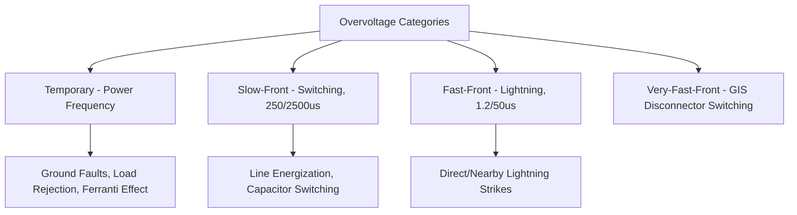
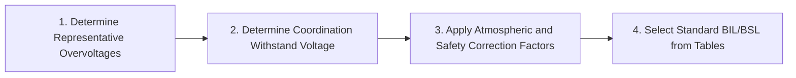

## Insulation Coordination Principles

### Overview

Insulation coordination is the engineering discipline of selecting the dielectric (insulation) strength of equipment and correlating it with the expected overvoltage stresses on a power system, such that insulation failures are limited to an economically and operationally acceptable frequency, while avoiding costly over-insulation. It integrates system overvoltage analysis (originating from lightning, switching operations, and temporary power-frequency events) with equipment withstand capability and protective device (surge arrester) characteristics into a coherent, standardized design process.

The foundational international standard is **IEC 60071** ("Insulation co-ordination"), with **IEEE Std C62.82** (formerly IEEE 1313) providing a broadly parallel North American framework.

### Categories of Overvoltage

Power systems experience overvoltage stresses classified by origin, duration, and waveshape, each requiring different insulation withstand considerations:

**Temporary Overvoltages (TOV)**

- Power-frequency overvoltages of relatively long duration (from a few cycles to several seconds or longer), arising from causes such as ground faults on ineffectively grounded systems (see [[system-grounding]] treatment), load rejection, Ferranti effect on lightly loaded long lines, or resonance/ferroresonance conditions.
- Characterized primarily by magnitude and duration rather than a specific waveshape (since it is essentially a sustained power-frequency sinusoid at elevated magnitude).

**Slow-Front (Switching) Overvoltages**

- Transient overvoltages with front times typically in the range of tens of microseconds to a few milliseconds, arising from switching operations (line energization/re-energization, capacitor bank switching, fault initiation/clearing) or, in some cases, distant lightning strikes.
- Standardized test waveform: 250/2500 μs (250 μs front time, 2500 μs time to half-value on the tail).

**Fast-Front (Lightning) Overvoltages**

- Transient overvoltages with front times typically in the range of 0.1 to 20 μs, primarily arising from direct or nearby lightning strikes to transmission lines, shield wires, or substations.
- Standardized test waveform: 1.2/50 μs.

**Very-Fast-Front Overvoltages**

- Extremely fast transients (nanosecond-range front times), primarily associated with disconnector switching operations in Gas-Insulated Switchgear (GIS), where the fast current interruption and short internal distances produce steep-fronted traveling waves.

### Standard Insulation Levels and Withstand Testing

Equipment insulation withstand capability is verified through standardized dielectric tests corresponding to each overvoltage category:

| Test | Waveform | Represents |
| --- | --- | --- |
| Power-frequency withstand (short duration) | 50/60 Hz, typically 1 minute | Temporary overvoltage withstand |
| Switching impulse withstand (BSL — Basic Switching Impulse Level) | 250/2500 μs | Slow-front overvoltage withstand |
| Lightning impulse withstand (BIL — Basic Insulation Level) | 1.2/50 μs | Fast-front overvoltage withstand |

**Basic Insulation Level (BIL)** is the most commonly referenced parameter in equipment specification — the peak voltage value of the standard lightning impulse waveform that the insulation must withstand without failure, standardized at discrete values (e.g., 95, 125, 150, 200, 250, 350, 450, 550 kV, etc., depending on system voltage class) per IEC 60071-1 and IEEE C62.82 series tables.

### Insulation Coordination Process (Statistical/Deterministic Approach)

**Step 1 — Determine Representative Overvoltages**

- Establish the expected overvoltage magnitude and probability distribution for each category (TOV, slow-front, fast-front) at the point of interest, typically via system studies (e.g., electromagnetic transient simulation for switching surges, lightning performance analysis using shielding failure and backflashover models for lightning surges).

**Step 2 — Determine Coordination Withstand Voltage**

- Apply appropriate coordination and safety factors to the representative overvoltage to establish the required withstand voltage, accounting for the statistical nature of both the overvoltage occurrence and the insulation's own withstand characteristic (self-restoring insulation, such as air gaps, has a probabilistic withstand curve rather than a single deterministic value).

**Step 3 — Apply Correction Factors**

- **Atmospheric correction**: air-insulated equipment withstand is corrected for altitude (reduced air density at higher altitude reduces dielectric strength) and, in some methodologies, humidity/temperature.
- **Safety factor**: an additional margin (commonly around 15% for internal insulation and somewhat lower for external/self-restoring insulation, per IEC guidance) accounts for uncertainties in the overvoltage and withstand estimates, aging effects, and manufacturing variation.

**Step 4 — Select Standard Insulation Level**

- Round up the calculated required withstand voltage to the nearest standard BIL/BSL value from the applicable IEC/IEEE standard tables, ensuring the selected standard level is not below the required coordination withstand voltage.

### Self-Restoring vs. Non-Self-Restoring Insulation

- **Self-restoring insulation** (air gaps, most external insulation such as bushings and open-air clearances): fully recovers dielectric properties after a disruptive discharge (flashover), permitting a statistical design approach where a small, defined probability of flashover is accepted as economically optimal rather than requiring zero-failure-probability insulation levels.
- **Non-self-restoring insulation** (solid/liquid dielectric in transformers, cables, GIS internal insulation): does not recover after failure — a single breakdown typically causes permanent damage — requiring a more conservative, essentially deterministic design margin since statistical risk-acceptance is inappropriate when failure means equipment damage rather than a momentary, self-clearing flashover.

This distinction fundamentally shapes design philosophy: transmission line insulator strings (self-restoring, air-gap-dominated) are commonly designed to a defined, non-zero acceptable flashover rate (e.g., an accepted number of lightning-caused flashovers per 100 km per year), while transformer internal insulation is designed with substantial deterministic margin against any anticipated overvoltage the surge arrester coordination is intended to control.

### Role of Surge Arresters in Coordination

Surge arresters (predominantly metal-oxide varistor, MOV, type in modern practice) are the primary device used to limit the overvoltage that actually reaches protected equipment, forming the critical link between system overvoltage phenomena and equipment insulation withstand capability.

**Protective Margin**

$$PM = \frac{BIL - V_{PL}}{V_{PL}} \times 100\%$$

Where $V_{PL}$ is the arrester's protective level (residual voltage at the relevant discharge current, typically the lightning impulse protective level for fast-front coordination). IEC/IEEE guidance typically recommends a protective margin of at least 20% for lightning impulse coordination [Inference — specific recommended margin values vary somewhat between standard editions and equipment categories; the exact applicable margin should be confirmed against the current governing standard for a specific project], to account for arrester lead length inductance, arrester aging, and other practical deviations from idealized coordination.

**Separation Distance Effect**

- The protective effectiveness of a surge arrester diminishes with increasing electrical distance (cable/busbar length) between the arrester and the protected equipment, since traveling-wave reflection at the equipment terminal can produce a voltage at the equipment exceeding the arrester's residual voltage at its own location — an important consideration in substation layout, particularly for transformers where arresters should be located as electrically close as practical.

### Worked Example: BIL Selection with Protective Margin Check

**Scenario**: A 138 kV substation transformer is protected by a surge arrester with a lightning impulse protective level (residual voltage at 10 kA) of $V_{PL} = 380$ kV. Available standard BIL values for this voltage class per applicable tables include 450, 550, and 650 kV.

**Step 1 — Calculate required BIL for 20% protective margin**

$$BIL_{required} = V_{PL} \times 1.20 = 380 \times 1.20 = 456\ \text{kV}$$

**Step 2 — Select standard BIL**

The nearest standard BIL value meeting or exceeding 456 kV is **550 kV** (450 kV would fall short of the calculated requirement).

**Step 3 — Verify actual protective margin with selected BIL**

$$PM = \frac{550 - 380}{380} \times 100\% \approx 44.7\%$$

**Key Points**

- The selected 550 kV BIL provides a protective margin (~44.7%) well above the 20% guideline, which is typical in practice since standard BIL values are discrete steps rather than continuously selectable — the actual installed margin is often substantially higher than the calculated minimum requirement.
- [Inference] This example illustrates the coordination logic using representative figures; actual arrester protective level selection also depends on arrester energy discharge duty, temporary overvoltage (TOV) withstand capability of the arrester itself, and system-specific overvoltage study results, all of which should be verified for a specific project rather than assumed from a simplified BIL/margin check alone.

### Insulation Coordination for Different Equipment Types

| Equipment | Dominant Insulation Type | Key Coordination Consideration |
| --- | --- | --- |
| Power Transformers | Non-self-restoring (oil/paper) | Conservative margin; arrester placement close to bushings |
| Circuit Breakers | Mixed (self-restoring external, some internal) | Both open and closed gap withstand; switching surge behavior during operation |
| Transmission Line Insulators | Self-restoring (air gap) | Statistical flashover rate design; lightning performance (shielding, backflashover) |
| GIS (Gas-Insulated Switchgear) | Non-self-restoring (SF6/compressed gas) | Very-fast-front transient consideration; internal fault containment |
| Cables | Non-self-restoring (solid dielectric) | Conservative margin; particular attention to switching surge stress at terminations |

### Standards and References

| Standard | Scope |
| --- | --- |
| IEC 60071-1 / -2 | Insulation coordination — definitions/principles/rules (Part 1) and application guide (Part 2) |
| IEEE Std C62.82.1 (formerly 1313.1) | Standard for insulation coordination — definitions, principles, and rules |
| IEEE Std C62.82.2 (formerly 1313.2) | Application guide for insulation coordination |
| IEC 60060 series | High-voltage test techniques (defines standard test waveforms) |

**Related Topics**

- Surge arrester technology and application (metal-oxide varistor design)
- Lightning performance of transmission lines (shielding and backflashover analysis)
- Substation and equipment grounding grid design
- Ferroresonance and temporary overvoltage mechanisms
- Gas-Insulated Switchgear (GIS) very-fast-front transient analysis
- Transmission line insulator design and flashover rate calculation
- Electromagnetic transient (EMT) simulation for switching surge studies
- Basic Insulation Level (BIL) standard value tables by voltage class