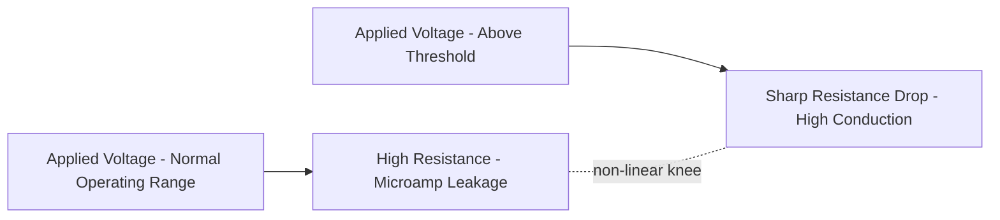
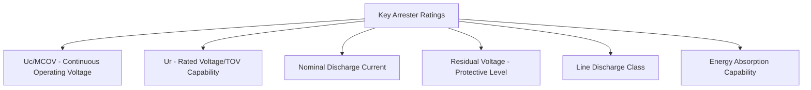
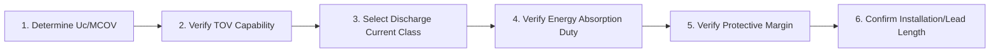

## Surge Arrester Selection and Application

### Overview

Surge arresters are protective devices connected in shunt between phase conductors and ground, designed to limit transient overvoltages (from lightning and switching surges) at protected equipment by diverting surge current to ground while presenting a very high impedance during normal system operation. Proper arrester selection and application is the practical execution of insulation coordination principles, translating system voltage class, expected overvoltage severity, and equipment insulation levels into a specific arrester rating and physical installation.

Modern arrester application is dominated by **metal-oxide (MO) surge arresters**, which have largely superseded the older gapped silicon-carbide (SiC) arrester technology in new installations.

### Metal-Oxide Varistor (MOV) Technology

- MOV arresters use zinc-oxide (ZnO) based ceramic elements exhibiting a highly non-linear voltage-current characteristic: at normal system voltage, the element presents extremely high resistance (drawing only a small leakage/reference current, typically in the microampere to low milliampere range); above a threshold voltage, resistance drops sharply, allowing the element to conduct significant current and clamp the voltage.

$$I = k V^\alpha$$

Where $\alpha$ (the non-linearity coefficient) is very high for quality ZnO material (commonly cited in the range of 30–50 or higher over the relevant operating region), giving the sharp knee characteristic that distinguishes MOV behavior from a simple resistor.

- **Gapless design**: because the ZnO element's leakage current at normal operating voltage is low enough to be thermally manageable, modern MOV arresters typically require no series gap (unlike legacy SiC arresters, which required a spark gap to block continuous current flow at normal voltage) — simplifying construction and improving response speed, since there is no gap sparkover time delay.

### Key Arrester Ratings and Parameters

**Continuous Operating Voltage ($U_c$ / MCOV)**

- The maximum RMS power-frequency voltage that may be continuously applied to the arrester terminals, per IEC 60099-4 (rated as $U_c$) or IEEE C62.11 (rated as MCOV — Maximum Continuous Operating Voltage). Must be selected to exceed the maximum expected continuous system voltage at the arrester's location, including anticipated voltage regulation range.

**Rated Voltage ($U_r$)**

- Per IEC definition, the maximum permissible RMS voltage between terminals at which the arrester is designed to operate correctly under temporary overvoltage (TOV) conditions for a specified duration (commonly 10 seconds in standard TOV capability tests) — a key parameter distinguishing arrester TOV withstand capability, not merely a "rating label."

**Nominal Discharge Current**

- The peak value of the standardized 8/20 μs current impulse waveform used to classify the arrester's discharge capability and to define its associated protective (residual voltage) characteristics — commonly available in standard classes of 1.5, 2.5, 5, 10, and 20 kA, with higher classes generally corresponding to arresters intended for higher system voltage/energy duty applications.

**Residual Voltage (Protective Level, $U_{res}$ or $V_{PL}$)**

- The peak voltage appearing across the arrester terminals during passage of a discharge current of specified magnitude and waveshape — the key parameter linking arrester selection directly to the insulation coordination protective margin calculation.

**Line Discharge Class**

- For arresters applied on higher-voltage systems (particularly where switching surge energy duty from line discharge is significant), a line discharge class (per IEC classification, Class 1 through Class 5, increasing with energy handling capability) characterizes the arrester's capability to absorb the energy associated with discharging a charged transmission line into the arrester during specific switching scenarios.

**Energy Absorption Capability**

- Rated in kJ per kV of $U_c$ (or similar normalized units), representing the maximum energy the arrester can absorb during a single impulse or specified duty cycle without thermal instability or failure — a critical check for switching surge duty and for arresters exposed to repeated or high-energy transient events.

### Arrester Selection Process

**Step 1 — Determine Continuous Operating Voltage Requirement**

- Establish maximum system phase-to-ground voltage at the arrester location, accounting for normal voltage regulation range (commonly systems are designed to operate within a defined percentage band above nominal, e.g., +5-10%).
- Select arrester $U_c$/MCOV rating to exceed this maximum expected continuous voltage with appropriate margin.

**Step 2 — Verify Temporary Overvoltage (TOV) Capability**

- Determine the expected magnitude and duration of TOV events at the arrester location (from ground fault studies, based on the system grounding method's coefficient of grounding — see [[system-grounding]] treatment for effectively grounded vs. other grounding methods).
- Confirm the selected arrester's TOV capability curve (typically published by manufacturers as a duration-vs-voltage capability curve) covers the expected TOV magnitude for the expected duration — this is often the governing constraint for arrester rated voltage selection on systems with significant ground fault overvoltage.

**Step 3 — Select Nominal Discharge Current Class**

- Based on system voltage level and expected lightning/switching surge exposure severity, per standard practice guidance correlating voltage class to typical discharge current class (higher system voltages and higher lightning exposure areas typically warrant higher discharge current classes).

**Step 4 — Verify Energy Absorption Duty**

- For applications with significant switching surge energy duty (e.g., long line energization, capacitor bank switching, certain HVDC and FACTS-adjacent applications), confirm the arrester's energy absorption capability and line discharge class are adequate for the specific system study results — this typically requires electromagnetic transient (EMT) simulation for applications with non-trivial switching surge energy duty.

**Step 5 — Determine Residual Voltage and Verify Protective Margin**

- Confirm the arrester's residual voltage at the relevant discharge current, combined with the protected equipment's BIL/BSL, provides the required protective margin per insulation coordination principles (commonly ≥20% for lightning impulse coordination, subject to the specific applicable standard's guidance).

**Step 6 — Confirm Physical/Installation Considerations**

- Arrester lead length (connections to line and ground) should be minimized, since lead inductance adds to the effective protective level seen by equipment during fast-front surges.
- Arrester placement should be as electrically close as practical to the protected equipment (particularly transformers), accounting for separation distance effects described in insulation coordination principles.

### Worked Example: Arrester Selection for a Distribution Feeder

**Scenario**: A 34.5 kV (nominal line-to-line) distribution feeder is solidly grounded (effectively grounded, coefficient of grounding ≈ 80%). Select an appropriate arrester continuous operating voltage rating.

**Step 1 — Maximum phase-to-ground voltage under normal conditions**

$$V_{LN} = \frac{34.5}{\sqrt{3}} \approx 19.9\ \text{kV}$$

Allowing for system voltage regulation (assume system may operate up to 105% of nominal):

$$V_{LN,max} \approx 19.9 \times 1.05 \approx 20.9\ \text{kV}$$

**Step 2 — Select MCOV rating**

A standard arrester MCOV rating of approximately 22 kV (a commonly available standard class for this voltage level) [Inference — specific standard MCOV values are manufacturer/standard-table specific and should be confirmed against current IEEE C62.11/IEC 60099-4 tables] would provide adequate margin above the calculated 20.9 kV maximum continuous voltage.

**Step 3 — TOV verification**

For an effectively grounded system, TOV during a ground fault is limited to approximately 80% of the phase-to-phase voltage (per the coefficient of grounding definition), i.e., roughly:

$$V_{TOV} \approx 0.80 \times 34.5 \approx 27.6\ \text{kV}$$

This must be checked against the selected arrester's rated TOV capability curve at the expected fault duration (typically a few seconds pending protection clearing) to confirm the arrester will not be thermally overstressed during this event — a distinctly separate check from the steady-state MCOV requirement.

**Key Points**

- On effectively grounded systems, TOV magnitude during ground faults is comparatively modest (a key advantage of solid/effective grounding for arrester rating purposes) compared to ungrounded or resonant-grounded systems, where TOV can approach or exceed line-to-line voltage — significantly affecting arrester rated voltage selection on those systems.
- [Inference] This example uses representative figures for illustration; actual arrester selection requires consulting current manufacturer catalogs and applicable IEEE C62.22 (application guide for MOV arresters on AC systems) or IEC 60099-5 (application guide) recommendations for the specific system and equipment involved.

### Arrester Application Considerations by Location

| Location | Key Consideration |
| --- | --- |
| Transmission line terminations at substations | Primary lightning protection for incoming lines; coordinated with substation shielding |
| Transformer terminals | Closest practical placement to minimize separation distance effect; critical for non-self-restoring insulation protection |
| Capacitor banks | Switching surge duty consideration; may require higher energy absorption class |
| Cable terminations | Protection against surge reflection at cable-to-overhead-line transition points, a common location for elevated transient stress |
| Distribution transformers | Cost-sensitive application; typically standard distribution-class MOV arresters, closely coupled to transformer bushings |
| HVDC converter stations / FACTS installations | Specialized arrester energy duty from converter switching events; [Inference] often requires dedicated arrester energy absorption studies beyond standard AC application guidance |

### Failure Modes and Monitoring

- **Thermal runaway**: if an arrester is subjected to energy duty exceeding its absorption capability, or if the ZnO element degrades (from aging, moisture ingress, or repeated overstress), leakage current at normal operating voltage can increase, causing self-heating that further reduces resistance — a positive-feedback thermal runaway process that can lead to arrester failure/explosion if not interrupted (many arresters incorporate pressure-relief venting to fail safely rather than violently).
- **Surge counters and leakage current monitors**: commonly installed with substation-class arresters to track the number of discharge operations and monitor leakage current trends, supporting condition-based maintenance and early detection of degrading units.
- **Disconnector devices**: many distribution-class arresters include an isolating disconnector that separates a failed arrester from the system, preventing a sustained fault from an internally failed unit while providing a visual failure indication.

### Standards and References

| Standard | Scope |
| --- | --- |
| IEC 60099-4 | Metal-oxide surge arresters without gaps for AC systems |
| IEC 60099-5 | Surge arresters — selection and application recommendations |
| IEEE Std C62.11 | Standard for metal-oxide surge arresters for AC power circuits |
| IEEE Std C62.22 | Guide for the application of metal-oxide surge arresters for AC systems |

**Related Topics**

- Insulation coordination principles and protective margin calculation
- System grounding methods and coefficient of grounding effect on TOV
- Substation grounding grid design (arrester ground lead bonding)
- Lightning performance of transmission lines
- Electromagnetic transient (EMT) simulation for switching surge energy duty
- HVDC converter station overvoltage protection
- Capacitor bank switching transient mitigation
- Gas-Insulated Switchgear (GIS) very-fast-front surge protection