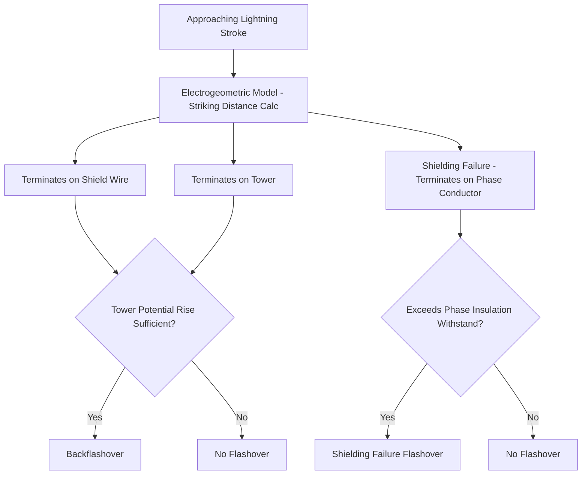
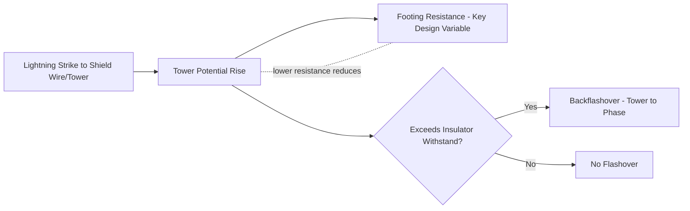

## Lightning Performance of Transmission Lines

### Overview

Lightning performance analysis quantifies and mitigates the rate of transmission line outages caused by lightning strikes, expressed conventionally as the number of flashovers or outages per 100 km of line per year. This discipline integrates lightning stroke statistics, line geometry (shielding design), tower footing impedance, and insulation withstand characteristics to predict and improve line reliability against what is, in many regions, the dominant cause of unplanned transmission line outages.

Two fundamentally distinct failure mechanisms are analyzed separately: **shielding failure** (lightning bypassing the shield wire to strike a phase conductor directly) and **backflashover** (lightning striking the shield wire or tower, with the resulting tower potential rise causing flashover from tower to phase conductor).

### Lightning Stroke Characteristics

Lightning performance analysis relies on statistical models of stroke current parameters, most commonly based on the widely cited CIGRE/IEEE lognormal distribution of first-stroke peak current magnitude:

$$P(I > I_0) = \frac{1}{1 + \left(\frac{I_0}{31}\right)^{2.6}}$$

This commonly cited formula (median current approximately 31 kA) represents the probability that a given stroke exceeds current $I_0$ (in kA); [Inference] specific parameter values vary somewhat between published studies and regional lightning data, and project-specific lightning current distribution data (from lightning detection networks, where available) is generally preferred over generic formulas for detailed line design.

**Ground Flash Density ($N_g$)**

- The number of lightning strokes to ground per km² per year at a given location, derived from lightning detection network data or historical keraunic level (thunderstorm-day) correlations in areas lacking direct detection network coverage.
- A foundational input to lightning performance calculations, since it directly scales the expected number of strikes to a line of given length and effective collection width.

**Line Attractive/Collection Width**

- Transmission lines, due to their height, attract a disproportionate share of nearby lightning strokes compared to flat ground — the effective collection width (a function of line height per the electrogeometric model described below) determines the total number of strokes terminating on the line (shield wire, tower, or phase conductors) per unit length per year.

### The Electrogeometric Model (EGM)

The electrogeometric model is the standard analytical framework for determining whether an approaching lightning stroke terminates on the shield wire, a tower, or a phase conductor, based on the concept of a "striking distance" that depends on stroke current magnitude.

$$r_s = A \cdot I^b$$

Where $r_s$ is the striking distance (the distance from the downward leader tip at which the final jump to a grounded object occurs), $I$ is the stroke current, and $A$, $b$ are empirical constants from various published EGM formulations (multiple variants exist, e.g., Armstrong-Whitehead, Brown-Whitehead, IEEE-recommended formulas, with somewhat differing constants).

**Shielding Failure Mechanism**

- For strokes below a certain critical current magnitude, the striking distance is small enough that a stroke approaching within the geometric "exposure zone" of a phase conductor (rather than the shield wire) can strike the phase conductor directly, bypassing the shield wire's intended protection.
- Counterintuitively, **shielding failures are associated with lower-magnitude strokes** — larger strokes have larger striking distances, making them more likely to be captured by the (typically higher, more exposed) shield wire before reaching the phase conductor within its narrower exposure window.
- The **shielding failure flashover rate (SFFOR)** quantifies the expected number of shielding-failure-induced flashovers per 100 km per year, calculated by integrating the stroke current probability distribution over the current range that produces shielding failure AND exceeds the phase conductor's insulation withstand (very low-current strokes that hit the phase conductor may not have enough energy to cause flashover, an important nuance in SFFOR calculation).

### Shielding Angle and Design

- The **shielding angle** is the angle between a vertical line through the shield wire and a line from the shield wire to the outermost phase conductor, historically the primary (simplified) design parameter for shielding effectiveness — smaller shielding angles generally provide better shielding effectiveness, though the relationship is geometry- and height-dependent rather than a simple universal rule.
- Modern practice increasingly relies on the electrogeometric model applied to the specific tower geometry rather than a fixed target shielding angle alone, since EGM analysis captures the current-dependent nature of shielding effectiveness that a single fixed angle cannot fully represent.
- **Double shield wires** (two shield wires rather than one) are used on many higher-voltage lines specifically to reduce the shielding failure rate by narrowing the exposure zone for phase conductors, at increased cost and additional tower loading.

### Backflashover Mechanism

When lightning strikes the shield wire or a tower directly (the majority of strokes to a well-shielded line), the stroke current flows through the tower structure and footing resistance to ground, causing a transient rise in tower potential:

$$V_{tower} \approx I \times R_{footing} + L_{tower}\frac{dI}{dt}$$

Where $R_{footing}$ is the tower footing (grounding) resistance/impedance and the second term accounts for the tower's own surge impedance/inductance effect during the fast current rise.

If this tower potential rise exceeds the withstand voltage of the insulator string (accounting for the fact that phase conductor voltage at the instant of the strike may partially add to or subtract from the tower potential rise, depending on power-frequency phase position — a factor incorporated in detailed backflashover rate calculations), a **backflashover** occurs: an insulator string flashover from tower to phase conductor, with current flowing in the reverse direction compared to a normal (phase-to-ground) fault path.

**Tower Footing Resistance is the Dominant Design Lever**

- Since backflashover rate is highly sensitive to tower footing resistance (directly scaling the tower potential rise for a given stroke current), reducing footing resistance is the primary and most cost-effective mitigation for backflashover-dominated lightning performance problems.
- Typical mitigation techniques: additional driven ground rods, counterpoise conductors (buried horizontal conductors extending from the tower base), chemical ground enhancement material in poor-conductivity soil, and connecting tower grounds to any adjacent conductive infrastructure (where permissible).

### Backflashover Rate (BFOR) Calculation Approach

The Backflashover Rate calculation integrates the probability distribution of stroke currents striking the shield wire/tower over the current range that produces a tower potential rise exceeding insulation withstand:

$$BFOR = N_L \times \int_{I_{crit}}^{\infty} f(I) \, dI$$

Where $N_L$ is the number of strokes to the line's shield wire/towers per 100 km per year (from the electrogeometric model and ground flash density), $f(I)$ is the stroke current probability density function, and $I_{crit}$ is the critical current magnitude at which tower potential rise equals insulator withstand voltage — currents above this level are assumed to cause backflashover.

[Inference] This represents the simplified conceptual basis of BFOR calculation; comprehensive line design studies typically use detailed traveling-wave/electromagnetic transient modeling of the specific tower, span, and grounding configuration (given the complexity of tower surge impedance, adjacent tower/span coupling, and non-linear soil ionization effects at high current) rather than the simplified closed-form approximation shown here.

### Worked Example: Simplified Backflashover Sensitivity

**Scenario**: A 230 kV line has an insulator string with critical flashover voltage (CFO) of 1300 kV. Tower footing resistance is currently 40 Ω. Approximate tower surge impedance effects are neglected for this simplified illustration (resistive approximation only).

**Step 1 — Critical current for backflashover (resistive approximation)**

$$I_{crit} \approx \frac{CFO}{R_{footing}} = \frac{1300}{40} = 32.5\ \text{kA}$$

**Step 2 — Effect of reducing footing resistance to 15 Ω**

$$I_{crit} \approx \frac{1300}{15} \approx 86.7\ \text{kA}$$

**Key Points**

- Reducing footing resistance from 40 Ω to 15 Ω raises the critical current threshold from ~32.5 kA to ~86.7 kA; since the majority of lightning strokes (per typical lognormal current distributions) fall below the higher threshold, this reduction substantially decreases the probability that a given strike exceeds the critical current — directly reducing backflashover rate.
- [Inference] This simplified resistive approximation neglects tower and span surge impedance effects, which are significant for accurate fast-front transient analysis; real backflashover rate calculations require considering the full traveling-wave behavior of the tower and adjacent spans, particularly for the initial (steepest) portion of the stroke current waveform.

### Improving Lightning Performance: Design Options Summary

| Mitigation | Primary Mechanism Addressed | Notes |
| --- | --- | --- |
| Reduce tower footing resistance | Backflashover | Most cost-effective lever in most cases; counterpoise, ground rods, soil treatment |
| Add/improve shield wire coverage (reduce shielding angle) | Shielding failure | Particularly important near line terminations and on taller/more exposed structures |
| Increase insulation (longer insulator strings, additional units) | Both (raises critical current for both mechanisms) | Higher cost; may require structure modification for clearance |
| Install line surge arresters (transmission-class) | Both | Directly limits voltage across insulator string regardless of mechanism; increasingly common on problem spans |
| Improve span/tower surge impedance characteristics | Backflashover (secondary effect) | Less commonly a primary design lever compared to footing resistance |

**Transmission-Class Line Surge Arresters**

- Installed in parallel with the insulator string on selected (typically high-footing-resistance or otherwise problematic) towers, providing a direct voltage-limiting path that prevents flashover regardless of whether the underlying cause would have been shielding failure or backflashover — an increasingly common targeted mitigation for specific problem locations rather than full-line application, given cost considerations.

### Standards and References

| Reference | Scope |
| --- | --- |
| IEEE Std 1243 | Guide for improving the lightning performance of transmission lines |
| CIGRE Technical Brochures (WG C4.xx series) | Lightning parameters for engineering applications, EGM formulations, and line performance methodology |
| IEEE Std 998 | Guide for direct lightning stroke shielding of substations (related, substation-focused parallel methodology) |

[Inference] Specific CIGRE brochure numbers and IEEE guide revision status change periodically; current governing document versions should be verified for project-specific design work.

**Related Topics**

- Electrogeometric model (EGM) formulations and striking distance calculation
- Tower footing resistance reduction techniques (counterpoise, ground enhancement)
- Insulation coordination principles (critical flashover voltage, BIL)
- Surge arrester selection and transmission-class line arrester application
- Substation direct lightning stroke shielding (IEEE 998)
- Ground flash density mapping and lightning detection networks
- Traveling-wave and electromagnetic transient (EMT) tower modeling
- Transmission line reliability indices and outage cause analysis