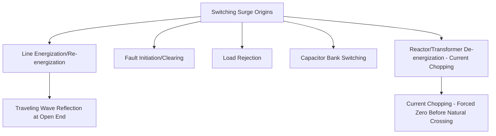
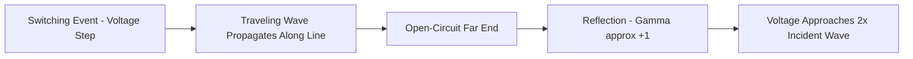
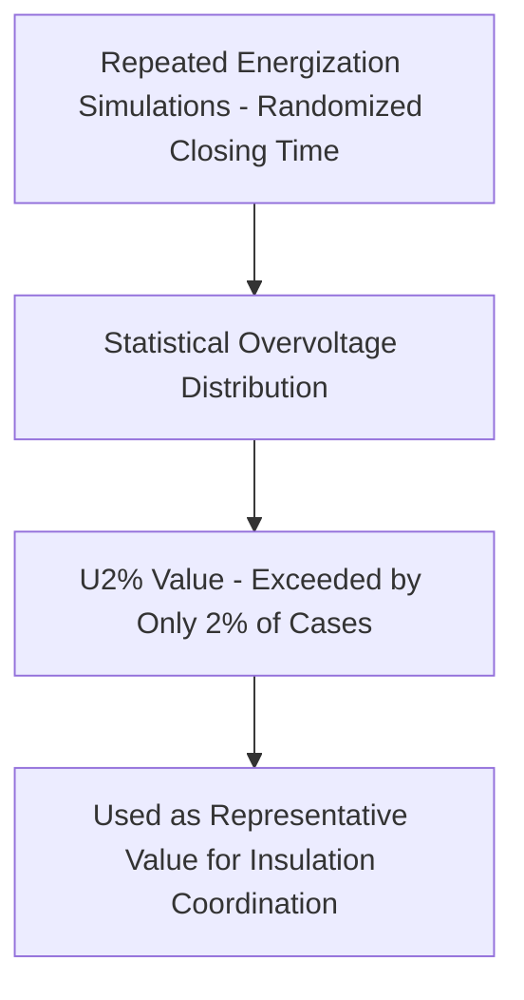
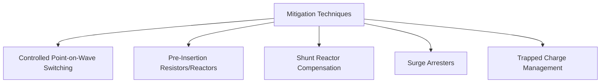

## Switching Surge Analysis and Mitigation

### Overview

Switching surges are slow-front transient overvoltages generated by the operation of switching devices (circuit breakers, disconnectors) or by system disturbances such as fault initiation/clearing, rather than by external phenomena like lightning. Unlike lightning surges (fast-front, externally originated), switching surges arise from within the system itself and become the dominant insulation coordination consideration at higher transmission voltages (typically above roughly 300 kV, where switching surge withstand — rather than lightning impulse withstand — often governs required phase-to-ground and phase-to-phase clearances).

### Origins of Switching Surges

**Line Energization and Re-energization**

- Energizing an unloaded or lightly loaded transmission line causes a traveling wave to propagate along the line, reflecting at the open (or terminated) far end; the superposition of incident and reflected waves can produce a voltage significantly exceeding the source voltage, particularly for longer lines.
- **Re-energization** (closing onto a line that retains trapped charge from a prior de-energization) is typically more severe than initial energization, since the trapped charge voltage can be of either polarity relative to the source voltage at the instant of reclosing, potentially doubling the effective voltage step compared to energizing from a de-energized (zero-charge) state.

**Fault Initiation and Clearing**

- The sudden change in system configuration when a fault occurs, and again when it is cleared, launches transient traveling waves; multi-phase faults and their clearing sequence can produce significant transient overvoltage on healthy phases.

**Load Rejection**

- Sudden loss of load (e.g., due to a remote breaker opening) on a lightly loaded, long transmission line can produce a temporary overvoltage due to the Ferranti effect (capacitive charging current on an open-ended or lightly loaded line causing receiving-end voltage to exceed sending-end voltage) combined with generator/exciter response dynamics — this overlaps somewhat with the temporary overvoltage (TOV) category discussed in insulation coordination but often has a switching-surge-like transient component during the initial disturbance.

**Capacitor and Reactor Bank Switching**

- Energizing a capacitor bank produces an inrush transient with oscillation frequency determined by the source and capacitor bank parameters; back-to-back capacitor bank switching (energizing one bank while an adjacent bank is already in service) can produce particularly high-frequency, high-magnitude inrush currents due to the low impedance path between adjacent banks.
- De-energizing (interrupting) an unloaded reactor or lightly loaded transformer can produce **current chopping** transients: certain circuit breaker interrupting technologies may force current to zero before the natural current zero-crossing, causing a rapid collapse of magnetic energy stored in the reactor/transformer inductance, producing a voltage spike.

### Traveling Wave Fundamentals

Switching surge magnitude on transmission lines is fundamentally governed by traveling wave (transmission line transient) theory. A voltage step applied at one end of a line propagates as a wave at a velocity close to the speed of light (for overhead lines) or somewhat slower (for cables, due to higher effective permittivity), governed by:

$$v = \frac{1}{\sqrt{LC}}$$

Where $L$ and $C$ are the line's per-unit-length inductance and capacitance.

At an open-circuit termination (or any impedance discontinuity), the wave reflects with a reflection coefficient:

$$\Gamma = \frac{Z_2 - Z_1}{Z_2 + Z_1}$$

For an open-circuit end ($Z_2 \to \infty$), $\Gamma \to +1$, meaning the reflected wave adds constructively to the incident wave, and the voltage at the open end can momentarily reach approximately twice the incident wave magnitude — the fundamental mechanism underlying line energization overvoltage.

### Statistical Nature of Switching Surge Overvoltage

Unlike a single deterministic value, switching surge magnitude for a given switching operation (e.g., line energization) varies statistically depending on the exact instant of switch closing relative to the power-frequency waveform, and (for reclosing) the magnitude and polarity of any trapped charge — since three-phase breaker poles rarely close at precisely the same instant, and the "worst-case" closing instant varies by phase and event.

This statistical behavior is typically characterized via:

- **Statistical distribution of switching surge overvoltage** (e.g., a cumulative probability distribution obtained from repeated energization simulations with randomized closing time, sometimes called a "statistical switching study").
- **$U_{2\%}$ value**: the overvoltage magnitude exceeded by only 2% of switching operations in the simulated/tested population — a standard reference value (per IEC 60071) used as the representative switching surge overvoltage for insulation coordination purposes on self-restoring insulation, reflecting the accepted statistical design philosophy for switching impulse withstand.

### Mitigation Techniques

**Controlled (Point-on-Wave) Switching**

- Modern circuit breakers with controlled switching capability (synchronized closing controllers) time the closing instant of each phase pole to coincide with a favorable point on the voltage waveform (e.g., near a voltage zero-crossing for capacitor bank energization, or accounting for trapped charge polarity for line reclosing), substantially reducing the worst-case transient magnitude compared to random (uncontrolled) closing.
- Particularly effective and widely applied for capacitor bank switching (targeting closing near voltage zero to minimize inrush) and increasingly applied for line energization/reclosing on higher-voltage systems.

**Pre-Insertion Resistors/Reactors**

- Circuit breakers equipped with pre-insertion resistors briefly insert a resistance in series with the line during the closing operation (typically for 8–15 ms) before the main contacts fully close, damping the initial traveling wave reflection and substantially reducing peak switching surge magnitude — a well-established, widely applied mitigation particularly for extra-high-voltage (EHV) line energization.
- Pre-insertion reactors serve an analogous damping function in some capacitor bank switching applications, limiting inrush current magnitude and rate of rise.

**Shunt Reactors (Line-Connected or Bus-Connected)**

- Permanently or switchably connected shunt reactors reduce the effective line charging (Ferranti) effect, limiting both steady-state temporary overvoltage and the severity of switching transients associated with line energization on long, lightly loaded EHV lines.
- **Switchable shunt reactors** (sometimes combined with a neutral reactor for single-phase reclosing secondary arc extinction) provide flexibility to apply reactive compensation only when needed (e.g., light-load periods) without permanently affecting heavy-load power transfer capability.

**Surge Arresters**

- While traditionally sized primarily for lightning (fast-front) protection, surge arresters — particularly modern MOV types with good energy absorption characteristics — also provide meaningful switching surge voltage limiting, and dedicated line-connected arresters are sometimes applied specifically to control switching surge magnitude on critical EHV lines, especially where controlled switching or pre-insertion resistors are not economically justified for the full mitigation requirement.

**Trapped Charge Management**

- For line reclosing applications, techniques to actively discharge trapped line charge before reclosing (e.g., via a brief closing of grounding switches, or allowing sufficient dead time for natural decay via line insulator leakage and corona losses) reduce the severity of the subsequent reclosing transient compared to reclosing onto a fully charged line.

### Worked Example: Pre-Insertion Resistor Effect (Conceptual)

**Scenario**: A 500 kV line energization study (without mitigation) shows a statistical $U_{2\%}$ switching surge overvoltage of 2.2 pu (per unit of peak phase-to-ground voltage). The line's required switching impulse withstand (BSL), after applying standard coordination margin, would require a BSL corresponding to roughly 2.2 pu — a costly insulation/clearance requirement. A pre-insertion resistor scheme is proposed.

**Typical effect** [Inference — actual percentage reduction is highly system- and study-specific, requiring EMT simulation for the specific line and resistor value; the following illustrates the general order of benefit reported in industry practice rather than a precise universal figure]:

- Properly designed pre-insertion resistors commonly reduce statistical switching surge overvoltage from the 2.0–2.5 pu range (typical uncontrolled energization on long EHV lines) to approximately 1.5–1.8 pu.

**Key Points**

- This reduction directly translates into reduced required insulation/clearance for the line and connected equipment — historically one of the primary economic justifications for pre-insertion resistor breakers on EHV lines, since tower window/clearance dimensions (and hence tower cost and right-of-way width) scale with required switching impulse withstand at these voltage levels.
- Modern controlled (point-on-wave) switching technology is increasingly considered as an alternative or complement to pre-insertion resistors, potentially achieving comparable overvoltage reduction with different maintenance and reliability tradeoffs (pre-insertion resistor breakers have additional mechanical complexity; controlled switching relies on accurate voltage measurement and timing control electronics).
- [Inference] The specific choice between these mitigation approaches for a given project depends on detailed system studies, breaker technology availability, and economic comparison — no single approach is universally preferred across all applications.

### Relationship to Insulation Coordination

Switching surge analysis directly feeds the insulation coordination process:

- The statistical $U_{2\%}$ overvoltage (with appropriate safety margin) determines the required switching impulse withstand (BSL) for self-restoring insulation such as phase-to-ground and phase-to-phase air clearances.
- At EHV and UHV voltage levels, switching surge withstand requirements frequently govern tower geometry and clearance design more than lightning impulse withstand, since switching surge magnitude scales with system operating voltage while lightning surge severity is largely independent of system voltage class — making switching surge mitigation economically significant primarily at higher voltage levels.

### Standards and References

| Standard | Scope |
| --- | --- |
| IEC 60071-2 | Insulation coordination application guide, including switching surge statistical methodology |
| IEEE Std C62.82.2 (formerly 1313.2) | Application guide for insulation coordination, switching surge considerations |
| CIGRE Technical Brochures (various, WG C4/B4 series) | Switching surge study methodology, controlled switching application guidance |

**Related Topics**

- Insulation coordination principles and switching impulse withstand (BSL)
- Traveling wave theory and transmission line transient analysis
- Controlled (point-on-wave) switching technology for circuit breakers
- Shunt reactor compensation for EHV transmission lines
- Surge arrester energy absorption and line discharge class
- Electromagnetic transient (EMT) simulation methodology
- Ferranti effect and temporary overvoltage on lightly loaded lines
- Circuit breaker interrupting technology and current chopping phenomena