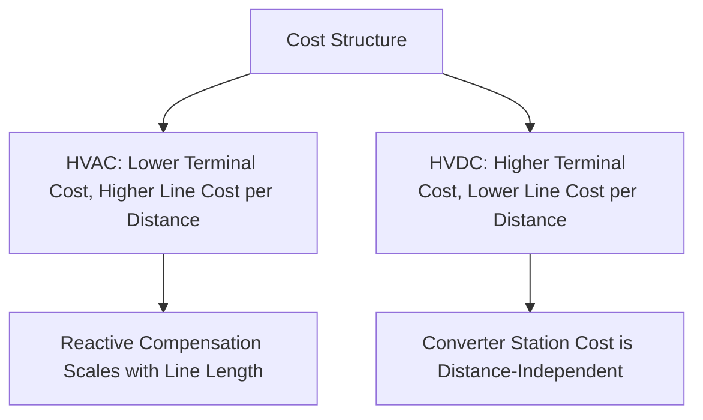
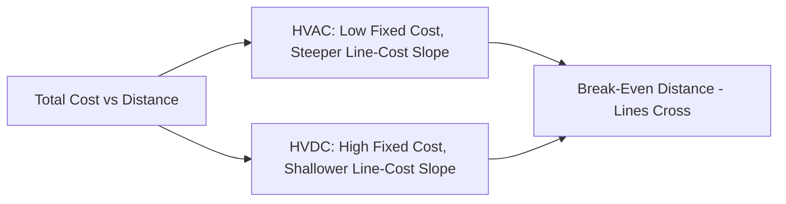
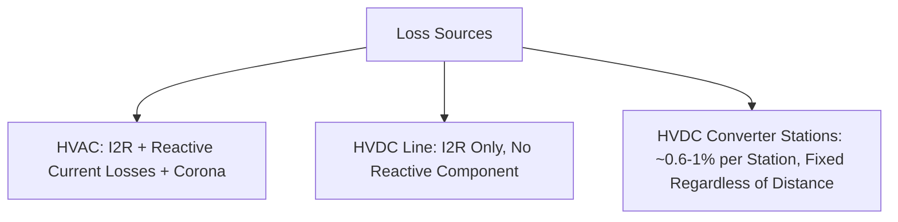
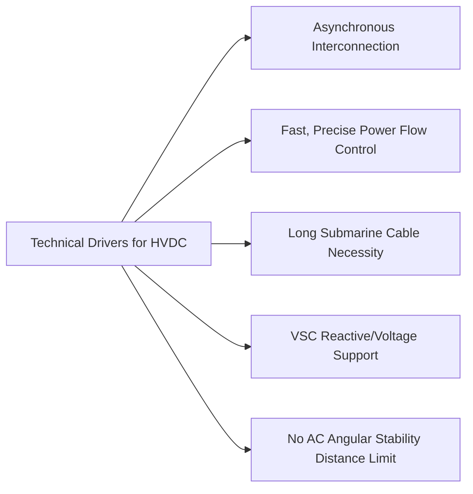

## HVAC versus HVDC Transmission Economics

### Overview

The choice between High-Voltage Alternating Current (HVAC) and High-Voltage Direct Current (HVDC) transmission for a given application is fundamentally an economic and technical trade-off analysis, weighing line/cable capital costs, terminal (converter/substation) equipment costs, losses, and technical capability differences (distance limitations, controllability, asynchronous interconnection) against each other. There is no universally correct choice — the optimal technology depends heavily on transmission distance, whether the route is overhead or submarine/underground, power transfer requirements, and specific system integration needs.

### Fundamental Cost Structure Comparison

**HVAC Systems**

- **Line/cable cost**: generally lower cost per unit length for overhead lines at a given power rating compared to equivalent HVDC overhead lines, due to well-established, mature design and construction practice; however, AC cables (particularly submarine/underground) face significant capacitive charging current limitations that HVDC does not.
- **Terminal cost**: relatively low — AC substations (transformers, switchgear, protection) are mature, standardized, and comparatively inexpensive relative to HVDC converter stations.
- **Reactive compensation requirement**: long AC lines and especially AC cables require substantial shunt reactive compensation (shunt reactors for lines, due to charging current) to manage voltage profile — an additional cost that scales with distance and is particularly severe for AC cables.

**HVDC Systems**

- **Line/cable cost**: for a given power transfer capability, HVDC transmission lines/cables can be less expensive than equivalent AC lines, since DC transmission requires only two (bipolar) or even one (monopolar with ground/sea return) conductor compared to three phase conductors for AC, and does not have reactive/charging current losses over the line length.
- **Terminal cost**: substantially higher — HVDC converter stations (rectifier and inverter) involve expensive power electronic valves (thyristor-based LCC or IGBT-based VSC), transformers, filters, and control systems, representing a significant fixed cost regardless of transmission distance.
- **No reactive compensation requirement along the DC link itself**: DC transmission has no reactive power flow or charging current issue over the line/cable length (though LCC converter stations themselves require substantial reactive compensation/filtering at the AC terminals).

### The Break-Even Distance Concept

The classic HVAC-vs-HVDC economic comparison is illustrated by plotting total system cost (terminal cost plus line cost, as a function of transmission distance) for each technology:

- HVDC has a **higher fixed cost** (converter stations) but a **lower cost per unit distance** for the line/cable itself.
- HVAC has a **lower fixed cost** (substations) but generally comparable-to-higher cost per unit distance once reactive compensation requirements are included, particularly for cable applications.
- The **break-even distance** is the transmission length at which total HVDC system cost equals total HVAC system cost; beyond this distance, HVDC becomes the more economical choice, while below it, HVAC remains more economical.

$$C_{total} = C_{terminal} + C_{line} \times d$$

Where $d$ is transmission distance; setting $C_{HVAC}(d) = C_{HVDC}(d)$ and solving for $d$ gives the break-even distance.

**Typical Break-Even Distance Ranges** [Inference — these figures are widely cited industry rules of thumb but vary considerably based on specific project parameters, voltage level, technology (LCC vs VSC), and prevailing equipment/construction costs at the time of a given study; they should not be treated as precise universal thresholds]:

| Transmission Type | Approximate Break-Even Distance |
| --- | --- |
| Overhead line | Roughly 500–800 km |
| Submarine cable | Roughly 50–100 km |
| Underground cable | Roughly 50–100 km (similar drivers to submarine cable — AC charging current limitation) |

**Why Cable Break-Even Distances Are Much Shorter Than Overhead Lines**

- AC cables have dramatically higher capacitance per unit length than overhead lines (due to the close proximity of conductor and shield/sheath with a solid dielectric between them), producing very high charging current that consumes an increasing share of the cable's current-carrying capacity as length increases.
- Beyond a certain length, an AC cable's charging current alone approaches its thermal current rating, leaving little or no capacity for actual power transfer — sometimes requiring intermediate reactive compensation stations for longer AC cable routes (impractical for submarine applications) — making DC cables the practical necessity rather than merely the economic preference beyond a certain submarine/underground distance.

### Loss Comparison

**HVAC Line Losses**

- $I^2R$ conductor losses (present in both AC and DC), plus additional AC-specific losses: reactive current flow contributes to $I^2R$ losses without delivering real power, and corona losses (partial discharge from conductor surface, more significant at very high AC voltages) contribute additional loss not present (or present at lower magnitude) in equivalent DC transmission.

**HVDC Line Losses**

- Only $I^2R$ conductor losses at DC (no reactive current component in the line itself), generally giving DC transmission a per-kilometer loss advantage over long distances for equivalent power transfer.

**HVDC Converter Station Losses**

- A significant loss component unique to HVDC: each converter station (rectifier and inverter) introduces conversion losses, historically cited in the range of roughly 0.6–1% of transferred power per converter station for modern designs [Inference — specific converter loss figures are technology- and vendor-specific (LCC vs. VSC, and specific converter design generation) and should be confirmed against current manufacturer/project data rather than treated as a fixed universal value], meaning a two-terminal HVDC link incurs converter losses at both ends regardless of transmission distance.

**Net Loss Comparison**

- For short distances, HVDC's fixed converter station losses may exceed the loss savings from reduced line losses, making HVAC more efficient overall.
- For long distances, the cumulative HVAC line loss advantage of HVDC eventually outweighs the fixed converter losses, favoring HVDC — this crossover distance is generally shorter than the pure capital-cost break-even distance in many published comparisons, though [Inference] the precise relationship depends on the specific loss and cost figures used in any given study.

### Technical (Non-Purely-Economic) Drivers for HVDC Selection

Beyond direct cost comparison, several technical factors independently favor HVDC regardless of break-even distance calculations:

**Asynchronous Interconnection**

- HVDC (particularly back-to-back converter stations with no significant transmission distance) allows interconnection between AC systems operating at different frequencies, or at the same nominal frequency but without synchronized phase angle/frequency control (e.g., interconnecting two separate synchronous grids) — a capability AC transmission cannot provide, since AC interconnection requires synchronism.

**Precise, Fast Power Flow Control**

- HVDC converters provide direct, fast, and precise control of active power transfer magnitude and direction, independent of the connected AC systems' voltage angle relationship — valuable for grid stability support, congestion management on parallel AC paths, and power flow control that AC transmission (governed by line impedance and voltage angle differences) cannot directly provide.

**Long Submarine Cable Crossings**

- As discussed above, beyond a certain distance, AC cable transmission becomes technically impractical (not merely uneconomical) due to charging current constraints, making HVDC the only practical technology choice for long submarine interconnections (e.g., offshore wind farm connections beyond a certain distance from shore, or long inter-island/inter-country submarine links).

**Reactive Power / Voltage Support Capability (VSC-HVDC specifically)**

- Voltage-Source Converter (VSC) based HVDC systems can independently control reactive power at each converter terminal (similar to STATCOM capability), providing voltage support to weak AC grids at either end — a capability not inherent to AC transmission itself.

**Bulk Power Transfer Without Stability Limit Concerns**

- AC transmission over very long distances faces steady-state and transient stability limits (related to power-angle relationships) that can constrain deliverable power well below thermal conductor limits; HVDC transmission does not have this angular stability constraint over distance, since DC power flow is set directly by converter control rather than by voltage angle difference across line impedance.

### LCC-HVDC vs. VSC-HVDC Economic Considerations

| Attribute | LCC-HVDC (Line-Commutated, Thyristor) | VSC-HVDC (Voltage-Source, IGBT) |
| --- | --- | --- |
| Converter cost | Generally lower | Generally higher (though gap has narrowed with MMC maturity) |
| Converter losses | Somewhat lower per station (historically) | Somewhat higher, though modern MMC designs have substantially closed this gap |
| Reactive power/filter requirement | Significant (requires substantial reactive compensation/AC filters) | Minimal to none (inherent reactive control capability) |
| Footprint | Larger (filter yards) | More compact |
| Weak AC system connection capability | Limited (requires sufficient AC system strength, i.e., short-circuit ratio, for reliable commutation) | Well-suited (can connect to very weak or even passive/islanded AC networks) |
| Typical application | Very high-power, long-distance bulk transmission | Offshore wind integration, urban infeed, multi-terminal grids |

[Inference] The relative economic positioning of LCC versus VSC continues to evolve as VSC/MMC technology matures and costs decline; project-specific vendor quotations remain necessary for an accurate current comparison rather than relying on generalized historical cost differentials.

### Worked Example: Simplified Break-Even Illustration

**Scenario**: A proposed 600 km overhead transmission corridor is being evaluated for either a 500 kV AC double-circuit line or an equivalent-capacity ±500 kV HVDC bipole.

**Illustrative cost inputs** (order-of-magnitude, for illustration only):

- HVAC: terminal (substation) cost ≈ $50 million; line cost ≈ $1.0 million/km (including shunt reactor compensation).
- HVDC: terminal (converter stations, both ends) cost ≈ $300 million; line cost ≈ $0.6 million/km.

**Total cost at 600 km**:

$$C_{HVAC} = 50 + (1.0 \times 600) = 650\ \text{million}$$

$$C_{HVDC} = 300 + (0.6 \times 600) = 660\ \text{million}$$

**Break-even distance** (solving $C_{HVAC}(d) = C_{HVDC}(d)$):

50 + 1.0d = 300 + 0.6d \implies 0.4d = 250 \implies d = 625\ \text{km}$}

**Key Points**

- At 600 km, this illustrative example falls just below the calculated 625 km break-even point, marginally favoring HVAC on pure capital cost — but the outcome is close enough that loss evaluation, reliability/redundancy requirements, and any technical drivers (e.g., need for power flow control or asynchronous interconnection) could readily shift the decision toward HVDC.
- [Inference] All cost figures in this example are illustrative approximations for demonstrating the calculation methodology; actual project economics require current, project-specific vendor and construction cost estimates, along with detailed loss and reliability (availability) analysis, not generic per-km cost assumptions.

### Additional Considerations Beyond Simple Break-Even Analysis

- **Right-of-way and environmental factors**: HVDC lines can sometimes achieve narrower right-of-way and lower visual/environmental impact for a given power transfer compared to equivalent AC lines, an increasingly significant factor in permitting-constrained regions.
- **System reliability and redundancy**: bipolar HVDC configurations can continue partial operation (at reduced capacity) if one pole is lost, a redundancy characteristic distinct from typical AC double-circuit line behavior.
- **Black-start and grid-forming capability**: modern VSC-HVDC systems increasingly offer grid-forming and black-start support capability, an emerging factor in economic/technical evaluation not captured by traditional break-even distance analysis alone.
- **Multi-terminal and DC grid considerations**: extending a point-to-point HVDC link to multi-terminal configuration involves additional technical and economic complexity beyond the simple two-terminal comparison presented here.

**Related Topics**

- LCC-HVDC converter technology and control
- VSC-HVDC and Modular Multilevel Converter (MMC) technology
- Submarine and underground HVDC cable design
- Multi-terminal HVDC and DC grid architecture
- Offshore wind farm HVDC grid integration
- AC transmission line steady-state and transient stability limits
- Reactive power and filter design for LCC converter stations
- HVDC system reliability and redundancy (bipole configuration)