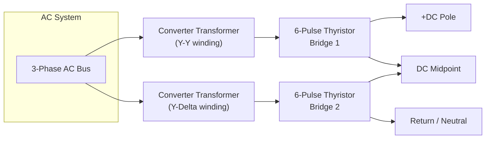
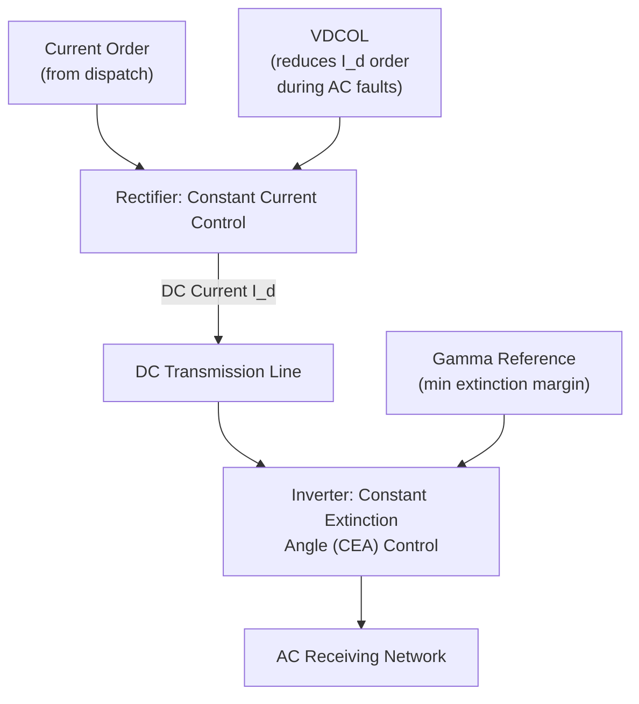
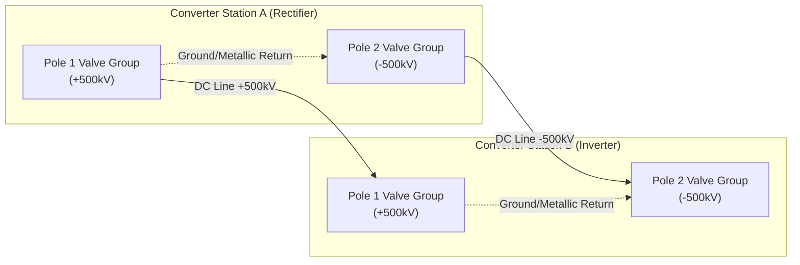

## Line-Commutated Converter (LCC) HVDC Technology

### Overview and Historical Context

Line-Commutated Converter (LCC) HVDC is the original and most mature high-voltage direct current transmission technology, commercially deployed since the 1950s (the Gotland link in Sweden, 1954, using mercury-arc valves). Modern LCC schemes use thyristor valves, first introduced in the 1970s, and remain the dominant choice for ultra-high-power, ultra-long-distance bulk transmission and asynchronous interconnections.

LCC relies on naturally commutated thyristor switching, where the AC system voltage itself forces current commutation from one valve to the next. This distinguishes it fundamentally from Voltage-Sourced Converter (VSC) HVDC, which uses self-commutated devices (IGBTs) capable of switching independent of the AC waveform.

### Core Operating Principle

The thyristor is a semiconductor device that can be triggered "on" via a gate pulse but cannot be turned "off" by gate control — it only turns off when the current through it naturally reverses to zero (natural or line commutation). This means:

- The converter absolutely requires a "stiff" AC voltage source at both terminals to achieve commutation
- The AC system's voltage zero-crossings dictate the timing window for valve switching
- LCC **consumes** reactive power (typically 50-60% of the transmitted active power) rather than being able to independently control it

**Key Points**

- Thyristors conduct once triggered and remain on until current naturally crosses zero
- Firing angle $\alpha$ controls the DC output voltage, not the current magnitude directly
- Cannot operate into a passive/weak AC network without additional support (e.g., synchronous condensers, STATCOMs)

### Converter Topology: The 12-Pulse Bridge

The fundamental building block is the Graetz bridge — a 6-pulse, 3-phase full-wave rectifier/inverter built from 6 thyristor valves. In practice, virtually all modern LCC schemes use a **12-pulse configuration**: two 6-pulse bridges connected in series on the DC side, fed by transformers with a 30° phase shift (one Y-Y, one Y-Δ winding configuration).

**Why 12-pulse:**

- Cancels the 5th and 7th harmonics on the AC side (dominant harmonics of a 6-pulse bridge)
- Reduces DC-side ripple, lowering filter requirements
- Halves the AC filtering burden compared to two independent 6-pulse bridges

### Valve Structure and Firing Control

Each of the 6 valve positions in a bridge is typically composed of many thyristors connected in series (to achieve the required blocking voltage rating, since a single thyristor may only block a few kV), grouped into modules within **thyristor valve towers**, often housed in a dedicated valve hall.

**Firing (delay) angle $\alpha$:**

The DC voltage output of a 6-pulse bridge is given by:

$$V_{d} = \frac{3\sqrt{2}}{\pi}V_{LL}\cos(\alpha) - \frac{3}{\pi}\omega L_{c}I_{d}$$

where $V_{LL}$ is the AC line-to-line RMS voltage, $L_c$ is the commutating inductance (from transformer leakage reactance), and $I_d$ is the DC current.

- $\alpha = 0°$–$90°$: rectifier operation (power flows AC→DC)
- $\alpha = 90°$–$180°$: inverter operation (power flows DC→AC)
- Practical rectifier operation: $\alpha \approx 15°$–$18°$ minimum (to guarantee valve turn-on margin)
- Practical inverter operation: constrained by **extinction angle** $\gamma$ (margin before commutation failure), typically $\gamma \approx 15°$–$18°$ minimum

### Commutation Process and Overlap Angle

When a valve is fired, current does not transfer instantaneously to the incoming valve — the finite transformer leakage inductance causes a temporary overlap period (angle $\mu$) during which two valves conduct simultaneously. This overlap:

- Reduces the average DC voltage
- Introduces characteristic voltage notches on the AC waveform (a key power-quality signature of LCC)
- Must remain within limits, or the extinction angle margin collapses, risking **commutation failure**

**Commutation Failure**

A commutation failure occurs when a valve that should have turned off (as current transferred to the next valve) fails to do so — usually triggered by an AC-side voltage dip/fault reducing the driving voltage available for commutation. This causes a temporary short-circuit of the DC pole through the bridge, collapsing DC voltage and briefly interrupting power transfer. LCC schemes are inherently susceptible to this, especially at the inverter end where the extinction margin is already tight. [Inference: susceptibility severity depends heavily on the specific AC network's short-circuit ratio and fault type, so this is a design-sensitive rather than universal quantity.]

### Reactive Power Consumption and Compensation

LCC converters consume reactive power proportional to the firing/extinction angle, roughly 50-60% of the rated active power at both ends. This must be compensated locally, since LCC cannot generate reactive power like VSC can.

**Compensation methods:**

- Switched capacitor banks
- AC harmonic filters that double as reactive power sources (tuned filters at 11th, 13th, 23rd, 25th harmonics, plus high-pass filters)
- Synchronous condensers (for weak grids requiring additional short-circuit strength)
- Static VAR Compensators (SVC) in some modern schemes

### Short-Circuit Ratio (SCR) and AC System Strength

LCC HVDC requires a reasonably strong AC network at both terminals because commutation depends on the AC voltage waveform being stable and quickly self-restoring after disturbances. This is quantified by the **Short-Circuit Ratio**:

$$SCR = \frac{S_{ac,fault}}{P_{dc,rated}}$$

- $SCR > 3$: Strong AC system — normal LCC operation
- $SCR = 2$–$3$: Weak AC system — special controls, filters, or dynamic reactive support required
- $SCR < 2$: Very weak system — LCC generally infeasible without synchronous condensers or hybrid VSC support

This is a defining limitation versus VSC HVDC, which can operate into very weak or even passive networks (black-start capable).

### Control Strategy

LCC control operates via firing angle manipulation using a cascaded control hierarchy:

- **Rectifier station**: typically operates in constant current (CC) control
- **Inverter station**: typically operates in constant extinction angle (CEA) control, or constant voltage (CV) control at lighter loading
- A **voltage-dependent current order limiter (VDCOL)** reduces current order during AC voltage dips, helping recovery from faults and limiting commutation failure recurrence

### DC Filters and Harmonic Mitigation

Because 12-pulse operation still generates residual characteristic harmonics (12th, 24th, etc., on the AC side; 12th, 24th on the DC side), both AC-side and DC-side filters are mandatory:

- **AC filters**: tuned single/double-tuned branches plus high-pass filters, sized also to supply reactive power
- **DC filters**: smoothing reactors (large series inductors, historically 0.5-1.0 H) plus DC-side harmonic filters to prevent telephone interference and reduce ripple on the DC line

### Physical/System Configuration Example

**Example**

A typical bipolar LCC HVDC scheme:

- Two independent poles (+V and −V) referenced to a common ground/earth return or metallic return conductor
- Each pole rated at, e.g., ±500 kV, 3000 A → 1500 MW per pole, 3000 MW total
- Redundancy: if one pole trips, the other continues transmitting at half capacity (or up to its overload rating), unlike a monopolar scheme which fully loses transmission capability

### Comparison: LCC vs. VSC HVDC

| Attribute | LCC HVDC | VSC HVDC |
| --- | --- | --- |
| Switching device | Thyristor (line-commutated) | IGBT (self-commutated) |
| Reactive power | Consumes, needs external compensation | Independently controllable (4-quadrant) |
| AC network requirement | Strong (SCR > 2-3) | Can serve weak/passive networks |
| Power reversal | Requires DC voltage polarity reversal | DC current direction reversal (voltage polarity fixed) |
| Footprint | Larger valve halls, more filters | More compact |
| Commutation failure risk | Yes | No (not applicable) |
| Typical power rating | Very high (>2000 MW per pole common) | Historically lower, though modern VSC (e.g., ±800 kV) is closing the gap |
| Black start capability | No | Yes |
| Losses per station | Lower (~0.7-0.8%) | Higher (~1-2%), though newer designs are improving |

### Applications

- **Long-distance bulk power transmission**: e.g., hydroelectric power from remote generation (Itaipu, Three Gorges–Shanghai, Rihand-Delhi)
- **Asynchronous interconnections**: linking grids of different frequencies or unsynchronized grids (Japan's 50/60 Hz interconnections)
- **Submarine cable crossings** where AC transmission is impractical beyond ~50-80 km due to cable charging current
- **Back-to-back (B2B) schemes**: no DC line at all, both converters at one site, purely for asynchronous grid interconnection

### Advantages

- Proven technology with the highest power and voltage ratings in commercial service (up to ±1100 kV UHVDC, e.g., China's Changji-Guquan line)
- Lower converter station losses relative to VSC
- Lower cost per MW at very high power/distance combinations
- Long, well-established reliability track record

### Limitations

- Requires a minimum AC system strength (SCR) to commutate reliably
- Susceptible to commutation failure during AC-side faults
- Large reactive power consumption requiring extensive filter/compensation infrastructure
- Cannot supply power to a passive/dead network (no black-start capability)
- Larger physical footprint (valve halls, filter yards)
- Slower dynamic response compared to VSC for power reversal

### Diagram: LCC Converter Station Single-Line

<svg xmlns="http://www.w3.org/2000/svg" viewBox="0 0 800 420" font-family="Arial, sans-serif">
<text x="400" y="25" font-size="16" font-weight="bold" text-anchor="middle">LCC HVDC Converter Station – Single-Line (svg_diagram)</text>
<line x1="50" y1="70" x2="750" y2="70" stroke="black" stroke-width="2" />
<text x="60" y="60" font-size="12">AC Busbar</text>
<line x1="150" y1="70" x2="150" y2="110" stroke="black" stroke-width="2" />
<rect x="100" y="110" width="100" height="50" fill="none" stroke="black" stroke-width="2" />
<text x="150" y="140" font-size="11" text-anchor="middle">Filter Bank</text>
<line x1="300" y1="70" x2="300" y2="120" stroke="black" stroke-width="2" />
<rect x="250" y="120" width="100" height="60" fill="none" stroke="black" stroke-width="2" />
<text x="300" y="145" font-size="11" text-anchor="middle">Converter</text>
<text x="300" y="160" font-size="11" text-anchor="middle">Transformer</text>
<text x="300" y="173" font-size="10" text-anchor="middle">(Y-Y)</text>
<line x1="450" y1="70" x2="450" y2="120" stroke="black" stroke-width="2" />
<rect x="400" y="120" width="100" height="60" fill="none" stroke="black" stroke-width="2" />
<text x="450" y="145" font-size="11" text-anchor="middle">Converter</text>
<text x="450" y="160" font-size="11" text-anchor="middle">Transformer</text>
<text x="450" y="173" font-size="10" text-anchor="middle">(Y-Delta)</text>
<rect x="270" y="220" width="60" height="80" fill="none" stroke="black" stroke-width="2" />
<text x="300" y="260" font-size="10" text-anchor="middle">6-Pulse</text>
<text x="300" y="273" font-size="10" text-anchor="middle">Bridge 1</text>
<line x1="300" y1="180" x2="300" y2="220" stroke="black" stroke-width="2" />
<rect x="420" y="220" width="60" height="80" fill="none" stroke="black" stroke-width="2" />
<text x="450" y="260" font-size="10" text-anchor="middle">6-Pulse</text>
<text x="450" y="273" font-size="10" text-anchor="middle">Bridge 2</text>
<line x1="450" y1="180" x2="450" y2="220" stroke="black" stroke-width="2" />
<line x1="330" y1="230" x2="420" y2="230" stroke="black" stroke-width="2" />
<line x1="300" y1="300" x2="450" y2="300" stroke="black" stroke-width="2" />
<line x1="300" y1="230" x2="600" y2="230" stroke="red" stroke-width="3" />
<text x="610" y="234" font-size="11" fill="red">+DC Pole</text>
<circle cx="600" cy="230" r="4" fill="red" />
<line x1="450" y1="300" x2="600" y2="300" stroke="blue" stroke-width="3" />
<text x="610" y="304" font-size="11" fill="blue">DC Return</text>
<circle cx="600" cy="300" r="4" fill="blue" />
<rect x="600" y="220" width="40" height="20" fill="none" stroke="black" />
<text x="620" y="234" font-size="9" text-anchor="middle" />
<line x1="640" y1="230" x2="700" y2="230" stroke="black" stroke-width="1" stroke-dasharray="4,2" />
<text x="705" y="234" font-size="10">Smoothing Reactor →</text>
<line x1="600" y1="70" x2="750" y2="70" stroke="black" stroke-width="2" />
<rect x="650" y="110" width="100" height="50" fill="none" stroke="black" stroke-width="2" />
<text x="700" y="140" font-size="11" text-anchor="middle">Filter Bank</text>
<line x1="700" y1="70" x2="700" y2="110" stroke="black" stroke-width="2" />
</svg>

### Next Steps

**Related Topics**

- Voltage-Sourced Converter (VSC) HVDC Technology
- Thyristor Valve Design and Cooling Systems
- HVDC Converter Transformers and Insulation Coordination
- Commutation Failure Analysis and Mitigation Techniques
- Short-Circuit Ratio and AC Network Strength Assessment
- HVDC Control Hierarchies (Master Control, Pole Control, Valve Group Control)
- AC/DC Harmonic Filter Design for HVDC Stations
- Hybrid LCC-VSC HVDC Schemes
- Multi-Terminal HVDC (MTDC) Systems
- Ultra-High-Voltage Direct Current (UHVDC) Transmission (±800 kV and above)