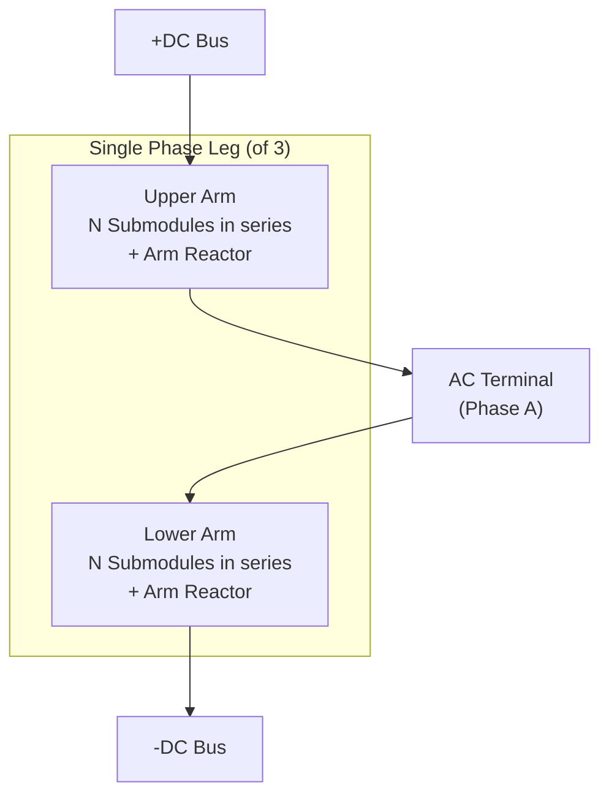
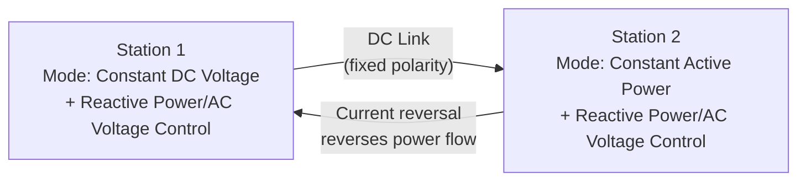

## Voltage-Source Converter (VSC) HVDC Technology

### Overview and Historical Context

Voltage-Source Converter (VSC) HVDC is the modern alternative to LCC HVDC, commercially introduced in 1997 (Hellsjön-Grängesberg pilot, Sweden) under ABB's "HVDC Light" branding, with Siemens ("HVDC PLUS") and GE/Alstom ("HVDC MaxSine") offering equivalent technology. VSC uses self-commutated semiconductor switches — primarily Insulated Gate Bipolar Transistors (IGBTs) — that can be turned both on and off independent of the AC waveform, unlike the thyristors used in LCC.

This self-commutation capability fundamentally changes converter behavior: VSC can independently control active and reactive power, operate into weak or even passive AC networks, and reverse power flow without reversing DC voltage polarity.

### Core Operating Principle

Unlike LCC, VSC does not depend on the AC system voltage to force current commutation. Instead, IGBTs are switched using pulse-width modulation (PWM) or, in modern designs, multilevel switching patterns, synthesizing an AC waveform from a fixed-polarity DC voltage.

**Key Points**

- IGBTs can be commanded off at any point in the current cycle (fully controllable switching)
- The converter behaves as a controllable AC voltage source behind a reactor, enabling independent 4-quadrant control of active (P) and reactive (Q) power
- DC voltage polarity remains fixed; power reversal is achieved by reversing DC current direction
- Can energize a "dead" AC network (black-start capability), since it does not require an existing AC voltage to commutate

### Converter Topologies

**1. Two-Level and Three-Level Converters (early generation)**

Early VSC-HVDC used two-level or three-level (Neutral-Point-Clamped, NPC) converters with high-frequency PWM (1-2 kHz switching). These required significant AC-side filtering to remove switching harmonics and produced comparatively higher switching losses.

**2. Modular Multilevel Converter (MMC) — current standard**

Since approximately 2010 (Siemens' Trans Bay Cable project), the **Modular Multilevel Converter (MMC)** has become the dominant VSC topology. MMC builds the output waveform from a large number of small voltage steps generated by individually switched submodules, closely approximating a sinusoid with minimal harmonic content.

**MMC Submodule (Half-Bridge) Structure:**

Each submodule contains two IGBTs (T1, T2), two anti-parallel diodes, and a DC storage capacitor. Depending on switching state, the submodule inserts either its capacitor voltage or zero voltage into the arm:

- **T1 ON, T2 OFF**: Submodule "inserted" — capacitor voltage $V_C$ added to the arm voltage
- **T1 OFF, T2 ON**: Submodule "bypassed" — zero voltage contributed

By coordinating hundreds of submodules per arm (typically 200-400+ in modern UHV schemes), the converter synthesizes a near-sinusoidal, near-harmonic-free waveform directly, drastically reducing filter requirements compared to both LCC and two-level VSC.

**Submodule variants:**

- **Half-bridge submodule (HBSM)**: lowest cost, most common; cannot block DC fault current (cannot generate negative voltage)
- **Full-bridge submodule (FBSM)**: 4 IGBTs, can generate negative voltage, enables DC fault current blocking/ride-through, but roughly doubles conduction losses and cost
- **Hybrid designs**: mix of HBSM and FBSM arms to balance cost vs. DC fault handling capability [Inference: exact ratios and deployment choices are project-specific and vendor-dependent]

### Control Strategy: Independent P-Q Control

VSC's defining advantage is decoupled control of active and reactive power, typically implemented via a $dq$-frame vector control scheme:

- **d-axis current** ($I_d$): controls active power transfer (or DC voltage, depending on station role)
- **q-axis current** ($I_q$): controls reactive power exchange (or AC voltage support)

**Station-level control modes:**

- One station typically regulates **DC voltage** (analogous to slack-bus behavior on the DC grid)
- The other station regulates **active power** (scheduled power transfer)
- Each station independently regulates **reactive power** or **AC voltage** at its own terminal, unconstrained by the other station's settings

$$P = \frac{V_{ac} \cdot V_{conv}}{X}\sin(\delta), \quad Q = \frac{V_{ac}(V_{ac} - V_{conv}\cos(\delta))}{X}$$

where $V_{conv}$ is the converter-synthesized AC voltage magnitude, $V_{ac}$ is the grid voltage, $\delta$ is the phase angle between them, and $X$ is the coupling reactance (arm reactor + transformer leakage).

### Reactive Power Capability

Unlike LCC (which always consumes reactive power), VSC can independently generate or absorb reactive power within its converter rating, functioning similarly to a STATCOM in addition to transmitting active power. This eliminates most or all of the need for switched capacitor banks and synchronous condensers required in LCC schemes.

**Example**

A VSC station rated at 1000 MW active power with a converter MVA rating of 1100 MVA can supply approximately $\sqrt{1100^2 - 1000^2} \approx 458$ Mvar of reactive power while delivering full active power, subject to the actual PQ capability curve of the specific design. [Inference: exact capability curves vary by manufacturer and are shaped by thermal, voltage, and DC-side constraints.]

### Weak AC Network and Black-Start Capability

Because VSC generates its own AC voltage waveform rather than depending on the grid's existing voltage for commutation, it can:

- Operate into networks with very low Short-Circuit Ratio (SCR < 2), including theoretically SCR → 0 (passive load)
- Energize a dead AC network from black-start conditions (used for offshore wind farm connections, where no AC grid exists until the converter energizes it)
- Support weak grid interconnections without additional synchronous condenser investment

This is the primary reason VSC has become the default choice for offshore wind HVDC export systems.

### DC Fault Handling

**Key Points**

- Half-bridge MMC cannot actively block DC-side fault current — the antiparallel diodes form an uncontrolled rectifier path, allowing fault current to flow even with all IGBTs blocked
- DC-side fault clearing in HBSM-only schemes typically relies on the AC-side circuit breakers (tripping the whole station) or DC circuit breakers (fast-acting HVDC breakers, an active area of technology development)
- Full-bridge or hybrid MMC arms can suppress fault current without requiring AC breaker tripping, improving fault ride-through and enabling multi-terminal DC grid protection schemes

### Cable and Overhead Line Compatibility

VSC's fixed DC voltage polarity is particularly advantageous for:

- **Extruded (XLPE) cable systems**: unlike LCC, which requires oil-impregnated paper-insulated cables due to periodic polarity reversal during power-flow changes, VSC's fixed polarity is compatible with XLPE cables, which are cheaper, lighter, and more environmentally favorable
- **Submarine and underground cable projects**: nearly all VSC HVDC deployment to date has been cable-based (offshore wind, submarine interconnectors, urban underground links)

### Losses and Physical Footprint

- Converter station losses are historically higher than LCC (~1-2% per station for MMC, versus ~0.7-0.8% for LCC), though this gap has been narrowing with modern MMC designs
- Physical footprint is significantly smaller than LCC due to minimal/no AC harmonic filters and no reactive compensation banks
- No valve hall requirement is as stringent as thyristor valve halls in some designs, though MMC valve towers/stacks still require dedicated, climate-controlled housing

### Comparison: VSC vs. LCC HVDC

| Attribute | VSC HVDC | LCC HVDC |
| --- | --- | --- |
| Switching device | IGBT (self-commutated) | Thyristor (line-commutated) |
| Reactive power | Independently controllable (4-quadrant) | Consumes; requires external compensation |
| AC network requirement | Works with weak/passive networks | Requires strong AC (SCR > 2-3) |
| Power reversal | DC current reversal (voltage fixed) | DC voltage polarity reversal |
| Black start | Yes | No |
| DC fault handling | Possible with FBSM/hybrid MMC | N/A (not applicable in the same sense) |
| Cable type | XLPE compatible | Requires oil-paper (mass-impregnated) cable |
| Footprint | Smaller (minimal filters) | Larger (extensive AC filter yards) |
| Losses per station | Higher (~1-2%) | Lower (~0.7-0.8%) |
| Typical power rating | Growing; UHV VSC now reaching >3000 MW, ±800 kV | Highest in industry (up to ±1100 kV) |
| Multi-terminal DC grids | Well-suited | Complex due to polarity-reversal power flow |

### Applications

- **Offshore wind farm integration**: dominant technology for connecting offshore wind clusters to onshore grids (e.g., North Sea projects, DolWin/BorWin clusters in Germany)
- **Urban infeed via underground cable**: where overhead LCC lines are impractical (e.g., city center bulk power delivery)
- **Multi-terminal HVDC (MTDC) grids**: VSC's non-polarity-dependent power reversal makes it far better suited to meshed DC grids than LCC (e.g., Zhangbei ±500 kV 4-terminal MTDC project)
- **Weak grid interconnection and grid strengthening**: providing both power transfer and reactive/voltage support simultaneously
- **Submarine interconnectors**: linking asynchronous or synchronous AC systems across bodies of water (e.g., NordLink, North Sea Link)

### Advantages

- Independent, fast (sub-cycle) control of active and reactive power
- Compatible with weak AC systems and passive network energization (black start)
- Compatible with lower-cost, more compact XLPE cable systems
- Minimal AC harmonic filtering required (especially with MMC)
- Compact converter station footprint
- No commutation failure risk
- Well-suited to multi-terminal DC grid architectures

### Limitations

- Historically higher converter losses than LCC (gap narrowing with newer MMC designs)
- Half-bridge MMC schemes cannot autonomously clear DC-side faults; require additional protection strategies
- Historically lower maximum power/voltage ratings than LCC, though this gap is closing with recent ±800 kV UHV VSC projects [Unverified: the exact current record ratings evolve rapidly as new projects commission; verify against the latest commissioned project data for up-to-date figures]
- Higher initial equipment cost per MVA in some cases due to submodule capacitor and control complexity
- DC circuit breaker technology for meshed MTDC grids is still maturing

### Diagram: VSC (MMC) Converter Station Single-Line

<svg xmlns="http://www.w3.org/2000/svg" viewBox="0 0 800 420" font-family="Arial, sans-serif">
<text x="400" y="25" font-size="16" font-weight="bold" text-anchor="middle">VSC (MMC) HVDC Converter Station – Single-Line (svg_diagram)</text>
<line x1="50" y1="70" x2="750" y2="70" stroke="black" stroke-width="2" />
<text x="60" y="60" font-size="12">AC Busbar</text>
<rect x="120" y="100" width="90" height="40" fill="none" stroke="black" stroke-width="1.5" />
<text x="165" y="124" font-size="10" text-anchor="middle">AC Filter</text>
<text x="165" y="136" font-size="9" text-anchor="middle">(minimal)</text>
<line x1="165" y1="70" x2="165" y2="100" stroke="black" stroke-width="1.5" />
<line x1="350" y1="70" x2="350" y2="110" stroke="black" stroke-width="2" />
<rect x="300" y="110" width="100" height="50" fill="none" stroke="black" stroke-width="2" />
<text x="350" y="140" font-size="11" text-anchor="middle">Converter</text>
<text x="350" y="153" font-size="11" text-anchor="middle">Transformer</text>
<line x1="350" y1="160" x2="350" y2="190" stroke="black" stroke-width="2" />
<rect x="290" y="190" width="120" height="20" fill="none" stroke="black" stroke-width="1.5" />
<text x="350" y="204" font-size="9" text-anchor="middle">Arm Reactors</text>
<rect x="270" y="220" width="70" height="120" fill="none" stroke="black" stroke-width="2" />
<text x="305" y="240" font-size="10" text-anchor="middle">Upper Arm</text>
<text x="305" y="253" font-size="9" text-anchor="middle">N Submodules</text>
<rect x="285" y="265" width="40" height="12" fill="none" stroke="black" />
<rect x="285" y="280" width="40" height="12" fill="none" stroke="black" />
<rect x="285" y="295" width="40" height="12" fill="none" stroke="black" />
<text x="305" y="320" font-size="9" text-anchor="middle">⋮</text>
<rect x="380" y="220" width="70" height="120" fill="none" stroke="black" stroke-width="2" />
<text x="415" y="240" font-size="10" text-anchor="middle">Lower Arm</text>
<text x="415" y="253" font-size="9" text-anchor="middle">N Submodules</text>
<rect x="395" y="265" width="40" height="12" fill="none" stroke="black" />
<rect x="395" y="280" width="40" height="12" fill="none" stroke="black" />
<rect x="395" y="295" width="40" height="12" fill="none" stroke="black" />
<text x="415" y="320" font-size="9" text-anchor="middle">⋮</text>

<text x="360" y="285" font-size="10">(Phase A)</text>

<line x1="305" y1="220" x2="305" y2="180" stroke="red" stroke-width="2" />
<line x1="305" y1="180" x2="600" y2="180" stroke="red" stroke-width="3" />
<text x="610" y="184" font-size="11" fill="red">+DC Bus</text>
<line x1="415" y1="340" x2="415" y2="380" stroke="blue" stroke-width="2" />
<line x1="415" y1="380" x2="600" y2="380" stroke="blue" stroke-width="3" />
<text x="610" y="384" font-size="11" fill="blue">-DC Bus</text>

<text x="500" y="30" font-size="9" text-anchor="middle" fill="gray">(single phase-leg shown; 3 total per converter)</text>

<rect x="600" y="170" width="100" height="220" fill="none" stroke="black" stroke-width="1" stroke-dasharray="3,3" />
<text x="650" y="285" font-size="10" text-anchor="middle">DC Cable /</text>
<text x="650" y="298" font-size="10" text-anchor="middle">Overhead Line</text>
</svg>

### Next Steps

**Related Topics**

- Line-Commutated Converter (LCC) HVDC Technology
- Modular Multilevel Converter (MMC) Submodule Design and Capacitor Balancing
- HVDC Circuit Breakers for Multi-Terminal DC Grids
- Offshore Wind Farm HVDC Grid Connection Design
- Multi-Terminal HVDC (MTDC) Grid Architecture and Protection
- Hybrid LCC-VSC HVDC Schemes
- HVDC Cable Systems: XLPE vs. Mass-Impregnated Design
- Converter Control: Vector (dq) Control and Phase-Locked Loop (PLL) Design
- Grid-Forming vs. Grid-Following Converter Control
- STATCOM and Reactive Power Compensation Devices