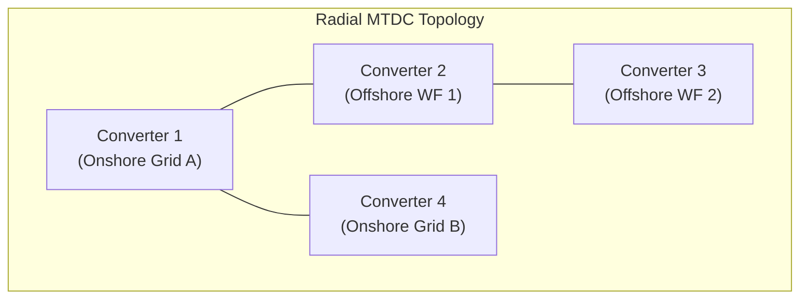
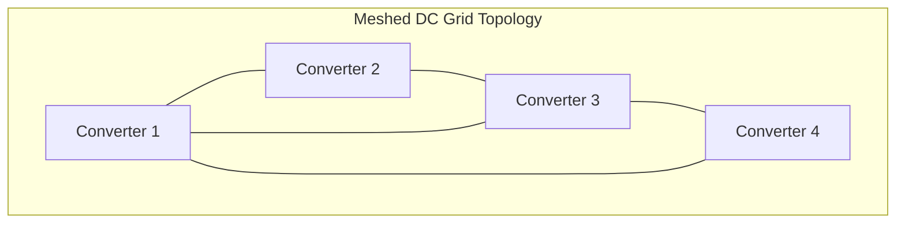
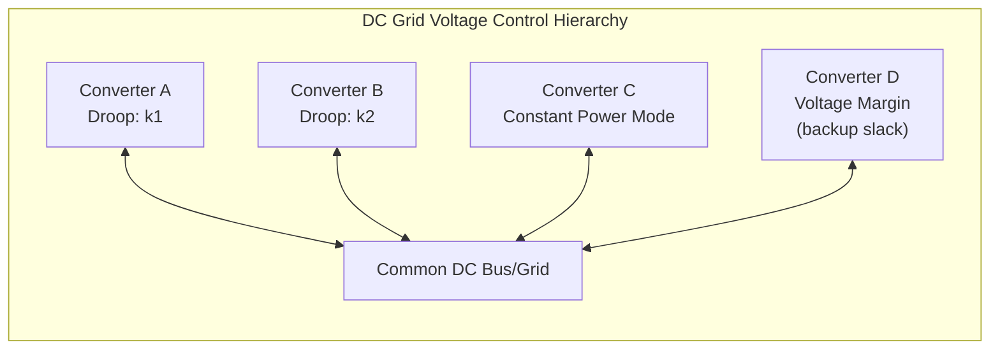
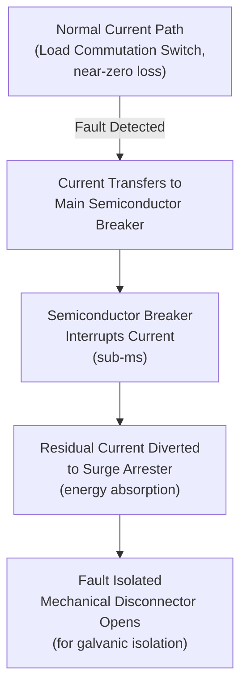

## Multi-Terminal HVDC and DC Grid Concepts

### Overview

A Multi-Terminal HVDC (MTDC) system connects three or more converter stations to a common DC network, rather than the conventional point-to-point (two-terminal) HVDC link. Extending this concept to a meshed, interconnected topology with multiple parallel DC paths and redundancy yields a **DC grid** — analogous in structure and purpose to the meshed AC transmission grid, but operating in the DC domain.

MTDC/DC grid development is driven primarily by the need to interconnect multiple offshore wind clusters, integrate several onshore grid injection points, and provide redundant power paths without the cost of numerous separate point-to-point links.

### Motivation and Drivers

**Key Points**

- Aggregating multiple offshore wind farms into a shared DC collector grid reduces the number of expensive long-distance cable runs
- Enables power trading and interconnection among more than two AC systems via a shared DC backbone
- Improves reliability: a single line/converter outage does not necessarily de-energize the entire link, if grid topology and protection allow redistribution
- Reduces curtailment risk for remote renewable generation by providing multiple export paths

### Topology Classes

**1. Radial MTDC**

Multiple converter stations connected in a star or radial pattern from one or more collection points, with no closed loops. Simpler protection (comparable to extended point-to-point schemes) but no redundancy if a DC line segment is lost — downstream stations are isolated.

**2. Ring/Meshed MTDC (DC Grid)**

Multiple DC lines interconnect converter stations with closed loops, providing N-1 contingency redundancy: if one line or converter trips, power can reroute through the mesh. This is structurally closer to a true "grid" and requires substantially more sophisticated protection.

### VSC vs. LCC Suitability for MTDC

**VSC is strongly preferred for MTDC/DC grid applications** because:

- Power reversal is achieved by reversing DC current direction while DC voltage polarity remains fixed
- This allows any converter station to independently increase, decrease, or reverse its power flow without disrupting the DC voltage reference or requiring coordinated polarity switching across the entire network

**LCC is poorly suited** because:

- Power reversal requires reversing DC voltage polarity across the whole pole
- In a meshed network, reversing polarity at one station would force polarity reversal implications throughout the connected DC network, making independent multi-station control impractical
- LCC-based MTDC schemes exist but are typically limited to fixed-role radial configurations (e.g., a few LCC MTDC pilot projects in the 1990s such as the Quebec-New England multi-terminal scheme), rather than fully flexible DC grids [Inference: while technically possible, LCC MTDC has seen minimal commercial adoption relative to VSC due to this structural constraint]

### DC Voltage and Power Flow Control in MTDC

With more than two terminals, a single "slack" reference model (one rectifier, one inverter) no longer applies. Instead, MTDC control uses a distributed hierarchy:

- **DC Voltage Droop Control**: multiple converters share DC voltage regulation duty proportionally, each adjusting its power injection based on local DC voltage deviation from a reference — analogous to frequency droop control in AC systems
- **Master Voltage Control**: one converter is designated as the primary DC voltage regulator (slack), while others operate in constant power or constant current mode
- **Voltage Margin Control**: a backup converter takes over voltage regulation only if the primary regulator reaches its power limit, providing redundancy without permanently splitting regulation duty across multiple stations

$$P_i = P_{i,ref} - k_i(V_{dc,i} - V_{dc,ref})$$

where $k_i$ is the droop gain for converter $i$, allowing multiple converters to jointly stabilize DC voltage while sharing power imbalance automatically.

### DC Fault Protection — The Central Technical Challenge

DC grid protection is widely regarded as the most difficult unsolved engineering challenge for scaling MTDC into true meshed grids, due to fundamental differences from AC fault behavior:

- **No natural current zero-crossing**: unlike AC, DC fault current does not periodically cross zero, so conventional AC circuit breakers (which rely on arc extinction at current zero) cannot interrupt DC fault current directly
- **Extremely fast fault current rise**: DC fault current in a low-impedance cable/converter network can rise from nominal to damaging levels within a few milliseconds, driven by rapid discharge of converter arm capacitances (in half-bridge MMC) — far faster than typical AC breaker operating times (60-100 ms)
- **Selectivity requirement**: in a meshed grid, protection must isolate only the faulted line segment without de-energizing the entire DC grid or unaffected converters

**Protection Strategies:**

| Approach | Mechanism | Trade-off |
| --- | --- | --- |
| AC-side breaker tripping | Trip all AC breakers feeding converters connected to the fault | Simple but de-energizes entire DC network; unacceptable for large grids |
| Full-bridge / hybrid MMC | Converter itself blocks DC fault current by inserting reverse voltage | Effective but increases converter cost/losses; still needs a mechanical isolation step |
| DC Circuit Breakers (DCCB) | Dedicated fast-acting DC breakers isolate the faulted line segment only | Enables selective protection; technology still maturing and costly |
| DC fault current limiters | Reactors/superconducting limiters slow fault current rise to allow more time for detection/action | Adds impedance/losses; often paired with DCCBs |

### DC Circuit Breaker (DCCB) Technologies

**1. Mechanical DC Breakers**

Use a mechanical switch with an auxiliary commutation circuit (typically an LC resonant circuit) to force an artificial current zero-crossing. Low conduction losses (since current flows through a mechanical contact when closed) but slower operation (several milliseconds to tens of milliseconds).

**2. Solid-State DC Breakers**

Use power semiconductors (IGBTs/thyristors) to interrupt current almost instantly (sub-millisecond). Very fast, but continuous conduction losses are significant since current always flows through semiconductor devices during normal operation.

**3. Hybrid DC Breakers**

Combine a fast mechanical disconnector (near-zero conduction loss in normal operation) with a semiconductor-based main breaker path that briefly carries fault current during the interruption sequence — considered the leading practical approach, first commercially demonstrated by ABB around 2012 and deployed in projects such as China's Zhangbei DC grid.

### DC Grid Standardization Challenges

**Key Points**

- No single globally standardized DC voltage level exists yet for DC grid interconnection (unlike standardized AC voltage levels); ±320 kV, ±400 kV, and ±500 kV/±525 kV are common but not universally interoperable [Unverified: standardization efforts by CIGRE and IEC are ongoing and voltage-level conventions continue to evolve, so current figures should be checked against the latest published standards]
- Interoperability between different vendors' MMC control systems (dynamic response, fault ride-through behavior) is an active standardization concern, since early MTDC projects have often used single-vendor equipment throughout
- DC grid codes (analogous to AC grid codes governing frequency response, fault ride-through, etc.) are still being developed by international bodies (CIGRE, ENTSO-E, IEC)

### Real-World MTDC/DC Grid Projects

**Example**

- **Zhangbei ±500 kV DC Grid (China, commissioned 2020)**: a 4-terminal meshed VSC DC grid using hybrid MMC (mix of half-bridge and full-bridge submodules) with DC circuit breakers, connecting renewable generation (wind/solar) near Zhangbei to Beijing load centers — widely cited as the first true meshed VSC DC grid at this scale
- **Nan'ao Multi-Terminal VSC-HVDC (China, 2013)**: 3-terminal MTDC connecting wind generation on Nan'ao island, an early practical MTDC deployment
- **North Sea Wind Power Hub concept (Europe, planning stage)**: proposed multi-country offshore DC grid hub aggregating multiple wind farms and interconnecting several North Sea nations [Inference: as a planning-stage concept, scope and final configuration are subject to ongoing revision]

### Communication and Coordination Requirements

MTDC/DC grid operation typically requires:

- Wide-area monitoring and fast inter-station communication (for coordinated droop parameter adjustment, fault location, and protection coordination)
- Centralized or hierarchical DC grid energy management systems (EMS) analogous to AC SCADA/EMS, but operating on much faster timescales for fault handling
- Coordination between AC-side grid codes at each converter's point of connection and the DC-side control hierarchy

### Advantages of DC Grids over Multiple Point-to-Point Links

- Fewer total converter stations needed for a given number of interconnection points (shared infrastructure)
- N-1 redundancy possible with meshed topology, improving reliability
- More flexible integration of new generation or load nodes without redesigning the entire network
- Potential for DC-side power trading/market coupling among more than two systems simultaneously

### Limitations and Open Challenges

- DC circuit breaker cost and technological maturity remain limiting factors for large-scale meshed grids
- Lack of unified international DC grid codes and voltage-level standards
- Multi-vendor interoperability (control system compatibility) is not yet fully mature
- System-level fault studies and protection coordination are significantly more complex than point-to-point HVDC
- Capital cost of DCCBs and full-bridge/hybrid MMC converters is higher than simpler two-terminal VSC links

### Next Steps

**Related Topics**

- Voltage-Source Converter (VSC) HVDC Technology
- Modular Multilevel Converter (MMC) Submodule Design and Fault Blocking
- DC Circuit Breaker Design and Fault Current Limiting
- Offshore Wind Farm HVDC Grid Connection Design
- DC Grid Codes and International Standardization (CIGRE, IEC, ENTSO-E)
- Droop Control and Power-Sharing Strategies in DC Grids
- Hybrid LCC-VSC HVDC Schemes
- HVDC Cable Systems: XLPE vs. Mass-Impregnated Design
- Power System Protection Coordination in Meshed Networks
- AC/DC Hybrid Transmission System Planning