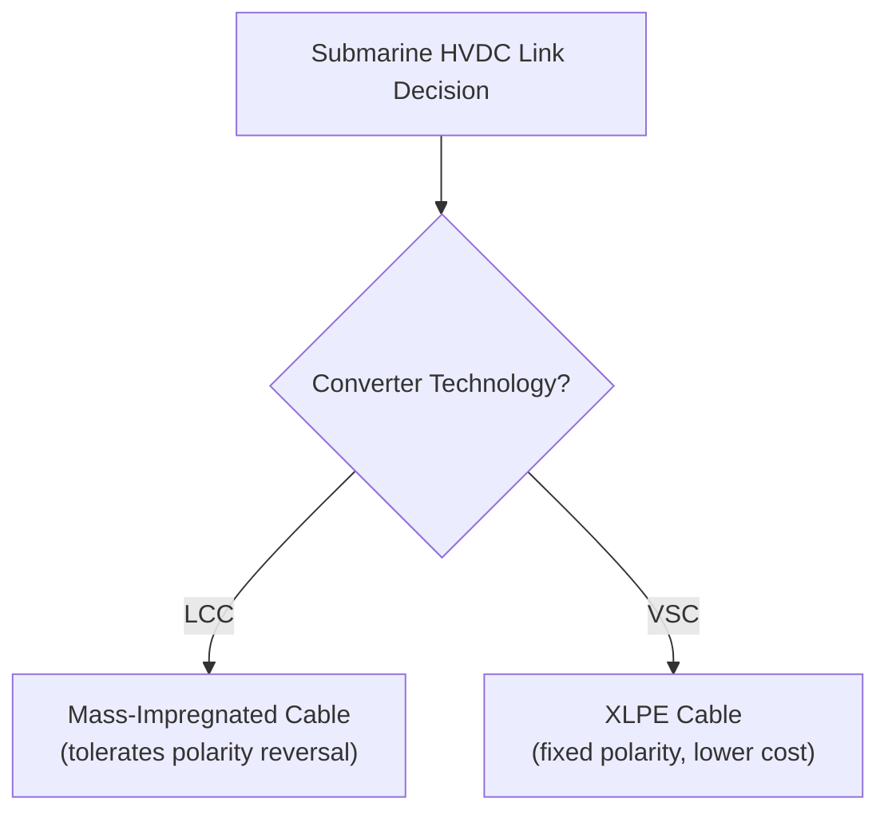
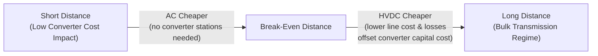

## Submarine Cable and Long-Distance Bulk Transmission

### Overview

Submarine cable and long-distance bulk transmission represent two of the primary application drivers for HVDC technology. Both address a common underlying physical constraint: AC transmission becomes progressively less viable as distance and/or cable length increase, due to capacitive charging effects (for cables) and reactive/stability limitations (for long overhead lines). HVDC — whether LCC or VSC — removes these constraints by eliminating the need to continuously charge/discharge line capacitance and by decoupling the two connected AC systems electrically.

### Why AC Struggles Over Long Distances and Undersea Routes

**AC Overhead Lines — Long Distance Limitations**

- **Reactive power / stability limits**: as overhead AC line length increases, the line's series reactance increases proportionally, reducing the maximum transferable power for a given stability margin (approximated by the classic power-angle relationship $P = \frac{V_1 V_2}{X}\sin\delta$)
- **Voltage regulation**: long lines require substantial reactive compensation (shunt reactors/capacitors) at intermediate points to maintain acceptable voltage profiles
- **Synchronization requirement**: AC transmission requires both ends to remain in synchronism; over very long distances, this becomes progressively harder to maintain during disturbances

**AC Submarine/Underground Cables — The Charging Current Problem**

- Cables have dramatically higher capacitance per unit length than overhead lines (tens of times higher), due to the close proximity of conductor and grounded/semi-conducting shield with a solid dielectric between them
- This capacitance draws continuous reactive charging current from the AC source, which increases with cable length
- Beyond a practical threshold — commonly cited as roughly **50-80 km** for AC submarine cables, though the specific value depends on voltage level, cable design, and compensation availability — the charging current alone approaches or exceeds the cable's thermal current rating, leaving little or no capacity for actual power transfer [Inference: this threshold is a design-dependent rule of thumb rather than a fixed physical constant, and can be extended somewhat with reactive compensation platforms, though this adds cost and complexity]

**Key Points**

- HVDC cables carry no continuous reactive charging current in steady state (only a transient capacitive charging effect at energization), removing the length-dependent capacity penalty entirely
- This makes HVDC the default choice for any submarine cable link beyond the AC practical limit

### HVDC Submarine Cable Types

**1. Mass-Impregnated (MI) Cable**

- Paper insulation impregnated with a high-viscosity compound, used historically and still in current LCC and some VSC projects
- Compatible with LCC's periodic polarity reversal (used for power-flow reversal in LCC schemes)
- Proven track record at very high voltages (used up to ±600 kV and beyond)
- Heavier and generally more expensive to manufacture per unit length than modern polymer cables

**2. XLPE (Cross-Linked Polyethylene) Cable**

- Extruded polymer insulation, lighter, more flexible, and generally lower-cost to manufacture and install than MI cable
- Cannot tolerate DC voltage polarity reversal (space charge accumulation in the XLPE dielectric under reversed polarity was a historical technical barrier)
- Ideal match for VSC HVDC, since VSC reverses power flow via current direction rather than voltage polarity
- Now available at high voltage ratings suitable for bulk transmission (±320 kV, ±400 kV, ±525 kV+ commercially demonstrated) [Unverified: maximum commercially proven XLPE HVDC voltage ratings continue to increase with new projects, so figures should be checked against the latest manufacturer/project data]

### Submarine Cable Construction (Cross-Section Concept)

A typical HVDC submarine cable consists of, from inside to outside:

1. Conductor (copper or aluminum, stranded)
2. Conductor screen (semi-conducting layer)
3. Insulation (XLPE or mass-impregnated paper)
4. Insulation screen (semi-conducting layer)
5. Metallic sheath/screen (lead or aluminum, provides radial water barrier and fault current path)
6. Bedding/armor layer (steel wire armoring for mechanical protection against anchors, fishing gear, seabed movement)
7. Outer serving (protective polymer jacket)

<svg xmlns="http://www.w3.org/2000/svg" viewBox="0 0 500 500" font-family="Arial, sans-serif">
<text x="250" y="25" font-size="15" font-weight="bold" text-anchor="middle">HVDC Submarine Cable Cross-Section (svg_diagram)</text>
<circle cx="250" cy="270" r="220" fill="none" stroke="#333" stroke-width="2" />
<text x="250" y="60" font-size="10" text-anchor="middle">Outer Serving (Polymer Jacket)</text>
<circle cx="250" cy="270" r="200" fill="#d9d9d9" stroke="#333" stroke-width="1.5" />
<text x="250" y="85" font-size="10" text-anchor="middle">Armor (Steel Wire)</text>
<circle cx="250" cy="270" r="170" fill="#bfbfbf" stroke="#333" stroke-width="1.5" />
<text x="250" y="115" font-size="10" text-anchor="middle">Bedding Layer</text>
<circle cx="250" cy="270" r="140" fill="#a6a6a6" stroke="#333" stroke-width="1.5" />
<text x="250" y="145" font-size="10" text-anchor="middle">Metallic Sheath (Lead/Aluminum)</text>
<circle cx="250" cy="270" r="110" fill="#f2c2a0" stroke="#333" stroke-width="1.5" />
<text x="250" y="175" font-size="10" text-anchor="middle">Insulation Screen</text>
<circle cx="250" cy="270" r="90" fill="#f7ddc3" stroke="#333" stroke-width="1.5" />
<text x="250" y="195" font-size="10" text-anchor="middle">Insulation (XLPE / Mass-Impregnated)</text>
<circle cx="250" cy="270" r="50" fill="#c9852f" stroke="#333" stroke-width="1.5" />
<text x="250" y="225" font-size="10" text-anchor="middle">Conductor Screen</text>
<circle cx="250" cy="270" r="35" fill="#b5651d" stroke="#333" stroke-width="1.5" />
<text x="250" y="275" font-size="11" text-anchor="middle" fill="white">Conductor</text>
<text x="250" y="290" font-size="9" text-anchor="middle" fill="white">(Cu/Al)</text>
</svg>

### Cable Installation and Route Engineering

**Key Points**

- **Burial**: cables are typically buried 1-3 m below the seabed where feasible, to protect against anchor strikes, fishing trawl gear, and thermal stability considerations
- **Route surveys**: extensive geotechnical and geophysical surveys are required prior to route selection, assessing seabed composition, existing infrastructure (pipelines, other cables), shipping lanes, and environmental sensitivities
- **Cable-laying vessels**: specialized ships equipped with large cable carousels and dynamic positioning systems lay cable continuously, often at rates measured in km/day, with jointing operations required where cable lengths must be spliced together
- **Repair considerations**: submarine cable repair is a major undertaking, requiring cable recovery to a repair vessel, splicing, and re-laying — repair times can extend to weeks, making cable reliability and redundancy planning critical for bulk links

### Thermal Rating and Ampacity Considerations

Submarine cables are thermally constrained by their ability to dissipate heat into the surrounding seabed/seawater environment. Key factors:

- **Burial depth**: deeper burial increases thermal resistance to ambient, reducing ampacity for a given conductor size
- **Seabed thermal resistivity**: varies by location (soil composition, moisture content); higher thermal resistivity soils reduce achievable ampacity
- **Cable bundling**: multiple cables laid in close proximity (e.g., bipole pairs) experience mutual heating, requiring derating relative to a single isolated cable
- **Conductor sizing**: larger copper/aluminum cross-sections reduce $I^2R$ losses and heat generation but increase cost, weight, and installation difficulty

### Long-Distance Overhead Line Bulk Transmission

For overland bulk transmission (as opposed to submarine), HVDC overhead lines address the AC stability/reactive limitations described above and are typically justified once transmission distance exceeds a break-even point (commonly cited in the range of roughly 500-800 km for overhead lines, though this varies significantly by project-specific cost factors) beyond which HVDC's lower line losses and elimination of stability constraints offset the higher converter station capital cost relative to AC. [Inference: break-even distance is highly sensitive to local costs, power level, and right-of-way constraints, so any single figure should be treated as an illustrative approximation rather than a universal threshold]

**Example**

- **Rihand-Dadri (India)**: one of the earliest LCC bulk overhead HVDC schemes, ±500 kV
- **Changji-Guquan (China)**: ±1100 kV UHVDC, approximately 3300 km, among the highest-voltage and longest HVDC overhead links in commercial operation, transmitting bulk power from Xinjiang renewable/coal generation to eastern load centers
- **Rio Madeira (Brazil)**: ±600 kV LCC HVDC transmitting hydroelectric power over roughly 2400+ km from the Amazon region to São Paulo

### Break-Even Distance Concept

The economic crossover reflects two competing cost curves:

- **AC**: lower terminal equipment cost, but line/cable cost and losses scale unfavorably with distance (especially for cables, due to charging current and compensation requirements)
- **DC**: high fixed converter station cost (largely independent of distance) but substantially lower line/cable cost per km and lower transmission losses at long distances

### Bipolar Configuration for Bulk Transmission Reliability

Nearly all bulk long-distance HVDC schemes (submarine or overhead) use a **bipolar configuration**: two independent poles of opposite polarity referenced to a common return path.

- Under normal operation, both poles carry rated current, and the ground/metallic return typically carries only a small imbalance current
- If one pole is lost (fault or maintenance), the healthy pole can continue operating at up to its full or overload rating, using ground or metallic return, preserving partial transmission capacity
- This redundancy is essential for bulk schemes where full loss of a monopolar link would represent an unacceptable single point of failure

### Losses Over Long Distances

**Key Points**

- HVDC transmission losses are dominated by $I^2R$ conductor losses (resistive) plus fixed converter station losses (roughly 0.7-2% total depending on technology, incurred once per station regardless of distance)
- Because HVDC lines/cables operate without reactive power flow (aside from minor cable charging transients) and without AC skin-effect-related complications to the same degree, conductor losses per km are typically lower than for an equivalent AC circuit at comparable voltage and power level
- Total transmission efficiency for a long bulk HVDC scheme (e.g., several thousand km) can still exceed 90-95% delivered power, factoring in both converter and line losses [Inference: exact efficiency figures depend heavily on conductor sizing, voltage level, and loading, so should be treated as representative rather than universal]

### Applications Combining Both Themes

- **Offshore wind export via long submarine cable**: combines both submarine cable engineering and (often) long-distance considerations, typically using VSC and XLPE cable
- **Cross-border/cross-sea interconnectors**: linking national grids across straits or seas (e.g., NorNed between Norway and the Netherlands, ~580 km, one of the longest submarine power cables at the time of commissioning)
- **Remote hydro/renewable resource evacuation**: transmitting power from remote generation (large hydro dams, remote wind/solar resource areas) to distant load centers via overhead HVDC bulk links

### Advantages

- Removes the AC charging-current distance limitation entirely for submarine/underground cable routes
- Lower transmission losses over long distances compared to equivalent AC
- Enables connection of asynchronous or electrically isolated systems across seas
- Bipolar redundancy provides high reliability for critical bulk transmission corridors
- Scales to very high power levels (multi-GW) over intercontinental-scale distances

### Limitations

- High converter station capital cost makes short-distance HVDC uneconomical relative to AC
- Submarine cable repair logistics are complex, costly, and time-consuming relative to overhead line repair
- Route surveys, permitting, and marine environmental assessments for submarine cables add significant project lead time
- Long overhead HVDC lines still require substantial right-of-way and tower infrastructure investment, similar to AC

### Next Steps

**Related Topics**

- Line-Commutated Converter (LCC) HVDC Technology
- Voltage-Source Converter (VSC) HVDC Technology
- HVDC Cable Systems: XLPE vs. Mass-Impregnated Design (Detailed)
- Offshore Wind Farm HVDC Grid Connection Design
- HVDC Overhead Line Tower and Insulation Design
- Cable Thermal Rating and Ampacity Calculation Methods
- Economic Break-Even Analysis for AC vs. DC Transmission
- Bipolar and Monopolar HVDC Configuration Design
- Submarine Cable Route Engineering and Marine Survey Techniques
- Ultra-High-Voltage Direct Current (UHVDC) Transmission (±800 kV and above)