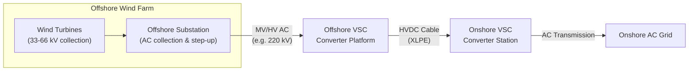
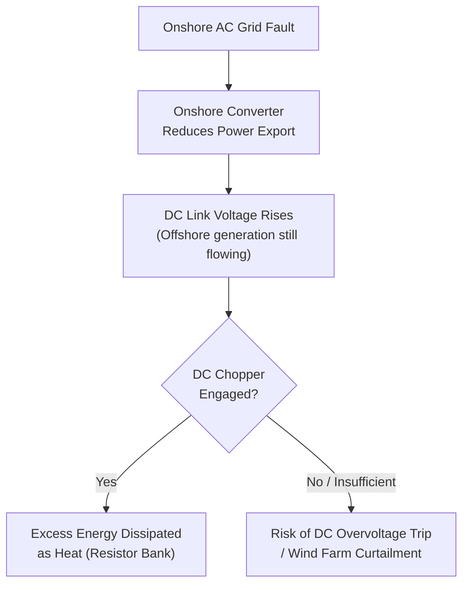

## HVDC for Offshore Wind Integration

### Overview

HVDC for offshore wind integration refers to the use of HVDC transmission — almost exclusively VSC-based — to collect power from offshore wind farms and deliver it to the onshore AC grid. As offshore wind projects have moved farther from shore and grown in capacity (from a few hundred MW to multi-GW clusters), HVDC has become the standard transmission solution beyond a certain distance threshold, replacing AC export systems that become impractical due to submarine cable charging current limitations.

### Why HVDC (and Specifically VSC) for Offshore Wind

**Key Points**

- Offshore wind farms are electrically remote, connected via submarine cable, which suffers from the same charging-current distance limitation described for any AC submarine cable (practical AC limit commonly cited around 50-80 km, project-dependent)
- Offshore wind farms are, by definition, generation-only sites with no pre-existing AC grid — the AC collection network within the wind farm must be **energized from scratch**, which VSC can do via black-start capability
- Wind power output is variable and requires continuous reactive power/voltage support at the point of connection, which VSC provides inherently as part of its 4-quadrant control
- LCC is generally unsuitable for this application because it requires a "stiff" AC source for commutation — an offshore wind farm's own AC network, especially before energization, cannot provide this

### Typical System Architecture

**Offshore components:**

- Individual wind turbine generators (typically operating internally at 690 V–1 kV, or increasingly higher with direct-drive/medium-voltage designs)
- Inter-array cables collecting turbine output at medium voltage (33 kV or, increasingly, 66 kV — the latter reduces the number of offshore substations needed and lowers array cable losses)
- Offshore substation platform stepping up to a higher AC voltage (commonly 132-220 kV) for transmission to the converter platform
- Offshore HVDC converter platform (VSC/MMC), converting AC to DC for export

**Onshore components:**

- Onshore HVDC converter station, converting DC back to AC
- Grid connection point (substation) integrating the converted power into the transmission network

### Offshore Converter Platform Engineering Considerations

**Key Points**

- The offshore converter platform is a large, heavy, and expensive structure (often the single most expensive asset in the transmission chain), housing the full MMC valve stack, transformers, cooling systems, and auxiliary power supplies
- Platform design must accommodate marine environmental conditions: corrosion protection, seismic/wave loading (for the supporting jacket or floating structure), helicopter access, and limited maintenance access windows (weather-dependent)
- Redundancy and reliability requirements are elevated compared to onshore stations, since offshore maintenance access is costly and weather-constrained; unplanned outages can persist longer due to logistics
- Recent trend toward larger, higher-voltage offshore platforms (e.g., ±320 kV to ±525 kV DC, multi-GW AC-side ratings) as wind farm cluster sizes grow, aiming to reduce the number of separate platforms needed per GW exported

### DC Voltage and Power Rating Trends

Offshore wind HVDC export system ratings have grown substantially over successive project generations:

| Generation (approximate) | Typical DC Voltage | Typical Power per Link |
| --- | --- | --- |
| Early (2010s) | ±150 kV to ±200 kV | 400-900 MW |
| Mid (mid-2010s to 2020s) | ±320 kV | 900 MW-1 GW |
| Current/emerging | ±320 kV to ±525 kV | 1-2+ GW |

[Unverified: exact voltage/power figures continue to increase as new projects are announced and commissioned; treat this table as illustrative of the historical trend rather than a definitive current-state reference, and verify against the latest project data for specific figures.]

### Wind Farm Collector Grid Considerations

- **Grid-forming behavior within the wind farm AC network**: because the offshore AC network has no external stiff source, either the offshore VSC converter or the wind turbines themselves (or both, in coordinated schemes) must provide grid-forming voltage/frequency reference behavior for the internal collector grid
- **Reactive power management within the array**: inter-array cables themselves generate some reactive charging current at medium voltage, requiring coordination with turbine-level reactive capability and the offshore converter's reactive support role
- **Fault ride-through coordination**: wind turbines and the offshore converter must coordinate fault ride-through behavior so that an onshore AC grid fault (which can cause a temporary power imbalance, since the offshore wind farm continues generating while the export capacity is constrained) does not trip the wind farm entirely

### Onshore AC Fault Ride-Through and Overvoltage Management

**Key Points**

- A fault on the onshore AC grid can suddenly reduce the amount of power the onshore converter can export into the grid, while offshore wind generation continues largely unaffected — creating a power imbalance that raises DC-link voltage
- **DC chopper (braking resistor)**: a common solution is a resistor bank connected across the DC link (often at the offshore or onshore converter) that dissipates excess energy during onshore grid faults, preventing DC overvoltage trip
- Coordinated fast communication or local DC voltage-based control between offshore and onshore converters helps manage this transient power imbalance without unnecessary wind farm curtailment or tripping

### Multi-Terminal and Hub Concepts for Offshore Wind

As offshore wind development scales to larger regional clusters, industry and research attention has moved toward:

- **Shared offshore hub platforms**: aggregating multiple wind farms into a single offshore collector/converter hub, reducing the number of individual export cables and platforms needed
- **Multi-terminal offshore DC grids**: connecting several offshore converter platforms and multiple onshore grid connection points via a meshed or radial DC network (see Multi-Terminal HVDC and DC Grid Concepts), enabling power to be routed to whichever onshore grid has capacity or the most favorable price
- **Cross-border energy islands**: proposed artificial islands or hub platforms serving as a central offshore collection and interconnection point for multiple countries' wind farms and interconnectors simultaneously (e.g., proposed North Sea hub concepts) [Inference: these remain largely at planning/feasibility stage as of the available information, so specific configurations should be treated as provisional]

### Cable Considerations Specific to Offshore Wind

- **Export cable**: the HVDC cable(s) running from the offshore converter platform to shore — typically XLPE for VSC schemes, sized for the full wind farm export capacity
- **Redundancy philosophy**: some projects install a single bipolar cable pair (each cable carrying one pole); loss of one cable/pole still allows partial export via the remaining pole and ground/metallic return, similar to bulk overhead schemes
- **Landfall engineering**: the transition point where the submarine cable comes ashore requires specialized horizontal directional drilling or trenching techniques to minimize environmental and coastal disruption

### Comparison: AC vs. VSC-HVDC Export for Offshore Wind

| Attribute | AC Export | VSC-HVDC Export |
| --- | --- | --- |
| Practical distance limit | ~50-80 km (cable charging current) | No fundamental distance limit |
| Reactive compensation | Required at intervals for longer AC cables | Not required for the DC cable itself |
| Grid-forming capability | Relies on onshore grid stiffness | Can black-start/energize offshore network |
| Capital cost (short distance) | Lower | Higher (converter platforms) |
| Capital cost (long distance) | Higher (compensation, losses) | Lower relative to AC beyond break-even distance |
| Multi-farm aggregation | Limited | Well-suited via DC hubs/multi-terminal grids |

### Applications and Notable Project Types

**Example**

- **DolWin and BorWin cluster projects (Germany, North Sea)**: multiple sequential VSC-HVDC links (DolWin1 through DolWin3, BorWin1 through BorWin3, etc.) connecting successive offshore wind farm clusters to the German onshore grid, illustrating the generational voltage/power growth described above
- **East Anglia and Dogger Bank projects (UK)**: large-scale offshore wind developments using HVDC export as capacity and distance from shore increased
- **Multi-terminal offshore hub proposals (North Sea Wind Power Hub and similar concepts)**: aggregating several countries' wind resources through shared offshore DC infrastructure

### Advantages

- Removes the AC cable distance/charging-current constraint entirely
- Provides independent reactive power/voltage support at both ends
- Enables black-start energization of the offshore collector network
- Scales well to very large (multi-GW) wind farm clusters
- Compatible with future multi-terminal/hub DC grid expansion

### Limitations

- High capital cost of offshore converter platforms, especially for smaller/nearer-shore wind farms where AC remains more economical
- Offshore platform reliability and maintenance access constraints (weather windows, logistics)
- DC link overvoltage management during onshore AC faults requires additional protective equipment (DC choppers) and control coordination
- Standardization and multi-vendor interoperability for shared offshore hubs and multi-terminal expansion remain evolving areas
- Long lead times for permitting, marine surveys, and converter platform fabrication

### Next Steps

**Related Topics**

- Voltage-Source Converter (VSC) HVDC Technology
- Multi-Terminal HVDC and DC Grid Concepts
- Submarine Cable and Long-Distance Bulk Transmission
- Modular Multilevel Converter (MMC) Submodule Design
- Grid-Forming vs. Grid-Following Converter Control
- DC Chopper and Braking Resistor Design for HVDC Links
- Wind Turbine Generator Types and Grid Code Compliance
- Offshore Substation and Platform Structural Design
- Fault Ride-Through Requirements for Renewable Generation
- HVDC Cable Systems: XLPE vs. Mass-Impregnated Design