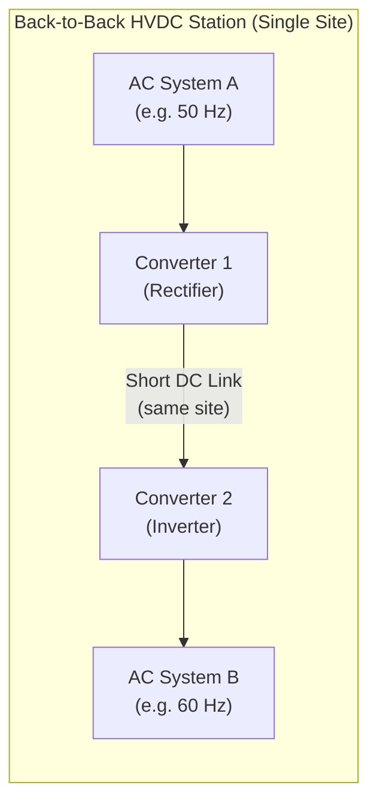
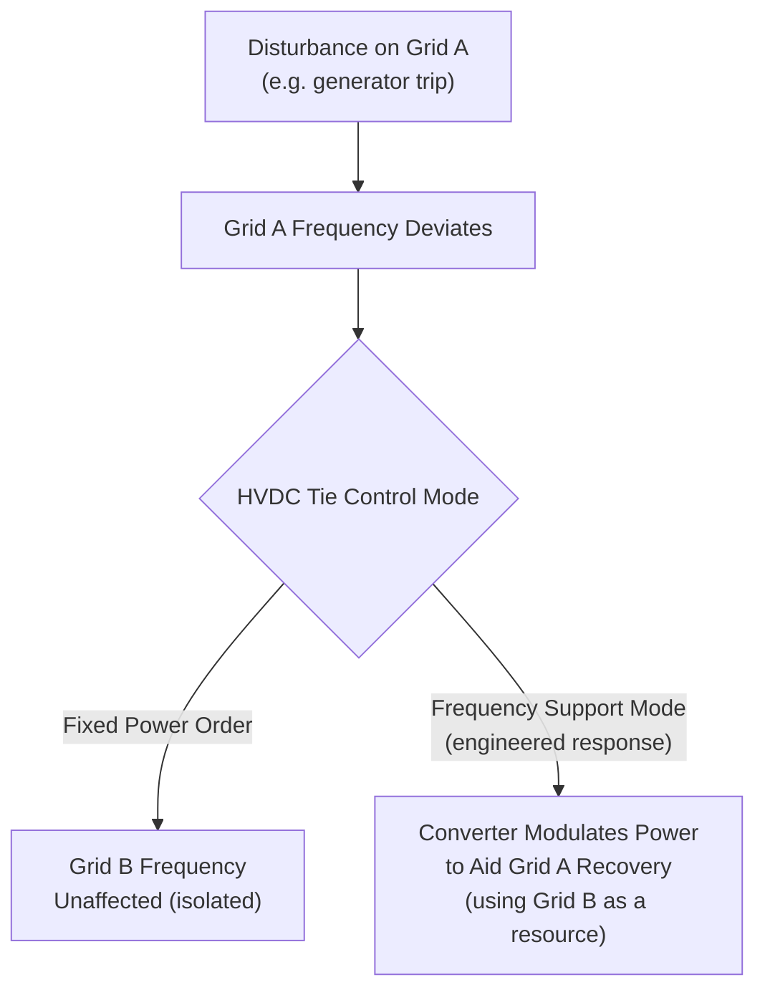

## Asynchronous Interconnections and Back-to-Back HVDC

### Overview

Asynchronous interconnections use HVDC to link two AC power systems that do not, cannot, or should not operate in electrical synchronism with one another. Because DC transmission does not require frequency or phase matching between its terminals, HVDC is the only practical means of transferring bulk power between such systems. **Back-to-Back (B2B) HVDC** is the specific configuration used when both converter stations are collocated at a single site with no (or a negligible) DC transmission line between them — used purely to interconnect two adjacent but asynchronous or incompatible grids.

### Why Asynchronous Interconnection Is Needed

**Key Points**

- **Different nominal frequencies**: some regions historically adopted different standard frequencies (50 Hz vs. 60 Hz), most notably parts of Japan (50 Hz in the east, 60 Hz in the west), making direct AC interconnection between those areas physically impossible without frequency conversion
- **Independently operated synchronous grids**: even at the same nominal frequency, some neighboring grids are operated as separate synchronous areas for historical, regulatory, or reliability reasons (e.g., interconnections between separately operated North American Eastern, Western, and ERCOT/Texas interconnections; historical divisions in parts of the former Eastern Bloc)
- **Weak or unstable AC tie risk**: even where frequencies match, directly synchronizing two large grids via a strong AC tie can propagate disturbances (cascading faults, frequency oscillations) from one system into the other; an HVDC tie acts as a firewall, since active power exchange can be controlled independently of each side's internal dynamics
- **Different grid codes/operating philosophies**: interconnecting two utilities with different protection philosophies, voltage levels, or market structures is sometimes more practical via a controllable DC interface than through direct AC synchronization

### Back-to-Back HVDC Configuration

In a B2B scheme, the rectifier and inverter are installed within the same station (often in the same building or immediately adjacent structures), and the "DC link" between them may be as short as a few meters or a single busbar connection, rather than a transmission line or cable of significant length.

**Key distinguishing characteristics of B2B vs. conventional point-to-point HVDC:**

- No meaningful transmission line/cable — DC voltage can be optimized purely for converter cost and losses rather than balanced against line insulation/right-of-way economics, often resulting in a lower DC voltage design than a long-distance link of similar power
- Physically compact — both converter halls/valve stacks are on the same site
- Power flow reversal happens without the transmission-line considerations relevant to long links (e.g., no traveling-wave/line-charging transients to manage over long distances)

### Converter Technology Choice for Asynchronous/B2B Applications

Both LCC and VSC are used for asynchronous interconnection and B2B schemes, with the choice depending on system requirements:

| Consideration | Favors LCC | Favors VSC |
| --- | --- | --- |
| Very high power transfer | Yes (higher power ratings achievable) | Less common at extreme power levels, though gap is narrowing |
| Weak AC system on one/both sides | No (needs strong AC, SCR support) | Yes (operates into weak networks) |
| Independent reactive power control needed | No (consumes reactive power) | Yes (4-quadrant control) |
| Lower footprint / compact site | No (larger filter yards) | Yes |
| Black-start support needed | No | Yes |
| Proven very-high-power track record | Yes | Growing but historically more limited |

**Example**

- Several Japan 50/60 Hz frequency-converting stations (e.g., the Shin Shinano, Sakuma, and Higashi-Shimizu frequency converter stations) have historically used LCC technology given their high power ratings and mature technology base at the time of construction
- More recent B2B and asynchronous tie projects, especially where weak grid support or compact footprint matters, increasingly favor VSC

### Control Considerations Specific to Asynchronous Ties

- **No synchronization requirement**: because the two AC systems are never directly connected electrically, there is no need to match phase angle, frequency, or voltage magnitude across the DC link — each side's converter operates according to its own local AC system's characteristics
- **Frequency support decoupling**: an HVDC asynchronous tie does not inherently provide inertial frequency response between the two systems (unlike a direct AC tie, where kinetic energy from rotating machines on one side can help arrest a frequency deviation on the other) — any frequency support must be explicitly engineered via converter control (e.g., fast active power modulation in response to measured frequency deviation, sometimes termed "synthetic inertia" or emulated frequency response)
- **Firewall function**: a fault or disturbance on one AC system (e.g., a large generator trip causing frequency deviation) does not automatically propagate to the other system's frequency, since the two are electrically decoupled — the HVDC link's power order can be held constant, ramped, or used to provide controlled support depending on the operating philosophy chosen

### Long-Distance Asynchronous Interconnections (Non-B2B)

Not all asynchronous interconnections are back-to-back; many involve a substantial DC transmission line or cable between two asynchronous systems, combining the asynchronous-tie function with long-distance or submarine transmission (see Submarine Cable and Long-Distance Bulk Transmission). In these cases, the same asynchronous-interconnection principles apply, but with the added line/cable engineering considerations of a conventional point-to-point HVDC scheme.

**Example**

- **NorNed (Norway-Netherlands)**: submarine HVDC interconnector linking two separate synchronous areas (Nordic synchronous grid and Continental European synchronous grid)
- **Interconnections between the UK and Continental Europe** (e.g., IFA, Nemo Link, and similar links): the UK and Ireland operate as separate synchronous areas from Continental Europe, requiring HVDC (not necessarily back-to-back, since these involve submarine cable distance) for interconnection

### Reliability and Market Benefits

**Key Points**

- Enables power trading and mutual reserve-sharing arrangements between grids that would otherwise be electrically isolated from each other
- Provides a controllable "valve" for power exchange — operators can precisely schedule and adjust power flow to match market or reliability needs, unlike an AC tie where flow is determined by network impedances and cannot be directly commanded
- Improves overall system resilience by allowing power import/export during localized generation shortfalls or emergencies, without exposing either system's frequency stability to disturbances originating in the other

### Advantages

- The only viable method for interconnecting grids of genuinely different frequencies
- Acts as a disturbance firewall, isolating each system's frequency dynamics from the other
- Fully controllable power flow, useful for market-based trading and emergency support
- B2B configuration avoids the cost, environmental permitting, and land-use burden of transmission line/cable, since the interconnection is essentially localized to one site
- VSC-based schemes can additionally support each connected grid with independent reactive power/voltage regulation

### Limitations

- Does not provide inertial/frequency response between systems unless specifically engineered into the control system, unlike a direct synchronous AC tie
- B2B schemes are inherently power-limited to the capacity justified at that single site/corridor; scaling up requires either a larger station or an additional parallel scheme
- LCC-based ties require adequate AC system strength (SCR) on both sides, which can be a constraint at some interconnection points
- Capital cost of two full converter stations (or a B2B station) is significant compared to a simple AC tie, where synchronization is technically feasible

### Next Steps

**Related Topics**

- Line-Commutated Converter (LCC) HVDC Technology
- Voltage-Source Converter (VSC) HVDC Technology
- Multi-Terminal HVDC and DC Grid Concepts
- Submarine Cable and Long-Distance Bulk Transmission
- Synchronous Grid Interconnection and Synchronization Requirements
- Frequency Response and Inertia in Power Systems
- Power System Interconnection Economics and Market Coupling
- Grid Codes for Cross-Border Interconnectors
- Short-Circuit Ratio (SCR) and AC System Strength Assessment
- HVDC Control Hierarchies (Master Control, Pole Control, Valve Group Control)