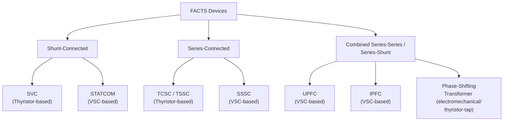
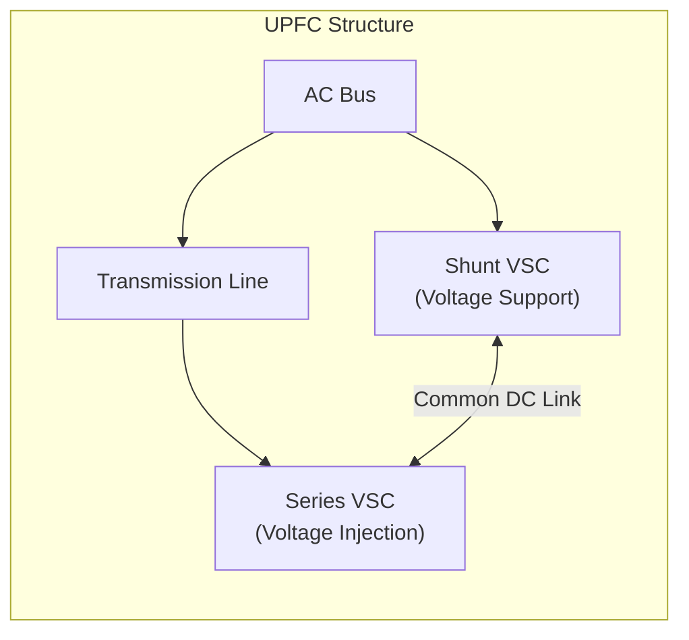

## FACTS Device Classification and Applications

### Overview

Flexible AC Transmission Systems (FACTS) are power-electronic-based devices installed within AC transmission networks to dynamically control key electrical parameters — voltage, impedance, and phase angle — without requiring topological changes (switching lines in/out) or mechanical intervention. FACTS technology emerged from EPRI-led research in the late 1980s (the term is generally attributed to Dr. Narain Hingorani) as a means of increasing the utilization, controllability, and stability of existing AC transmission infrastructure without building new lines.

### Fundamental Power Transfer Relationship

FACTS devices operate by manipulating one or more of the three variables in the classic AC power-angle equation:

$$P = \frac{V_1 V_2}{X}\sin(\delta)$$

where $V_1$, $V_2$ are the voltage magnitudes at each end of a line, $X$ is the line's series reactance, and $\delta$ is the phase angle difference between the two ends. FACTS devices can influence:

- **Voltage magnitude** ($V_1$, $V_2$) — via shunt reactive power injection/absorption
- **Series reactance** ($X$) — via series compensation (adding capacitive reactance to effectively reduce the line's net impedance)
- **Phase angle** ($\delta$) — via phase-shifting or voltage-injection devices

### Classification Framework

FACTS devices are broadly classified along two axes: **connection type** (shunt, series, or combined) and **generation** (conventional thyristor-based vs. voltage-sourced-converter-based).

**Generation classification:**

- **First generation (thyristor-based)**: uses thyristor-controlled/switched reactive elements (reactors, capacitors); examples include SVC and Thyristor-Controlled Series Capacitor (TCSC). Thyristors here are used only for switching/phase control of passive elements, not for synthesizing an AC waveform directly.
- **Second generation (VSC-based)**: uses self-commutated voltage-source converters (structurally related to VSC-HVDC converters) to synthesize a controllable AC voltage directly; examples include STATCOM, Static Synchronous Series Compensator (SSSC), and Unified Power Flow Controller (UPFC).

### Shunt-Connected FACTS Devices

**Static VAR Compensator (SVC)**

A shunt-connected combination of Thyristor-Controlled Reactor (TCR) and Thyristor-Switched Capacitor (TSC) banks, providing continuously variable reactive power (inductive or capacitive) to regulate voltage at its connection point.

**Static Synchronous Compensator (STATCOM)**

A shunt-connected VSC-based device that synthesizes a controllable AC voltage source behind a coupling reactor/transformer, exchanging reactive power with the grid by controlling the magnitude of its output voltage relative to the grid voltage — structurally similar to a VSC-HVDC converter's reactive support function, but with no DC transmission line (the DC side terminates in a capacitor only).

**Key Points**

- Both SVC and STATCOM primarily provide **voltage support** ($V_1$/$V_2$ control) at their point of connection
- STATCOM maintains rated reactive current output even during low-voltage conditions (fault ride-through support), whereas SVC's reactive output capability declines with the square of voltage (since it behaves more like a variable admittance) — this makes STATCOM generally more effective during severe voltage sags
- STATCOM has a smaller physical footprint than an equivalently rated SVC, since it does not require large TCR/TSC banks

### Series-Connected FACTS Devices

**Thyristor-Controlled Series Capacitor (TCSC)**

A series-connected capacitor bank paralleled with a thyristor-controlled reactor, allowing continuous adjustment of the effective series capacitive reactance inserted into the line. This directly modifies $X$ in the power-angle equation, increasing transfer capability and helping damp power oscillations.

**Static Synchronous Series Compensator (SSSC)**

A VSC-based series device that injects a controllable voltage (in quadrature or any phase relationship with line current) directly in series with the transmission line, emulating either capacitive or inductive series compensation without physical capacitor/reactor banks.

**Key Points**

- Series devices primarily target the **$X$ term**, directly increasing power transfer capability for a given voltage and angle
- Series compensation also plays a major role in **subsynchronous resonance (SSR) mitigation** and **power oscillation damping (POD)** for interconnected systems with lightly damped inter-area modes
- TCSC has seen substantial deployment for SSR mitigation near large steam turbine-generators, where fixed series capacitors alone can excite damaging subsynchronous torsional oscillations

### Combined/Unified FACTS Devices

**Unified Power Flow Controller (UPFC)**

The most versatile FACTS device, combining a shunt VSC and a series VSC sharing a common DC link. The shunt converter provides voltage support/reactive compensation at the bus (like a STATCOM), while the series converter injects a controllable voltage in series with the line (like an SSSC), enabling **simultaneous and independent control of voltage magnitude, series reactance (effective), and phase angle** — i.e., independent control of both active and reactive power flow on the compensated line.

**Interline Power Flow Controller (IPFC)**

An extension of the UPFC concept using multiple series VSCs (each in a different line) sharing a common DC link, enabling coordinated power flow control and active power transfer between multiple transmission lines within a substation — useful for balancing loading across parallel corridors.

### Comparative Summary Table

| Device | Connection | Generation | Primary Control Variable | Typical Application |
| --- | --- | --- | --- | --- |
| SVC | Shunt | 1st (Thyristor) | Voltage ($V$) | Voltage regulation, reactive support |
| STATCOM | Shunt | 2nd (VSC) | Voltage ($V$), fast reactive current | Voltage support, fault ride-through, flicker mitigation |
| TCSC | Series | 1st (Thyristor) | Series reactance ($X$) | Power transfer boost, SSR mitigation, damping |
| SSSC | Series | 2nd (VSC) | Injected series voltage (effective $X$) | Power flow control, damping |
| UPFC | Combined | 2nd (VSC) | $V$, $X$ (effective), $\delta$ | Full independent P-Q flow control |
| IPFC | Combined (multi-line) | 2nd (VSC) | Power flow across multiple lines | Corridor load balancing |
| Phase-Shifting Transformer | Series | Electromechanical/thyristor-tap | Phase angle ($\delta$) | Loop flow control, parallel path balancing |

### Applications by Function

**Voltage Regulation and Reactive Power Support**

- SVC and STATCOM are the primary tools for maintaining bus voltage within limits, particularly in networks with long lines, weak interconnections, or significant load variability
- Widely deployed near industrial loads with fluctuating reactive demand (e.g., arc furnaces) for flicker mitigation, since fast-responding STATCOMs can counteract rapid voltage fluctuations

**Thermal/Transfer Capability Enhancement**

- Series devices (TCSC, SSSC) increase the effective power transfer capability of existing transmission corridors by reducing net series reactance, deferring the need for new line construction

**Transient and Small-Signal Stability Improvement**

- FACTS devices can rapidly modulate voltage, reactance, or injected voltage in response to power system swings, improving both first-swing transient stability margins and damping of inter-area oscillation modes
- This is achieved via supplementary damping controllers layered on top of the device's primary voltage/power regulation function, typically using local or wide-area measured signals (e.g., line power or bus frequency deviation) as damping control inputs

**Subsynchronous Resonance (SSR) Mitigation**

- TCSC's thyristor-controlled reactance can be actively modulated to avoid or damp resonant interaction with turbine-generator torsional modes, a known risk with fixed series capacitor banks near thermal generation

**Power Flow Control and Loop Flow Management**

- UPFC, IPFC, and phase-shifting transformers redirect power flow among parallel paths, addressing "loop flow" problems where power takes an unintended path through a network due to relative impedances rather than the desired scheduled path

### Relationship to HVDC/VSC Technology

**Key Points**

- STATCOM, SSSC, and UPFC share substantial technological lineage with VSC-HVDC converters — all use self-commutated VSC/MMC-based converter technology, differing primarily in application (a STATCOM has no DC transmission function; its DC side terminates in a capacitor rather than a cable/line to another converter)
- Some FACTS/HVDC hybrid concepts exist, such as VSC-HVDC back-to-back stations that also provide standalone reactive power support functionally similar to a STATCOM at their AC terminal, effectively rendering a dedicated STATCOM redundant at some HVDC converter sites

### Advantages of FACTS Technology in General

- Rapid (sub-cycle to few-cycle) response compared to mechanical switching (capacitor banks, tap changers)
- Increases usable transfer capacity of existing transmission assets without new line construction, reducing right-of-way and permitting burden
- Improves both steady-state voltage profile and dynamic stability performance
- Modular and often retrofittable into existing substations

### Limitations

- Higher capital and lifecycle cost compared to conventional passive compensation (fixed capacitor/reactor banks, mechanically switched devices)
- VSC-based FACTS devices (STATCOM, SSSC, UPFC) introduce switching harmonics requiring filtering, though generally less than legacy two-level VSC-HVDC schemes if multilevel topologies are used
- UPFC and IPFC, while highly capable, have seen comparatively limited commercial deployment relative to SVC/STATCOM/TCSC due to cost and control complexity [Inference: deployment counts are project-specific and evolve over time, so this reflects a general industry pattern rather than a precise current count]
- Protection and control coordination with existing network protection schemes can be complex, particularly for series devices that alter the apparent impedance seen by distance relays

### Next Steps

**Related Topics**

- Static VAR Compensator (SVC) Design and Control
- Static Synchronous Compensator (STATCOM) Design and Control
- Thyristor-Controlled Series Capacitor (TCSC) and Subsynchronous Resonance Mitigation
- Unified Power Flow Controller (UPFC) Architecture and Control
- Voltage-Source Converter (VSC) HVDC Technology
- Power System Stability: Transient, Small-Signal, and Voltage Stability
- Power Oscillation Damping (POD) Control Design
- Reactive Power Compensation Fundamentals
- Phase-Shifting Transformers and Loop Flow Control
- Modular Multilevel Converter (MMC) Submodule Design