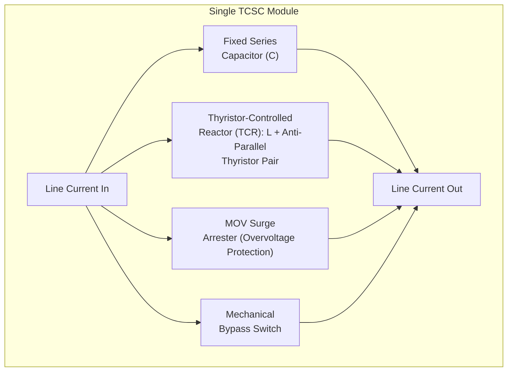
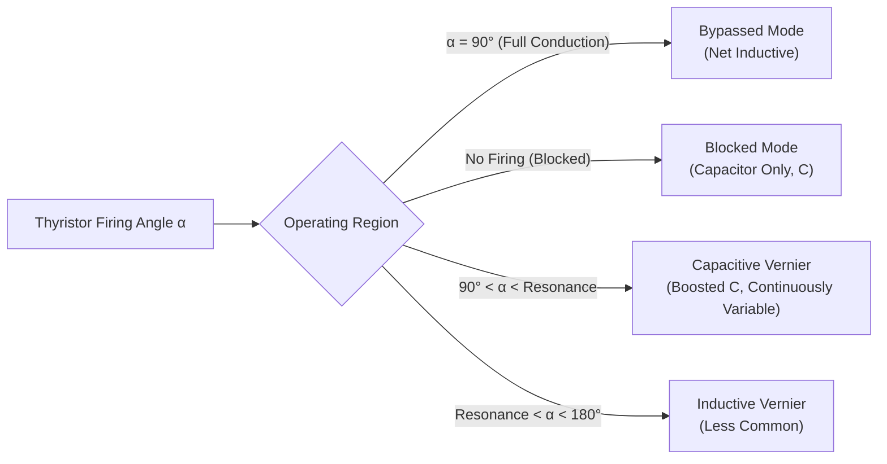
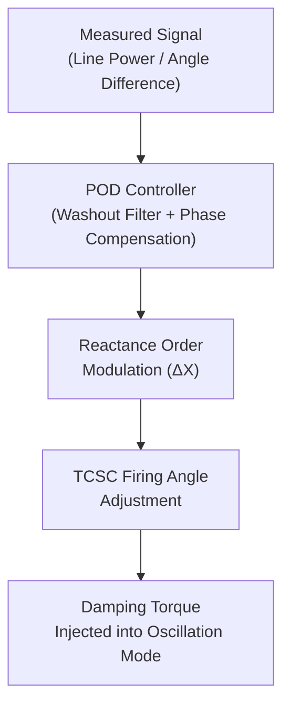

## Thyristor-Controlled Series Compensation (TCSC)

### Overview

Thyristor-Controlled Series Compensation (TCSC) is a series-connected FACTS device that provides rapidly and continuously variable series capacitive (or inductive) reactance in a transmission line. It is built from a fixed series capacitor bank paralleled with a Thyristor-Controlled Reactor (TCR), allowing the effective net reactance seen by the line to be adjusted by controlling the thyristor firing angle — without any mechanical switching. TCSC represents the first-generation (thyristor-based, non-VSC) class of series FACTS devices.

### Motivation: Why Series Compensation Matters

Series capacitive compensation reduces the *net* series reactance of a transmission line, directly increasing power transfer capability per the power-angle relationship:

$$P = \frac{V_1 V_2}{X_L - X_C}\sin(\delta)$$

where $X_L$ is the line's natural series reactance and $X_C$ is the reactance contributed by the series capacitor (subtracted since it is capacitive). Fixed series capacitors have provided this benefit for decades, but they cannot adapt dynamically to changing system conditions and can introduce risks (notably subsynchronous resonance) that a controllable device can actively mitigate.

### Basic Circuit Topology

A single TCSC module consists of:

- A fixed series capacitor ($C$)
- A thyristor-controlled reactor (TCR) — an inductor ($L$) in series with a pair of anti-parallel thyristors — connected in parallel with the capacitor
- A surge arrester (metal-oxide varistor, MOV) across the module to limit overvoltage during line faults
- A bypass switch (mechanical) for module protection/isolation

Multiple TCSC modules are typically connected in series to achieve the required voltage rating and reactance range for a given transmission line, similar to how HVDC valve towers stack series-connected thyristors for voltage rating.

### Operating Modes

**1. Bypassed (Thyristor Fully Conducting) Mode**

The thyristors are fired at $\alpha = 90°$ (full conduction), causing the TCR to behave as a continuously conducting inductor in parallel with the capacitor. Since the TCR's inductance is typically sized much smaller than the capacitor's reactance, this mode makes the module net *inductive*, effectively bypassing/nullifying most of the capacitive compensation — used for protection during faults or when compensation is not desired.

**2. Blocked (Thyristor Non-Conducting) Mode**

No firing pulses are applied; the TCR carries no current. The module behaves as a simple fixed series capacitor, providing the maximum capacitive reactance corresponding to $C$ alone.

**3. Vernier (Partial Conduction) Control Mode**

The thyristors are fired at an angle $90° < \alpha < 180°$, allowing partial conduction through the TCR. This creates a parallel LC resonant circuit whose effective impedance can be tuned continuously between the capacitor-only value and a boosted capacitive value (in the capacitive vernier region) — this is the primary mode used for continuous, dynamic reactance control.

**Key Points**

- In the capacitive vernier region, partial thyristor conduction causes the effective impedance to *increase* beyond the capacitor's own reactance, due to the parallel resonance effect between $L$ and $C$ — this is the operating region used for continuous compensation adjustment
- An inductive vernier region also exists at different firing angles, providing a net inductive boost mode, though this is used less frequently in typical applications
- The firing angle must avoid the exact parallel resonance point of the $L$-$C$ combination, since the theoretical impedance approaches infinity there — practical control systems maintain a safety margin around this resonant firing angle

### Reactance-vs-Firing-Angle Characteristic

The apparent capacitive reactance $X_{TCSC}$ as a function of firing angle $\alpha$ can be approximated by combining the natural capacitor reactance with the TCR's variable susceptance contribution. Qualitatively:

- Near $\alpha = 180°$ (near-blocked): $X_{TCSC} \approx X_C$ (capacitor alone)
- As $\alpha$ decreases from 180° toward the resonance point: $X_{TCSC}$ increases beyond $X_C$ (boosted capacitive region)
- Just past resonance into the inductive vernier region: behavior transitions sharply and becomes net inductive
- At $\alpha = 90°$: TCR fully conducts, net impedance becomes small and inductive (bypass-like behavior)

[Inference: the precise numerical shape of this characteristic depends on the specific $L/C$ ratio chosen for a given TCSC design, so only the qualitative behavior is universal.]

### Subsynchronous Resonance (SSR) Mitigation — Primary Application Driver

**Key Points**

- Fixed series capacitors, when installed near large steam turbine-generator units, can create a network resonance condition at a frequency that is the complement of one of the turbine-generator shaft's natural torsional frequencies relative to system frequency — this is the classic SSR risk (famously responsible for shaft damage incidents such as the Mohave Generating Station events in the 1970s)
- TCSC mitigates SSR through its controllable impedance: because the TCR's parallel resonance and vernier control alter the module's apparent impedance across frequencies (not just at fundamental frequency), TCSC presents a different, generally more benign impedance characteristic at subsynchronous frequencies compared to a fixed capacitor of equivalent fundamental-frequency compensation
- Some TCSC installations include supplementary SSR damping controllers that actively modulate the firing angle in response to detected subsynchronous oscillation signatures, providing active damping beyond the passive impedance-shaping benefit

### Power Oscillation Damping (POD)

Beyond steady-state power transfer enhancement, TCSC's fast (sub-cycle to few-cycle) controllability makes it effective for damping inter-area and local power system oscillations:

- A supplementary POD controller modulates the TCSC's reactance order around its steady-state setpoint, typically driven by a locally measured signal (line active power, or in more advanced schemes, a wide-area measurement such as remote bus frequency or angle difference) that correlates with the oscillation mode to be damped
- The modulation is phased to inject damping torque into the oscillating mode, analogous to a power system stabilizer (PSS) acting through excitation control on a generator, but acting through the transmission network's impedance instead

### Control System Architecture

A TCSC control system is typically hierarchical:

- **Reactance/impedance control loop**: converts a desired reactance (or power) order into a corresponding firing angle command, accounting for the nonlinear reactance-vs-angle relationship
- **Firing angle synchronization**: thyristor firing is synchronized to the line current zero-crossing (since TCSC operates on the line current waveform rather than a station AC bus voltage, unlike an SVC/STATCOM referenced to bus voltage)
- **Protection logic**: rapid transition to bypass mode during detected line faults or overcurrent conditions, to protect the capacitor and thyristors from fault-level currents
- **Supplementary controllers**: SSR damping and POD control loops superimposed on the base reactance control

### Protection Considerations

**Key Points**

- During a line fault, fault current through the TCSC module can be extremely high; the MOV surge arrester limits the voltage across the capacitor, while the thyristor-controlled bypass (forcing the TCR into full conduction, effectively short-circuiting much of the module's impedance) protects the capacitor from overvoltage and the thyristors from overcurrent
- A mechanical bypass switch provides a final, galvanically isolating protection stage and allows maintenance access without de-energizing the line entirely (the line can continue carrying power through the bypassed/shorted module)
- Coordinating TCSC protection response speed with existing line protection relay schemes (distance protection, differential protection) is an important design consideration, since the TCSC's changing impedance can affect fault location calculations if not properly accounted for in relay settings

### Comparison: TCSC vs. Fixed Series Capacitor vs. SSSC

| Attribute | Fixed Series Capacitor | TCSC | SSSC (VSC-based) |
| --- | --- | --- | --- |
| Control | None (fixed reactance) | Continuous (thyristor firing angle) | Continuous (VSC voltage injection) |
| SSR mitigation capability | None (can worsen SSR) | Active mitigation via impedance shaping/damping control | Active mitigation, generally strong |
| Response speed | N/A | Fast (cycles) | Very fast (sub-cycle) |
| Cost | Lowest | Moderate | Highest |
| Independent of line current magnitude | Yes (reactance fixed) | Reactance depends on firing angle, somewhat current-dependent | Can inject a voltage largely independent of line current magnitude within rating |

### Applications

- **Long AC transmission corridors**: boosting power transfer capability on existing lines without new construction
- **Networks near large thermal generation**: SSR mitigation is a primary driver for TCSC selection over fixed series capacitors in such locations
- **Interconnected systems with inter-area oscillation modes**: providing supplementary power oscillation damping to improve small-signal stability margins
- **Notable projects**: several TCSC installations have been deployed in North America (e.g., historically at Slatt substation, Oregon, and other BPA/WAPA network locations) and elsewhere specifically to address SSR risk near thermal plants and to boost transfer capability on long AC ties [Inference: specific installation details and current operational status may have evolved since original commissioning, so treat named examples as illustrative rather than as a verified current inventory]

### Advantages

- Continuously variable series compensation without mechanical switching, enabling fast dynamic response
- Effective, well-established tool for SSR mitigation compared to fixed series capacitors
- Improves both steady-state transfer capability and small-signal oscillation damping
- More mature and generally lower-cost than VSC-based SSSC for equivalent series compensation function

### Limitations

- More complex control and protection coordination than a simple fixed series capacitor
- Introduces some harmonic distortion due to thyristor switching, requiring consideration in harmonic studies (though generally less severe than shunt TCR-based SVC due to the series configuration and typically smaller reactor rating)
- Reactance range and control complexity are inherently more limited than a VSC-based SSSC, which can inject a voltage largely decoupled from the LC resonance constraints of a thyristor-based design
- Requires careful firing angle control to avoid operating too close to the LC resonance point

### Next Steps

**Related Topics**

- FACTS Device Classification and Applications
- Static Synchronous Series Compensator (SSSC) Design and Control
- Subsynchronous Resonance (SSR) Analysis and Mitigation Techniques
- Power Oscillation Damping (POD) Control Design
- Static VAR Compensator (SVC) Design and Control
- Power System Small-Signal Stability and Eigenvalue Analysis
- Series Capacitor Bank Protection and MOV Sizing
- Transmission Line Protection Relay Coordination with FACTS Devices
- Unified Power Flow Controller (UPFC) Architecture and Control
- Power System Stabilizer (PSS) Design Fundamentals