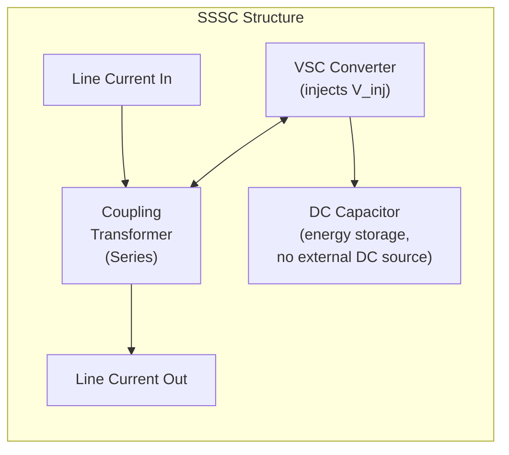
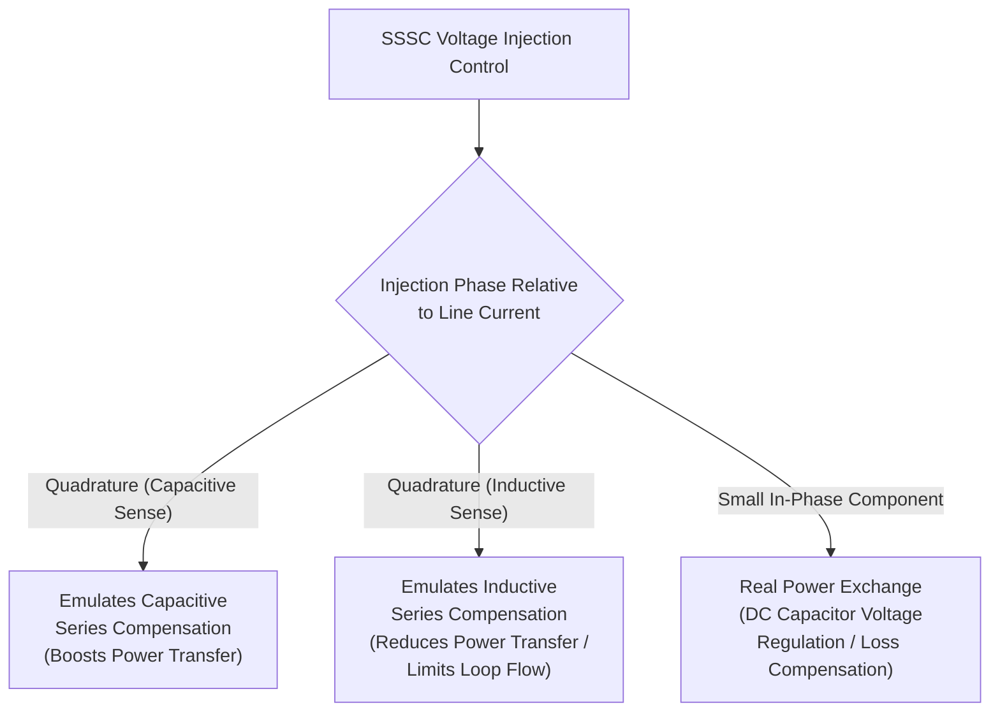

## Static Synchronous Series Compensator (SSSC)

### Overview

The Static Synchronous Series Compensator (SSSC) is a second-generation, Voltage-Source-Converter-based series FACTS device that injects a controllable AC voltage in series with a transmission line via a coupling transformer. Unlike thyristor-based series compensation (TCSC), which modulates the effective impedance of a physical capacitor/reactor combination, the SSSC synthesizes an entirely independent voltage waveform, allowing it to emulate capacitive or inductive series compensation — or inject a voltage with no fixed relationship to line current at all — without relying on any physical capacitor bank switched into the line.

### Fundamental Operating Principle

The SSSC's converter is coupled to the transmission line in series through a transformer, and its DC side is typically terminated in a capacitor only (no DC transmission function, similar to a STATCOM). By controlling the magnitude and phase of the converter's output voltage relative to the line current, the SSSC can:

- Inject a voltage **in quadrature (90°) with line current**, which emulates a pure reactive (capacitive or inductive) series compensation effect — this is the primary operating mode
- Inject a voltage with a **small in-phase component**, exchanging a limited amount of real power with the line (used to cover the converter's own internal losses, drawn from the line itself since there is no external DC source)

### Voltage Injection and Effective Reactance

The injected voltage $V_{inj}$, when placed in quadrature with the line current $I_{line}$, produces an effect mathematically equivalent to inserting a variable reactance into the line:

$$V_{inj} = \pm jX_{eff} \cdot I_{line}$$

- If $V_{inj}$ leads $I_{line}$ by 90° in the capacitive sense (i.e., the injected voltage opposes the line's inductive voltage drop), the effect is equivalent to **capacitive series compensation**, boosting power transfer
- If $V_{inj}$ is applied in the opposite quadrature sense, the effect is equivalent to **inductive series compensation**, reducing power transfer (useful for limiting loop flows or fault current contribution)

**Key Points**

- Because the SSSC directly synthesizes the injected voltage rather than relying on a resonant LC circuit (as TCSC does), its effective reactance is essentially **independent of line current magnitude** within its voltage rating — it can maintain a constant injected voltage (and thus a currentindependent compensation effect) across a wider operating range than a passive or thyristor-switched capacitor, whose reactive power output scales with the square of current
- This current-independence is a key theoretical advantage: at low line loading, a fixed or thyristor-controlled series capacitor provides little compensation (since $Q = I^2 X$ scales down sharply), whereas an SSSC can maintain a meaningful injected voltage even at lower currents, subject to its converter rating

### Comparison of Reactive Power Behavior vs. Line Current

| Device | Reactive Compensation Behavior vs. Current |
| --- | --- |
| Fixed Series Capacitor | Scales with $I^2$ — weak at low current |
| TCSC | Scales roughly with $I^2$, modulated by firing angle |
| SSSC | Can maintain injected voltage largely independent of current (within converter rating) |

### Four-Quadrant Operation

Unlike a fixed capacitor bank (capacitive only) or even TCSC (predominantly capacitive with limited inductive vernier range), the SSSC can smoothly transition between capacitive and inductive compensation modes, and can also (within a smaller range, due to converter loss/rating limits) exchange a small amount of real power with the line to support control functions such as DC capacitor voltage regulation.

### DC Capacitor Voltage Regulation

Because the SSSC's DC side has no external power source (unlike a UPFC, which shares a DC link with a shunt converter, or an HVDC converter, which connects to a DC transmission line), the DC capacitor voltage must be maintained purely through small controlled real-power exchange with the AC line itself:

- The converter draws a small in-phase current component from the line to replenish losses (switching losses, conduction losses) in the converter and maintain the DC capacitor at its regulation setpoint
- This real power draw is typically a small fraction of the converter's rating and does not materially affect the line's overall power flow

### Control System Structure

**Key Points**

- **Reactance/voltage order loop**: translates a desired effective series reactance (or power flow order) into a required injected voltage magnitude and phase, based on measured line current
- **DC voltage regulation loop**: adjusts the small in-phase voltage component to keep the DC capacitor voltage within its operating band
- **Fast control response**: since the SSSC uses VSC/PWM or multilevel switching (rather than line-current-synchronized thyristor firing as in TCSC), it can respond within a fraction of a cycle, making it well suited to power oscillation damping and transient stability improvement applications
- **Protection/bypass function**: during severe line faults or overcurrent conditions, the SSSC is typically bypassed (via a mechanical or thyristor bypass switch) to protect the converter from excessive fault current, similar in principle to TCSC's bypass mode but implemented via the VSC's own protective blocking and a bypass switch rather than forced full TCR conduction

### Applications

**Power Flow Control**

By emulating variable series reactance, the SSSC can be used to actively manage power flow distribution among parallel transmission paths, redirecting power away from thermally constrained lines toward underutilized corridors.

**Power Oscillation Damping (POD)**

The SSSC's fast, current-independent voltage injection capability makes it an effective actuator for damping inter-area and local oscillation modes, using a supplementary damping controller that modulates the injected voltage around its steady-state setpoint based on a measured signal correlated with the oscillation (line power, angle difference, or wide-area signals).

**Subsynchronous Resonance (SSR) Mitigation**

Because the SSSC does not rely on a physical LC resonant circuit, it inherently avoids the classic SSR risk mechanism associated with fixed series capacitors, and can be actively controlled to provide positive damping at subsynchronous frequencies if a torsional interaction risk is identified.

**Transient Stability Enhancement**

Rapid injection of a compensating voltage immediately following a system disturbance (e.g., a nearby fault) can help maintain synchronism by effectively reducing the apparent line reactance during the critical post-fault swing period, improving the first-swing stability margin.

**Example**

A UPFC's series-connected converter element is functionally an SSSC — the UPFC combines an SSSC (for series voltage injection/power flow control) with a STATCOM (for shunt voltage support), sharing a common DC link so that the series converter's real power needs can be met by the shunt converter drawing power from the AC bus, rather than by drawing real power from the line itself as a standalone SSSC must.

### Comparison: SSSC vs. TCSC

| Attribute | SSSC | TCSC |
| --- | --- | --- |
| Underlying technology | VSC (self-commutated) | Thyristor-controlled LC circuit |
| Reactance dependency on current | Largely independent (within rating) | Dependent (scales with current²) |
| Inductive/capacitive range | Smooth, symmetric quadrant transition | Capacitive vernier primary; inductive vernier more limited |
| Real power exchange capability | Small, for DC capacitor regulation only | None (passive LC network) |
| Response speed | Very fast (sub-cycle, PWM/multilevel switching) | Fast (cycles, thyristor firing angle) |
| Harmonic content | Lower with multilevel VSC designs | Present due to thyristor switching, generally line-current-related |
| Cost | Higher | Lower |
| Commercial deployment history | Less widespread than TCSC | More established, longer deployment history |

### Advantages

- Current-independent voltage injection provides effective compensation even at partial line loading, unlike passive or thyristor-switched capacitive devices
- Smooth, symmetric capacitive-to-inductive control range without LC resonance constraints
- Very fast dynamic response, well suited to transient stability and oscillation damping applications
- Inherently avoids the classic LC-resonance-based SSR excitation mechanism of fixed series capacitors
- No physical capacitor bank required in the traditional sense (DC-side capacitor only, much smaller than a series compensation capacitor bank)

### Limitations

- Higher capital cost than TCSC or fixed series capacitors for equivalent compensation rating
- DC capacitor voltage regulation depends on drawing real power from the line itself, constraining available control margin compared to a UPFC's shared-DC-link approach
- Series coupling transformer must be rated for full line current and the required injection voltage, representing a significant and costly component
- Less widespread commercial deployment history relative to TCSC means comparatively less long-term field operating experience [Inference: deployment prevalence is a general industry pattern rather than a precise up-to-date count, since new projects continue to be commissioned]

### Next Steps

**Related Topics**

- FACTS Device Classification and Applications
- Thyristor-Controlled Series Compensation (TCSC)
- Unified Power Flow Controller (UPFC) Architecture and Control
- Static Synchronous Compensator (STATCOM) Design and Control
- Power Oscillation Damping (POD) Control Design
- Subsynchronous Resonance (SSR) Analysis and Mitigation Techniques
- Power System Transient Stability Analysis
- Voltage-Source Converter (VSC) HVDC Technology
- Modular Multilevel Converter (MMC) Submodule Design
- Interline Power Flow Controller (IPFC) Concepts