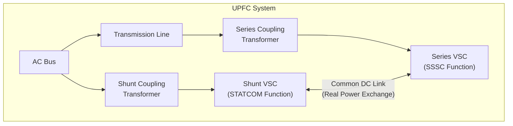
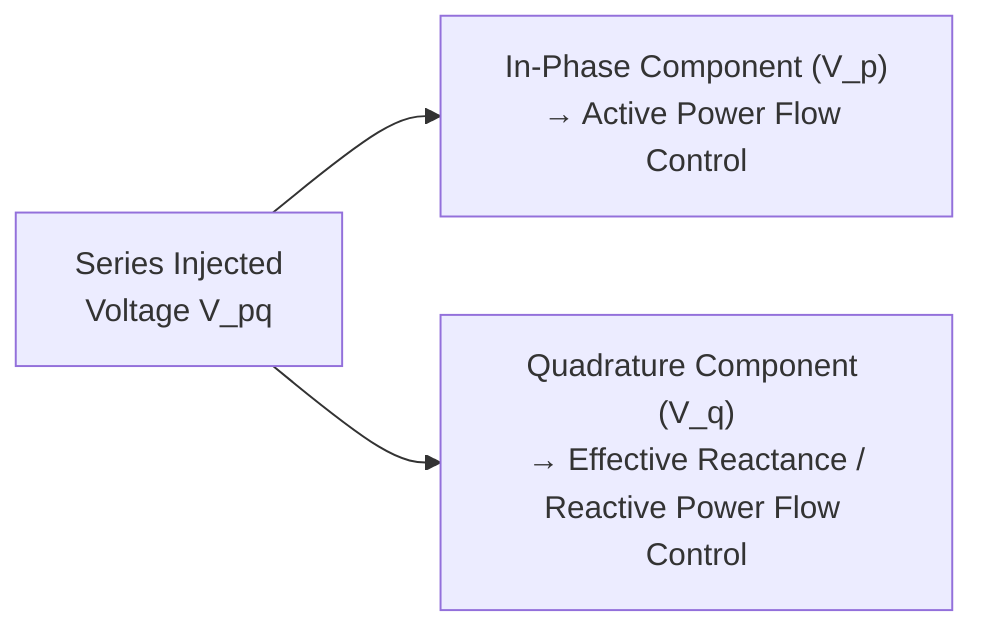
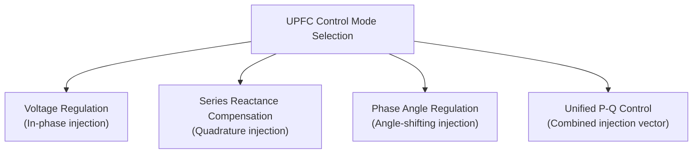

## Unified Power Flow Controller (UPFC)

### Overview

The Unified Power Flow Controller (UPFC) is the most versatile device in the FACTS family, combining a shunt-connected Voltage-Source Converter (functioning as a STATCOM) and a series-connected Voltage-Source Converter (functioning as an SSSC) that share a common DC link. This architecture allows the UPFC to simultaneously and independently control all three variables governing AC power flow — voltage magnitude, effective series reactance, and phase angle — making it, in principle, capable of controlling active and reactive power flow on a transmission line to essentially any operating point within its rating, while also regulating bus voltage at its point of connection.

### Fundamental Architecture

**Shunt converter (STATCOM function):**

- Connected to the AC bus via a shunt coupling transformer
- Regulates bus voltage by absorbing/injecting reactive current, exactly as a standalone STATCOM would
- Additionally supplies (or absorbs) the real power required by the series converter, via the shared DC link — this is the key structural distinction from a standalone SSSC, which must draw its own real power directly from the line current

**Series converter (SSSC function):**

- Connected in series with the transmission line via a series coupling transformer
- Injects a controllable voltage $V_{pq}$ of variable magnitude and phase angle (a full 360° range, not restricted to quadrature-only injection as in a pure reactive SSSC)
- Because the DC link supplies real power from the shunt side, the series converter can inject a voltage with an arbitrary phase relationship to line current, not just a reactive (quadrature) component

### The Key Structural Innovation: Common DC Link

**Key Points**

- In a standalone SSSC, real power exchange with the line is limited to covering the converter's own losses, since there is no other source of DC-side energy — this restricts the series converter to injecting a voltage that is (aside from a small loss-compensation component) essentially in quadrature with line current
- In the UPFC, the shared DC link allows the shunt converter to import real power from the AC bus and deliver it to the series converter's DC terminals, freeing the series converter to inject a voltage with **any phase angle relative to line current**, including a substantial in-phase (real power) component
- This is what enables the UPFC's defining capability: independent, simultaneous control of active power flow (via the in-phase component of injected voltage) and reactive power flow / effective reactance (via the quadrature component), while the shunt side separately manages bus voltage regulation

### Injected Voltage Decomposition

The series-injected voltage $V_{pq}$ can be resolved into two orthogonal components relative to the line current $I_{line}$:

$$V_{pq} = V_{p} + V_{q}$$

- $V_p$ (in-phase or anti-phase component): controls **active power flow** on the line by effectively modifying the voltage magnitude/angle relationship between the sending and receiving ends, similar in effect to a phase-shifting transformer
- $V_q$ (quadrature component): controls **effective series reactance**, emulating capacitive or inductive series compensation exactly as a standalone SSSC would

### Control Modes and Capabilities

The UPFC can be operated in several distinct control modes, often selectable or blended depending on system needs:

**1. Voltage Regulation Mode**

The series converter injects a voltage in phase (or anti-phase) with the bus voltage to directly boost or buck the effective sending-end voltage magnitude, analogous to a tap-changing transformer but with continuous, sub-cycle control.

**2. Series Reactance Compensation Mode**

The series converter injects a quadrature voltage to emulate variable capacitive or inductive series compensation, functionally identical to standalone SSSC operation.

**3. Phase Angle Regulation Mode**

The series converter injects a voltage specifically oriented to shift the phase angle between sending- and receiving-end voltages, similar to a phase-shifting transformer, to control power flow direction/magnitude on parallel paths.

**4. Independent Real and Reactive Power Flow Control (Unified Mode)**

Combining the above, the UPFC can set both active power ($P$) and reactive power ($Q$) flow on the compensated line to essentially any point within an achievable operating region (bounded by converter voltage/current ratings), independent of the natural, uncompensated power flow that would otherwise be dictated by line impedance and terminal voltages.

### Operating Region and Constraints

**Key Points**

- The achievable $P$-$Q$ operating region at the compensated line is bounded by: (1) the series converter's voltage injection rating (maximum $|V_{pq}|$), (2) the series converter's current rating (must carry full line current), (3) the shunt converter's rating (must supply/absorb the real power demanded by the series converter plus its own reactive support duty), and (4) the DC link voltage rating shared by both converters
- Because the shunt converter must simultaneously perform bus voltage regulation and supply real power to the series converter, its total apparent power rating must be sized to accommodate both functions concurrently under worst-case conditions
- The theoretical $P$-$Q$ operating locus at a given line current is typically visualized as a circular or near-circular region in the $P$-$Q$ plane centered on the natural (uncompensated) operating point, with radius determined by the maximum injectable voltage magnitude [Inference: the exact shape and radius depend on specific converter ratings and system impedance, so this describes the general analytical concept rather than a fixed universal geometry]

### Comparison: UPFC vs. Individual FACTS Devices

| Capability | SVC/STATCOM (Shunt only) | TCSC/SSSC (Series only) | UPFC |
| --- | --- | --- | --- |
| Voltage magnitude control | Yes | Indirect (via reactance effect) | Yes |
| Series reactance / reactive power flow control | No | Yes | Yes |
| Active power flow control (independent) | No | Limited (via reactance change only) | Yes (direct, via in-phase injection) |
| Phase angle control | No | No | Yes |
| Simultaneous independent P & Q control | No | No | Yes |
| Relative cost | Lower | Moderate | Highest |
| Control/protection complexity | Lower | Moderate | Highest |

### Applications

**Congestion Management and Loop Flow Control**

UPFC's ability to independently set active power flow on a specific line makes it a powerful tool for redirecting power away from congested corridors toward underutilized parallel paths, addressing loop-flow problems in meshed networks more comprehensively than a phase-shifting transformer alone (which cannot simultaneously provide voltage/reactive support).

**Voltage Support Combined with Power Flow Control**

Because the shunt converter provides STATCOM-like voltage regulation at the point of connection while the series converter manages line power flow, the UPFC addresses both objectives at a single installation, which may otherwise require separate shunt and series devices.

**Transient Stability and Damping Support**

The UPFC's fast, flexible control authority over both real and reactive power flow allows it to be used for transient stability enhancement and power oscillation damping, potentially with greater effectiveness than a series-only or shunt-only device, since it can coordinate both voltage and power-flow responses to a system disturbance.

**Example**

The UPFC concept was first demonstrated in a full-scale utility installation at the Inez Station in Kentucky, USA, in the late 1990s, widely cited as the first commercial UPFC installation demonstrating simultaneous voltage regulation and power flow control functions at a single substation. [Unverified: specific operational status and any subsequent modifications to this or later UPFC installations should be checked against current utility documentation, as long-term operating histories of individual FACTS installations are not reliably tracked in general reference material.]

### Advantages

- Most comprehensive control capability of any FACTS device — simultaneous, independent control of voltage, effective reactance, and phase angle
- Can address multiple network problems (voltage support, congestion, loop flow, oscillation damping) from a single installation
- Series converter is not constrained to quadrature-only injection, unlike a standalone SSSC, due to the shared DC link supplying real power
- Rapid (sub-cycle) dynamic response suitable for both steady-state optimization and transient stability support

### Limitations

- Highest capital cost among FACTS devices, due to the need for two full VSC converter systems plus both shunt and series coupling transformers
- Control system complexity is significantly greater than single-function devices, requiring careful coordination between shunt and series converter control loops and protection schemes
- Series coupling transformer must be rated for full line current plus the injection voltage requirement, representing a large and costly component, similar to the SSSC case but compounded by the added shunt-side coordination requirement
- Commercial deployment has been comparatively limited relative to SVC, STATCOM, and TCSC, reflecting the cost and complexity trade-off against the incremental control benefit for many applications [Inference: this reflects a general industry adoption pattern rather than a precise, continuously updated deployment count]
- Protection coordination is complex: a fault on the compensated line requires rapid, coordinated bypass/blocking of the series converter to protect it from fault current, while the shunt converter's response must also be managed to avoid destabilizing the shared DC link

### Next Steps

**Related Topics**

- FACTS Device Classification and Applications
- Static Synchronous Series Compensator (SSSC)
- Static Synchronous Compensator (STATCOM) Design and Control
- Thyristor-Controlled Series Compensation (TCSC)
- Interline Power Flow Controller (IPFC) Concepts
- Phase-Shifting Transformers and Loop Flow Control
- Power Oscillation Damping (POD) Control Design
- Power System Transient Stability Analysis
- Modular Multilevel Converter (MMC) Submodule Design
- Transmission Congestion Management and Power Flow Optimization