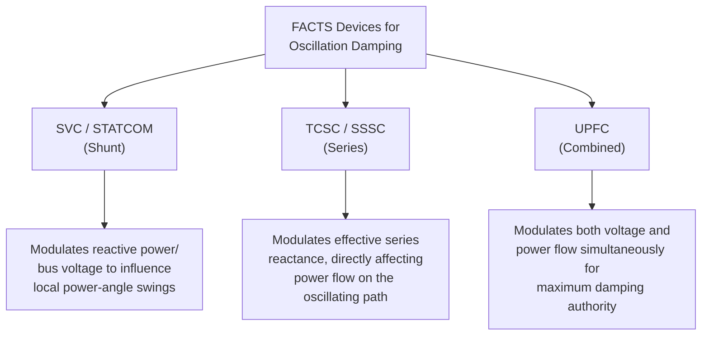
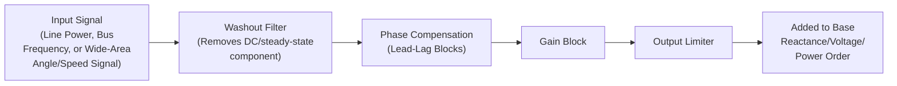

## FACTS for Oscillation Damping

### Overview

FACTS-based oscillation damping refers to the use of FACTS devices' fast, controllable reactive power, series reactance, or voltage-injection capability to actively suppress power system oscillations — both local-mode oscillations (a single generator or plant swinging against the rest of the system, typically 0.8-2 Hz) and inter-area-mode oscillations (groups of generators in one region swinging against groups in another region across a weak tie, typically 0.1-0.8 Hz). This application layers a supplementary damping control function on top of a FACTS device's primary voltage or power-flow regulation role.

### Why Power System Oscillations Occur

**Key Points**

- Interconnected power systems behave as networks of coupled electromechanical oscillators — each synchronous generator has rotor inertia and is connected to the rest of the system through transmission impedances, creating natural oscillatory modes analogous to masses connected by springs
- Following a disturbance (a fault, a large load or generation change, a line trip), these modes are excited and the system rotor angles oscillate before settling (if adequately damped) to a new steady-state operating point
- **Local modes** typically involve one plant or a small group of nearby generators oscillating against the rest of the system, generally well-damped by local excitation system controls (Power System Stabilizers, PSS) on the generators themselves
- **Inter-area modes** involve larger groups of generators, often across a long, relatively weak tie-line, oscillating against each other; these modes are frequently only lightly damped by generator-based controls alone because the tie-line itself, not any single generator's excitation response, is central to the oscillation path — this is where FACTS-based damping becomes particularly valuable, since FACTS devices are installed directly in the transmission path where the oscillatory power flow occurs

### Damping Torque Concept

Oscillation damping, whether provided by a generator's PSS or a FACTS device, works by injecting a supplementary control action that produces a component of electrical torque (or, for FACTS devices acting through the network rather than directly on a generator shaft, an equivalent damping effect on the oscillating power flow) that is in phase with the **speed deviation** of the oscillating mode, rather than with the angle deviation.

$$\Delta T_e = \Delta T_{synchronizing} + \Delta T_{damping}$$

where $\Delta T_{damping}$ must be in phase with rotor speed deviation ($\Delta \omega$) to provide positive damping. A FACTS supplementary damping controller is designed so that its output signal, after passing through the device's control dynamics and the network's electrical response, arrives in the correct phase relationship to reinforce this damping torque component.

### Applicable FACTS Devices and Their Damping Mechanisms

**Shunt devices (SVC, STATCOM):**

By modulating reactive power injection/absorption at a bus, shunt devices vary the local voltage magnitude, which in turn influences the power transferred across nearby lines (via the power-angle equation's $V_1 V_2$ term). This provides an indirect but effective damping mechanism, particularly for oscillation modes involving voltage sensitivity at the device's connection point.

**Series devices (TCSC, SSSC):**

By modulating the effective series reactance $X$ directly in the line carrying the oscillating power flow, series devices provide a more direct damping mechanism, since they act on the same $X$ term that directly governs power transfer on that specific path — often making series devices particularly effective for damping inter-area modes tied to a specific critical transmission corridor.

**Combined devices (UPFC):**

By modulating both the in-phase (active power) and quadrature (reactive power/reactance) components of its injected voltage, a UPFC can provide the strongest and most flexible damping authority, capable of directly targeting active power flow modulation rather than relying solely on an indirect voltage-to-power-flow relationship.

### Supplementary Damping Controller Structure

A typical FACTS Power Oscillation Damping (POD) controller follows a structure closely analogous to a generator's Power System Stabilizer (PSS):

- **Washout filter**: a high-pass filter that removes the steady-state component of the input signal, ensuring the damping controller only acts on the oscillatory (transient) component and does not interfere with the device's primary steady-state regulation function
- **Phase compensation (lead-lag) blocks**: shift the phase of the oscillatory signal to align the controller's output with the speed-deviation component required for positive damping torque, compensating for phase lags introduced by the device's own control dynamics and the network's response characteristics
- **Gain block**: sets the strength of the damping action; excessive gain can destabilize other modes or interact adversely with the device's primary control loop, so gain is tuned (often via eigenvalue/residue analysis) to provide adequate damping without introducing new stability issues
- **Output limiter**: constrains the supplementary modulation signal to prevent the damping function from driving the device beyond its safe operating range or excessively disrupting its primary regulation duty

### Signal Selection: Local vs. Wide-Area

**Key Points**

- **Local signals** (e.g., the active power flow on the line where the FACTS device is installed, or local bus frequency) are simple to measure, require no external communication, and are inherently robust to communication failures — but may provide poor observability of certain inter-area modes if the device's local measurement point does not strongly reflect that mode's dynamics
- **Wide-area signals** (e.g., a remote bus angle difference or speed deviation, obtained via Phasor Measurement Units, PMUs, and wide-area communication) can provide much better observability and controllability of specific inter-area modes, since the signal can be chosen specifically to correlate strongly with the targeted mode
- Wide-area damping control introduces dependency on communication infrastructure latency and reliability, requiring robust fallback strategies (e.g., reverting to a local signal or a fixed setpoint) if the wide-area signal becomes unavailable or delayed beyond an acceptable threshold

### Modal Analysis and Controller Tuning

FACTS damping controllers are typically designed using small-signal (linearized) power system models, employing:

- **Eigenvalue analysis**: identifying the system's oscillatory modes (as complex eigenvalue pairs) and their associated damping ratios, to determine which modes are poorly damped and require supplementary control
- **Participation factor analysis**: identifying which generators/states most strongly participate in a given poorly-damped mode, helping select where a FACTS device (or PSS) would be most effective
- **Residue-based tuning**: the residue of the transfer function from a candidate FACTS control input to a candidate feedback signal, evaluated at the mode's eigenvalue, indicates both the achievable damping improvement and the required phase compensation for the controller — this is the standard analytical method for tuning lead-lag phase compensation blocks in both PSS and FACTS damping controllers

$$\lambda_i = \sigma_i \pm j\omega_i, \quad \zeta_i = \frac{-\sigma_i}{\sqrt{\sigma_i^2 + \omega_i^2}}$$

where $\zeta_i$ is the damping ratio of mode $i$; a commonly cited practical target is $\zeta_i \geq 0.03$-$0.05$ (3-5%) for acceptable inter-area mode damping, though specific utility/regional planning criteria vary. [Unverified: exact minimum damping ratio criteria differ by system operator and regulatory body, so any specific numerical threshold should be checked against the applicable grid code or reliability standard for the system in question.]

### Interaction with Generator-Based PSS

**Key Points**

- FACTS damping controllers and generator PSS units often coexist in the same power system, and their combined effect must be studied together, since a FACTS device may inadvertently interact with (reinforce or destabilize) modes that PSS units are already damping, or vice versa
- Coordinated tuning studies typically evaluate the closed-loop system with all damping controllers (PSS and FACTS) active simultaneously, rather than tuning each device in isolation, to avoid adverse interactions
- FACTS devices are particularly valuable for damping modes that PSS-equipped generators cannot adequately address alone — especially inter-area modes where the critical oscillatory power flow passes through a specific transmission corridor rather than being strongly observable/controllable from any single generator's terminal

### Practical Considerations and Limitations

- The damping benefit achievable from a FACTS device is fundamentally limited by its power/voltage rating — a device sized primarily for steady-state voltage support or power flow control may have limited additional headroom for large-signal damping modulation during severe disturbances
- Controller robustness across a range of system operating conditions (varying load levels, generation dispatch, network topology) is a key design challenge, since a controller tuned for one operating point may provide reduced or even negative damping under significantly different conditions — robust control design techniques (e.g., $H_\infty$, multi-model tuning) are sometimes applied to address this
- Communication-dependent wide-area damping schemes require careful cybersecurity and reliability engineering, since a compromised or corrupted wide-area signal could, in principle, be used to destabilize rather than damp an oscillation mode

### Applications and Notable Contexts

**Example**

- TCSC installations in North America (e.g., historically at the Slatt substation in the Pacific Northwest) have been documented in technical literature as providing supplementary damping for inter-area oscillation modes associated with long north-south transmission corridors, in addition to their primary transfer capability and SSR mitigation roles [Inference: specific current operational damping control configurations may have been modified since original commissioning literature was published]
- Wide-area damping control research and pilot deployments using PMU-based signals have been explored in various interconnected systems as PMU infrastructure has matured, aiming to improve inter-area mode damping beyond what local-signal-based control alone can achieve [Inference: the maturity and extent of wide-area damping control deployment varies significantly by region and utility, so this should be understood as a general industry direction rather than a specific verified deployment]

### Advantages

- Provides damping authority for inter-area modes that may be poorly addressed by generator PSS alone, particularly when the critical oscillatory flow passes through a specific transmission corridor
- FACTS devices' fast (sub-cycle to few-cycle) response makes them well suited to actively damping oscillations in the 0.1-2 Hz range typical of power system electromechanical modes
- Supplementary damping function can often be added to an existing FACTS device (installed primarily for voltage support or power flow control) with modest additional control system complexity, leveraging existing hardware
- Series devices in particular provide direct authority over the power flow on the specific line most associated with a targeted inter-area mode

### Limitations

- Damping authority is bounded by the device's underlying voltage/power rating, which may be sized primarily for other functions
- Wide-area damping schemes introduce communication latency and reliability dependencies
- Controller tuning must account for interaction with existing PSS units and other FACTS damping controllers to avoid adverse mode interactions
- Robustness across varying system operating conditions requires careful design and, often, periodic retuning as system conditions evolve over time
- Not a substitute for adequate underlying system strength/inertia; FACTS damping control mitigates but does not eliminate the underlying causes of poorly damped inter-area modes

### Next Steps

**Related Topics**

- FACTS Device Classification and Applications
- Thyristor-Controlled Series Compensation (TCSC)
- Static Synchronous Series Compensator (SSSC)
- Unified Power Flow Controller (UPFC) Architecture and Control
- Power System Stabilizer (PSS) Design Fundamentals
- Power System Small-Signal Stability and Eigenvalue Analysis
- Wide-Area Monitoring Systems and Phasor Measurement Units (PMUs)
- Inter-Area Oscillation Modes in Interconnected Power Systems
- Subsynchronous Resonance (SSR) Analysis and Mitigation Techniques
- Robust Control Design Techniques for Power System Applications