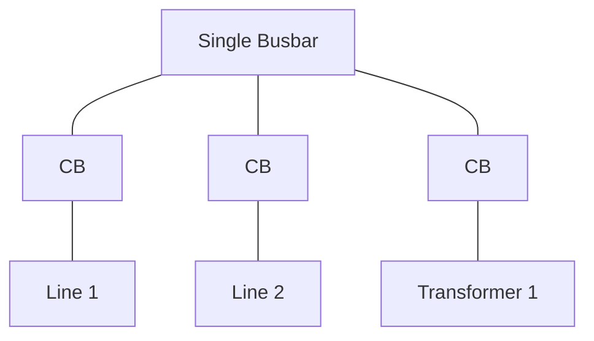
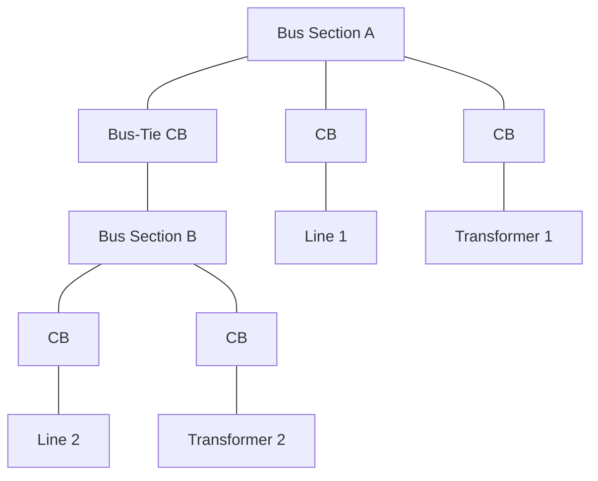
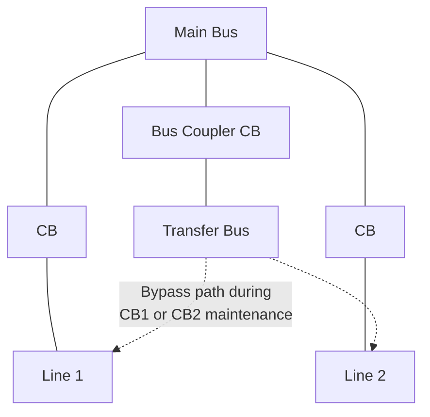
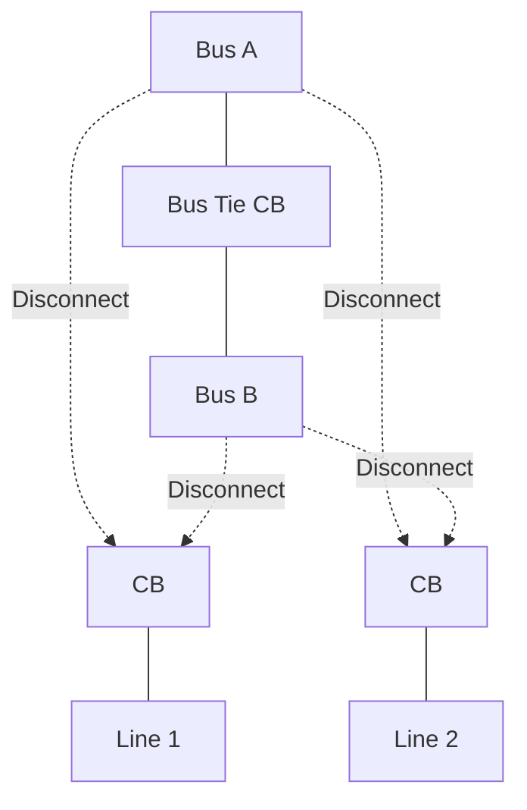
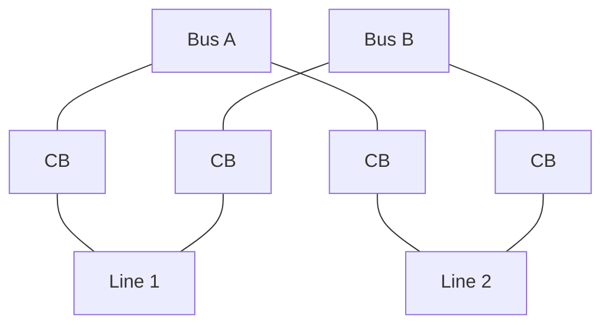
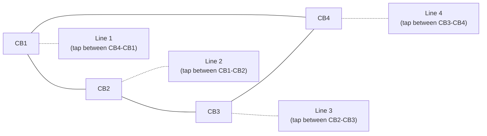
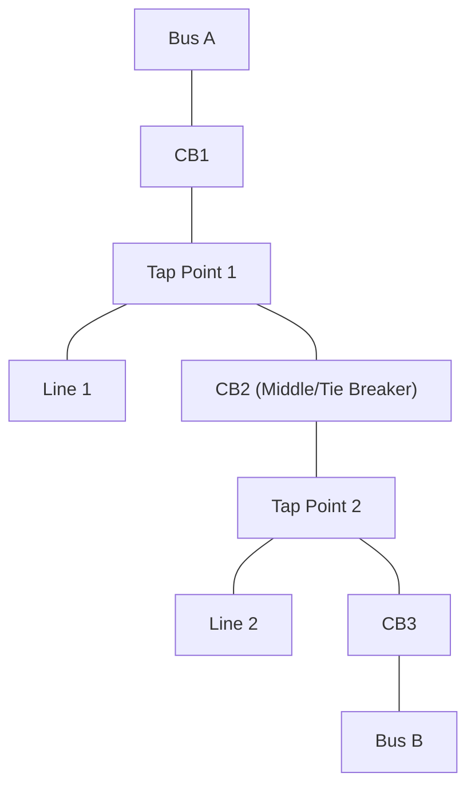
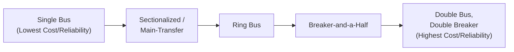

## Substation Bus Configuration Types

### Overview

Substation bus configuration refers to the arrangement of busbars, circuit breakers, and switching equipment that determines how transmission lines, transformers, and other feeders connect within a substation. The chosen configuration governs the substation's reliability, flexibility for maintenance, fault-clearing behavior, and capital cost. Selecting a bus configuration is one of the foundational decisions in substation design, balancing reliability requirements against cost and land-area constraints.

### Key Evaluation Criteria for Bus Configurations

**Key Points**

- **Reliability**: the ability to maintain service during equipment failure or planned maintenance without interrupting connected circuits
- **Flexibility**: ease of switching operations, ability to isolate equipment for maintenance without de-energizing unrelated circuits
- **Cost**: capital cost scales strongly with the number of circuit breakers per feeder (breakers are typically the most expensive switching component)
- **Land area**: some configurations require substantially more substation footprint than others
- **Fault impact**: the number of circuits lost and the duration of the outage when a bus fault or breaker failure occurs

### Single Bus (Single Busbar) Configuration

The simplest configuration: all feeders (lines, transformers) connect to one common busbar through individual circuit breakers.

**Key Points**

- Lowest capital cost, simplest protection and operation
- A bus fault or bus maintenance requires de-energizing **all** connected circuits — a critical reliability weakness
- Generally limited to distribution-level or low-priority substations where an extended outage is tolerable

### Single Bus with Bus Sectionalizing (Sectionalized Single Bus)

A variation that splits the single bus into two (or more) sections connected via a normally-closed bus-tie circuit breaker, limiting the impact of a bus fault to only the affected section.

- Improves reliability over a plain single bus by containing a bus fault to one section
- Still requires an outage of the affected section's circuits during a fault or maintenance on that section
- Moderate cost increase (one additional breaker for the bus tie)

### Main-and-Transfer Bus Configuration

Adds a second ("transfer") bus alongside the main bus, connected via a transfer bus coupler breaker, allowing any single feeder's breaker to be taken out of service for maintenance while the feeder remains in service (routed temporarily through the transfer bus and coupler breaker).

**Key Points**

- Enables breaker maintenance without a feeder outage — a major operational advantage over a plain single bus
- A fault on the main bus itself still de-energizes all circuits, since there is no redundant main path
- Requires switching sequences (isolating the feeder to the transfer bus) whenever a breaker is taken out for maintenance, adding operational complexity relative to simpler schemes

### Double Bus, Single Breaker Configuration

Two independent main busbars, each feeder connected to both buses via a bus-selector disconnect switch arrangement, but with only **one** circuit breaker per feeder (shared between the two bus connection options via the disconnects).

- Provides flexibility to switch a feeder between the two buses (e.g., for bus maintenance or load balancing) without an outage, since the feeder can be pre-connected to the alternate bus before disconnecting from the original
- A fault on the breaker itself, however, still interrupts the associated feeder, since there is no redundant breaker path for that specific circuit
- Moderate cost, moderate reliability improvement over single-bus schemes

### Double Bus, Double Breaker Configuration

Two independent main busbars, with **each feeder connected to both buses through its own dedicated circuit breaker** (two breakers per feeder).

**Key Points**

- Very high reliability: a fault on either bus, or failure of either breaker for a given feeder, does not interrupt that feeder's service, since the alternate bus/breaker path remains available
- Highest capital cost among common configurations, due to two full circuit breakers per feeder plus the associated protection and control equipment
- Typically reserved for the highest-criticality substations (major generation interconnection points, critical load centers, key network hubs)

### Ring Bus Configuration

Circuit breakers are arranged in a closed loop ("ring"), with each feeder tapped between two adjacent breakers in the ring — there is no separate busbar section as such; the ring itself functions as the bus.

**Key Points**

- Only **one breaker per feeder** on average (number of breakers equals number of feeders, since it's a closed ring), providing double-breaker-equivalent reliability at roughly half the breaker cost
- A single breaker failure opens the ring at that point but does not interrupt any feeder directly, since the ring can be reconfigured to maintain all feeder connections (though the ring is temporarily "broken" into an open string until repair)
- **A key limitation**: if a second breaker fails or is under maintenance while a first breaker is already out, the ring may split into two separate sections, potentially isolating one or more feeders — reliability degrades once more than one breaker is unavailable simultaneously
- Ring bus size is practically limited (commonly 4-6 breakers/feeders) since larger rings increase the complexity of protection coordination and the potential impact of a ring split
- Economical and widely used for medium-sized transmission substations balancing cost and reliability

### Breaker-and-a-Half Configuration

Three circuit breakers are arranged in series between two main buses, with **two feeders** tapped from the two points between adjacent breakers — hence "breaker and a half" per feeder (1.5 breakers per feeder on average).

**Key Points**

- High reliability: either main bus can be taken out of service entirely without interrupting any feeder, since each feeder can be supplied through the middle breaker and the remaining healthy bus
- A single breaker failure typically results in the loss of, at most, one feeder (or a brief disturbance to two feeders sharing the middle breaker, depending on the specific fault location and protection scheme), rather than a complete substation outage
- Requires more complex protection schemes than a ring bus, since the middle ("tie") breaker is shared between two feeder circuits and its protection zone must correctly discriminate between faults on either feeder
- Widely used at extra-high-voltage (EHV) transmission substations and major generation interconnection points, where reliability is critical and the number of feeders justifies the higher breaker count relative to single-breaker schemes

### Comparative Summary

| Configuration | Breakers per Feeder | Reliability | Relative Cost | Typical Application |
| --- | --- | --- | --- | --- |
| Single Bus | 1 | Lowest | Lowest | Distribution, low-priority substations |
| Sectionalized Single Bus | 1 | Low-Moderate | Low | Distribution, moderate-priority substations |
| Main-and-Transfer | 1 (+ shared coupler) | Moderate (breaker maintenance only) | Moderate | Substations needing breaker maintenance flexibility |
| Double Bus, Single Breaker | 1 (with bus selection) | Moderate | Moderate | Substations needing bus flexibility |
| Ring Bus | ~1 | High | Moderate | Medium/large transmission substations |
| Double Bus, Double Breaker | 2 | Very High | Very High | Critical substations, major interconnections |
| Breaker-and-a-Half | 1.5 | Very High | High | EHV transmission, critical interconnection points |

### Configuration Selection Trade-Off

### Bus Fault Considerations

**Key Points**

- Configurations with a single bus section (single bus, main-and-transfer) expose all connected circuits to a common bus fault
- Sectionalized and double-bus schemes limit fault exposure to the affected bus/section, protected by dedicated bus differential protection zones for each section
- Ring bus and breaker-and-a-half schemes have no distinct "bus" in the traditional sense at the ring/diameter level; instead, protection is organized around breaker zones and feeder-specific differential/distance protection, which must be carefully coordinated with the shared (tie/middle) breakers

### Applications by Voltage Level and Criticality

- **Distribution substations**: single bus or sectionalized single bus is common, reflecting lower per-circuit criticality and cost sensitivity
- **Sub-transmission and moderate-criticality transmission substations**: ring bus is a common choice, balancing cost against meaningfully improved reliability
- **EHV transmission and major substations (generation interconnection, key network nodes)**: breaker-and-a-half or double bus/double breaker are standard, reflecting the high cost of an outage at these critical network points
- **Substations requiring frequent breaker maintenance without outages**: main-and-transfer bus schemes remain in use, particularly at older facilities or where a full breaker-and-a-half upgrade is not economically justified

### Advantages and Limitations Summary

**Advantages of higher-reliability configurations (ring, breaker-and-a-half, double bus/double breaker):**

- Minimal or no service interruption during single-component failure or planned maintenance
- Improved fault containment, limiting the scope of any single disturbance

**Limitations of higher-reliability configurations:**

- Substantially higher capital cost (more breakers, more complex protection and control systems)
- Greater land area requirements in most cases (more equipment, more bays)
- More complex protection coordination, particularly for shared/tie breakers in ring and breaker-and-a-half schemes
- Increased operational and maintenance training requirements due to more complex switching sequences

### Next Steps

**Related Topics**

- High-Voltage Circuit Breaker Types and Operating Principles
- Substation Protection Schemes: Bus Differential and Breaker Failure Protection
- Gas-Insulated Switchgear (GIS) vs. Air-Insulated Switchgear (AIS)
- Substation Layout and Physical Design Considerations
- Disconnect Switches and Isolation Equipment
- Power Transformer Protection and Substation Integration
- Substation Automation and SCADA Integration
- Reliability Assessment Methods for Substation Design (N-1, N-2 Criteria)
- Instrument Transformers (CTs and VTs) in Substation Design
- Surge Arrester Application and Insulation Coordination in Substations