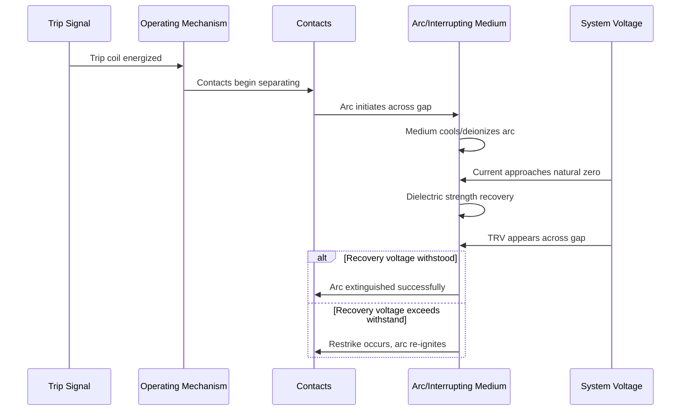

## Circuit Breaker Technologies and Interrupting Media

### Overview

A circuit breaker is an electromechanical device designed to make, carry, and interrupt current under both normal operating conditions and abnormal conditions such as short circuits. Unlike fuses, circuit breakers can be reset after operation without component replacement. In substation design, breaker selection is driven primarily by the **interrupting medium** — the substance used to extinguish the arc that forms between the separating contacts — because this determines the breaker's voltage class, interrupting capacity, maintenance profile, and physical footprint.

The arc-interruption problem is fundamentally about rapidly increasing dielectric strength across the contact gap faster than the system voltage can re-establish current flow. Each interrupting medium solves this differently.

### The Arc Interruption Problem

When contacts separate under load, the current does not stop instantaneously. Contact separation ionizes the surrounding medium, sustaining an arc through thermal ionization. Successful interruption requires:

1. **Cooling the arc plasma** to reduce ionization and increase electrical resistance
2. **Deionizing the gap** rapidly after current zero (in AC systems, natural current zero occurs every half-cycle)
3. **Withstanding the transient recovery voltage (TRV)** that appears across the contacts immediately after current zero, without the gap re-striking

$$TRV(t) = V_{peak}\left(1 - \cos(\omega_n t)\right)e^{-\alpha t}$$

where $\omega_n$ is the natural frequency of the recovery circuit and $\alpha$ is a damping factor determined by system impedance. If the dielectric recovery of the gap lags behind the TRV rise, a **restrike** or **reignition** occurs, and interruption fails.

### Classification by Interrupting Medium

#### 1. Oil Circuit Breakers (OCB)

**Bulk Oil Breakers**

Contacts are submerged in a large tank of mineral oil, which serves dual purposes: arc interruption and insulation to ground. The arc vaporizes the oil, producing hydrogen gas (from cracking of hydrocarbons), which has excellent thermal conductivity and helps cool and deionize the arc.

- **Key Points**
  - Oil volume was historically very large (thousands of liters for HV applications)
  - Hydrogen gas generated during arcing aids cooling but creates fire and explosion risk
  - Largely obsolete in new substation construction due to maintenance burden and fire hazard
  - Still found in legacy installations, particularly pre-1980s substations

**Minimum Oil Breakers (MOB)**

An evolution that confines oil to an interrupting chamber around the contacts only, using porcelain or other material for phase-to-ground insulation instead of oil. This reduced oil volume by roughly 90% compared to bulk oil designs.

- [Unverified] Exact oil volume reduction percentages vary significantly by manufacturer and voltage class; figures cited in different references range from 80-95%.

#### 2. Air Blast Circuit Breakers (ABCB)

Uses compressed air (typically 20-30 bar) directed through a nozzle across the separating contacts to cool and sweep away ionized gas.

- **Key Points**
  - Requires a dedicated compressed air plant (compressors, receivers, dryers) — significant auxiliary infrastructure
  - Produces substantial noise during operation (audible over long distances)
  - Fast interrupting times, historically favored for EHV applications (up to 800 kV)
  - Sensitive to air quality (moisture causes dielectric degradation)
  - Largely superseded by SF6 breakers since the 1980s due to complexity of air supply systems

#### 3. SF6 (Sulfur Hexafluoride) Circuit Breakers

The dominant technology for medium and high voltage applications since the 1970s-80s. SF6 is an electronegative gas — it readily captures free electrons to form stable, immobile negative ions, rapidly reducing the ionized particle density in the arc channel.

**Why SF6 works well:**

- High dielectric strength (~2.5-3x that of air at the same pressure)
- Excellent thermal conductivity in the arc region, aiding rapid arc cooling
- Electronegativity accelerates deionization after current zero
- Non-flammable, chemically stable under normal conditions

**Sub-types:**

*Puffer-Type Interrupters*: A moving piston mechanically compresses SF6 gas during the opening stroke, forcing it through a nozzle across the arc at high velocity during current zero.

*Self-Blast (Rotating Arc / Thermal-Assisted) Interrupters*: Uses the arc's own thermal energy to build gas pressure, reducing the mechanical energy required from the operating mechanism. This lowered the operating energy requirements substantially compared to pure puffer designs, enabling simpler, lower-maintenance spring or motor-charged mechanisms.

- **Key Points**
  - Dominant technology for 72.5 kV and above; increasingly common down to 12 kV in GIS applications
  - SF6 has a global warming potential (GWP) of approximately 23,500 (100-year basis per IPCC AR5), driving regulatory pressure and R&D into alternatives
  - Leak detection and gas density monitoring (via density switches referenced to temperature) are critical maintenance items
  - Sealed-for-life designs are common at distribution voltages; HV designs often have gas compartments with monitoring and top-up provisions
- [Inference] The trend toward self-blast over pure puffer designs at transmission voltages reflects a broader industry shift to reduce mechanism energy and closing/opening mass, though pure puffer designs remain in service and in new manufacture for specific applications.

#### 4. Vacuum Circuit Breakers (VCB)

Contacts are enclosed in a sealed vacuum interrupter (typically $10^{-4}$ to $10^{-7}$ torr). Because there is no gas to ionize in the classical sense, arc formation relies on metal vapor from the contact material itself.

**Interruption mechanism:**

When contacts part, the last points of contact vaporize, forming a metal-vapor arc. Because there is no continuously replenished ionizable medium, the vapor density collapses rapidly at current zero as vapor condenses back onto the contacts and shields, and the gap regains dielectric strength within microseconds.

- **Key Points**
  - Dominant technology for distribution class (up to ~38 kV, with some designs reaching 72.5 kV)
  - Virtually maintenance-free — no gas handling, no oil replacement, sealed contacts
  - Compact size compared to SF6 or oil equivalents at the same voltage class
  - Contact material design (commonly CuCr alloys) is critical: must balance interrupting capability, low chopping current, and resistance to contact welding
  - **Current chopping**: vacuum interrupters can force current to zero slightly before the natural AC zero-crossing, generating switching transients — a known consideration when switching transformers or reactors
  - Producing multiple small re-ignitions in rapid succession (virtual current chopping) is a documented phenomenon requiring surge protection in some applications
- [Inference] The upper voltage boundary for vacuum technology continues to shift upward as interrupter and multi-break designs improve; some manufacturers now offer vacuum breakers at 145 kV, though SF6 remains dominant above ~72.5 kV as of current standard practice.

#### 5. Air Magnetic Circuit Breakers (Legacy)

An older technology using atmospheric air combined with magnetic arc chutes that stretch and cool the arc using electromagnetic force (the arc's own current interacts with a series coil to drive it into ceramic/metal splitter plates).

- **Key Points**
  - Common in indoor medium-voltage switchgear from the 1950s-1980s
  - Simple, robust, but bulky and largely replaced by vacuum breakers in new switchgear
  - Still encountered in legacy industrial and utility switchgear requiring retrofit decisions

### Comparative Summary

| Technology | Typical Voltage Range | Interrupting Time | Maintenance | Status |
| --- | --- | --- | --- | --- |
| Bulk Oil | Up to 145 kV (legacy) | 3-5 cycles | High | Obsolete |
| Minimum Oil | Up to 245 kV (legacy) | 2-4 cycles | Moderate-High | Largely obsolete |
| Air Blast | Up to 800 kV (legacy) | 2-3 cycles | High (air plant) | Obsolete for new builds |
| SF6 | 12 kV - 1200 kV | 2-3 cycles | Low | Dominant, HV/EHV |
| Vacuum | Up to ~72.5 kV (typ.) | 2-3 cycles | Very Low | Dominant, distribution/sub-transmission |

- [Unverified] Interrupting time in cycles varies by design, mechanism speed, and manufacturer; the ranges above reflect commonly cited industry figures rather than a single standard.

### Rated Parameters Governing Selection

- **Rated voltage**: maximum system voltage the breaker is designed for
- **Rated normal current**: continuous current-carrying capability without exceeding temperature rise limits
- **Rated short-circuit breaking current**: symmetrical RMS current the breaker can interrupt (per IEC 62271-100 or IEEE C37.06)
- **Rated short-circuit making current**: peak asymmetrical current the breaker can close into without contact welding or mechanical damage (typically 2.5-2.6x the rated breaking current)
- **Rated short-time withstand current and duration**: current the breaker can carry (without necessarily interrupting) for a defined period, typically 1-3 seconds
- **Rated operating sequence**: e.g., O-0.3s-CO-3min-CO, defining reclosing duty cycles

$$I_{making} \approx k \times I_{breaking(sym)}$$

where $k$ is the asymmetry factor, commonly around 2.5-2.7 depending on the system X/R ratio.

### Arc Interruption Sequence (Generic, Medium-to-High Voltage)

### Simplified Puffer-Type SF6 Interrupter Cross-Section (svg_diagram)

<svg xmlns="http://www.w3.org/2000/svg" viewBox="0 0 640 320" font-family="sans-serif">
<text x="320" y="24" text-anchor="middle" font-size="16" font-weight="bold">Puffer-Type SF6 Interrupter Cross-Section (svg_diagram)</text>

<rect x="40" y="60" width="560" height="200" fill="none" stroke="#333" stroke-width="2" rx="8" />
<text x="60" y="80" font-size="12" fill="#555">SF6 Gas Compartment</text>

<rect x="80" y="150" width="140" height="20" fill="#8a8a8a" stroke="#333" stroke-width="1.5" />
<text x="150" y="145" text-anchor="middle" font-size="11">Fixed Contact</text>

<rect x="380" y="150" width="140" height="20" fill="#8a8a8a" stroke="#333" stroke-width="1.5" />
<text x="450" y="145" text-anchor="middle" font-size="11">Moving Contact</text>

<line x1="380" y1="190" x2="440" y2="190" stroke="#333" stroke-width="1.5" marker-end="url(#arrow)" />
<text x="410" y="205" text-anchor="middle" font-size="10">Opening travel</text>

<polygon points="220,140 300,155 300,175 220,190" fill="#c9c9c9" stroke="#333" stroke-width="1.5" />
<text x="255" y="130" text-anchor="middle" font-size="11">Nozzle</text>

<line x1="220" y1="160" x2="380" y2="160" stroke="#e05a2b" stroke-width="3" stroke-dasharray="4,3" />
<text x="300" y="215" text-anchor="middle" font-size="11" fill="#e05a2b">Arc column</text>

<rect x="300" y="230" width="150" height="24" fill="#d9d9d9" stroke="#333" stroke-width="1.5" />
<text x="375" y="270" text-anchor="middle" font-size="11">Puffer Cylinder (compresses SF6)</text>

<line x1="330" y1="228" x2="290" y2="192" stroke="#2b6de0" stroke-width="1.5" marker-end="url(#arrowblue)" />
<line x1="360" y1="228" x2="320" y2="192" stroke="#2b6de0" stroke-width="1.5" marker-end="url(#arrowblue)" />
<text x="365" y="210" font-size="10" fill="#2b6de0">SF6 flow</text>
</svg>

### Emerging Alternatives to SF6

Due to SF6's high global warming potential, the industry is actively transitioning toward alternative interrupting media in new equipment, particularly in Europe under F-gas regulations.

- **Vacuum interrupters** extending to higher voltage classes, reducing reliance on gas-insulated designs at sub-transmission levels
- **Dry air / clean air (synthetic air)** breakers: use compressed atmospheric-composition air; require larger enclosures due to lower dielectric strength than SF6, but eliminate greenhouse gas concerns
- **Fluoronitrile (C4-FN) / fluoroketone (C5-FK) gas mixtures** blended with CO2 and/or O2 (marketed under trade names such as g3/g³ by some manufacturers): offer GWP reductions of 98%+ compared to pure SF6 while retaining much of its dielectric performance
- **CO2-based mixtures**: lower dielectric performance than SF6, generally requiring higher pressure or larger interrupter volumes to achieve equivalent interrupting capacity
- [Speculation] The long-term dominant SF6 replacement technology for EHV/UHV gas-insulated switchgear (GIS) is not yet fully settled industry-wide; fluoronitrile/CO2 blends and vacuum-at-higher-voltages both show adoption momentum but standardization and long-term field performance data are still maturing as of this writing.

### Practical Example: Sizing Consideration

Given a 138 kV substation feeder with a calculated symmetrical fault current of 31.5 kA and system X/R ratio of 15:

1. Select a breaker rated at or above 31.5 kA symmetrical breaking current (commonly a 40 kA rated breaker is chosen for margin and standardization)
2. Verify the making current capability: with $k \approx 2.6$ for this X/R ratio, required making current $\approx 31.5 \times 2.6 = 81.9$ kA peak — confirm the breaker's rated making current (often 2.5-2.7x its symmetrical breaking rating) meets or exceeds this
3. Confirm short-time withstand rating covers protection clearing time plus margin (e.g., 3 seconds at 40 kA)
4. Select interrupting medium based on voltage class — at 138 kV, SF6 puffer or self-blast is standard; vacuum is increasingly available in this range from select manufacturers

**Conclusion**

Interrupting medium selection is not merely a materials choice — it cascades into mechanism design, maintenance regime, environmental compliance, and physical substation layout. SF6 remains the workhorse for transmission-class applications despite environmental pressure, while vacuum technology has effectively won the distribution and sub-transmission space on the basis of maintenance-free operation and compactness. Oil and air-blast technologies persist only as legacy assets requiring lifecycle replacement planning.

**Related Topics**

- Gas-Insulated Switchgear (GIS) vs Air-Insulated Switchgear (AIS) architecture
- Circuit breaker operating mechanisms (spring, pneumatic, hydraulic, motor-charged)
- Transient recovery voltage (TRV) and rate-of-rise-of-recovery-voltage (RRRV) analysis
- Current chopping and virtual current chopping in vacuum interrupters
- SF6 gas handling, recovery, and environmental regulations (F-gas, EPA)
- Circuit breaker failure protection (breaker failure relay schemes, 50BF)
- Synchronous switching / point-on-wave switching controllers
- Insulation coordination and dielectric withstand testing per IEC 62271-100 / IEEE C37.06